# 了解 Python 导入，__init__。py 和 pythonpath —一劳永逸

> 原文：<https://towardsdatascience.com/understanding-python-imports-init-py-and-pythonpath-once-and-for-all-4c5249ab6355?source=collection_archive---------0----------------------->

## PYTHON 基础

## 了解如何导入包和模块(以及两者之间的区别)

在本教程结束时，这是您可以轻松使用的目录结构(针对`Medium_Imports_Tutorial`项目)——从一个子目录导入任何脚本到另一个子目录(蓝色箭头)。
*注:如果你愿意合作，这里有*[*Github*](https://github.com/V-Sher/Medium_Imports_Tutorial)*回购。*

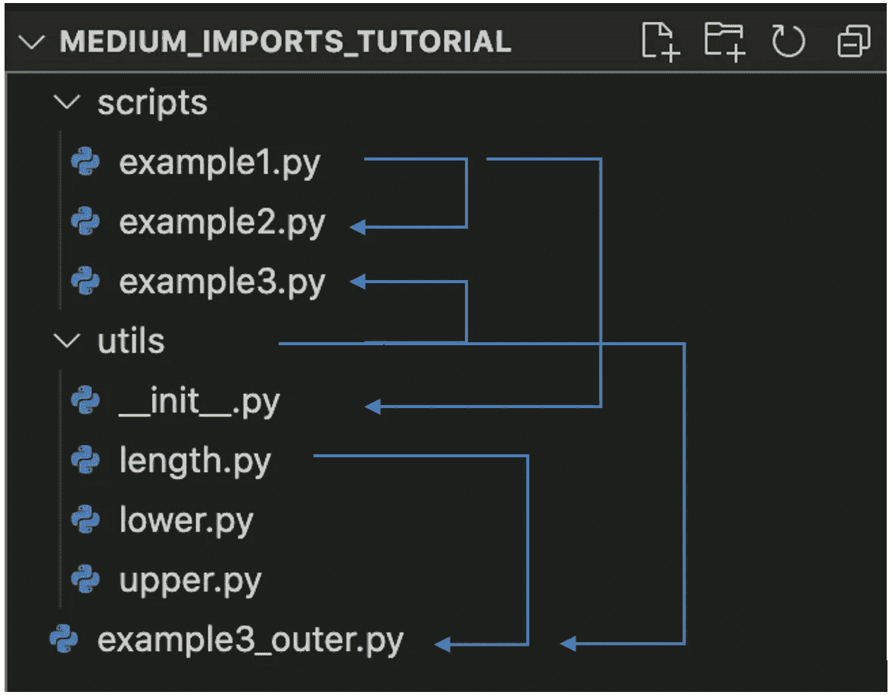

学习 Python 导入的目录结构

在我们开始之前，让我们了解一下**包**和**模块**之间的区别，因为我们将在整篇文章中多次提到它们。

> 模块:一个 python 脚本。
> 
> 包:模块的集合。

# 我们开始吧...

上图中的目录结构看起来有点复杂，我不会要求你一次创建它。

为了简单起见，让我们首先在项目目录中创建一个目录`scripts`，并向其中添加两个模块——`example1.py`和`example2.py`。

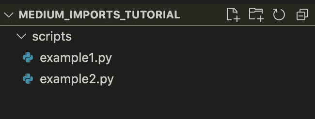

这个想法是让在`example1.py`中定义的任何函数/变量/类都可以在`example2.py`中访问。该模块的内容如下:

```
***#example1.py***MY_EX1_STRING = 'Welcome to Example1 module!'def yolo(*x*: int):
     print("You only LIve", *x*, "times.")
```

要在`example2.py`内导入这些项目:

```
***#example2.py***import example1*# imported string*
print("The imported string is: ", example1.MY_EX1_STRING)*# imported function*
example1.yolo(10)
```

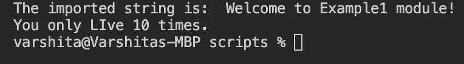

运行 **example2.py** 的输出

只是重复一下显而易见的内容，可以使用点符号来访问导入模块中的项目——例如，`example1.yolo()`或`example1.MY_EX1_STRING`。如果你觉得每次都写`example1.XXX`似乎有点太长，我们可以使用别名`as`并重写`example2.py`如下。正如您正确猜测的那样，输出仍然保持不变。

```
***#example2.py***import example1 **as e1***# imported string*
print("The imported string is: ", **e1**.MY_EX1_STRING)*# imported function*
**e1**.yolo(10)
```

## 当我们写一个' import '语句时，到底发生了什么？

python 解释器试图寻找包含我们试图在`sys.path`中导入的模块*的*目录*。这是一个目录列表，Python 会在查看完缓存模块和 Python 标准库模块后搜索这些目录。*

让我们看看此时我们的系统路径包含了什么(通过注释掉`example2.py`中的前几行代码)。

```
**#example2.py***# import example1
# print("The imported string is: ", example1.MY_EX1_STRING)
# example1.yolo(10)*import sys
print(sys.path)
```

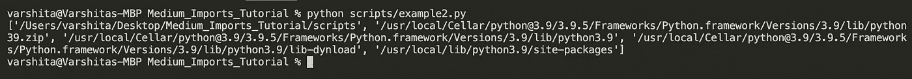

sys.path 的输出

正如你所看到的，由`sys.path`返回的列表中的第一个元素指向`Medium_Imports_Tutorial/scripts`目录，这是我们导入的模块即`example1.py`所在的位置。请注意，这个目录神奇地出现在`sys.path`中并不是巧合。

> 来自`sys.path`的输出将总是包含索引为 0 的当前目录！当前目录是正在运行的脚本所在的目录。

这就是当调用者和被调用者模块位于同一个目录中时，导入相当简单的原因。

## 如果我只想从导入的模块中导入某些项目，而不是全部，该怎么办？

在我们的例子中，我们只有一个字符串和一个在`example1.py`模块中定义的函数。需要记住的一件重要事情是，每当执行一个 import 语句时，整个模块都将运行。为了证明这一点，让我们稍微修改一下`example1.py`:

```
***#example1.py*****print("Thanks for importing Example1 module.")**MY_EX1_STRING = 'Welcome to Example1 module!'def yolo(*x*: int):
     print("You only LIve", *x*, "times.")**yolo(10000)**
```

现在试着运行`example2.py`。您将看到打印语句以及`yolo(10000)`的输出也将被打印出来(除了之前的输出)。

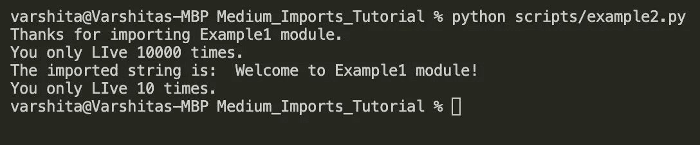

*注意:有一个解决方法，我们可以控制语句在导入时是否运行。例如，请参见下面的代码片段。*

```
***#example1.py***print("Thanks for importing Example1 module.")MY_EX1_STRING = 'Welcome to Example1 module!'def yolo(*x*: int):
     print("You only LIve", *x*, "times.")**if __name__ == '__main__':
     yolo(10000)**
```

*在* `*if__name__ == '__main__'*` *语句里面的代码* ***在导入*** *的时候不会运行，但是在外面定义的* `*yolo()*` *和* `*MY_EX1_STRING*` *可以通过导入使用。话虽如此，如果我们将* `example1.py`作为独立模块运行，那么`if`语句中的代码将被执行。

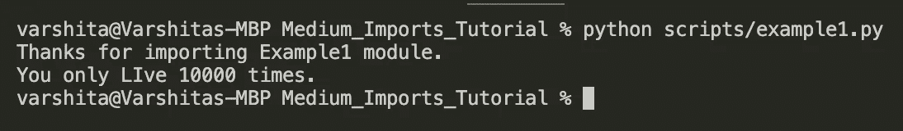

运行 **example1.py** 的输出

总之，既然我已经证明了导入一个模块可以运行它的所有内容(如果不使用`if __name__ == “__main__"`)，那么为什么只导入感兴趣的项目是有意义的就相当直观了。让我们看看如何在`example2.py`中通过从`example1.py`导入`yolo`函数来实现这一点。这也有助于我们摆脱点符号，我们可以简单地使用`yolo`功能。

```
**#example2.py****from example1 import yolo**
yolo(10)
```

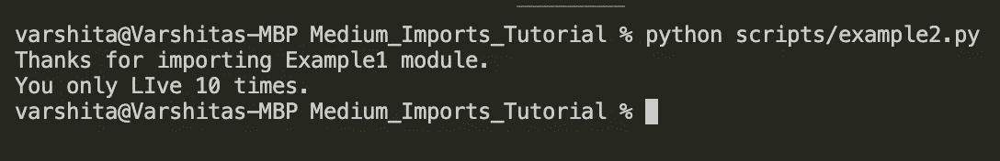

类似地，我们可以通过`from example1 import yolo, MY_EX1_STRING`从`example1.py`导入两个对象。

*注意:通常，存在包含进口陈述的代码，例如* `*from example1 import **` *。这实质上意味着导入所有内容，但是，这被认为是一种不好的做法，因为它会对代码的可读性产生负面影响。*

## PYTHONPATH 有什么用？

如果您注意到 Github 上项目的目录结构，通常会有一个`utils`目录，其中包含一些用于预处理、数据清理等常见任务的实用程序脚本。这些脚本与主脚本分开保存，旨在重用。

让我们继续为我们的项目创建一个。`utils`包将包含三个模块— `length.py`、`lower.py`和`upper.py`，分别用于返回字符串输入的长度、小写和大写。

我们还将在项目根目录下创建`example3_outer.py`模块。这是我们将导入`util`包中的模块的地方。

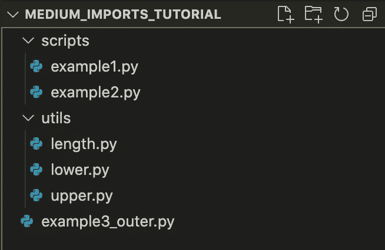

三个模块的内容如下:

```
**#utils/length.py**def get_length(*name*: str):
    return len(*name*)**#utils/lower.py**def to_lower(*name*: str):
    return *name*.lower()**#utils/upper.py**def to_upper(*name*: str):
    return *name*.upper()
```

现在，如果我们必须在`example3_outer.py`中导入`length.py`模块，这是我们通常的做法。

```
**#example3_outer.py**import utils.lengthres = utils.length.get_length("Hello")
print("The length of the string is: ",res)
```

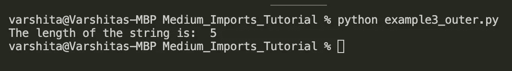

需要注意的是，如果你要做的是`import length`而不是`import utils.length`，你会得到`ModuleNotFoundError: No module named ‘length’`。这是因为`sys.path`列表不包含`../Medium_Imports_Tutorial/utils`目录(*但*)，该目录是它找到`length.py`模块所需要的。让我们看看如何将它添加到`sys.path`列表中。

有两种方法可以做到这一点:

**方法 1** :使用`sys.path.append`

```
**#example3_outer.py**import os
import sysfpath = os.path.join(os.path.dirname(__file__), 'utils')
**sys.path.append**(fpath)
print(sys.path)import length
txt = "Hello"
res_len = length.get_length(txt)
print("The length of the string is: ",res_len)
```

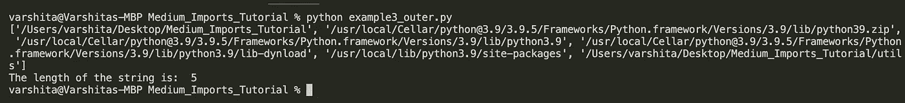

需要考虑的事情很少:

*   `imports`的顺序很重要——只有使用`sys.path.append`将路径附加到`utils`目录后，才能执行`import length`语句。简而言之，不要为了整洁而将`imports os`、`import sys`和`import length`都放在脚本的顶部！
*   `os.path.dirname(__file__)`返回当前工作目录的绝对路径。我们使用`os.path.join`将`utils`目录添加到这个路径中。
*   与往常一样，使用点符号(即`length.get_length()`)可以方便地访问导入模块中定义的函数。

**方法二**:使用`PYTHONPATH`环境变量

我经常发现修改 pythonpath 变量比使用方法 1 添加目录更容易。

> PYTHONPATH 是一个环境变量，您可以设置它来添加额外的目录，python 将在这些目录中查找模块和包。[ [来源](https://www.tutorialspoint.com/What-is-PYTHONPATH-environment-variable-in-Python)

在我们修改它之前，让我们在终端中使用`echo $PYTHONPATH`检查它的内容(以确保我们没有覆盖它):

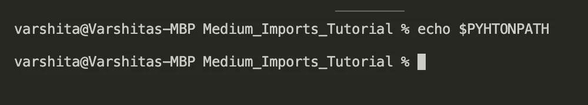

看起来它现在是空的，但是如果不是空的，我们总是建议**修改 pythonpath，以一种追加到它而不是覆盖它的方式**。更具体地说，您必须将新目录添加到`PYTHONPATH`，用冒号(`:`)将其与现有内容隔开。

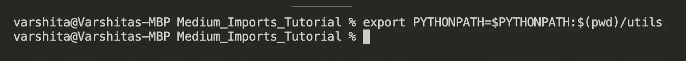

有了 pythonpath 变量集，我们不再需要在`example3_outer.py`中追加到`sys.path`(为了清晰起见，我在下面的代码片段中把它们注释掉了)。

```
**#example3_outer.py****#import os
#import sys****#fpath = os.path.join(os.path.dirname(__file__), 'utils')
#sys.path.append(fpath)
#print(sys.path)**import length
txt = "Hello"
res_len = length.get_length(txt)
print("The length of the string is: ",res_len)
```

*注意:一旦关闭 python，列表将恢复到以前的默认值。如果您想将一个目录永久添加到* `*PYTHONPATH*` *，请将导出命令(* `export PYTHONPATH=$PYTHONPATH:$(pwd)/utils` ) *添加到您的* `*~/.bashrc*` *。(参见本*[*stack overflow*](https://stackoverflow.com/questions/3402168/permanently-add-a-directory-to-pythonpath)*讨论)。*

最后，定义了两个方法之后，让我们选择一个(基于您的偏好/用例)来导入剩余的两个模块—`example3_outer.py`中的`upper.py`和`lower.py`。
*(注:我用方法 1 只是为了好玩。)*

```
**#example3_outer.py**import os
import sysfpath = os.path.join(os.path.dirname(__file__), 'utils')
sys.path.append(fpath)import length
**import upper
import lower**txt = "Hello"res_len = length.get_length(txt)
print("The length of the string is: ",res_len)**res_up = upper.to_upper(txt)
print("Uppercase txt: ", res_up)****res_low = lower.to_lower(txt)
print("Uppercase txt: ", res_low)**
```

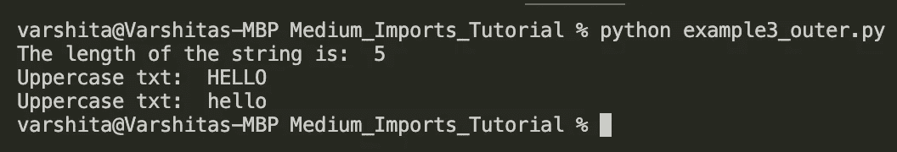

超级！这看起来真棒。然而，如果我们可以只做`import utils`而不是单独导入其中的所有模块，那不是很好吗？毕竟，我们的用例表明我们确实需要所有这三个功能。那么我们该怎么做呢？

## 我们什么时候需要 __init__。py？

首先，让我们尝试在`example3_outer.py`中导入`utils`目录(在注释掉所有现有代码之后):

```
**#example3_outer.py**import utils
```

运行这个脚本不会导致任何错误，这是理所当然的——解释器会查看`sys.path`内部，并在索引 0 处找到当前目录`../Medium_Imports_Tutorial`。这就是找到`utils`目录所需的全部内容。

现在让我们尝试从`utils`访问`length.py`模块:

```
**#****example3_outer.py**import utilstxt = "Hello"
res = utils.length.get_length(txt)
```

当您尝试运行这个脚本时，您会看到一个`AttributeError: module ‘utils’ has no attribute ‘length’`。通俗地说，这意味着我们将无法访问`utils`中的任何 python 脚本，因为解释器还不知道这是一个包！

我们可以通过在`utils`文件夹中引入`__init__.py`文件将这个目录变成一个包。

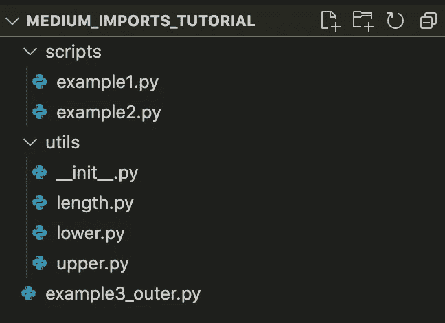

在`__init__.py`中，我们导入所有我们认为对我们的项目必要的模块。

```
***# utils/__init__.py*** *(incorrect way of importing)*from length import get_length
from lower import to_lower
from upper import to_upper
```

我们称之为`example3_outer.py`

```
import utilstxt = "Hello"
res_low = utils.to_lower(txt)
print(res_low)
```

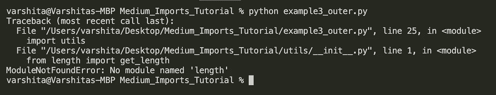

等一下！ *为什么运行* `*example3_outer.py*` *时会出现错误？*
答:我们在上面的`__init__.py`中导入模块的方式对你来说似乎是合理的——毕竟`__init__.py`和`length.py`(或`lower.py`、`upper.py`)在同一级别，所以没有理由`from lower import to_lower`不工作。事实上，如果您单独运行这个`init`文件，它将完美地执行(它不会给出任何输出，但仍然会成功执行)。

话虽如此，我们不能使用上述导入方式，因为即使`length.py`和`lower.py`与`__init__.py`处于同一级别，这也不是调用`init`的级别。实际上，我们从`example3_outer.py`发出调用，因此`sys.path`将只有`example3_outer.py`的当前目录，即`../Medium_Imports_Tutorial`来搜索*中的任何*导入。因此，当解释器在`example3_outer.py`中遇到`import utils`命令时，即使它移动到`utils`目录中的`__init__.py`，也不会自动更新`sys.path`，解释器也无法知道在哪里可以找到名为`length`的模块。我们必须以某种方式指向目录的位置。为此，我们可以在`__init__.py` 中使用相对或绝对导入(或如上所述设置`PYTHONPATH`变量)。

> 相对导入(不推荐):指定相对于调用脚本路径的路径。

```
**# utils/__init__.py**from .lower import to_lower
from .upper import to_upper
from .length import get_length
```

我们使用点符号(`.`或`..`)来指定相对进口。lower 前面的单个点指的是调用导入时所在的目录。这可以看作是从`./lower.py`导入`to_lower()`。类似地，模块名前的双点意味着从当前级别向上移动两级。

> 绝对导入(更好的选择):指定从项目根目录(或 sys.path 可以访问的任何其他目录)导入的模块的绝对路径。

```
**# utils/__init__.py**from utils.lower import to_lower
from utils.upper import to_upper
from utils.length import get_length
```

现在，与相对进口相比，它包含了更多的信息，而且不容易被破解。此外，如上所述，`sys.path`可以访问项目根目录，即`../Medium_Imports_Tutorial`，从那里可以轻松搜索`utils`目录。(为什么？因为它是项目根目录的直接子目录)。

**当我们导入一个定义了** `**__init__.py**` **的包时会发生什么？**这是一个初始化步骤，是我们导入包时执行的第一个文件。考虑到我们在这里做了所有必要的导入，调用脚本中的代码要干净得多。例如:

```
**#example3_outer.py****import utils**txt = "Hello"
res_len = **utils.get_length**(txt)
print(res_len)res_up = **utils.to_upper**(txt)
print(res_up)res_low = **utils.to_lower**(txt)
print(res_low)
```

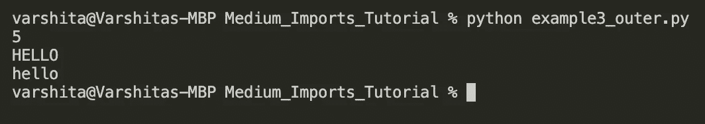

厉害！现在我们已经将我们的`utils`目录转换成了一个包。这个包的美妙之处在于，它可以被导入到任何地方，并且几乎可以立即使用。让我们看看如何在`scripts`目录中使用这个包。让我们在`scripts`中创建一个名为`example3.py`的新文件。

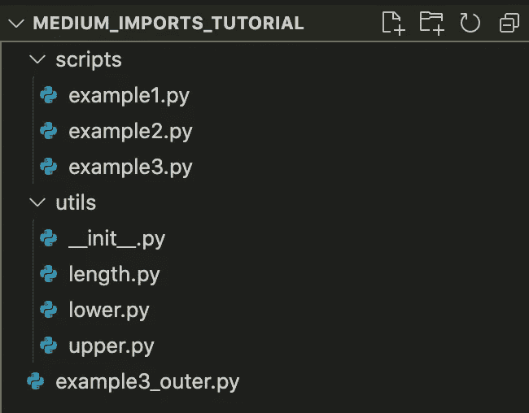

```
**# scripts/example3.py**import os
import sysPROJECT_ROOT = os.path.abspath(os.path.join(
                  os.path.dirname(__file__), 
                  os.pardir)
)
sys.path.append(PROJECT_ROOT) import utils
print(utils.get_length("Hello"))************** OUTPUT *********
5
```

需要考虑的事情很少:

*   在导入`utils`包之前，我们必须确保`utils`的父目录，即项目根目录可以被 Python 解释器访问。假设它会默认发生是不明智的，主要是因为我们现在在项目根目录中的一个级别(我们从`scripts/example3.py`运行脚本)，`sys.path`将在索引 0 处有`../Medium/Imports_Tutorial/scripts`。
*   `os.path.dirname(__file__)`将给出当前脚本的目录名，而`os.pardir`将使用点符号给出父目录的路径，即`..`。总而言之，`os.path.abspath`将提供项目根的绝对路径。

额外好处:我们甚至可以将其他目录中的模块添加到我们的`__init__.py`中。例如，让我们引入在`scripts/example1.py`中定义的`yolo()`。

```
**# utils/__init__.py**from utils.lower import to_lower
from utils.upper import to_upper
from utils.length import get_length**from scripts.example1 import yolo**
```

在`example3.py`中调用该函数

```
**# scripts/example3.py**import os
import sysPROJECT_ROOT = os.path.abspath(os.path.join(
                  os.path.dirname(__file__), 
                  os.pardir)
)
sys.path.append(PROJECT_ROOT)import utils
print(utils.get_length("Hello"))
**utils.yolo(2)**************** OUTPUT *********
5
**You only LIve 2 times.**
```

# 结论

老实说，导入错误在开始的时候真的让我很害怕，因为这是我从来不需要担心的一个方面。多年来，我已经学会了一个有用的技巧——对于你试图使用`import XYZ`导入的任何包/模块，确保 Python 解释器可以访问它。如果没有，更新`sys.path`或者更好地将相关目录附加到`PYTHONPATH`变量，避免在脚本中处理它。

一如既往，如果有更简单的方法来做/解释本文中提到的一些事情，一定要让我知道。一般来说，避免不请自来的破坏性/垃圾/敌意评论！

直到下一次✨

我喜欢写循序渐进的初学者指南、操作指南、面试问题、ML/AI 中使用的解码术语等。如果你想完全访问我的所有文章(以及其他作家在媒体上的文章)，那么你可以使用 [***我的链接***](https://varshitasher.medium.com/membership)**这里* ***注册。****

*[](/step-by-step-guide-to-explaining-your-ml-project-during-a-data-science-interview-81dfaaa408bf) [## 在数据科学面试中解释你的 ML 项目的逐步指南。

### 在结尾有一个额外的样本脚本，让你谨慎地展示你的技术技能！

towardsdatascience.com](/step-by-step-guide-to-explaining-your-ml-project-during-a-data-science-interview-81dfaaa408bf) [](/fine-tuning-hubert-for-emotion-recognition-in-custom-audio-data-using-huggingface-c2d516b41cd8) [## 使用 Huggingface 微调 HuBERT 用于定制音频数据中的情感识别

### 构建自定义数据加载器、实验日志、改进指标的技巧和 GitHub repo，如果您想了解…

towardsdatascience.com](/fine-tuning-hubert-for-emotion-recognition-in-custom-audio-data-using-huggingface-c2d516b41cd8) [](/end-to-end-deep-learning-project-part-1-930af1e1e191) [## 端到端深度学习项目:第 1 部分

### 用 Keras 实现迁移学习的高效网络图像分类模型

towardsdatascience.com](/end-to-end-deep-learning-project-part-1-930af1e1e191) [](https://varshitasher.medium.com/six-reasons-to-switch-to-this-podcast-app-today-3a396ada0a2b) [## 今天切换到这个播客应用程序的六个理由！

### 带上你的朋友。

varshitasher.medium.com](https://varshitasher.medium.com/six-reasons-to-switch-to-this-podcast-app-today-3a396ada0a2b)*