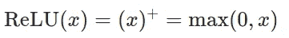
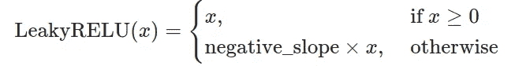
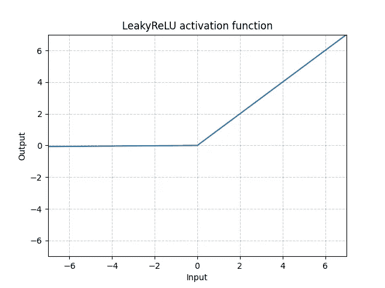
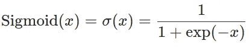
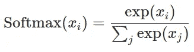
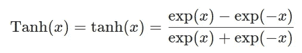
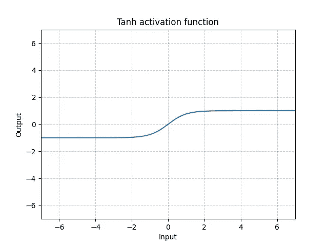

# 理解 PyTorch 激活函数:数学和算法(第一部分)

> 原文：<https://towardsdatascience.com/understanding-pytorch-activation-functions-the-maths-and-algorithms-part-1-7d8ade494cee?source=collection_archive---------26----------------------->

## PyTorch 中激活函数的数学定义、算法和实现的分步指南

你可以在这里找到第二部。


由[比尔·麦基](https://unsplash.com/@billmackie?utm_source=medium&utm_medium=referral)在 [Unsplash](https://unsplash.com?utm_source=medium&utm_medium=referral) 上拍摄的照片

# 介绍

在 ML 的世界中，激活函数帮助网络学习输入数据中的复杂模式(或嵌入)。与我们的大脑相比，激活功能类似于神经元的末端，在给定一组复杂输入的情况下，决定将什么信息包传播到后续神经元。

在这篇文章中，我们将从数学上形式化并实现 PyTorch 中一些更流行的激活函数。它将根据您正在查看的输出类型进行划分，即:

*   **(轻微)正** : ReLU 和漏 ReLU
*   **在 0 和 1 之间** : Sigmoid，Softmax
*   **介于-1 和 1 之间** : Tanh

# 1.(稍微)积极

如果您希望修改输入并只取其正值，那么整流线性单元(ReLU)或泄漏 ReLU 是合适的

## a.整流线性单元



ReLU 数学定义

给定输入 *x，* ReLU 将取 0 和 x 之间的最大值。


图形表示

在 python 中实现 ReLU 函数的方法如下:

```
import numpy as nparr_before = np.array([-1, 1, 2])def relu(x):
    x = np.maximum(0,x)
    return xarr_after = relu(arr_before)arr_after
#array([0, 1, 2])
```

并且在 PyTorch 中，可以很容易地调用 ReLU 激活函数。

```
import torch.nnrelu = nn.ReLU()
input = torch.randn(2)
output = relu(input)
```

## b.泄漏整流线性单元(ReLU)



泄漏 ReLU 数学定义

week ReLU 和 Leaky ReLU 略有区别。给定输入 *x，*如果值为正，Leaky ReLU 将取 0 和 x 之间的最大值，否则它将 x 乘以提供的负斜率。从图形上看，ReLU 有以下转化行为。



泄漏 ReLU 图形表示

在 python 中实现泄漏 ReLU 激活函数可以按如下方式完成:

```
import numpy as nparr_before = np.array([-1, 1, 2])# If x>0 returns x, else returns x*negative_slope
def leaky_relu(x, neg_slope=0.01):
    x = np.where(x>0, x, x*neg_slope)
    return xarr_after = leaky_relu(arr_before)arr_after
#array([-0.01, 1., 2.])
```

并且在 PyTorch 中，可以很容易地调用泄漏的 ReLU 激活函数。

```
import torch.nnneg_slope=0.01
leaky_relu = nn.LeakyReLU(neg_slope) #Pass in negative slope value
input = torch.randn(2)
output = leaky_relu(input)
```

# 2.介于 0 和 1 之间

如果您希望输出介于 0 和 1 之间的值(对于概率分类类型的问题非常有用)，那么 Sigmoid 或 Softmax 激活函数都是合适的，具体取决于下面讨论的一些注意事项。

## a.乙状结肠的



Sigmoid 数学定义

从图形上看，Sigmoid 具有以下转换行为，将输出限制为[0，1]。


Sigmoid 图形表示

在 python 中实现 Sigmoid 函数的方法如下:

```
import numpy as nparr_before = np.array([-1, 1, 2])def sigmoid(x):
    x = 1 / (1 + np.exp(-x))
    return xarr_after = sigmoid(arr_before)arr_after
#array([0.26894142, 0.73105858, 0.88079708])
```

在 PyTorch 中，您可以轻松地调用 Sigmoid 激活函数。

```
import torch.nnsigmoid = nn.Sigmoid()
input = torch.randn(2)
output = sigmoid(input)
```

## b.Softmax

Softmax 类似于 sigmoid 激活函数，因为每个元素的输出位于 0 和 1 之间的范围内(即[0,1]).不同之处在于 softmax 对指数项进行了归一化，使得分量之和等于 1。因此，softmax 通常用于多类分类问题，其中已知类的总概率总和通常为 1。



Softmax 数学定义

在 python 中实现 Softmax 函数的方法如下:

```
import numpy as nparr_before = np.array([-1, 1, 2])def softmax(x):
    numerator = np.exp(x)
    denominator = np.sum(np.exp(x))
    x = numerator / denominator
    return xarr_after = softmax(arr_before)arr_after
#array([0.03511903, 0.25949646, 0.70538451]) #Sums up to 1
```

在 PyTorch 中，您可以轻松调用 Softmax 激活函数。

```
import torch.nnsoftmax = nn.Softmax(dim=1)
input = torch.randn(2, 3)
output = softmax(input)
```

# 3.介于-1 和 1 之间

如果您希望将值转换到-1 和 1 之间，那么 Tanh 可能是一个合适的激活函数。

## a.双曲正切



Tanh 数学定义

从图形上看，Tanh 具有以下激活行为，将输出限制在[-1，1]之间。



Tanh 图形表示

在 python 中实现 Tanh 函数的方法如下:

```
import numpy as nparr_before = np.array([-1, 1, 2])def tanh(x):
    x = (np.exp(x) - np.exp(-x)) / (np.exp(x) + np.exp(-x))
    return xarr_after = tanh(arr_before)arr_after
#array([-0.76159416,  0.76159416,  0.96402758])
```

在 PyTorch 中，您可以轻松地调用 Tanh 激活函数。

```
import torch.nntanh = nn.Tanh()
input = torch.randn(2)
output = tanh(input)
```

# 结论

这篇文章介绍了 PyTorch 中一些更常见的激活函数的数学定义、图形表示和实际实现。下一篇文章将讨论一些更高级的激活功能，它们可能对不同的用例有用。敬请期待！

***做订阅我的邮件简讯:***[*【https://tinyurl.com/2npw2fnz】*](https://tinyurl.com/2npw2fnz)****在这里我定期用通俗易懂的语言和漂亮的可视化总结 AI 研究论文。****