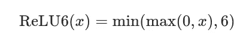
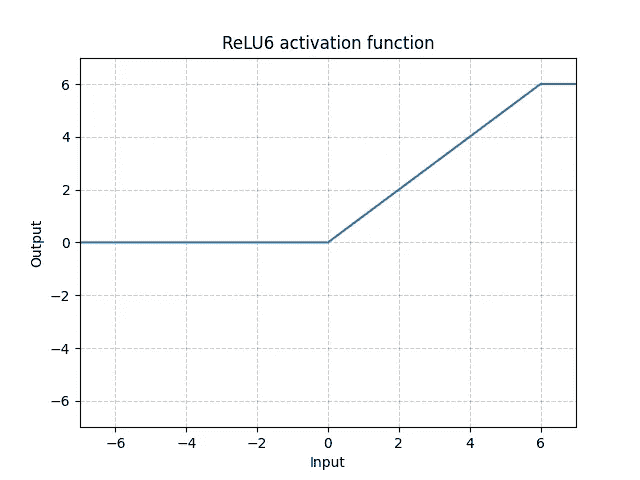
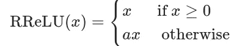
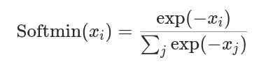
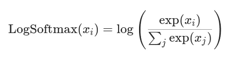
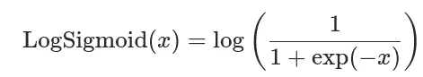
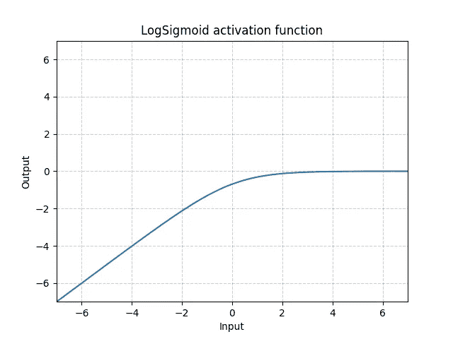

# 理解 PyTorch 激活函数:数学和算法(第二部分)

> 原文：<https://towardsdatascience.com/understanding-pytorch-activation-functions-the-maths-and-algorithms-part-2-1f8bce111a7b?source=collection_archive---------38----------------------->

## PyTorch 中激活函数的数学定义、算法和实现的分步指南

第 1 部分可以在这里找到[。](/understanding-pytorch-activation-functions-the-maths-and-algorithms-part-1-7d8ade494cee)


由[比尔·麦基](https://unsplash.com/@billmackie?utm_source=medium&utm_medium=referral)在 [Unsplash](https://unsplash.com?utm_source=medium&utm_medium=referral) 上拍摄的照片

# 介绍

在 ML 的世界中，激活函数帮助网络学习输入数据中复杂的非线性模式(或嵌入)。

在这篇文章中，我们将从数学上形式化并实现 PyTorch 中一些更健壮但不太流行的激活函数。要了解更多关于更流行的激活功能，请在[第 1 部分](/understanding-pytorch-activation-functions-the-maths-and-algorithms-part-1-7d8ade494cee)中找到它们。它将根据您正在查看的输出类型进行划分，即:

*   **(轻微)阳性** : ReLU6，随机泄漏
*   **在 0 和 1 之间** : Softmin
*   **小于 0** : LogSoftmax，LogSigmoid

# 1.(稍微)积极

*之前的帖子强调了 ReLU 和 LeakyReLU 的用法。*

如果您希望修改输入，并且只取它们的正值(在一定程度上取它们的负值)，那么 ReLU6 和随机化泄漏(RRELU)是合适的。

## a.整流线性单元 6 (ReLU6)



ReLU6 数学定义

给定输入 *x，* ReLU6 将取 0 和 x 之间的最大值，然后取初始输出和 6 之间的最小值。为什么将最大正值设置为 6？根据[论文](https://paperswithcode.com/method/relu6)，在低精度足够的情况下，6 的大小增加了计算的鲁棒性和稳定性。从图形上看，ReLU6 具有以下转变行为:



在 python 中实现 ReLU6 函数的方法如下:

```
import numpy as nparr_before = np.array([-1, 1, 7])def relu6(x):
    x = np.minimum(np.maximum(0,x), 6)
    return xarr_after = relu6(arr_before)arr_after
#array([0, 1, 6])
```

并且在 PyTorch 中，可以很容易地调用 ReLU6 激活函数。

```
import torch.nnrelu6 = nn.ReLU6()
input = torch.randn(2)
output = relu6(input)
```

## b.随机化泄漏率



RReLU 数学定义

在 RRELU 中，当输入值为正值时，转换将输出给定的正值。但是，如果是负的，那么输入将乘以 *a* ，其中 *a* 是从均匀分布 *N* (下，上)中随机抽取的。

在 python 中实现 RReLU 激活函数的方法如下:

```
import numpy as nparr_before = np.array([-1, 1, 2])# If x>0 returns x, else returns x*sampled_a
def rrelu(x, lower=0.125, upper=0.333):
    sampled_a = np.random.uniform(lower, upper)
    x = np.where(x>0, x, x*sampled_a)
    return xarr_after = rrelu(arr_before)arr_after
#array([-0.225, 1., 2.])
```

在 PyTorch 中，您可以轻松地调用 RReLU 激活函数。

```
import torch.nnneg_slope=0.01
rrelu = nn.RReLU(0.125, 0.333) #Pass in the lower and upper values
input = torch.randn(2)
output = rrelu(input)
```

# 2.介于 0 和 1 之间

如果您希望输出介于 0 和 1 之间的值(对于问题的概率分类类型很有用)，那么 Softmin 激活函数将是合适的，这取决于下面讨论的一些注意事项。

## a.Softmin

Softmin 类似于 softmax 激活函数，因为每个元素的输出位于 0 和 1 之间的范围内(即[0,1]).区别在于 softmin 将输入元素与负的 1 相乘，如下所示:



软最小数学定义

与 Softmax 相比，您何时使用 Softmin？这是您希望检测到更多负值的时候。例如，如果您有一个在一组图像中识别非狗的分类任务，模型在识别狗方面的置信度越低，您的分类性能就越好。

在 python 中实现 Softmin 函数的方法如下:

```
import numpy as nparr_before = np.array([-1, 1, 2])def softmin(x):
    numerator = np.exp(-x)
    denominator = np.sum(np.exp(-x))
    x = numerator / denominator
    return xarr_after = softmin(arr_before)arr_after
#array([0.84379473, 0.1141952 , 0.04201007]) #Sums up to 1
```

在 PyTorch 中，您可以轻松调用 Softmin 激活函数。

```
import torch.nnsoftmin = nn.Softmin()
input = torch.randn(2, 3)
output = softmin(input)
```

# 3.小于 0

如果您希望将值转换为小于 0 的值，那么 LogSoftmax 和 LogSigmoid 可能是合适的激活函数。

## a.LogSoftmax



LogSoftmax 数学定义

与 Softmax 类似，LogSoftmax 将日志操作应用于 Softmax 函数。除了数值稳定性之外，还有一个重要的优点:与 Softmax 相比，这个激活函数**严重惩罚了**错误的分类预测。

在 python 中实现 LogSoftmax 函数的方法如下:

```
import numpy as nparr_before = np.array([-1, 1, 2])def logsoftmax(x):
    numerator = np.exp(x)
    denominator = np.sum(np.exp(x))
    x = numerator / denominator log_x = np.log(x)
    return log_xarr_after = logsoftmax(arr_before)arr_after
#array([-3.34901222, -1.34901222, -0.34901222])
```

并且在 PyTorch 中，可以很容易地调用 LogSoftmax 激活函数。

```
import torch.nnlogsoftmax = nn.LogSoftmax()
input = torch.randn(2)
output = logsoftmax(input)
```

## b.对数乙状结肠



对数数学定义

类似于 LogSoftmax 对 Softmax，LogSigmoid 将 log 运算符应用于 Sigmoid 函数。从图形上看，LogSigmoid 具有以下转换行为，将输出限制为(-inf，0)。



对数图形表示

在 python 中实现 LogSigmoid 函数的方法如下:

```
import numpy as nparr_before = np.array([-1, 1, 2])def logsigmoid(x):
    x = 1 / (1 + np.exp(-x))
    return np.log(x)arr_after = logsigmoid(arr_before)arr_after
#array([-1.31326169, -0.31326169, -0.12692801])
```

并且在 PyTorch 中，可以很容易地调用 LogSigmoid 激活函数。

```
import torch.nnlogsigmoid = nn.LogSigmoid()
input = torch.randn(2)
output = logsigmoid(input)
```

# 结论

这篇文章继续讨论 PyTorch 中一些更健壮但不常用的激活函数的数学定义、图形表示和实际实现。如果你受益匪浅，请分享并为这篇文章鼓掌！

***做订阅我的邮件简讯:***[*【https://tinyurl.com/2npw2fnz】*](https://tinyurl.com/2npw2fnz)****在这里我定期用通俗易懂的英语和漂亮的可视化总结 AI 研究论文。****