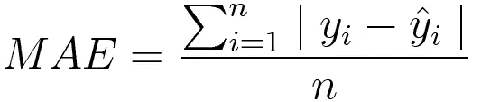
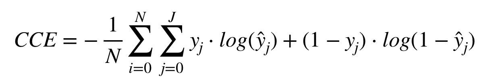

# 理解 PyTorch 损失函数:数学和算法(上)

> 原文：<https://towardsdatascience.com/understanding-pytorch-loss-functions-the-maths-and-algorithms-part-1-6e439b27117e?source=collection_archive---------33----------------------->

## PyTorch 中损失函数的数学定义、算法和实现的分步指南

你可以在这里找到第二部。


由[杰斯温·托马斯](https://unsplash.com/@jeswinthomas?utm_source=medium&utm_medium=referral)在 [Unsplash](https://unsplash.com?utm_source=medium&utm_medium=referral) 上拍摄的照片

就像人类一样，机器从过去的错误中学习。这些“错误”被正式称为**损失**，并由**函数**(即。损失函数)。如果机器学习算法的预测离地面真相更远，那么损失函数就会显得很大，反之亦然。因此，任何学习过程的目标都将是最小化这种损失，使得最终的输出将紧密匹配真实世界的标签。这篇文章将介绍一些更流行的损失函数的数学定义和算法，以及它们在 PyTorch 中的实现。

# 介绍

选择最佳损失函数是一项设计决策，取决于我们的计算约束(如速度和空间)、数据集中是否存在显著异常值以及我们拥有的输入/输出类型。

尽管如此，在选择不同的损失函数时，我们需要问的第一个问题是我们面前的数据类型。一般来说，损失函数可以根据我们正在处理的特定任务进行灵活的分组:或者是一个**回归**或者是**分类**问题。回归处理连续的数据集，例如在给定一个国家的人口增长率、城市化、历史 GDP 趋势等的情况下预测其人均 GDP。另一方面，分类问题涉及有限的离散类别，例如预测卫星图像是否正在经历任何降雨事件。

# 回归损失函数

## 平均绝对误差(L1 损耗)



平均绝对误差损失函数

平均绝对误差(MAE)是真实值(y_i)与其对应的预测值(y_hat_i)之间的绝对差值除以此类对的总数。

***算法:MAE***

```
import numpy as npy_pred = np.array([0.000, 0.100, 0.200])
y_true = np.array([0.000, 0.200, 0.250])# Defining Mean Absolute Error loss function
def mae(pred, true):
    # Get absolute difference
    differences = pred - true
    absolute_differences = np.absolute(differences) # Get the mean
    mean_absolute_error = absolute_differences.mean()
    return mean_absolute_errormae_value = mae(y_pred, y_true)
print ("MAE error is: " + str(mae_value))
```

***PyTorch 实现:MAE***

```
import torchmae_loss = torch.nn.L1Loss()input = torch.randn(2, 3, requires_grad=True)
target = torch.randn(2, 3)
output = mae_loss(input, target)
output.backward()input
#tensor([[-0.5855,  0.4962, -0.7684],
        [ 0.0587,  0.5546,  0.9823]], requires_grad=True)target
#tensor([[ 0.7184, -1.3773,  0.9070],
        [-0.1963, -3.2091, -0.8386]])output
#tensor(1.7821, grad_fn=<L1LossBackward>)
```

## 均方误差(L2 损耗)


均方误差损失函数

与 MAE 类似，均方误差(MSE)是真实值(y_i)和预测值(y_hat_i)之间的平方(成对)差的总和，除以这种对的数量。MSE 通常通过应用平方算子来惩罚远离事实的预测，但是对异常值不太稳健，因为它倾向于夸大这种观察。

***算法:MSE***

```
import numpy as npy_pred = np.array([0.000, 0.100, 0.200])
y_true = np.array([0.000, 0.200, 0.250])# Defining Mean Squared Error loss function
def mse(pred, true):
    # Get squared difference
    differences = pred - true
    squared_differences = differences ** 2 # Get the mean
    mean_squared_error = squared_differences.mean()
    return mean_squared_errormse_value = mse(y_pred, y_true)
print ("MSE error is: " + str(mse_value))
```

**py torch 实现:MSE**

```
import torchmse_loss = torch.nn.MSELoss()input = torch.randn(2, 3, requires_grad=True)
target = torch.randn(2, 3)
output = mse_loss(input, target)
output.backward()input
#tensor([[-0.4867, -0.4977, -0.6090],
        [-1.2539, -0.0048, -0.6077]], requires_grad=True)target
#tensor([[ 2.0417, -1.5456, -1.1467],
        [ 0.7593, -0.5154, -1.3713]])output
#tensor(2.1129, grad_fn=<MseLossBackward>)
```

# 分类损失函数

## 二元交叉熵


二元交叉熵损失函数

如果你只有两个标签(如真或假，猫或狗，*等*)，那么二元交叉熵(BCE)是最合适的损失函数。请注意，在上面的数学定义中，当实际标签为 1 (y(i) = 1)时，函数的后半部分会消失。在实际标签为 0 (y(i) = 0)的情况下，等式的前半部分被丢弃。简而言之，我们只是将实际预测概率的对数乘以地面真实类。当我们在*分类交叉熵*(在上一节中讨论)中推广 BCE 来处理 2 个以上的类时，这个想法是有用的。

***算法:BCE***

```
import numpy as npy_pred = np.array([0.1880, 0.4137, 0.2285])
y_true = np.array([0.0, 1.0, 0.0]) #2 labels: (0,1)def BCE(y_pred, y_true):
    total_bce_loss = np.sum(-y_true * np.log(y_pred) - (1 - y_true) * np.log(1 - y_pred)) # Get the mean BCE loss
    num_of_samples = y_pred.shape[0]
    mean_bce_loss = total_bce_loss / num_of_samples

    return mean_bce_loss

bce_value = BCE(y_pred, y_true)
print ("BCE error is: " + str(bce_value))
```

***PyTorch 实现:BCE***

```
import torchbce_loss = torch.nn.BCELoss()
sigmoid = torch.nn.Sigmoid() # Ensuring inputs are between 0 and 1input = torch.randn(3, requires_grad=True)
target = torch.empty(3).random_(2)
output = bce_loss(sigmoid(input), target)
output.backward()sigmoid(input)
#tensor([0.1880, 0.4137, 0.2285], grad_fn=<SigmoidBackward>)target
#tensor([0., 1., 0.])output
#tensor(0.4501, grad_fn=<BinaryCrossEntropyBackward>)
```

## 范畴交叉熵(即。负对数-可能性+对数软最大值)



分类交叉熵损失函数

类别交叉熵(CCE)损失函数可以用于具有两个以上类别的任务，例如狗、猫、虎、*等*之间的分类。上面的公式看起来令人望而生畏，但 CCE 本质上是 BCE 的推广，在所有类上增加了求和项。

***算法:CCE***

```
import numpy as npy_pred = np.array([0.1880, 0.4137, 0.2285])
y_true = np.array([0.0, 1.0, 0.0])def CCE(y_pred, y_true):
    total_cce_loss = np.sum(-y_true * np.log(y_pred) - (1 - y_true) * np.log(1 - y_pred)) # Get the mean CCE loss
    num_of_samples = y_pred.shape[0]
    mean_cce_loss = total_cce_loss / num_of_samples

    return mean_cce_losscce_value = CCE(y_pred, y_true)
print ("CCE error is: " + str(cce_value))
```

***PyTorch 实现:CCE***

```
import torchcce_loss = torch.nn.CrossEntropyLoss()input = torch.randn(2,3, requires_grad=True)
target = torch.empty(2).random_(3) #3 different classes
output = cce_loss(input, target)
output.backward()input
#tensor([[-0.1069, -1.0915,  0.6950],
        [-0.4095,  1.0890, -1.4179]], requires_grad=True)target
#tensor([1, 1])output
#tensor(1.2663, grad_fn=<NllLossBackward>)
```

# 结论

这就是我们对 PyTorch 更流行的损失函数、它们的数学定义、算法实现和 PyTorch 的 API 实践的介绍。本系列的下一部分将更多地讨论其他不太流行但有用的损失函数。

***做订阅我的邮件简讯:***[*https://tinyurl.com/2npw2fnz*](https://tinyurl.com/2npw2fnz)****在那里我定期用通俗易懂的英语和漂亮的可视化总结 AI 研究论文。****