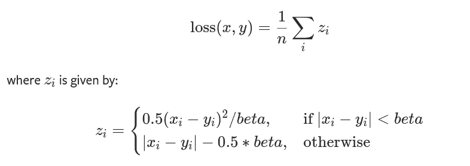
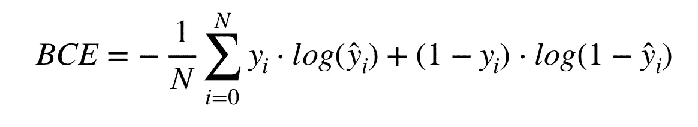

# 理解 PyTorch 损失函数:数学和算法(下)

> 原文：<https://towardsdatascience.com/understanding-pytorch-loss-functions-the-maths-and-algorithms-part-2-104f19346425?source=collection_archive---------21----------------------->

## PyTorch 中损失函数的数学定义、算法和实现的分步指南

**Part 1 可以在这里找到**[](/understanding-pytorch-loss-functions-the-maths-and-algorithms-part-1-6e439b27117e)****。****

****

**照片由 [Antoine Dautry](https://unsplash.com/@antoine1003?utm_source=medium&utm_medium=referral) 在 [Unsplash](https://unsplash.com?utm_source=medium&utm_medium=referral) 上拍摄**

**这是第 1 部分的延续，你可以在这里找到。在这篇文章中，我们将通过定义数学公式，编码算法并在 PyTorch 中实现，来深入挖掘 PyTorch 中鲜为人知但有用的损失函数。**

# **介绍**

**选择最佳损失函数是一项设计决策，取决于我们的计算约束(如速度和空间)、数据集中是否存在显著异常值以及我们拥有的输入/输出类型。**

**尽管如此，在选择不同的损失函数时，我们需要问的第一个问题是我们面前的数据类型。一般来说，损失函数可以根据我们正在处理的特定任务进行灵活的分组:或者是一个**回归**或者是**分类**问题。回归处理连续的数据集，例如在给定一个国家的人口增长率、城市化、历史 GDP 趋势等的情况下预测其人均 GDP。另一方面，分类问题涉及有限的离散类别，例如预测卫星图像是否正在经历任何降雨事件。**

# **回归损失函数**

## **平均绝对误差(L1 损耗)—但更好……(平滑损耗)**

**这个损失函数类似于 MAE，但是更好更稳定:例如，防止爆炸梯度。**

****

**平滑 1 损耗**

**那看起来…令人畏惧！让我们慢慢分解这些。**

**第一行概括了损失函数的数学定义。给定一组预测， *x* 和它们的基本事实， *y* ，我们平均出一个损失指标， *z.***

**那么什么是 *z* 呢？它是一个基于情况的损失函数: ***如果*** 预测值和地面实况值之间的绝对差值低于一个*β*值(这是一个由用户预先确定的先验值)，我们将该差值的平方乘以 0.5 并除以*β；* ***否则*** 从预测值和实际值的绝对差值中减去一半*β*。**

**在 Python 中，这可以写成:**

*****算法:smooth 1 loss*****

```
import numpy as npy_pred = np.array([0.000, 0.100, 0.200])
y_true = np.array([0.000, 0.200, 0.250])# Defining z function 
def calculate_z(diff, beta=0.5):
    if (diff < beta).all():
        return 0.5 * np.power(diff, 2) / beta
    else:
        return diff - 0.5 * beta# Defining Smooth L1 Loss function (with beta defined to be 0.5)
def smoothl1_loss(pred, true):
    # Get absolute difference
    differences = pred - true
    abs = np.absolute(differences) # Get the intermediate z values
    z_values = np.apply_along_axis(calculate_z, 0, abs) # Get the mean
    smoothl1loss = z_values.mean()
    return smoothl1losssmoothl1loss_value = smoothl1_loss(y_pred, y_true)
print ("SmoothL1Loss error is: " + str(smoothl1loss_value))
```

**在 PyTorch 中，它只是一个简单的函数调用…**

*****PyTorch 实现:smoothl loss*****

```
import torchsmoothl1_loss = torch.nn.SmoothL1Loss(beta=0.5)input = torch.randn(2, 3, requires_grad=True)
target = torch.randn(2, 3)
output = smoothl1_loss(input, target)input
#tensor([[ 0.6051,  1.8739,  0.8015],
        [ 0.6713, -0.2191, -1.6360]], requires_grad=True)target
#tensor([[ 0.5638, -0.0400,  1.0652],
        [-0.7935,  1.6107, -0.3567]])output
tensor(0.9265, grad_fn=<SmoothL1LossBackward>)
```

# **分类损失函数**

**还记得我们的[第一部分](/understanding-pytorch-loss-functions-the-maths-and-algorithms-part-1-6e439b27117e)对二元交叉熵的研究吗？我们将对它稍加改进以获得更大的数值稳定性(即性能更好)。**

## **二元交叉熵—但更好… (BCE With Logits)**

**这个损失函数是 BCE 更稳定的版本(即。你可以阅读更多关于 log-sum-exp 数值稳定性的技巧)，它在计算 BCELoss 之前结合了一个 Sigmoid 层。**

****

**二元交叉熵损失函数**

**简单重述一下 BCE:如果你只有两个标签(例如真或假，猫或狗，*等*)，那么二元交叉熵(BCE)是最合适的损失函数。请注意，在上面的数学定义中，当实际标签为 1 (y(i) = 1)时，函数的后半部分会消失。在实际标签为 0 (y(i) = 0)的情况下，等式的前半部分被丢弃。简而言之，我们只是将实际预测概率的对数乘以地面真实类。**

**现在的区别在于在两个地方应用了一个 *Sigmoid* 函数:**

*   **log( **sigmoid** (y_hat))和**
*   **log(**s 形** (1 — y_hat))**

**在 Python 中，这可以写成…**

*****算法:BCEWithLogits*****

```
import numpy as npy_pred = np.array([0.1880, 0.4137, 0.2285])
y_true = np.array([0.0, 1.0, 0.0]) #2 labels: (0,1)def sigmoid(x):
    return 1 / (1 + np.exp(-x))def BCEWithLogits(y_pred, y_true):
    total_bcelogits_loss = np.sum(-y_true * np.log(sigmoid(y_pred)) - (1 - y_true) * np.log(sigmoid(1 - y_pred))) # Get the mean BCEWithLogits loss
    num_of_samples = y_pred.shape[0]
    mean_bcelogits_loss = total_bcelogits_loss / num_of_samples

    return mean_bcelogits_lossbcelogits_value = BCEWithLogits(y_pred, y_true)
print ("BCEWithLogits error is: " + str(bcelogits_value))
```

**它的 PyTorch 实现也很简单。**

*****PyTorch 实现:BCEWithLogits*****

```
import torchbcelogits_loss = torch.nn.BCEWithLogitsLoss()input = torch.randn(3, requires_grad=True)
target = torch.empty(3).random_(2)
output = bcelogits_loss(input, target)input
#tensor([-0.7844, -1.8377,  0.1435], requires_grad=True)target
#tensor([1., 0., 1.])output
#tensor(0.6440, grad_fn=<BinaryCrossEntropyWithLogitsBackward>)
```

# **结论**

**这就是我们对 PyTorch 的不太流行但更好(在数值上更稳定等)的损失函数、它们的数学定义、算法实现和 PyTorch 的 API 实践的中间接触。**

**【https://tinyurl.com/2npw2fnz】*订阅我的电子邮件简讯:*[](https://tinyurl.com/2npw2fnz)*****我定期在那里用通俗易懂的英语和漂亮的可视化总结 AI 研究论文。*******