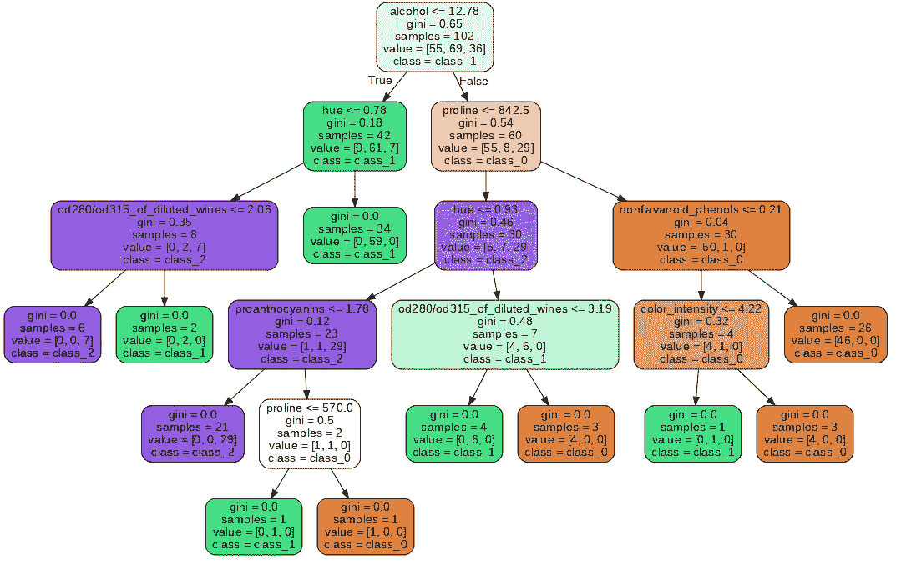
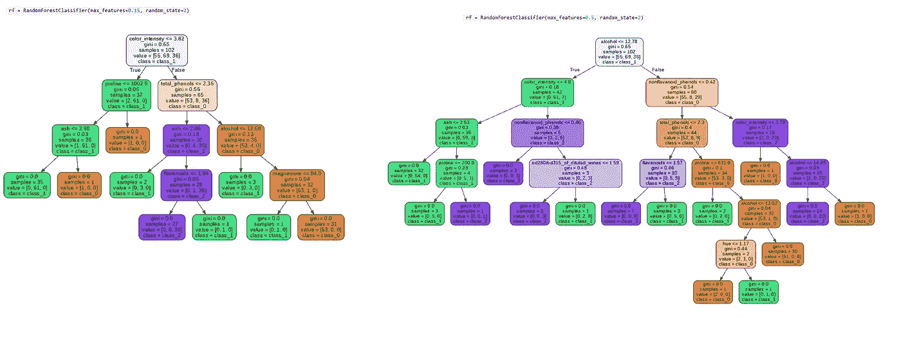
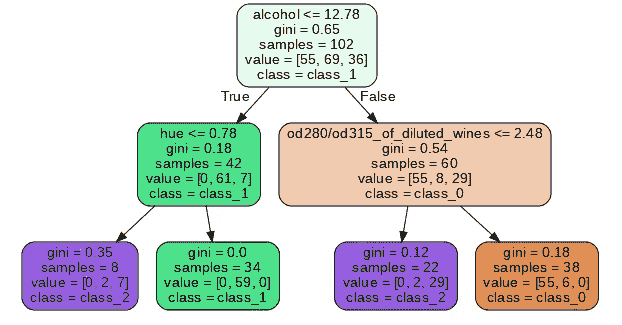
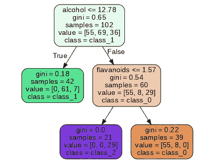
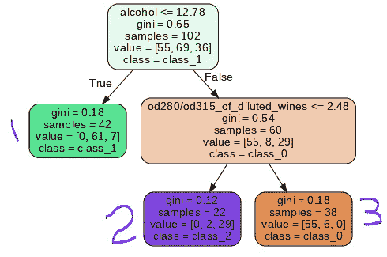
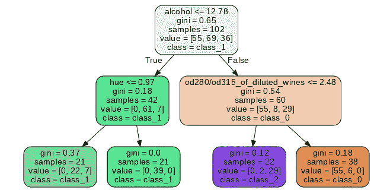
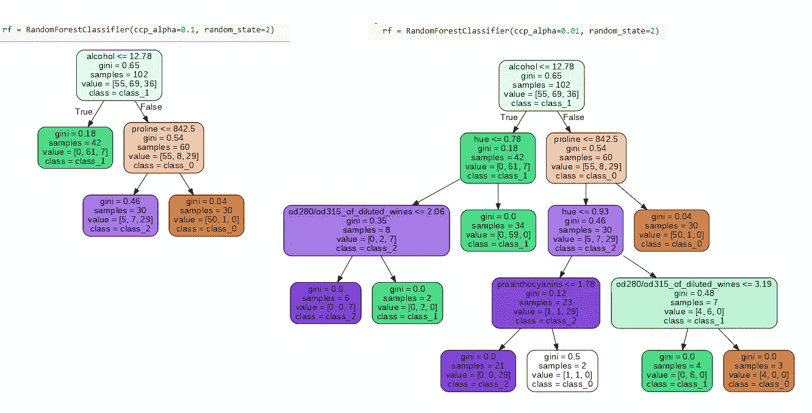

# 用图像理解随机森林的超参数

> 原文：<https://towardsdatascience.com/understanding-random-forests-hyperparameters-with-images-9b53fce32cb3?source=collection_archive---------20----------------------->

## 理解随机森林 ML 模型中超参数的影响


由 [Geran de Klerk](https://unsplash.com/@gerandeklerk?utm_source=unsplash&utm_medium=referral&utm_content=creditCopyText) 在 [Unsplash](https://unsplash.com/s/photos/forest?utm_source=unsplash&utm_medium=referral&utm_content=creditCopyText) 拍摄的照片

## 关于随机森林

决策树是一种解决问题的分布式算法。它试图通过将决策的每一步二进制化来模拟人类的思维过程。所以，在每一步，算法都在真或假之间选择前进。

该算法简单，但非常强大，因此广泛应用于机器学习模型中。然而，决策树的一个问题是它很难概括一个问题。该算法学习如何决定一个给定的数据集，以至于当我们想用它来处理新数据时，它无法给我们最好的答案。

为了解决这个问题，创建了一种新型的决策树算法，通过收集在同一数据集的各种变化上训练的许多树，并使用投票或平均系统来组合它们，并为每个数据点确定最佳结果。这就是随机森林的概念。

> 随机森林是由树结构分类器(…)独立同分布随机向量的集合组成的分类器，并且每棵树为输入 x 处最流行的类别投一个单位票。

## 创建简单的模型

创建模型相当简单。正如你们中的许多人可能知道的，实际的模型实例、拟合和预测只需要几行代码就可以完成。然而，困难的部分通常是准备数据和调整模型。

要调整模型，我们必须将超参数从默认值更改为能给我们带来最佳结果的值。我们的目标是更好地理解随机森林中每个超参数的作用，以便在需要时更好地修改它们。

以下是我将在本例中使用的导入和数据集:来自`sklearn`的 wines 数据集。

```
# Data
import pandas as pd
from sklearn.datasets import load_wine# Data split
from sklearn.model_selection import train_test_split# Model
from sklearn.ensemble import RandomForestClassifier# Visualize Tree
from sklearn.tree import export_graphviz# Load dataset
df = load_wine()# variables
X = pd.DataFrame(df.data, columns=df.feature_names)
# target
y = df.target# Split train and test
X_train, X_test, y_train, y_test = train_test_split(X, y, test_size=0.1, random_state=12)
```

以下是具有默认值的模型:

```
# Instantiate class. Using random_state=2 for you to be able to reproduce the same resultrf = RandomForestClassifier(*n_estimators=100*, *criterion='gini'*, *max_depth=None*, *min_samples_split=2*, *min_samples_leaf=1*, *min_weight_fraction_leaf=0.0*, *max_features='auto'*, *max_leaf_nodes=None*, *min_impurity_decrease=0.0*, *bootstrap=True*, *oob_score=False*, *n_jobs=None*, ***random_state=2***, *verbose=0*, *warm_start=False*, *class_weight=None*, *ccp_alpha=0.0*, *max_samples=None*)
```

我们来训练一下，生成一张图。

```
# Fit the model
rf.fit(X_train,y_train)# Extract one of the trees from the model
tree = rf.estimators_[99]# Export as dot file
export_graphviz(tree, out_file='tree.dot',
feature_names = df.feature_names, class_names = df.target_names, rounded = True, proportion = False, precision = 2, filled = True)# Convert to png using system command (requires Graphviz)
from subprocess import call
call(['dot', '-Tpng', 'tree.dot', '-o', 'tree.png', '-Gdpi=90'])# Display in jupyter notebook
from IPython.display import Image
Image(filename = 'tree.png')
```



图 1:具有所有默认值的随机森林模型。图片由作者提供。

好的，很好。现在，在继续之前，让我们排列我们正在使用的名称。

*   **节点**是我们有分裂的时候。
*   **分支**是一个决策路径【例如酒精=真>色调=真>结束(叶子)】
*   **叶子**是树枝的最后一格。

也就是说，在图 1 中注意到的第一个有趣的事情是，当“基尼”指标值为 0.0 时，树枝才到达叶子。该指标是一个衡量分割质量的函数。`sklearn`支持信息增益的“基尼”或“熵”。当数字达到 0 时，我们不能获得更多的信息，因为叶子现在是纯的。当你查看*值*【类 0 数量，类 1 数量，类 2 数量】时，一个纯叶节点被确认。如果预测的*类*中的数是唯一大于 0 的数，则该叶是纯的*(例如[0，1，0]和 class_1 =纯节点)*。

我们的目标是更好地理解改变超参数如何改变叶子、节点和分支的数量。因此，我将一次改变一个主要的超参数，并绘制结果。

## 最大功能

寻找最佳分割时要考虑的特征数量。默认值为“auto”，使用“sqrt”，但它有其他选项，如“log2”或一个有趣的可能性，即输入一个介于 0 和 1 之间的浮点数，这将是每次分割时使用的功能的百分比。如果你有 10 个特性，使用`max_feature=0.2`，它会考虑 20%的特性，也就是 2。

通常不是所有的特征都那么重要，所以这是一个很好的在`GridSearchCV`中测试的超参数，你可以试着从 0.3，0.4 这样的值开始。这里的数字越小，方差越小，但偏差越大。对于较高的数字，您有更多的机会将最佳特征用于分割，因此您将减少偏差，但增加方差。



图二:max_features 对比。作者图片

## 最大深度

这个超参数将限制树可以向下生长的最大分裂数量。

```
# Instantiate class
rf = RandomForestClassifier(max_depth = 2)
```



图 3:最大深度=2 的 RF 模型

因此，正如我们选择了`max_depth=2`，这意味着它只能分裂两次，使第三行的结果方块成为树叶。请注意，*基尼系数*指标仅适用于一个方块。事实上，它对结果没有太大的影响，因为在这个模型中有 100 个不同的树(估计量)。即使深度限制为 1，它仍然预测了三个类。它必须与其他超参数一起使用。

## **分割的最小样本数**

给定节点中能够拆分的最小样本数。

再看图 3。看到左侧有 42 个样本。让我们把`min_samples_split` 设为 50，看看会发生什么。

```
rf = RandomForestClassifier(min_samples_split=50, random_state=2)
```



作者图片

不出所料，左边的树枝没有生长。因此，这是修剪树并迫使它在达到节点纯度之前给出分类的另一种方式。

## 最大叶节点数

它决定了你的树的最大叶子数。

```
rf = RandomForestClassifier(max_leaf_nodes=3, random_state=2)
```



图 4: max_leaf_nodes=3。图片由作者提供。

这里，我们看到分类器为每个可预测的类(类 0、1 或 2)创建了一个叶子。

## 每片叶子的最小样本数

叶子需要的样本数。这意味着，如果叶片上的样本数在另一次分割后低于该数量，则不会进行处理。

```
rf = RandomForestClassifier(min_samples_leaf=20, random_state=2)
```



图 5: main_samples_leaf=20。图片由作者提供。

在图 5 中可以看到，每片叶子中的样本数高于 20。当我们的模型过度拟合时，我们可以尝试调整这个超参数，无论是否与`max_depth`结合，并强制做出更早的决定，这可能有助于推广预测。

## 复杂性成本修剪

另一种修剪树的方法是使用`ccp_alpha`超参数，它是复杂性成本参数。该算法将通过计算复杂度成本在树之间进行选择，具有较小值的数量被认为较弱，因此它们被修剪。一旦复杂性成本的最小值高于`ccp_alpha`，修剪就停止。`ccp_alpha`的值越大，修剪的节点数越多。



图 6:CCP 阿尔法数的差异。图片由作者提供。

## 在你走之前

本材料的目的是让您直观地了解改变随机森林模型中的每个超参数将如何影响您的结果。

*   `n_estimators`:估计数。你拥有的越多，你应该有一个更准确的结果，但它在计算能力方面更昂贵。
*   `criterion` **:** 在*基尼*或*熵*之间选择。两者将寻求相同的结果，即节点纯度。
*   树越大，越有可能过度拟合。RF 模型通常会尽量减少这种情况，但如果您的模型过度拟合，这个超参数可能会是一个有趣的玩法。
*   这个和上面那个一起工作。这是分裂到另一个分支所需的最小样本。
*   `max_leaf_nodes`:可以强制树少叶子。
*   `ccp_alpha`:另一种修剪树的方法，基于复杂性成本的计算。
*   参见 GitHub 中的[代码，这里是](https://github.com/gurezende/Studying/tree/master/Python/RandomForest)。

## 跟我来

如果你对这些内容感兴趣，请点击那个按钮告诉我应该写些什么，并关注我。

[](https://medium.com/gustavorsantos) [## 古斯塔夫·桑托斯

### 让我们做出更好的决定。数据驱动的决策。我用 Python，R，Excel，SQL 创建数据科学项目。

medium.com](https://medium.com/gustavorsantos) 

## 参考

[https://www.stat.berkeley.edu/~breiman/randomforest2001.pdf](https://www.stat.berkeley.edu/~breiman/randomforest2001.pdf)

[](https://scikit-learn.org/stable/modules/tree.html#minimal-cost-complexity-pruning) [## 1.10.决策树

### 决策树(DTs)是一种用于分类和回归的非参数监督学习方法。目标是…

scikit-learn.org](https://scikit-learn.org/stable/modules/tree.html#minimal-cost-complexity-pruning) 

[https://sci kit-learn . org/stable/modules/tree . html #最小成本复杂性修剪](https://scikit-learn.org/stable/modules/tree.html#minimal-cost-complexity-pruning)

[随机森林文档](https://scikit-learn.org/stable/modules/generated/sklearn.ensemble.RandomForestClassifier.html?highlight=random%20forest%20classifier#sklearn.ensemble.RandomForestClassifier)

[](/random-forest-hyperparameters-and-how-to-fine-tune-them-17aee785ee0d) [## 随机森林:超参数以及如何微调它们

### 如何优化最常用的机器学习模型之一

towardsdatascience.com](/random-forest-hyperparameters-and-how-to-fine-tune-them-17aee785ee0d)