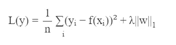
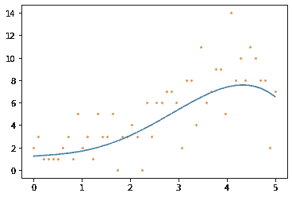
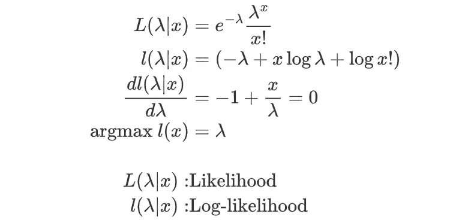
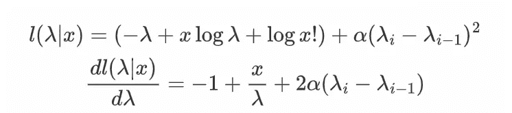
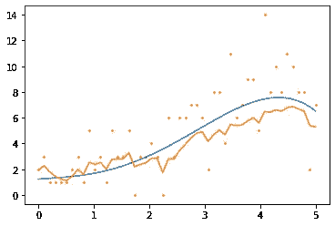
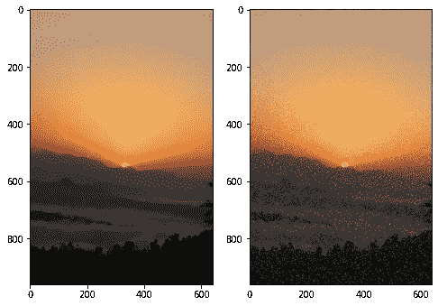
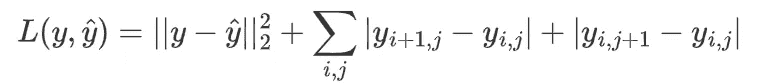
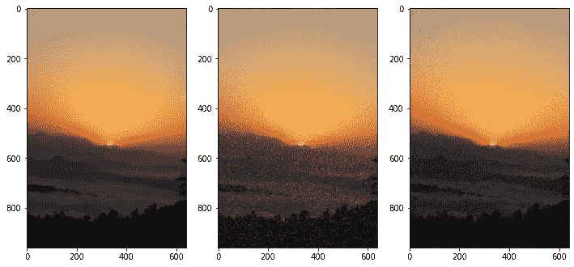
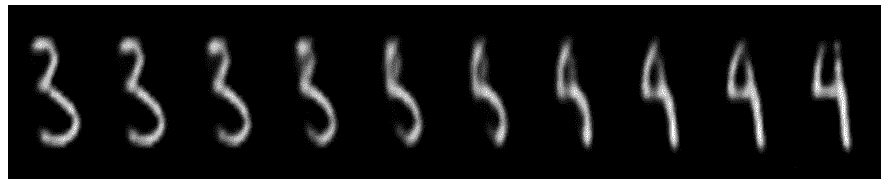
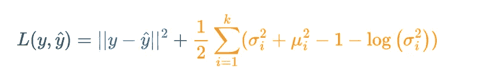

# 理解规范化

> 原文：<https://towardsdatascience.com/understanding-regularisation-7576f36942f5?source=collection_archive---------28----------------------->

## 正则化是一个强大的工具，可以帮助调整模型

卢卡斯·本杰明在 [Unsplash](https://unsplash.com?utm_source=medium&utm_medium=referral) 上的照片

今年年初，我对正规化的理解非常有限。对我来说，它只是一个在过度合身时使用的工具。如果模型的验证损失高于列车损失，添加 L1 或 L2 正则化可能能够解决这个问题。事实是，有许多不同的方法来看待正则化，它是一个强大的工具，可以帮助调整行为不同的模型。

# **过度拟合——它是什么，为什么会发生？**

在理解解决方案(正则化)之前，我们必须首先理解过度拟合的问题。

让我们从我们都熟悉的过拟合诊断开始:当验证/测试损失高于训练损失时。这表明该模型符合训练集中的某些模式，而这些模式可能不存在于测试集中。

这个方差是指预测的方差，而不是基础数据的方差。如果我将数据集分割成 5 个相等的大小，并通过决策树等高方差模型，与支持向量机等低方差模型相比，它可能会给出非常不同的输出。高方差模型比低方差模型更容易过度拟合。

观察过度拟合的另一种方法是查看模型本身的预测。我非常肯定，你们中的许多人以前见过这张图，它显示了回归问题中过度拟合的预测。

当然，对于简单的问题，我们可以很容易地看到解决方案。但是当处理像图像或文本这样的非结构化数据时，这可能不明显，这就是为什么使用验证损失。

不仅仅是诊断，我们首先要明白为什么这个问题会存在。

1.  **真实世界的数据是有噪声的**
    数据中总是存在异常和不同的交互和行为。这样做的问题是，所有这些随机噪声都将被模型作为信息捕获。该模型将数据中的噪声误认为它可以使用的模式，这导致过度拟合。
2.  **高维度**
    高维度恶化了噪声和方差导致的问题。随着维数的增加，随机特征与目标相关的概率只是偶然地增加。噪声越多，模型从噪声中学习的就越多。
3.  **小数据集** 与高维度类似，小数据集会导致噪声对模型性能产生更大的恶化作用。通过拥有更多数据点来减少方差，小数据集将经历极高的方差

除了减少过度拟合，正则化还可以应用于无监督的实例。在这种情况下，正则化用于推动模型以某种方式运行，而不是最小化验证损失。

# 什么是正规化？

## 数学定义

> 正规化是对损失增加惩罚的过程。

数学定义是我们都熟悉的东西。通过在损失函数中添加额外的惩罚，我们引入了模型必须优化的额外目标。然后，模型的最终收敛将平衡这些目标中的一部分，以获得性能最佳的解决方案。

现在让我们从不同的角度来看待正规化。

看待正规化的另一种方式更直观一些。我们可以从名字本身来看待正则化:让事情更有规律。虽然这个定义可能相当模糊，但通过这个“正则化透镜”来观察许多方法可能非常有用。让我们看看 L1 正则化([套索回归](https://en.wikipedia.org/wiki/Lasso_(statistics)))在这个镜头下是什么样子的。

L1 正规化公式

这里发生的是，我们基于权重的绝对值来惩罚模型。在拟合模型之后，我们看到许多预测器的权重将被设置为 0。我们这样做是因为不可能每一个特征都与目标相关联。

本质上，我们说的是“**低权重值是** **不规则的**”。假设首先对预测值进行缩放，则具有低权重值的要素可能与目标没有关系，只是模型过度适应随机噪声。这些低权重被认为是“不规则的”,并使用该附加损失函数来移除。我们将权重设置为 0 的阈值将取决于λ的值。

我更喜欢这个定义的原因是，它更容易看到其他机器学习技术如何能够归入正则化。除了 L1 和 L2 等著名的正则化方法，其他常用的机器学习方法也可以从正则化的角度来看。

例如，放弃和[提前停止](https://en.wikipedia.org/wiki/Regularization_(mathematics)#Early_stopping)都是用于防止神经网络过度拟合的方法，这可以被视为正则化

这种看待正规化的方式也有一个很好的贝叶斯视角。在这种范式下，我们所认为的“常规”代表了我们先前对数据的信念。规范化只是将模型推向我们先前的信念。如果先验信念模拟现实世界的过程，正则化将有助于模型更好地概括，并在最终应用中产生更多价值。

现在我们来看一些例子！其中一些例子是从我在学校学的优化模块中借来的，显示了在特殊情况下的规律性。

# 基本正规化

L1 向我们展示了正则化是如何让一个模型更好地泛化的，但是在某些情况下，没有正则化的模型是完全无用的！

观察到的泊松过程散点图-图片由作者提供

我们这里有一个时间序列图，其中的数据点是根据泊松分布生成的。蓝色曲线是决定λ的函数。这可以代表任何罕见的事件，如某一天检测到的产品缺陷数量或提交的保险索赔数量。我们想要恢复的是**速率参数λ** 的估计值，并观察它如何随时间变化。

我们可以发现的一个方法是使用**最大似然估计(MLE)** 。对于每个数据点，我们预测使该数据点的可能性最大化的速率参数。但是在我们的情况下，这可能会造成严重的问题！

泊松分布最大似然估计的推导

从上面的计算中我们看到，给出最大可能性的 rate 参数是当前数据点本身的值！这给了我们上图，它与基本分布相差甚远，并没有真正给出任何有用的见解。虽然这组预测的可能性分数是全局最优，但我们知道这种情况不太可能发生。

使用 MLE 的λ参数预测—作者图片

根据我们之前的信念，我们知道像这样的过程**不应该让 lambda 参数移动太多**。函数可能会更平滑，我们可以通过执行正则化来调整这种不规则的行为。我们在这里可以做的是推动模型生成遵循更平滑形状的预测。这可以使用损失函数来完成，该损失函数**惩罚预测**与前一时间步的差异。

正则化损失函数的对数似然和梯度

我们求解新损失函数的梯度，并使用梯度下降来优化它。因为 was 可以计算损失函数的梯度，所以我们可以执行简单的梯度下降算法来优化该损失函数。

正则化最大似然估计

在对这个新的损失函数进行优化之后，我们看到所产生的预测更好地适合基础函数。

正则化后的预测—作者图片

该函数现在对突然增加不太敏感，并且可以更好地洞察潜在的过程。实际上，我们永远不会知道这个底层函数，但是通过使用测试数据，我们可以看到我们的函数在现实世界中更有用！

# 图像正则化

由 [Ravi Sharma](https://unsplash.com/@ravinepz?utm_source=medium&utm_medium=referral) 在 [Unsplash](https://unsplash.com?utm_source=medium&utm_medium=referral) 上拍摄的照片

正则化也适用于图像问题。这个例子显示了正则化如何应用于图像去噪问题。这个问题更多的是一个优化问题，而不是一个机器学习问题，将只有一个数据点，我们将尝试只基于这个例子进行优化。

对于这个例子，我们将使用添加随机噪声到上面的图像。我们随机设置一些像素为白色，并尝试设计一个程序来恢复原始图像。

原始图像与噪声图像 Ravi Sharma 在 [Unsplash](https://unsplash.com?utm_source=medium&utm_medium=referral) 上[拍摄的原始照片](https://unsplash.com/@ravinepz?utm_source=medium&utm_medium=referral)

让我们从损失函数开始。在这种情况下，我们将使用 L2 损失函数，以便输出将类似于输入图像。然后，正则化通过严重惩罚“噪声”点来防止和精确复制输入。

全变差正则化损失函数

如果你注意到，正则化损失类似于第一个例子。这被称为全变差正则化(TVR ),可以根据维数进行推广。总变差正则化不是一维变差，而是惩罚 x 平面和 e 平面的变差。这是基于一个潜在的假设，即在图像中，像素值在大部分时间内不会发生很大变化，这种规律性的损失确保了这种行为。

现在进行优化！我们将使用 PyTorch，它帮助我们执行反向传播步骤并计算梯度。我们所要做的就是提供损失函数，并使用`loss.backward()`和`img_pred.grad`来获得梯度下降的梯度。

使用 PyTorch 的梯度下降

理想情况下，这将大大平滑图像，去除大部分随机噪声，同时保留大部分图像内容！

原始图像(左)、噪声图像(中)、清洁图像(右)

还不错！斑点肯定仍然很明显，但与嘈杂的图像相比要好得多。除了我们看到的去噪应用，TVR 还用于许多基于图像的生成模型，如风格转移和深度梦境，以平滑模型产生的最终图像。

# 生成建模中的正则化

马修·科莫伊在 [Unsplash](https://unsplash.com?utm_source=medium&utm_medium=referral) 上的照片

现在让我们转到更有趣的东西，自动编码器和生成建模！

VAE 输出-作者图片

自动编码器本质上是一种降维工具，它将高维数据点压缩成低维表示。这个想法很简单，我们训练一个模型将数据压缩到一个更小的维度，然后从压缩的表示中创建原始点。该模型然后基于。通过足够的训练，压缩的表示包含数据点的所有信息，但是在压缩包中。

就其本身而言，自动编码器是非常有用的算法，但通过添加正则化，你会得到非常特别的东西！自动编码器现在变成了一个变型自动编码器(VAE)，一个可以创建新的合成数据点的生成模型。

以前，对潜在表示没有限制，但现在我们增加了一个额外的正则化损失函数。这个损失函数不利于模型偏离标准的多元正态分布。为此，我们使用 KL-散度损失函数来计算概率分布之间的差异。

由重建损失(蓝色)和正则化 KL-散度损失(橙色)组成的 VAE 损失函数

在用这个新的损失函数训练后，隐藏变量变得更加正态分布。这个潜在空间中的采样点，并可能产生看起来像训练集的全新数据点。通过正则化，以前的降维技术可用于生成式建模，并创建在训练集中找不到的完全唯一的数据点。这种正则化方法的有趣之处在于，即使我们没有太多的先验信息，我们也可以生成有用的结果。我们并不真正知道是什么隐藏变量决定了数据是如何创建的，但是使用这种正则化方法确实会产生有趣且有用的结果。

如果你想知道更多关于 VAEs 的信息，我写了 4 部分的系列文章，你可以在这里找到:

 [## 使用 PyTorch Lightning 的可变自动编码器(VAE)初学者指南

### 了解 vae 以及如何使用它们来生成新数据

towardsdatascience.com](/beginner-guide-to-variational-autoencoders-vae-with-pytorch-lightning-13dbc559ba4b) 

正则化是一种非常强大的技术，嵌入在许多不同的常用算法中。除了 L1 和 L2 正则化，还有许多其他正则化方法，我们可以用来优化我们的模型。它给了我们数据科学家额外的旋钮来调整我们的模型并获得更好的结果。

如果你喜欢这篇文章，请在 Medium 上关注我！
查看代码:[https://github.com/reoneo97/understanding-regularisation](https://github.com/reoneo97/understanding-regularisation/)在 LinkedIn 上连接:[https://www.linkedin.com/in/reo-neo/](https://www.linkedin.com/in/reo-neo/)