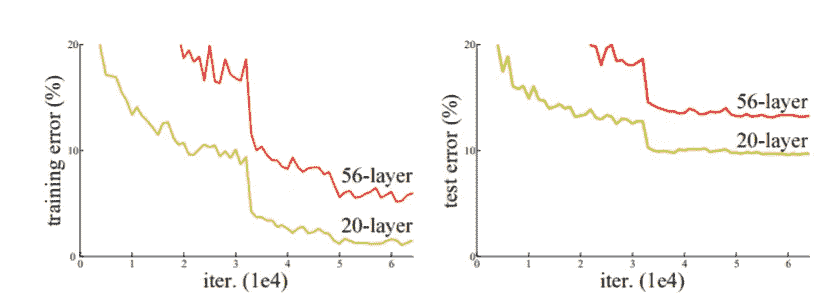
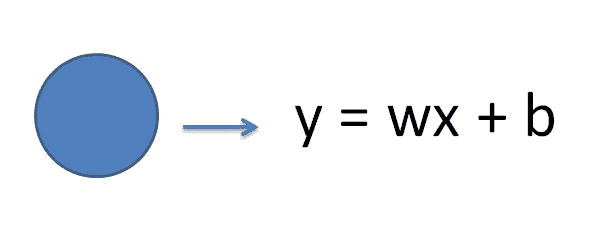
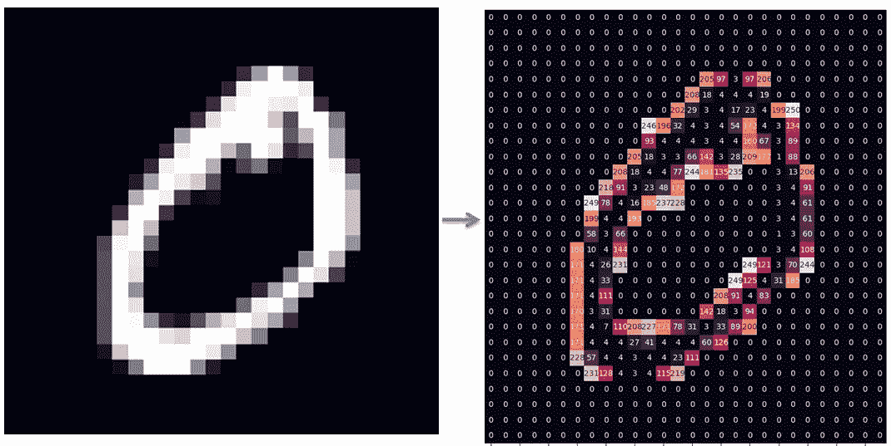
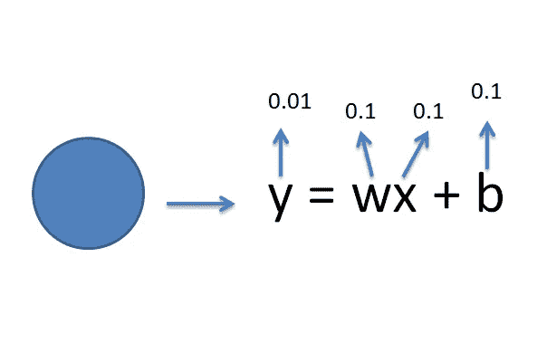
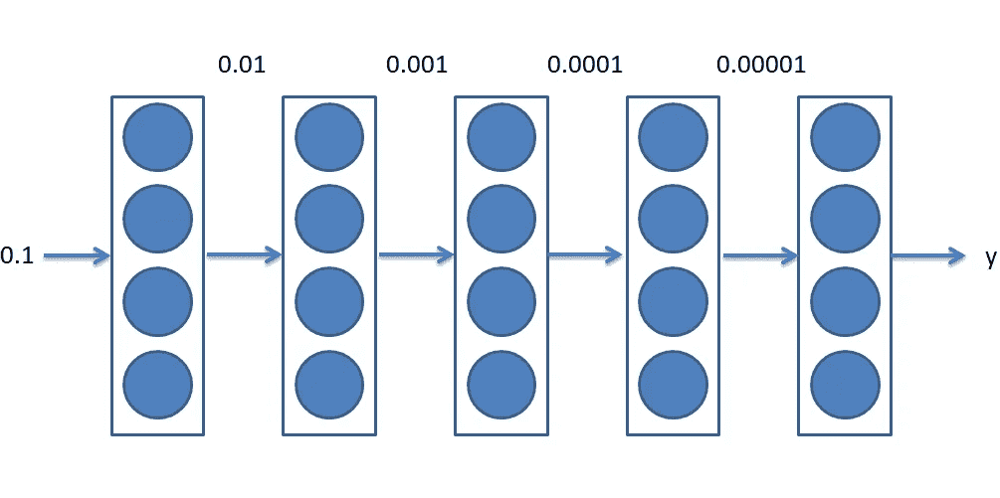
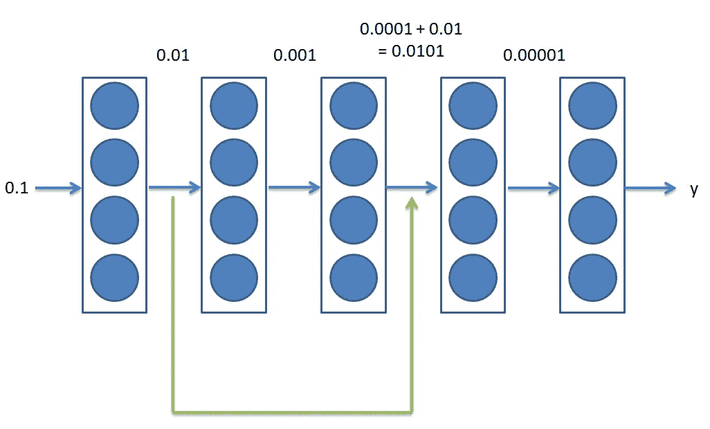

# 直观地理解剩余网络

> 原文：<https://towardsdatascience.com/understanding-residual-networks-resnets-intuitively-5afef9f089ea?source=collection_archive---------36----------------------->

## 资源网是许多计算机视觉应用的支柱

照片由[像素](https://www.pexels.com/photo/battle-black-blur-board-game-260024/?utm_content=attributionCopyText&utm_medium=referral&utm_source=pexels)的[皮克斯拜](https://www.pexels.com/@pixabay?utm_content=attributionCopyText&utm_medium=referral&utm_source=pexels)拍摄

ResNets 或残差网络是我们最终能够深入神经网络的原因。每个人都需要知道它们为什么工作，这样，他们就可以做出更好的决定，并理解神经网络为什么工作。**人工智能不是黑匣子。**在 ResNets 出现之前，层数多的神经网络一直比层数少的神经网络表现差(退化问题)。

雷斯网纸业([https://arxiv.org/pdf/1512.03385.pdf](https://arxiv.org/pdf/1512.03385.pdf))

上图显示，普通 20 层网络的误差(越小越好)总是优于普通 56 层网络。

# 出了什么问题？

让我们从单个神经元开始。

来源:作者

单个神经元有权重和偏差。偏向是让它活着，以免当 x = 0 时它死了。权重实际上决定了输入的重要性。权重越低，输入就越不重要。

警告是权重和偏差的值都在 0 和 1 之间。

x 是输入。在 ResNets 的情况下，x 将是一个图像。在给 ResNet 之前，让我们看看图像是什么样的。

来源:作者

图像由像素组成，每个像素取 0 到 255 之间的值。神经网络以这些数字的形式接收图像。上图是数字 0 被神经网络转换成数字后的图像。

但是，在网络喝这种数字汤之前，我们需要做更多的事情。

> 你愿意在更短的时间内跑完 255 英里还是 1 英里？

来源:作者

神经网络也运行到解决方案，这是更容易的，如果他们必须运行更少。所有值都除以 255(最大值)。我们称之为重新缩放，但它实际上是将代表图像的数字从圆圈 A 移至圆圈 b。因此，它减少了神经网络部分的工作。

因此，进入网络的内容在 0 到 1 的范围内。让我们看看这个值经过单个神经元时会发生什么。w 和 b 都在 0 和 1 之间的范围内。因此，y 在 0 到 0.1 的范围内。

如果我们把这个过程想象成数据通过网络，我们会看到值不断变小。

来源:作者

我们最终会遇到非常小的值(0.00001)。如果我们的值如此之小，我们将学到的(反向传播误差)也将更少，从而导致大网络给出的高训练误差。

# 解决方案

以上我们了解到价值观开始消亡。当一个人的心开始死亡时，我们该怎么办？**心肺复苏术。**

现在，当你为一个神经网络做心肺复苏时，它看起来像这样:

来源:作者

恢复权重的绿线是剩余连接，这就是 ResNets 的名称。

这就是如何在一行中描述 ResNets 中的剩余连接:

> 用于神经网络的 CPR

因此，有了剩余连接，这些值就不再消亡，我们最终得到的是一些重要的值，这些值导致神经网络中的一些重要学习。

这就是 ResNets 能够非常非常深入，同时仍能提供出色结果的方式和原因。