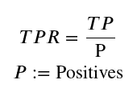
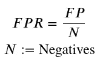
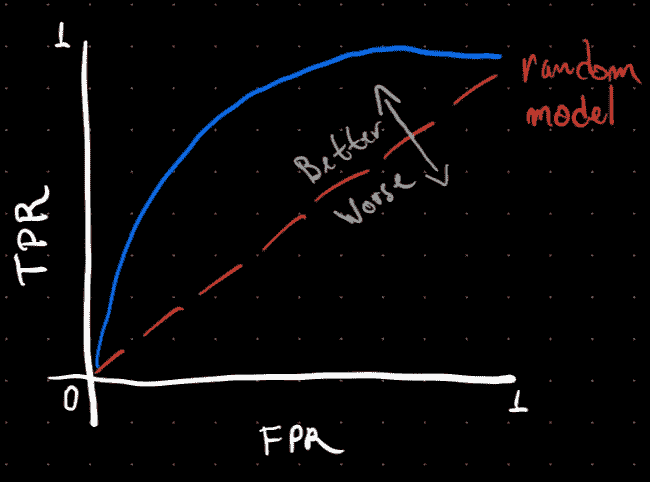
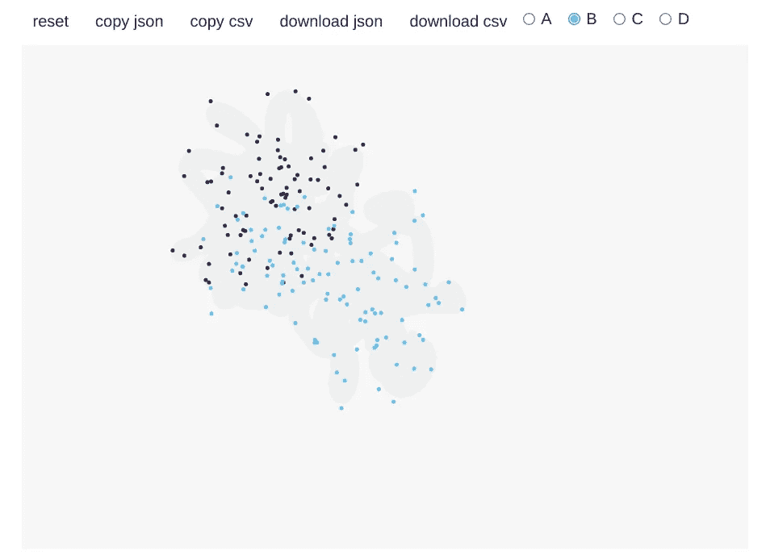
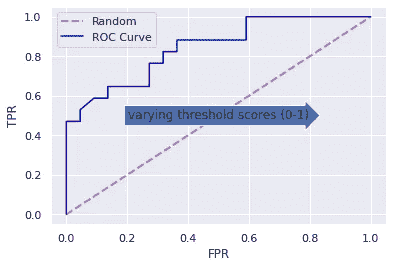

# 使用 Python 理解 ROC 曲线

> 原文：<https://towardsdatascience.com/understanding-roc-curves-c7f0b52e931e?source=collection_archive---------7----------------------->


艾萨克·史密斯在 [Unsplash](https://unsplash.com?utm_source=medium&utm_medium=referral) 上拍摄的照片

## 用 Python 构建接收机工作特性曲线的基本直觉

如果你谷歌:“ROC 曲线机器学习”，你会得到这样一个维基百科的答案:

> 受试者操作特征曲线，或 ROC 曲线，是一种图示，说明了二元分类器系统在其辨别阈值变化时的诊断能力

另一个常见的描述是 ROC 曲线*反映了跨不同分类阈值*的模型的敏感性。当我开始研究机器学习时，这些定义总是让我感到困惑。

在这篇文章中，我将分享我是如何学会理清自己“初学者般”的困惑，并对 ROC 曲线形成足够好的直觉的。

# ROC 曲线到底是什么？

理解 ROC 曲线的一种方式是 ***它描述了模型的灵敏度(真阳性率或 TPR)与其特异性(关于假阳性率描述:1-FPR)*** 。

现在，让我们理清这里的每个概念。

TPR 被称为模型的*敏感度*，是“阳性”类的正确分类除以数据集中所有可用阳性类的比率，数学上:



作者图片

虽然 FPR 是假阳性(误分类为阳性的预测数)与所有可用阴性类别之间的比率，但在数学上:



作者图片

****

# 将问题与阈值分数分离

一开始，暗示我的直觉是要把握门槛分数的作用。一个很好的起点是建立一个心理图景:



通过这种经典的可视化，人们可以了解到第一直觉，即 ***理想的模型是具有尽可能高的真阳性率同时保持尽可能低的假阳性率的模型。***

阈值对应于某个值 T(例如 0 和 1 之间的值),该值用作分类器的决策边界，并且它影响 TPR 和 FPR 之间的折衷。

让我们写一些代码来获得所有这些组件的可视化。

# 可视化 ROC 曲线

实现这一点的步骤如下:

1.  **导入我们的依赖关系**
2.  **用** `**drawdata**` **包给 Jupyter 笔记本**画一些假数据
3.  **导入假数据到熊猫数据框**
4.  **对数据拟合逻辑回归模型**
5.  **以概率值的形式获得逻辑回归模型的预测**
6.  **设置不同的阈值分数**
7.  **可视化 roc 曲线图**
8.  **得出一些最终结论**

## 1.导入我们的依赖性

```
from drawdata import draw_scatter
import pandas as pd
from sklearn.model_selection import train_test_split
from sklearn.linear_model import LogisticRegression
from sklearn.metrics import accuracy_score, precision_recall_curve,precision_score, plot_roc_curve
```

## 2.用 Jupyter 笔记本的`drawdata`包画一些假数据

```
draw_scatter()
```

输出:



## **3。将假数据导入熊猫数据框**

```
df = pd.read_csv("./data.csv")
```

## 4.根据数据拟合逻辑回归模型

```
def get_fp_tp(y, proba, threshold):
    """Return the number of false positives and true positives."""
    # source: https://towardsdatascience.com/roc-curve-explained-50acab4f7bd8
    # Classify into classes
    pred = pd.Series(np.where(proba>=threshold, 1, 0), 
                     dtype='category')
    pred.cat.set_categories([0,1], inplace=True)
    # Create confusion matrix
    confusion_matrix = pred.groupby([y, pred]).size().unstack()\
                           .rename(columns={0: 'pred_0', 
                                            1: 'pred_1'}, 
                                   index={0: 'actual_0', 
                                          1: 'actual_1'})
    false_positives = confusion_matrix.loc['actual_0', 'pred_1']
    true_positives = confusion_matrix.loc['actual_1', 'pred_1']
    return false_positives, true_positives

# train test split on the fake generated dataset
X = df[["x", "y"]].values
Y = df["z"].values
X_train, X_test, y_train, y_test = train_test_split(X, Y, test_size=0.2, random_state=42)
y_test = np.array([1 if p=="a" else 0 for p in y_test])
y_train = np.array([1 if p=="a" else 0 for p in y_train])

# create the model
lgr = LogisticRegression()
lgr.fit(X_train, y_train)
```

## 5.以概率值的形式获得逻辑回归模型的预测

```
y_hat = lgr.predict_proba(X_test)[:,1]
```

## 6.设置不同的阈值分数

```
thresholds = np.linspace(0,1,100)
```

## 7.可视化 roc 曲线图

```
# defining fpr and tpr
tpr = []
fpr = []
# defining positives and negatives
positives = np.sum(y_test==1)
negatives = np.sum(y_test==0)

# looping over threshold scores and getting the number of false positives and true positives
for th in thresholds:
    fp,tp = get_fp_tp(y_test, y_hat, th)
    tpr.append(tp/positives)
    fpr.append(fp/negatives)

plt.plot([0, 1], [0, 1], linestyle='--', lw=2, color='r',label='Random', alpha=.8)
plt.plot(fpr,tpr, label="ROC Curve",color="blue")
plt.text(0.5, 0.5, "varying threshold scores (0-1)", rotation=0, size=12,ha="center", va="center",bbox=dict(boxstyle="rarrow"))
plt.xlabel("False Positve Rate")
plt.ylabel("True Positive Rate")
plt.legend()
plt.show()
```



## 8.得出一些最终结论

通过改变阈值分数，我们可以得到增加的真阳性率和假阳性率。 ***一个好的模型是阈值分数使真阳性率尽可能接近 1，同时使假阳性率尽可能低。***

但是，我们如何选择最佳的分类阈值呢？

**一个简单的方法是取真阳性率和假阴性率之和最大的一个(1- FPR)。**

另一个标准可以是简单地**选择离你的 ROC 空间左上角最近的点。**然而，这意味着真阳性率和真阴性率具有相同的权重([来源](https://stats.stackexchange.com/questions/123124/how-to-determine-the-optimal-threshold-for-a-classifier-and-generate-roc-curve#:~:text=A simple method is to,thresholds like financial costs, etc.&text=Choose the point closest to,corner of your ROC space.))，这在癌症分类等情况下不一定成立，因为假阳性的负面影响大于真阳性的影响。

# 关于 ROC 曲线的最后思考

我认为，从长远来看，花一些时间来消化评估指标对您的机器学习之旅非常有益。在本文中，您了解了:

*   关于 ROC 曲线如何工作的基本直觉
*   分类阈值如何影响模型的敏感性和特异性之间的关系
*   关于如何使用 ROC 曲线设置最佳分类阈值的直觉

如果您想了解更多关于 Python 的机器学习知识，请查看以下课程:

> 这些是附属链接，如果你使用它们，我会得到一小笔佣金，干杯！:)

*   [**机器学习 A-Z:动手 Python & R 在数据科学**](http://seekoapp.io/61356d316220de00093c300e)
*   [**用于数据科学和机器学习的 Python 训练营**](http://seekoapp.io/61356d346220de00093c3010)

如果你喜欢这篇文章，请在 [Medium](https://lucas-soares.medium.com/) 、[上关注我，订阅我的简讯](https://lucas-soares.medium.com/subscribe)，在 [Twitter](https://twitter.com/LucasEnkrateia) 、 [LinkedIn](https://www.linkedin.com/in/lucas-soares-969044167/) 、 [Instagram](https://www.instagram.com/theaugmentedself/) 或 [join Medium](https://lucas-soares.medium.com/membership) 上与我联系！谢谢，下次再见！:)

# 参考

*   [ROC 曲线超赞教程](http://www0.cs.ucl.ac.uk/staff/W.Langdon/roc/)
*   [在 ROC 曲线上堆叠交换螺纹](https://stats.stackexchange.com/questions/123124/how-to-determine-the-optimal-threshold-for-a-classifier-and-generate-roc-curve)
*   [维基百科页面上的 ROC 曲线](https://en.wikipedia.org/wiki/Receiver_operating_characteristic)
*   [工整文章由](/roc-curve-explained-50acab4f7bd8) [Zolzaya Luvsandorj](https://medium.com/u/5bca2b935223) 讲述巨蟒的巨鸟曲线