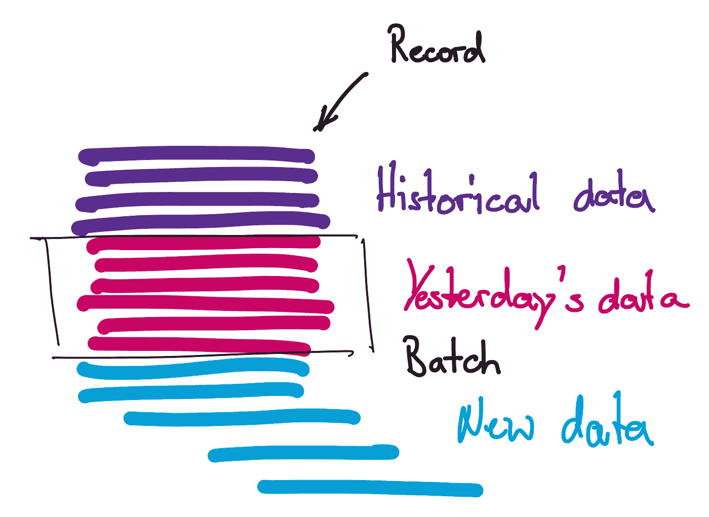

# 什么是流处理？

> 原文：<https://towardsdatascience.com/understanding-stream-processing-2ebebefa523e?source=collection_archive---------15----------------------->

# 流处理与批处理

从德国公司大数据领域的各种项目中，我意识到许多公司都面临着类似的问题。他们有旧的遗留系统，非常适合当时的设计和建造。今天，新技术出现，新事物成为可能。人们在谈论流处理和实时数据处理。每个人都想采用新技术来投资未来。尽管我个人认为这是一个合理的想法，但我也相信人们必须首先了解这些技术以及它们的用途。当我与各种客户一起工作时，我意识到以一种清晰的方式定义什么是流处理以及我们可以利用它的用例并不太容易。因此，在这一系列文章中，我将分享我的一些想法，我们将阐述这两种方法，以更好地理解它们是什么。在这第一篇文章中，我将试图明确区分众所周知的批处理和流处理。

关系数据库模型可能是最成熟和被采用的数据库形式。我想几乎所有公司都将 it 作为实施运营业务的核心组件。通常，这个中央数据存储的副本存在，用于分析用例。然而，复制和分析查询通常作为所谓的批处理作业运行。尽管我们中的大多数人可能对关系数据库有广泛的了解，但我还是想在文章开始时对批处理作业的特征有一个清晰的定义。

# 什么是批处理？

批处理作业通常按如下方式执行:

1.  读取所有输入数据，
2.  执行转换/逻辑，
3.  将结果写入接收器。

关键的部分是，在开始处理之前，我们首先读取我们希望用查询处理的整个输入。因此，我们是在“事后”查看我们的数据。也就是说，我们想要查看的所有数据都必须已经存在。然而，当我们处理运营数据时，这些数据是不断变化的。我们正在分析由我们的核心业务案例产生的数据，因此它将继续变化，直到我们退出我们的业务。因此，为了能够执行批处理作业(并在事后查看数据)，在某个时间点，我们必须获取底层数据的快照，并在“还存在什么”上运行我们的逻辑。这人为地将我们不断变化的数据集分成特定大小的批次。通常，批量大小由我们想要处理新事件的某个时间间隔指定(例如，一天一次、一天两次、一小时一次)。

作者图片

# 批处理的局限性是什么？

自然地，这种将我们的输入数据集人为划分成固定时间间隔的批次的做法导致了我们的处理结果的有限流通性。我们的结果数据集的有限流通性反过来限制了我们能够在其上构建的洞察力和用例。例如，如果我们一天只处理一次数据，那么昨天的结果今天才可用。

# 什么是流处理？

为了克服批处理的这一缺点，我们可以继续减少批处理的大小，直到我们在特定用例中得到我们期望的结果。我们可以一小时、一分钟或一秒钟处理一次。如果我们继续减少批处理时间间隔，我们最终将处理每个立即到来的事件。然而，每隔几毫秒查询数据库中的新事件会带来相当大的开销。此外，单个记录查询的价值甚至比每天只提供一次的结果更有限。由于批处理查询被设计为在开始处理之前读取所有记录，因此我们无法从单个记录批处理中获得太多信息。

假设我们想通过一些特定的关键字对数据集进行排序。如果我们查看一天的一批数据，我们得到的结果将和预期的一样:当天事件的有序列表。然而，对单记录数据集进行排序是没有意义的，因此我们的查询实际上是没有价值的。因此，有一种不同的方法来处理事件。这通常被称为流处理。

流处理是一种特殊类型的输入数据的特殊处理模式，它在许多方面不同于批处理。流处理的基本特征是:

1.  处理**未绑定的**数据集:我们处理一个不断接收更新的数据集。只要我们还在这一行，总会有新的记录。
2.  **立即处理记录**:我们希望在每条记录被添加到数据集中时对其进行处理。我们希望以低延迟处理它(无论这在数字上意味着什么)。
3.  记录总是一个**事件**:流中的每个数据记录都是一个事件。

事件是一个

1.  **小**，
2.  **自带**，
3.  **不可变的**对象
4.  描述**发生了什么事情**
5.  在某个**时间点**。

本质上，流处理是对不断增长的数据集的处理，该数据集由不可变记录的事件组成。由于事件不可更改，更新数据集的唯一方法是创建新记录。因此，我们正在处理一个只追加的数据集，并希望在每个事件到达时都进行处理。

让我们看看如何使用流处理来执行前面的示例，即按照某个数字对数据集进行排序。通常，每当我们需要一个流内数据的全局视图时，流处理器需要维护一个状态。在我们的例子中，这个状态就是所谓的物化视图。这个实例化视图随着每个新事件的到来而更新。就像这样，我们基本上是随着每个新事件的到来来更新我们的结果。每个时间点的当前状态可以通过从头重放整个流并对事件应用相同的逻辑来再现。

作者图片

# 结论

尽管每个人都在谈论流处理这个术语，并且它似乎可以应用于每个用例，但我们已经看到，它更多的是一种针对具有特殊特征的数据集的特殊处理模式。流处理意味着通过处理每条记录来处理一个未绑定且不断增长的数据集。这个数据集由事件组成，这些事件是小型的、自包含的和不可变的对象，描述在某个时间点发生的事情。流的关键属性是所有记录都是不可变的，因此我们处理的是只附加的数据集。每当我们处理这样的事件流时，我们都需要跨事件维护一个状态，以便对数据有一个全局的看法。为了处理新到达的输入事件，我们简单地将它与我们的逻辑一起应用于当前状态。只要我们保留了事件流的历史，我们就能够从任何时间点重现这种状态。每当我们的用例不满足这些需求时，它很可能不太适合作为流应用程序来实现。

在下一篇文章中，我们将详细阐述事件流和关系数据库中表的概念之间的联系。