# 了解代理模型及其在数据科学中的优势

> 原文：<https://towardsdatascience.com/understanding-surrogate-models-and-their-benefits-in-data-science-5cdc81a0509a?source=collection_archive---------20----------------------->

## R&D 使用的一些模型继承自基础理论，可能很难操作或转移。这个现实生活中的例子(带有代码)解释了为什么代理模型提供了一个有趣的替代方案。

阿诺·塞纳尔在 [Unsplash](https://unsplash.com?utm_source=medium&utm_medium=referral) 拍摄的照片

# 理论方法与替代方法

首先，区分我们将在本文中讨论的两种模型之间的主要区别是很重要的:

*   **理论模型**应该被认为是“现象学的”模型，继承自科学知识并以方程的形式表达，就像(很简单！)下面一个:

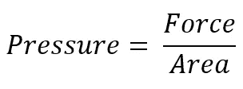

**理论压力公式**
图片作者

*   **替代模型**基于经验和/或模拟数据。它们只是理论模型的一种“接近的表示”,并且，通过延伸，是地面真相的一种“接近的表示”。它们通常不太准确，但也不太复杂。**机器学习模型属于第二类，因为它们几乎总是只依赖于观察。**

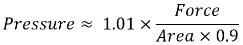

**通过测量 100 种不同的力和面积组合**
下的压力
推导出的替代公式图片由作者提供

# 那么，当我们已经有了理论模型，为什么还要对使用代理模型感兴趣呢？

想象一个研发部门正在设计一个新的流程。他们想要模拟每个分子的行为方式，或者至少，以最精确的方式模拟这个过程。

为了达到这样的精度，他们将使用模拟解决方案，其中嵌入了对过程及其相应的机械方程式的详细描述，如下图所示:

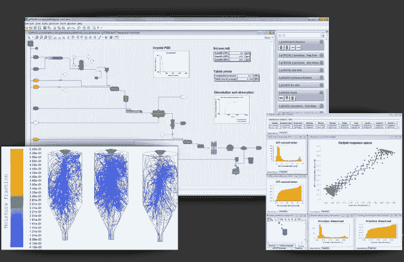

gPROMS 的屏幕截图—包含在 Process Systems Enterprise 的 kind 授权中

这一步完成后，工程部门的同事们准备开始在新车间中集成该设备，他们渴望从 R&D 的准备工作中受益…但他们面临一些限制:

*   **软件**:模拟工具可能很贵，而且由于他们的公司想要限制可用许可证的数量，他们无法使用这些工具。此外，理论模型的格式不能用它们自己的工具来解释。
*   **计算**:模拟的计算量可能很大，即使工程部门可以访问理论模型，他们也无法在更大的范围内将所有局部和复杂的模型结合起来，以模拟整个车间或工厂的行为。*这就像试图通过整合每个引擎的工作方式来描述道路交通的变化……而每辆车的速度就足够了。*
*   **保密** : R & D 确实同意在内部分享其工作成果，但也将这一新流程视为公司知识产权的一部分。由于工程部门可能会分包他们的一些研究，R & D 不愿意完全透露这个过程是如何设计的。他们宁愿把它表达成一个“黑匣子”，只有动态的输入和输出，对周围的环境作出反应。

**出于上述所有原因，代理模型可以代表一种有趣的替代方案，以降低所需的计算能力，同时允许与标准工具更好的兼容性，并且不会泄露公司的知识产权。**

如下所述，同样的过程动力学可以从纯理论的观点或从“接近”的观点来表达:

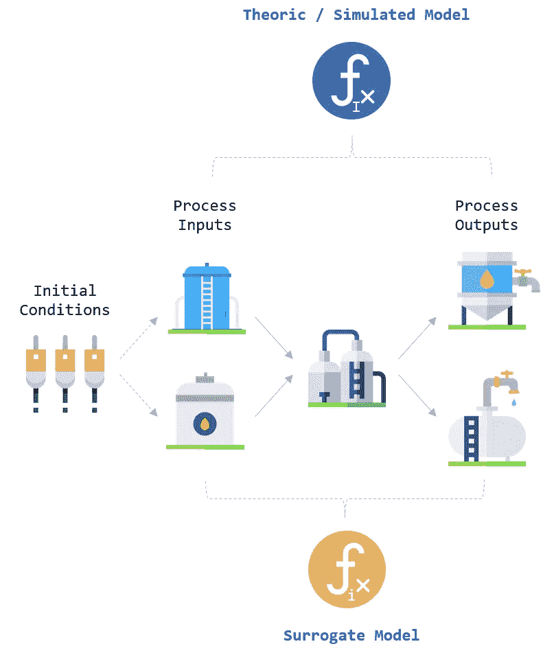

**理论模型 Vs 代理模型**(图片由作者提供—图标来源:[flaticon.com](http://flaticon.com))

# 现实生活中的应用呢？

之后描述的工作是我和我的 R&D 同事 Baptiste Boit 进行的第一个实验的净化版本，他一直在推动我(几个月来！)来开发代理模型…直到我明白这个概念有多关键！

*完整的源代码——代码和模拟数据——可以在 GitHub(本文末尾的链接)上找到。*

我们的目标是从具有以下特征的流程中创建一个代理模型:

**两个初始条件(X)定义了 100 个周期(时间)期间动态批处理的行为，通过 2 个输入变量和 3 个输出变量(Y)表示:**

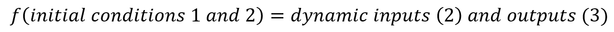

描述过程的“笨拙”公式=作者图片

Baptiste 模拟了 200 个不同的批次(“样本指数”从 0 到 199)，每个批次都以不同的起始条件(“Init_Cond_1”和“Init_Cond_2”)开始，就像一个标准的“实验设计”。

为了让它更容易理解，我将动态变量的数量从 5 个减少到了 3 个。这些动态变量(Dyn_Input_1、Dyn_Input_2 和 Dyn_Output_1)的值在每个批次的每个周期都会被记录，并已被归一化(MinMaxScaler()):

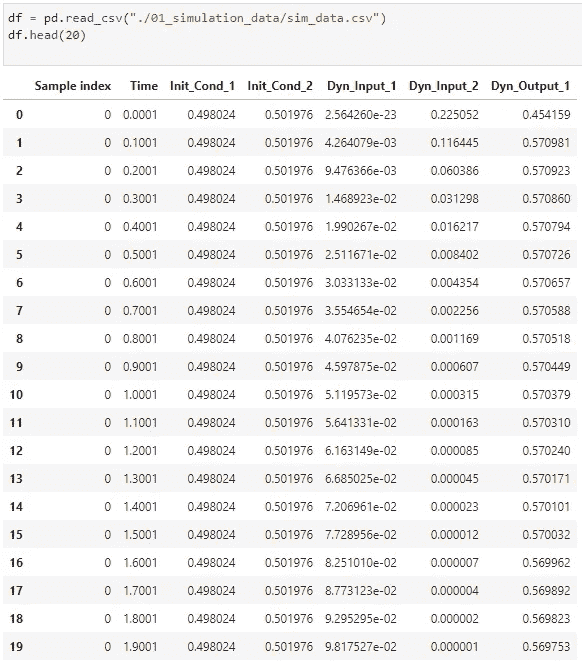

**作者第一批**
模拟图像的前 20 行

# 探索模拟数据

我们首先绘制初始条件的分布，正如人们所预料的那样，它们在两个范围内以类似 DoE 的方式均匀随机分布:

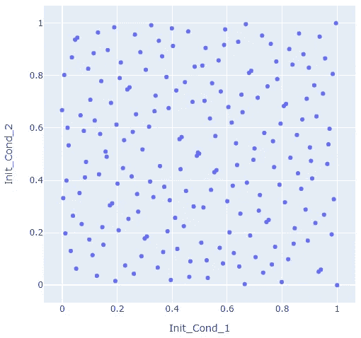

**传播的初始条件**
图片作者

为了便于进一步研究，让我们将这些数据整合到一个 200 行的数据框架中，该数据框架为每批数据编译三个动态变量的序列(100 个数据点):

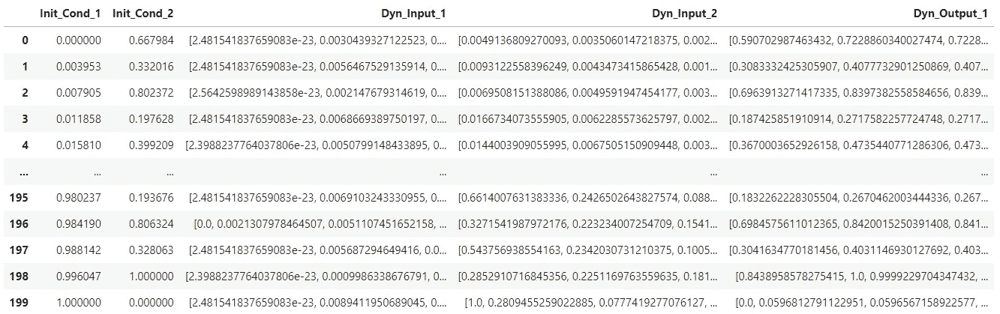

**综合数据框**
图片作者

让我们随机选择 20 个批次，显示变量的动态，看看它们的轮廓是什么样的(每种颜色对应一个批次):

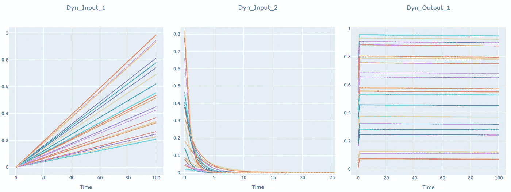

**20 个不同批次的动态变量样本**
作者图片

# 从动态变量中提取功能特征

我们可以观察到“ **Dyn_Input_1** ”具有线性轮廓。

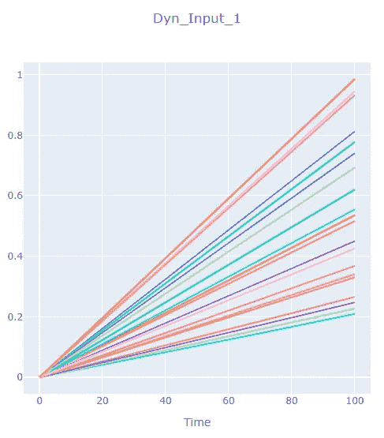

**作者提供的 20 个不同批次**
图像的“Dyn_Input_1”样本

现在的问题是:“**这些配置文件中的每一个与初始条件有什么关系？**

由于我们不能直接比较初始条件(2 个值)和“Dyn_Input_1”行为(100 个连续事件)，我们需要找到一个代理！

在这种情况下，我们可以对每一批应用线性回归，并提取相应的系数。由于所有事件都从(0，0)坐标开始，因此只有斜率(a1，a2，…)会带来相关信息。

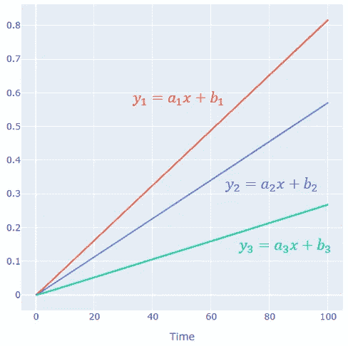

**动态变量的行为及其对应的线性方程**
作者图片

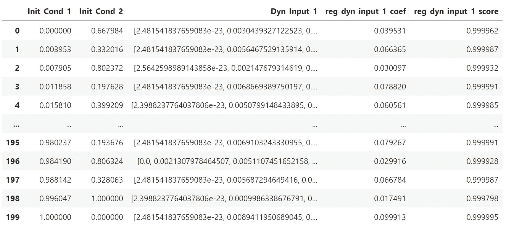

**作者使用 Dyn_Input_1 系列、系数和分数的合并数据框架**
图片

一旦提取了这两个特征(线性回归系数和相应的分数；上面最后两列)，我们高兴地看到系数和初始条件#2 之间的相关性非常强: **0.996** :

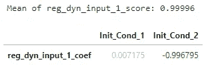

这意味着，如果我们知道初始条件#2 的值，我们就能够推断出动态输入#1 的相应斜率(=系数)，并最终推断出 100 个连续事件的值。

到目前为止，一切顺利😀

**动态输入#2** 有一个稍微复杂一点的轮廓:**第 n 根**。

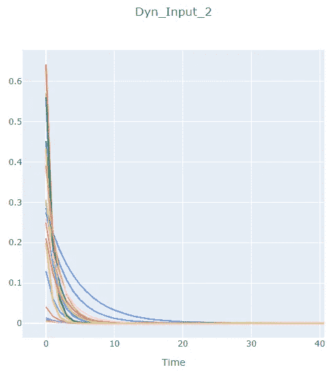

**作者提供的 20 个不同批次**
图像的“Dyn_Input_2”样本

与动态输入#1 一样，我们需要找到一个比 100 个数据点序列更简单的代理来表达每一批的行为。

我们仍然可以依赖线性回归，但是首先，需要对序列进行转换:我的方法是对时间=0 到值达到预定义阈值 0.00003 之间的部分进行“根转换”，如下例所示:

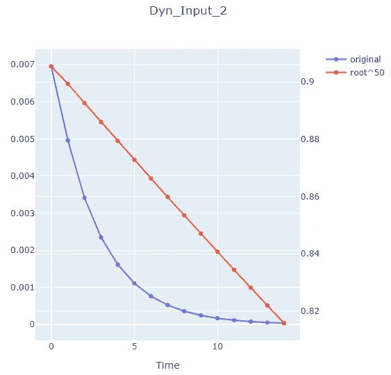

**n 次根变换对原始 Dyn_Input_2 变量(双标度)的影响**
作者提供的图像

为了定义这个阈值，我查看了 200 条曲线，并确定了大多数曲线(如果不是全部的话！)开始渐近。该“根部截面极限”范围在 7(最小值)、14(中值)和 43(最大值)之间:

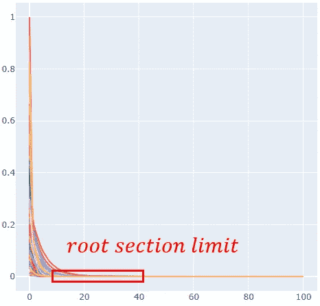

**根节限上 200 批次**
图片作者

应用变换后，我们提取每个模拟的回归系数和截距，并检查这些特征和初始条件之间是否存在相关性:

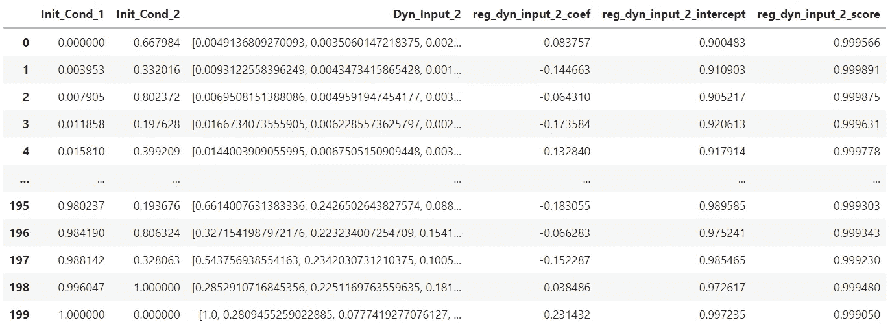

**作者使用 Dyn_Input_2 系列、系数和分数**
图像合并数据框架

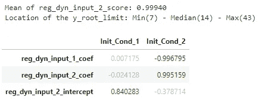

我们可以观察到，动态输入#2 的斜率也与初始条件#2 高度相关( **0.995** )，并且其截距与初始条件#1 相关( **0.84** )。至于动态输入#1，我们现在可以从唯一的初始条件值中推导出动态输入#2 的行为。

**动态输出#1** 具有第三种类型的曲线:在时间=0 和时间=0.1001 之间急剧增加之后，它是具有小负斜率的线性曲线:

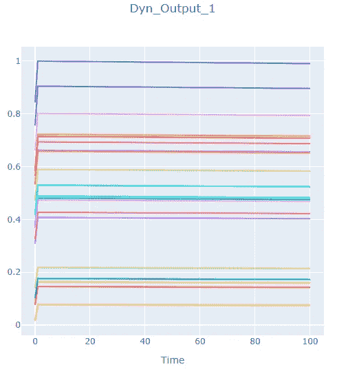

**20 个不同批次的“Dyn_Output_1”样本**
作者提供的图片

我们可以用同样的方法提取 3 个相关特征:

*   **初始值**(时间=0 时)
*   **系数**和**截距**的线性行为从时间=0.1001

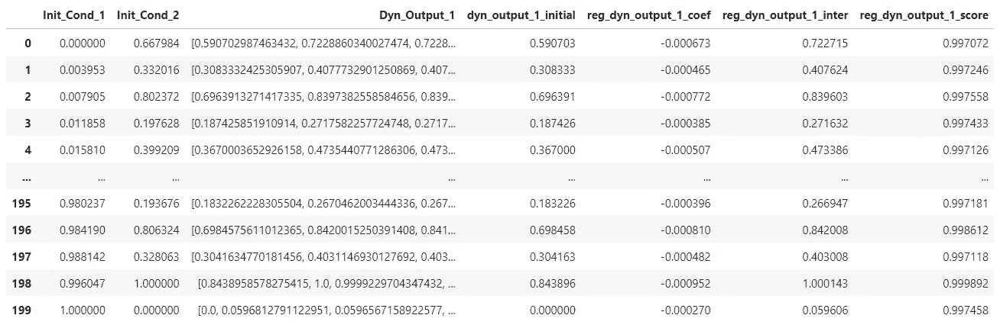

**作者使用 Dyn_Input_1 系列、系数和分数**
图像合并数据框架

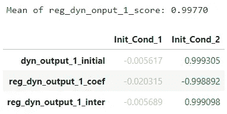

同样，我们可以观察到初始条件#2 和第三个动态变量之间的强相关性。

# 动态变量与初始条件和模型建立的总体相关性

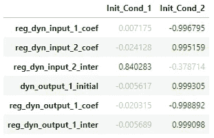

既然提取了每个动态变量的特征，并且建立了与初始条件的相关性，我们可以为每个动态变量创建一个线性模型:

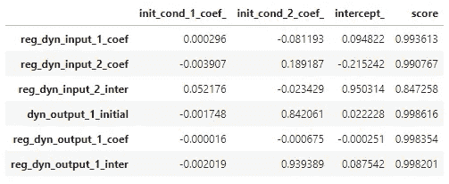

为了使这些代理模型更容易访问，我们可以创建一个“SurrogatePrediction”类，它有 3 种不同的方法，可以根据我们提供的初始条件生成预测的时间序列。

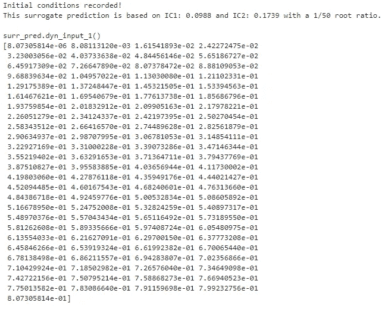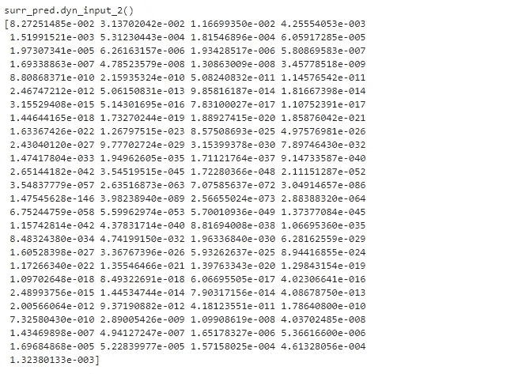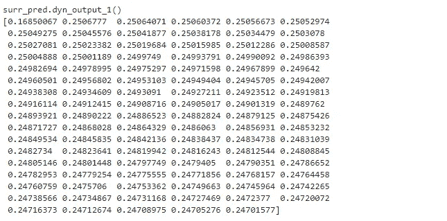

让我们选择两个随机初始条件，直观地比较替代模型预测和地面真实情况:

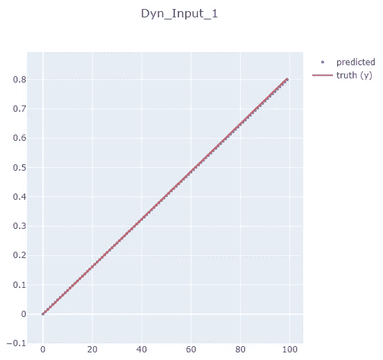

**Dyn_Input_1(预测与真实)** —作者图片

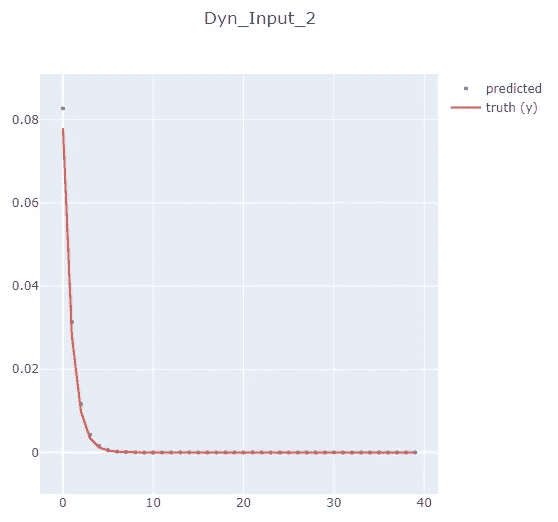

**Dyn_Input_2(预测与真实)** —作者图片

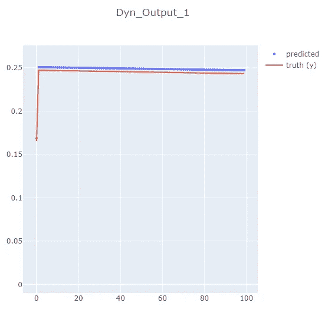

**Dyn_Output_1(预测与真实)** —作者图片

# 结论

我们现在拥有三个代理函数，它们只能通过它们的系数/截距来表达，并且可以模拟原始进程的行为方式，而不会暴露其核心设计。

它们是用 Python 开发的，但可以很容易地转换成其他格式，因为它们只是简单数学方程的组合！

任务完成！😀

注意:有人可能会说，这种模型可以更容易地用随机森林或梯度增强树这样的算法来实现。这是真的，我自己测试过(包含在 GitHub 库中)。由于训练集和测试集之间良好的同质性，验证分数超过 99%。然而，缺点是像系综树这样的“复杂”模型很难用另一种语言或仅通过方程来移植。

再次感谢巴蒂斯特·博伊特🙏早在我之前就理解了这种方法对于制造/加工行业以及其他行业来说是一个至关重要的话题！

相应的代码存储在这里:

 [## GitHub-pierrelouisscond/surrogate _ model _ demo

### 此时您不能执行该操作。您已使用另一个标签页或窗口登录。您已在另一个选项卡中注销，或者…

github.com](https://github.com/pierrelouisbescond/surrogate_model_demo) 

请不要犹豫，浏览我在 Medium 上的其他文章:

 [## 皮埃尔-路易·贝斯康德关于媒介的文章

### 数据科学、机器学习和创新

pl-bescond.medium.com](https://pl-bescond.medium.com/pierre-louis-besconds-articles-on-medium-f6632a6895ad)