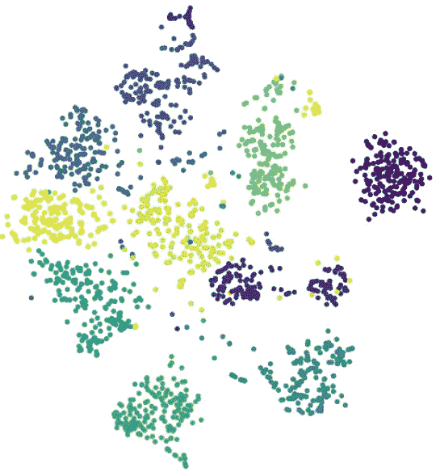
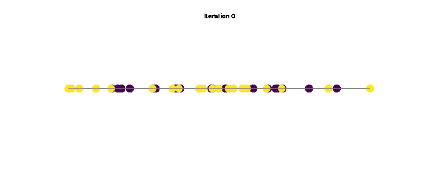
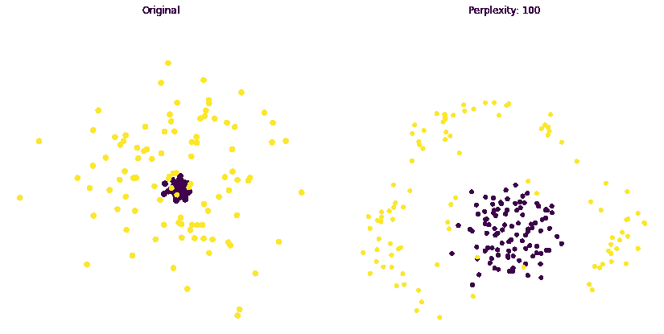
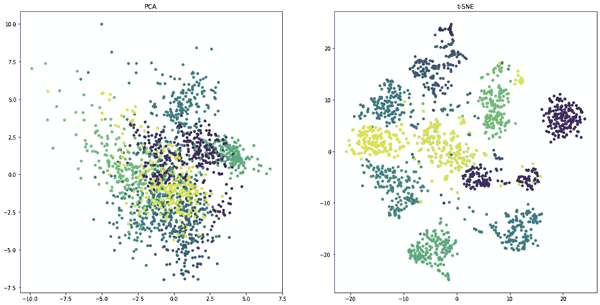

# 通过实施了解 t-SNE

> 原文：<https://towardsdatascience.com/understanding-t-sne-by-implementing-2baf3a987ab3?source=collection_archive---------18----------------------->

## t-SNE 是如何工作的以及如何实施的

图片作者。

在这篇博文中，我们将探究 t-SNE 算法的内部工作原理，清楚地理解它是如何工作的，它可以用来做什么，以及它的局限性是什么。我将采用自上而下的方法，首先在更高的层次上更一般地解释算法是如何工作的，然后更深入地探究它背后的数学。这篇文章在大部分有等式或计算的地方都包含代码块，因为有些人通过代码理解概念比数学更容易。整篇帖子也是笔记本，可以[下载](https://github.com/adamorucu/adamorucu.com/blob/main/_nbs/2021-10-30-tsne.ipynb)。

# 介绍

t-SNE 是一种用于可视化高维数据的算法。因为我们无法想象任何超过二维——也许是三维——的东西，所以 t-SNE 通过减少数据中的维数来做到这一点。这样做的同时尽可能地保留数据的结构。如果我们比较 SNE 霸王龙和主成分分析，我们会发现主成分分析试图保留数据中的信息，而 SNE 霸王龙则试图保留数据中的相对距离和聚类结构，因此较少考虑保留的总信息。

# 一般程序

因为我们的目标是降低数据的维度，所以让我们从一个简单的例子开始，看看将二维数据降低到一维会是什么样子。

从 2D 到 1D 的 SNE 投影。图片作者。

如您所见，该算法的输出不仅仅是到 x 轴的投影，它还会转换维度，以便尽可能保持相似和不相似数据之间的相关性。

如果你看一下下面的 GIF，你就能明白这个过程是如何发生的。在算法的每次迭代中，相似的数据点被拉到一起，而不相似的点被推开。这意味着，通过足够的迭代，算法应该以与点的自然结构相似的方式对点进行聚类。

t-SNE 迭代过程的结果。图片作者。

# 数学

现在让我们看看算法实际上是如何工作的，以及它背后的数学原理。首先，我们需要能够确定一对数据点是否相似。为此，我们首先计算每一对点之间的欧几里德距离。

然后，我们通过下面的过程来计算相似性:对于每个数据点，我们将它放在高斯曲线的中间，其余的数据根据它们的距离沿着曲线的其余部分。这意味着更靠近中间的点与选择的点相似，而边缘的点则非常不同。

这反映在下面的公式中，该公式基本上是归一化的高斯分布；

你可能想知道，我们如何选择标准差(sigma)？这不是我们直接选择的，而是通过设置一个叫做困惑的东西；其定义为，

基本上，困惑反映了我们对数据密度的看法。困惑的最佳值实际上无法通过分析来计算。因此，我们通常需要尝试不同的值，并试图找到提供最佳结果的值。困惑的最佳值通常在 5 到 50 之间。

通过我们设置的困惑，算法通过做[二分搜索法](https://en.wikipedia.org/wiki/Binary_search_algorithm)来选择与之对应的 sigmas。

既然我们现在知道如何找到原始高维状态数据之间的相似性，我们需要对其低维表示做同样的事情。这样，我们将能够确保在原始结构中靠得很近的数据在投影中也靠得很近。

这是一个与前一个非常相似的过程，唯一的不同是，我们将使用一个[学生的 t 分布](https://en.wikipedia.org/wiki/Student%27s_t-distribution)，其中[有一个自由度](https://en.wikipedia.org/wiki/Cauchy_distribution)，而不是使用高斯分布。

这种分布非常类似于高斯分布。只是边缘高一点，中间低一点。

t-Student(蓝色)和高斯(灰色)分布。图片作者。

我们现在知道如何计算高维和低维空间的相似性。接下来，我们将进行迭代过程。这将通过使用[梯度下降](https://en.wikipedia.org/wiki/Gradient_descent)步进并选取数据的越来越好的表示来完成。

但为了能够计算梯度，我们需要一个成本函数——这意味着一种检查低维数据结构是否准确代表高维状态的方法。因为我们基本上将比较两个分布，所以我们使用 [Kullback-Leibler 散度](https://en.wikipedia.org/wiki/Kullback%E2%80%93Leibler_divergence)来进行比较。

我不会在这里展示获得梯度的导数。如果你感兴趣的话，我建议你查看一下原始论文中关于这个算法的附录。如果你经历这个过程，得到的梯度如下:

至此，梯度下降程序基本上和往常一样。然而，我们将在这里使用动量，以使开始时的学习快一点。这只是一个简单的阶跃函数。

只剩下一件事我还没告诉你。也就是所谓的拥挤问题。这个问题的要点是，因为我们减少了维度的数量，我们能够在这些维度中表现的东西也减少了。为了理解这一点，想象一个正方形，它的每条边都是一个数据点。现在试着在一维空间中表示这四个点。你应该会看到你将会得到几个结果的组合，但是没有一个感觉是正确的，因为你不能代表它们到另外两个点的距离都是相等的。这基本上就是拥挤问题。为了解决这个问题，我们设定

现在我们知道了实现 t-SNE 算法的一切。

# 结果

我们可以在[MNIST 数字数据集](https://scikit-learn.org/stable/modules/generated/sklearn.datasets.load_digits.html#sklearn.datasets.load_digits)上快速运行它，并看到它确实将不同的数字聚集在不同的簇中，这正是我们希望看到的。

MNIST 的 t-SNE。图片作者。

但是现在让我们生成一些数据来检查它如何在不同的结构上工作。我将只生成二维数据，并在 t-SNE 上运行，以获得二维表示。虽然这实际上没有意义，但我在这里这样做了，这样我们就能够可视化结果，并且更容易检查它们。

第一，距离不同。如果您查看下面的结果，您会发现并非所有结果都保留了聚类之间的距离。这表明选择正确的困惑以尽可能保持原始结构的重要性。

不同班级之间的距离不同。图片作者。

接下来，我们尝试不同密度的集群。这里，我们看到 SNE 霸王龙创造的星系团的密度变得差不多了。这样做的原因是，当我们计算相似性时，我们将结果归一化。这导致簇具有相似的大小，尽管它不是原始数据的样子。

不同密度的数据。图片作者。

我们还可以看到，该算法可以区分一个集群内的密集区域作为不同的集群，这是非常令人印象深刻的。但是，请注意，困惑集将改变结果，因此我们需要通过困惑来表示我们对数据的了解，或者尝试不同的值来比较结果。

不同密度的数据。图片作者。

最后，再举一个例子，主要是因为视觉上看起来很酷。尽管如此，如果您查看由 50 个困惑获得的结果，您可以看到，与其余的数据点相比，聚类的中间部分被推出更多。这是由于这些区域更加密集，因此推拉效应变得更大。

如果你有兴趣看更多 t-SNE 在不同数据结构及其限制上的结果，我建议查看[distilt . pub](https://distill.pub/2016/misread-tsne/)。

图片作者。

最后，我们可以比较 SNE 霸王龙和主成分分析的结果，清楚地看到 SNE 霸王龙的目标是对数据进行聚类，因此在尝试对数据进行聚类时，可视化更加有用。

主成分分析和 t-SNE 的比较。图片作者。

# 结论

我们通过代码看到了 SNE 霸王龙是如何工作的。如果你想把这篇文章作为笔记本下载，你可以在这里[得到它](https://github.com/adamorucu/adamorucu.com/blob/main/_nbs/2021-10-30-tsne.ipynb)。我们还看到 t-SNE 比 PCA 有不同的用途。虽然它们都降低了数据的维度，但它们的方式非常不同。因此，在使用 SNE 霸王龙之前，我们应该仔细考虑它的缺点。