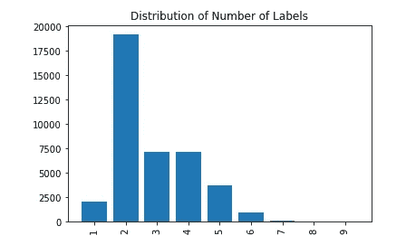
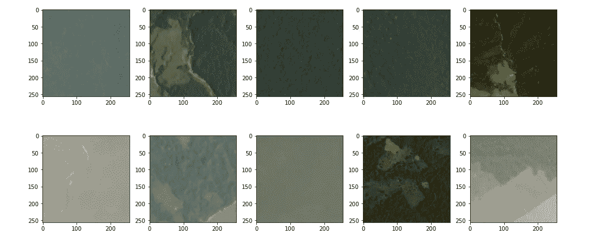
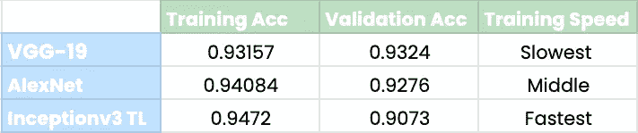

# 通过多标签分类+ VGG-19、Inceptionv3、AlexNet 和迁移学习了解亚马逊雨林

> 原文：<https://towardsdatascience.com/understanding-the-amazon-rainforest-with-multi-label-classification-vgg-19-inceptionv3-5084544fb655?source=collection_archive---------21----------------------->


法比奥·菲斯塔罗尔在 [Unsplash](https://unsplash.com/photos/adLo80F_9P0) 上的照片。

## 人工智能对生态系统保护的力量

## 目录

一.导言

*   亚马逊生态系统的现状
*   人工智能的潜力

二。了解数据集

三。计算机视觉；Conv 网络架构

*   多标签分类
*   VGG-19
*   AlexNet
*   Inceptionv3
*   迁移学习

四。亚马逊卫星芯片图像 ML 分类模型

*   数据可视化/探索性分析
*   预处理
*   模型
*   模型性能比较

动词 （verb 的缩写）结束语

亚马逊雨林:郁郁葱葱的绿色植物和生物多样性孕育了地球上丰富的动植物。密集而充满生命，亚马逊的功能不仅仅局限于成为一个迷人的生物群落。亚马逊是一个重要的碳汇；从空气中吸收超过 20 亿吨或 5%的年度碳排放量。

亚马逊还提供了一个自然资源的宝库，包括运输和流经亚马逊河的淡水、有价值的矿物质、全球粮食供应、具有特殊性能的可用于治疗疾病的药用植物。为了量化亚马逊植物群对医学的影响:[今天使用的所有药物中有 25%](https://www.telegraph.co.uk/travel/cruises/articles/how-to-be-a-botanical-buff/) 来自亚马逊，[巴西亚马逊地区的 41 种植物](https://amazonaid.org/global-importance-amazon-natural-resources/)可用于治疗疟疾，[在亚马逊雨林中发现了 70%具有抗癌特性的植物](https://amazonaid.org/global-importance-amazon-natural-resources/)。大自然的药房位于亚马逊雨林中。

亚马逊是设计出来的，注定要被人类的贪婪所毁灭。

在农业、牧场、城市发展、伐木和采矿的包围下，亚马逊的效用正在被耗尽。所有的雨林资源、美景和奇迹都被从 550 万公里的丰富生命中榨干了，所有依赖亚马逊的人都被晾在一边。更令人不安的是，对亚马逊的破坏正在将更多吨的碳送入迫在眉睫的气候变化之口，并加剧了一个积极的反馈循环:森林砍伐增加了亚马逊的温度，干燥了植被，随后培育和促进了更多的森林火灾。

为了减轻对亚马逊的进一步破坏，关键是:

*   加强监管，完善或起草符合生态系统最佳利益的政策。
*   自动监控人员活动和操作。(人工智能进入了等式。)
*   了解根本原因和问题。所有的解决方案都是从理解问题开始的。揭开亚马逊雨林土地使用背后的秘密是一个很好的起点，标志着解决雨林破坏的整体问题。

利用人工智能的力量，我们可以通过卫星图像和计算机视觉应用程序更好地了解亚马逊地区的人类活动，并相应地加强监管。

## 了解数据集

数据集由 P [lanet](https://www.planet.com/company/careers/) 提供，并提出了一个多标签分类问题，其中卫星图像芯片必须根据其大气条件和土地使用情况进行标记。

数据集包括一个 train_csv 文件，标签位于该文件中，图像芯片位于 train/test-jpg 下。

图像芯片来自太阳同步轨道和国际空间站轨道上的 4 波段卫星。

这些标签并不相互排斥，可以分为:人工采矿、常规采矿、半多云、居住、裸地、开花、选择性伐木、道路、耕作、水、农业、霾、初级、排污、多云、清洁和/或刀耕火种。

该数据集可在以下位置找到:

[](https://www.kaggle.com/c/planet-understanding-the-amazon-from-space/overview) [## 星球:从太空了解亚马逊

### 使用卫星数据追踪亚马逊雨林中的人类足迹

www.kaggle.com](https://www.kaggle.com/c/planet-understanding-the-amazon-from-space/overview) 

## 计算机视觉；Conv 网络架构

计算机视觉是机器学习的一个子集，属于人工智能的广阔领域，允许计算机看到并学习对图像的高级理解。

> *“在抽象层面上，计算机视觉问题的目标是使用观察到的图像数据来推断关于世界的一些事情。”*
> 
> — [计算机视觉:模型、学习和推理](https://amzn.to/2rxrdOF)，2012 年。

计算机视觉的过程模仿人类视觉系统；该领域旨在教会计算机接受视觉输入数据、处理数据和输出结果的复杂性。作为人类，我们不需要太多的思考或努力就可以在飞行中完成这项任务，但当试图将这种能力赋予机器时，这就变成了一项复杂得多的任务。

近年来，卷积神经网络改变了这个领域:卷积神经网络是一类专门为视觉图像应用而设计的神经网络。

卷积神经网络由两个主要部分组成:

1.  **特征提取**

这是网络的一部分，其中模型对图像数据应用一系列操作，主要目标是从图像中获取特征*。

协作执行这些操作并提取特征的卷积神经网络的层是:

*   卷积→特征提取的第一层。卷积层将滤波器应用于输入图像，以便学习图像特征。
*   池化→然后将对卷积图层的要素地图输出进行缩减采样。因此，池层的主要功能是空间维度减少。这里，应用了汇集操作，以便在特征图中仅突出显示最显著的特征。
*   展平→全连接图层之前的图层，将汇集的要素地图输入展平为一维数组；然后，该输出将被传递到全连接层。

*让我们能够识别的图案、线条和物体特征。

2.**分类**

卷积神经网络的这一部分负责将图像分类成一个或多个预定类别。这因任务而异:常规图像多分类意味着将整个图像分类到其中一个类别中，语义分割在更细粒度的级别上工作，将图像中的所有像素分类到一个类别中，这同样取决于数据。

这里使用的卷积神经网络的层:

*   全连接层→卷积神经网络中的最后一层。全连接层基于每个类别的概率生成输入图像的最终预测。

如前所述，数据集是一个多标签分类问题。与将图像分组在多个类别的*之一*下的多分类不同，在多标签分类中，一些图像可能只属于一个目标值，而其他图像可能占两个、三个、四个甚至全部十七个目标值。

完全披露:在此之前，我从未处理过卫星图像数据。出于对哪些卷积神经网络架构最适合卫星图像的好奇，我决定试验一些常见的卷积神经网络架构，并比较每个模型的性能。

使用的卷积神经网络架构:

1.  **VGG-19**

VGG-19 是视觉几何组开发的卷积神经网络架构；在被评为 2014 年 ILSVRC 分类任务的亚军后，它在计算机视觉社区中变得更加精通。它经常与 VGG-16 联系在一起，不同之处在于 VGG-19 有 19 层可训练重量，而不是 16 层，因此得名。

VGG-19 建筑的亮点:

> “使用具有非常小(3 × 3)卷积滤波器的架构，这表明通过将深度推至 16–19 个重量层，可以实现对现有技术配置的显著改进。”—用于大规模图像识别的超深度卷积网络

最初的作者在他们最初的研究论文[中对架构的配置进行了更深入的研究。](https://arxiv.org/pdf/1409.1556.pdf)

2. **AlexNet**

AlexNetGeoffrey E. Hinton 的作者是 Alex Krizhevsky、Ilya Sutskever，他以巨大的误差赢得了 ILSVRC 2012 竞赛，并被认为刺激了卷积神经网络的普及。

该架构的特征包括:

*   架构层包括 5 个卷积层和 3 个最大池层。
*   使用的激活函数是 Relu 而不是 Tanh，这引入了非线性并提高了训练速度。
*   重叠最大池用于降低错误率。
*   该架构还在完全连接的层之后利用了丢弃层，以避免过度拟合的问题。

3.**开始 v3**

Inceptionv3，顾名思义，是 Inception 卷积神经网络的第三个变体。Inceptionv3 建立在其前身 Inception 和 Inceptionv2 的基础上。

这是盗梦空间模型及其论文的时间表:

Inception→Inception 的设计突出了在不牺牲计算资源的情况下增加网络的宽度和深度。

在这里看论文[。](https://arxiv.org/pdf/1409.4842v1.pdf)

Inceptionv2 →在《重新思考计算机视觉的盗梦架构》中引入的第二个盗梦变体。

> “我们正在探索扩大网络规模的方法，目的是通过适当的分解卷积和积极的正则化，尽可能有效地利用增加的计算。”—重新思考计算机视觉的初始架构

在这里看论文[。](https://arxiv.org/pdf/1512.00567v3.pdf)

Inceptionv3 层:

*   盘旋
*   平均池
*   最大池
*   拒绝传统社会的人
*   全连接的

与 Inceptionv2 相同的论文。

**迁移学习的概念**

[迁移学习](/a-comprehensive-hands-on-guide-to-transfer-learning-with-real-world-applications-in-deep-learning-212bf3b2f27a)是机器学习中使用的一种方法，来自一个预先训练好的模型的知识(可学习的参数，如权重和偏差)可以在另一个模型中利用，其好处是:

1.  更快的训练时间
2.  在数据有限的应用中提高性能。
3.  更好的泛化；防止过度拟合。

简而言之，这是使用一个已经在特定数据集上训练过的模型，现在可以应用于另一个问题。

一般来说，[迁移学习](/a-comprehensive-hands-on-guide-to-transfer-learning-with-real-world-applications-in-deep-learning-212bf3b2f27a)最适合在您拥有的数据有限且数量稀少，或者问题出在模型先前训练的数据领域时使用。

Keras 提供深度学习图像分类模型，其权重经过预先训练，可用于迁移学习。可以使用流行的卷积神经网络架构，如 Xception、VGG16、VGG19、ResNet50、Inceptionv3、DenseNet121、EfficientNetB7 等。

## 亚马逊雨林卫星图像多标签模型

**数据可视化**总是一个好的起点。如果执行正确，探索性数据分析可以提取关键见解，然后用于设计与数据一致的模型。比如:数据有限吗？那么迁移学习可能是个好主意。缺失了很多价值观？特征工程可能会有所帮助。这一阶段的过程是为了更好地理解机器学习的关键:数据。

```
 **image_name              tags**0    train_0                 haze primary
1    train_1                 agriculture clear primary water
2    train_2                 clear primary
3    train_3                 clear primary
4    train_4               agriculture clear habitation primary road
5    train_5                 haze primary water
6    train_6             agriculture clear cultivation primary water
7    train_7                 haze primary
8    train_8                 agriculture clear cultivation primary
9    train_9              agriculture clear cultivation primary road(40479, 2){'habitation', 'clear', 'cultivation', 'slash_burn', 'bare_ground', 'artisinal_mine', 'road', 'primary', 'selective_logging', 'conventional_mine', 'partly_cloudy', 'agriculture', 'water', 
'cloudy', 'blow_down', 'haze', 'blooming'}
```

训练 csv 文件中有 40479 个值，打印了 17 个标签。

```
# values with one label
cloudy
cloudy
cloudy
cloudy
cloudy
cloudy
cloudy
[...]# values with six labels
agriculture clear habitation primary road water
blooming clear cultivation habitation primary slash_burn
agriculture clear habitation primary road water
agriculture bare_ground clear habitation primary road
agriculture clear cultivation habitation primary road
agriculture clear cultivation habitation primary road
[...]# values with nine labels
agriculture clear cultivation cultivation habitation primary road slash_burn water
agriculture artisinal_mine clear conventional_mine cultivation habitation primary road water
[...]
```

注意:该数据集不包含任何标签数超过 9 的图像。

现在有了每个标签的值的数量，我们可以绘制分布图来检查类别不平衡。



根据分布图，大多数图像有 2、3 或 4 个标签。

将图像可视化也是一个好主意，这样可以了解模型预测的中心内容。



**数据预处理**

要对数据进行预处理，首先要读入图像。数据集提供 40479 个值，但是为了加速训练；我读入了 20，000 个值，将 16，000–4000 个值用于培训和验证。

图像被加载到规范化的 NumPy 数组中。现在加载目标值或 y 值。同样，这是一个多标签分类问题，因此对于一些图像会有不止一个标签。如前所述，我将数据分成 16，000-4，000 份进行训练验证。

```
array([[0, 0, 0, ..., 0, 0, 0],
       [1, 0, 0, ..., 0, 1, 0],
       [0, 0, 0, ..., 0, 1, 0],
       ...,
       [1, 0, 0, ..., 0, 1, 0],
       [0, 0, 0, ..., 0, 1, 0],
       [0, 0, 0, ..., 0, 1, 0]])
```

## 模型

**VGG-19 —使用顺序 API**

**AlexNet —使用顺序 API**

**Inceptionv3 +迁移学习—功能 API**

## 模型性能比较



图片作者。

这里需要注意的是，我调整了模型的大小，并根据 VGG 的图像尺寸进行了训练——从 19 到 32 乘 32，而不是 128 乘 128。VGG-19 的预计到达时间大约是 4 个小时，我想加快训练的速度。

值得注意的是，训练精度都在接近的范围内，但是验证精度存在差异。

看一看图表，很难确定谁是赢家；然而，Inceptionv3 +迁移学习模型有进一步提高验证准确性的潜力。名义上，我将宣布 Inceptionv3 +迁移学习在使用整体观点(培训 acc、验证 acc 和培训速度)的三者中表现最好。

## 结束语

好吧，我承认，我以“使用这个数据集很有趣”结束了这些机器学习项目中的每一个，但这一个尤其开启了对人工智能的更深层次的欣赏。

我开始这个项目是出于好奇，想了解更多关于土地使用的知识，但最终也了解了雨林的所有不同功能。这就是处理不熟悉的数据的美妙之处，你最终会增加一些你自己的个人知识。

人工智能的现实应用总是最令人兴奋和敬畏的。提高地球上的生活质量应该是我们建设、发明和创造的首要原因；否则，这些任务很快就变得毫无意义。我会在未来寻找更多真实世界的影响数据集；如果你有，请在评论中链接它们！我很想探索它们。

查看我的其他作品，并在 [LinkedIn](https://www.linkedin.com/in/tenzin-migmar-a076781b3/) 上与我联系:

[月球岩石地貌分割用 U](https://www.kaggle.com/tenzinmigmar/lunar-rocky-landscape-segmentation-with-u-net) -Net

[用 LeNet-5 进行星系多类影像分类](https://www.kaggle.com/tenzinmigmar/galaxy-multi-image-classification-with-lenet-5)

[利用 K-Means 对鸢尾花类型进行分类](https://www.kaggle.com/tenzinmigmar/classifying-iris-flower-types-with-k-means)

*参考文献已被超链接！