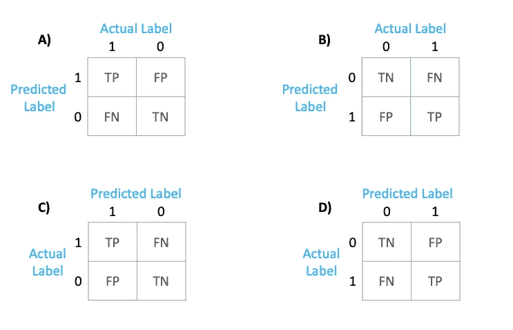
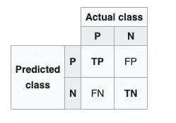
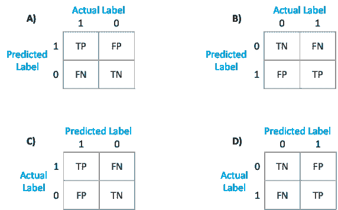
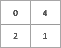
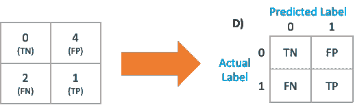
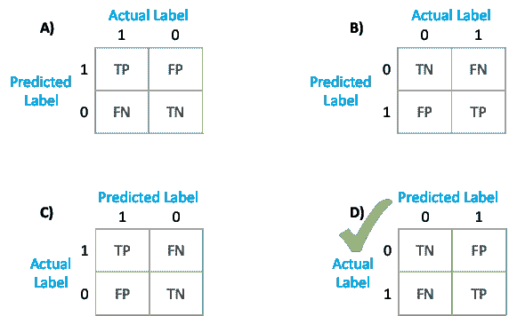
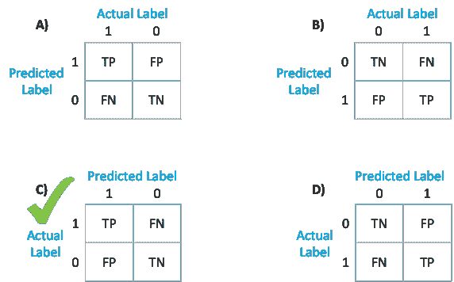
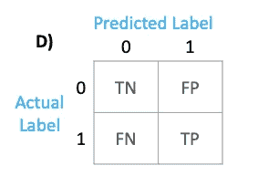
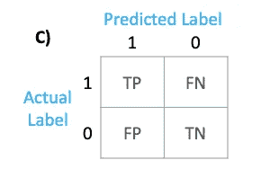

# 从 Scikit learn 了解混淆矩阵

> 原文：<https://towardsdatascience.com/understanding-the-confusion-matrix-from-scikit-learn-c51d88929c79?source=collection_archive---------5----------------------->

## 混淆矩阵输出的清晰表示



sklearn 的混淆 _ 矩阵默认输出是什么？作者图片

# 介绍

在我最近的一个项目中——一个交易监控系统生成了许多误报警报(这些警报随后由调查团队进行人工调查)。我们被要求使用机器学习来自动关闭那些错误的警报。机器学习模型的评估标准是一个度量标准*负预测值*，这意味着在该模型的所有负预测中，它已经正确识别了多少个案例。

NPV =真负值/(真负值+假负值)

假阴性的成本非常高，因为在这些情况下，我们的模型说它们不是欺诈性的，但实际上，它们是欺诈性的交易。

为了付诸行动，我会快速显示混淆矩阵，下面是 jupyter 笔记本的输出。我的二元分类模型是用 target = 1(欺诈交易)构建的，所以 target= 0(非欺诈交易)。

```
cm = confusion_matrix(y_test_actual, y_test_pred)
print(cm)----- Output -----
[[230, 33]
 [24, 74]
```

根据你如何解释混淆矩阵，你可以得到 90%或 76%的净现值。因为—

TN = cm[0][0]或 cm[1][1] ie。230 或 74

FN = cm[1][0] ie。24

## 维基百科表示法

我参考了维基百科上的[混淆矩阵表示法](https://en.wikipedia.org/wiki/Confusion_matrix)。



来自维基百科的混淆矩阵

这张来自维基百科的图片显示，预测的标签在水平方向，而实际的标签在垂直方向。这意味着，

TN = cm[1][1] ie。76

FN = cm[1][0] ie。24

**净现值= 76%**

## Sklearn 表示

Scikit learn 文档称 —维基百科和其他参考资料可能使用不同的轴约定。

哦等等！文档没有提到任何明确的东西，不是吗？他们说维基百科和其他参考资料 ***可能*** 对坐标轴使用不同的约定。

**您所说的“可能对轴使用不同的约定”是什么意思？**我们已经看到，如果您对轴使用错误的约定，您的模型评估指标可能会完全偏离轨道。

如果你通读文档，并接近底部，你会发现这个例子

```
tn, fp, fn, tp = confusion_matrix([0, 1, 0, 1], [1, 1, 1, 0]).ravel()
```

在这里，他们拉平了矩阵输出。在我们的例子中，这意味着，

TN = cm[0][0] ie。230

FN = cm[1][0] ie。24

**净现值= 90%**

# 理解混淆矩阵的结构

清楚地理解混淆矩阵的结构是最重要的。尽管您可以直接使用该公式来衡量大多数标准指标，如准确度、精确度、召回率等。很多时候，您需要计算阴性预测值、假阳性率、假阴性率等指标，这些指标在开箱即用的软件包中是不可用的。

现在，如果我让你为混淆矩阵选择正确的选项，这是混淆矩阵的输出。你会选哪一个？



混淆矩阵上的混淆。作者图片

你的答案是“ **A** ”因为维基百科是这么说的，还是“ **C** ”因为 sklearn 文档是这么说的？

## 让我们找出答案

考虑这些是您的 y_true 和 y_pred 值。

```
y_true = [0, 1, 0, 1, 0, 1, 0]
y_pred = [1, 1, 1, 0, 1, 0, 1]
```

通过查看给定的列表，我们可以计算出以下内容:

TP(真正)= 1

FP(假阳性)= 4

TN(真负值)= 0

FN(假阴性)= 2

对于用于二进制分类的经典机器学习模型，您通常会运行以下代码来获得混淆矩阵。

```
**from** **sklearn.metrics** **import** confusion_matrixconfusion_matrix(y_true, y_pred)
```



混淆矩阵的输出

如果我们把它填充回混淆矩阵，我们得到混淆矩阵如下



**因此正确答案是“D”**

```
cm = confusion_matrix(y_true, y_pred)
print (cm)--- Output ---
[[0,4]
 [2,1]]which translates to this: predicted                        
            0       1     
          -----   -----    
       0|   0   |   4      
actual    -----   -----             
       1|   2   |   1 
```

TN(真负值)= cm[0][0] = 0

FN(假阴性)= cm[1][0] = 2

TP(真正)= cm[1][1] = 1

FP(假阳性)= cm[0][1] = 4



参考原始图像。选项 D 是默认输出。作者图片

然而，如果你要添加一个简单的参数“*标签*”。

```
cm = confusion_matrix(y_true, y_pred, labels=[1,0])
print (cm)--- Output ---
[[1,2]
 [4,0]]which translates to this: predicted                        
            1       0      
          -----   -----    
       1|   1   |   2       
actual    -----   -----             
       0|   4   |   0
```

TP(真正)= cm[0][0] = 1

FP(假阳性)= cm[1][0] = 4

TN(真负值)= cm[1][1] = 0

FN(假阴性)= cm[0][1] = 2



参考原始图像。选项 C 是可以通过参数“label”得到的

# 结论:

来自 sklearn 的混淆矩阵的默认输出的正确表示如下。水平轴上的实际标签和垂直轴上的预测标签。

1.  默认输出

```
#1\. Default output
confusion_matrix(y_true, y_pred)
```



2.通过添加 labels 参数，您可以获得以下输出

```
#2\. Using labels parameter
confusion_matrix(y_true, y_pred, labels=[1,0])
```



# 感谢阅读！

*   如果你喜欢这个，请在 medium 上关注我。
*   你们的掌声对写更多、写得更好是一个巨大的鼓励和帮助。
*   有兴趣合作吗？我们在 [Linkedin](https://www.linkedin.com/in/samarth-agrawal-2501/) 上连线吧。
*   请随意写下您的想法/建议/反馈。
*   [Github 链接](https://github.com/samarth-agrawal-86/data_scientist_toolkit)