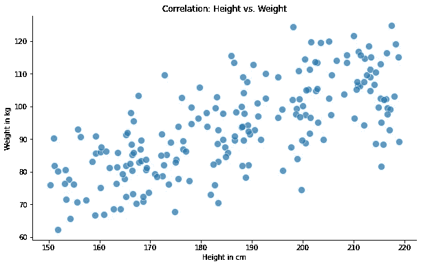
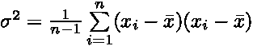
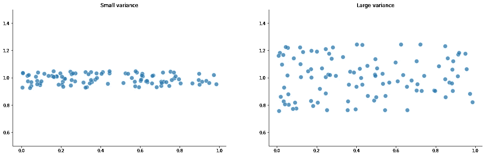
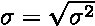
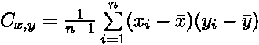
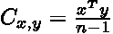
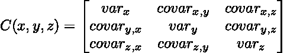
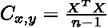
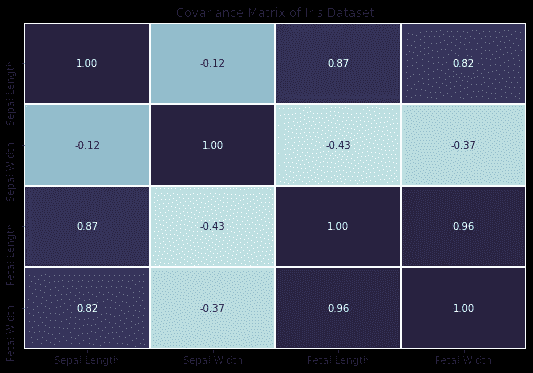

# 了解协方差矩阵

> 原文：<https://towardsdatascience.com/understanding-the-covariance-matrix-92076554ea44?source=collection_archive---------1----------------------->

## 基本原则

## 关于方差、标准差、相关性和协方差，你需要知道的就是

艾莉娜·格鲁布尼亚克在 [Unsplash](https://unsplash.com?utm_source=medium&utm_medium=referral) 上的照片

L 线性代数是机器学习的基础之一，被认为是*‘数据的数学’*。虽然我个人喜欢线性代数的许多方面，但有些概念一开始并不容易掌握。我经常努力想象一些概念的实际应用或实际好处。

然而，协方差矩阵却讲述了一个完全不同的故事。

协方差和相关性的概念使线性代数的某些方面变得生动。像 PCA 这样的算法在很大程度上依赖于协方差矩阵的计算，协方差矩阵在获取主成分中起着至关重要的作用。

</implementing-pca-from-scratch-fb434f1acbaa>  

在接下来的部分，我们将学习协方差矩阵，如何计算和解释它。但首先，我们需要了解相关的概念，基础知识，让我们有更深入的了解。

# 什么是相关性，它告诉我们什么？

相关性分析旨在识别变量之间的共性。

让我们想象一下，我们从一个随机的人群中测量变量*【身高】*和*【体重】*。一般来说，我们会认为高个子比矮个子重。这种关系的散点图可能如下所示:

身高和体重变量的散点图[图片来自作者]

通过观察上面的图，我们可以清楚地看出这两个变量是相关的。相关性，或者更确切地说是相关系数，为我们提供了一种统计方法来量化这种关系。

该系数的范围从负 1 到正 1，可以解释如下:

1.  正相关 *—* 告诉我们两个变量的移动方向相同，例如两个值同时增加。
2.  负相关 *—* 描述负相关变量。也就是说，如果一个变量增加，另一个就减少，反之亦然。
3.  相关系数为零表示完全没有关系。

> **注**:相关系数仅限于线性，因此不会量化任何非线性关系。为了测量非线性关系，可以使用其他方法，如互信息或转换变量。

那么我们为什么还要关心相关性呢？

原来，相关系数和协方差基本上是相同的概念，因此密切相关。相关系数只是限定在范围[-1，1]内的协方差的归一化版本。

这两个概念依赖于相同的基础:方差和标准差。

# 引入方差和标准差

方差作为离差的一种度量，告诉我们数据值有多么不同或多么分散。

我们可以通过取每个数据值和平均值之间的平方差的平均值来计算方差，从广义上讲，平均值就是每个数据点到中心的距离。

通过观察这个等式，我们已经可以知道，当所有数据值都接近平均值时，方差将会很小。如果数据点远离中心，方差会很大。

让我们来看两个例子，让事情变得更具体一些。

小方差与大方差数据的例子[图片由作者提供]

一旦我们知道了方差，我们也就知道了标准差。它就是方差的平方根。

现在我们知道了基本的概念，我们可以在下一节中把事情联系起来。

# 协方差和协方差矩阵

假设我们有一个包含两个要素的数据集，我们想要描述数据中的不同关系。协方差的概念为我们提供了这样做的工具，允许我们测量两个变量之间的方差。

我们可以通过稍微修改之前的方程来计算协方差，基本上是计算两个变量之间的方差。

如果我们之前的意思是将我们的数据居中，我们可以将等式简化为如下:

简化后，我们可以看到协方差的计算实际上非常简单。它只是包含数据的两个向量的点积。

现在想象一下，一个数据集有三个特征 x、y 和 z。计算协方差矩阵将得到一个 3x 3 的矩阵。该矩阵包含每个特征与所有其他特征及其自身的协方差。我们可以这样想象协方差矩阵:

基于[从头开始实施 PCA 的示例](/implementing-pca-from-scratch-fb434f1acbaa)

协方差矩阵是对称的，并且逐个特征地成形。对角线包含单个要素的方差，而非对角线条目包含协方差。

我们已经知道如何计算协方差矩阵，我们只需要将上面等式中的向量与以平均值为中心的数据矩阵进行交换。

一旦计算出来，我们就可以用前面我们学习相关系数时描述的相同方式来解释协方差矩阵。

# 运用我们的知识

既然我们已经完成了基础工作，让我们应用我们的知识。

出于测试目的，我们将使用 iris 数据集。数据集由 150 个样本组成，具有 4 个不同的特征(*萼片长度、萼片宽度、花瓣长度、花瓣宽度)*

让我们通过在散点图中绘制前两个特征来看一看数据。

通过绘制前两个特征对虹膜数据集进行概述[图片由作者提供]

我们的目标是*‘手动’*计算协方差矩阵。因此，我们需要先对我们的数据进行均值居中。为此，我们定义并应用以下函数:

> **注**:我们通过减去平均值并除以标准差来标准化数据。

运行上面的代码，标准化我们的数据，我们得到了预期的平均值 0 和标准差 1。

接下来，我们可以计算协方差矩阵。

> **注:**同样的计算可以用 NumPy 的内置函数 numpy.cov(x)来实现。

我们的协方差矩阵是一个 4x 4 的矩阵，逐个特征地成形。我们可以通过如下方式绘制矩阵和协方差:

协方差矩阵绘制成热点图[图片由作者提供]

通过获得高协方差或相关系数，我们可以清楚地看到不同特征之间的大量相关性。例如，花瓣长度似乎与花瓣宽度高度正相关，这在直觉上是有意义的——如果花瓣更长，它可能也更宽。

# 结论

在本文中，我们学习了如何计算和解释协方差矩阵。我们还讲述了一些相关的概念，如方差、标准差、协方差和相关性。

协方差矩阵在[主成分分析](/implementing-pca-from-scratch-fb434f1acbaa)中起着核心作用。用更人工的方法实现或计算它将许多重要的部分联系在一起，并为一些线性代数概念注入了活力。

> 感谢您的阅读！确保保持联系&在 [Medium](https://medium.com/@marvinlanhenke) 、 [Kaggle](https://www.kaggle.com/mlanhenke) 上关注我，或者在 [LinkedIn](https://www.linkedin.com/in/marvin-lanhenke-11b902211/) 上说声“嗨”

[马文·兰亨克](https://medium.com/@marvinlanhenke?source=post_page-----92076554ea44--------------------------------)

## # 30 日

[View list](https://medium.com/@marvinlanhenke/list/30daysofnlp-3974a0c731d6?source=post_page-----92076554ea44--------------------------------)30 stories

*喜欢这篇文章吗？成为* [*中等会员*](https://medium.com/@marvinlanhenke/membership) *继续无限学习。如果你使用下面的链接，我会收到你的一部分会员费，不需要你额外付费。*

<https://medium.com/@marvinlanhenke/membership>  

**参考资料/更多资料:**

*   [从零开始实施 PCA](/implementing-pca-from-scratch-fb434f1acbaa)
*   迈克·科恩博士。线性代数:理论，直觉，代码。