# 理解神经网络的表达能力

> 原文：<https://towardsdatascience.com/understanding-the-expressive-power-of-neural-networks-d4918c9e98da?source=collection_archive---------21----------------------->

## [实践教程](https://towardsdatascience.com/tagged/hands-on-tutorials)

我一直对神经网络似乎可以学习任何东西的能力感到惊讶。AlphaGo、谷歌翻译和特斯拉 Autopilot 都使用神经网络，但用于完全不同的任务。这怎么可能呢？事实证明，有一种叫做**通用逼近定理**的东西证明，在一定条件下，神经网络可以以任意精度逼近任何函数。这个定理的完整陈述和证明需要一些高等数学来理解，但是我们来看一个更简单的版本，建立一些直觉。首先，我们将使用一个通用的激活函数来构建任意函数。然后，我们将演示如何用神经网络来表示我们构建的任何函数。

**第一部分:从激活函数到任意函数**

通用逼近定理的完整陈述涉及向量值函数。为了简化，我们将考虑标量函数。我们的目标是逼近任意函数 y = f(x)，其中 x 和 y 是实数。回想一下高中微积分，任何这样的函数都可以用矩形来近似，如下所示。

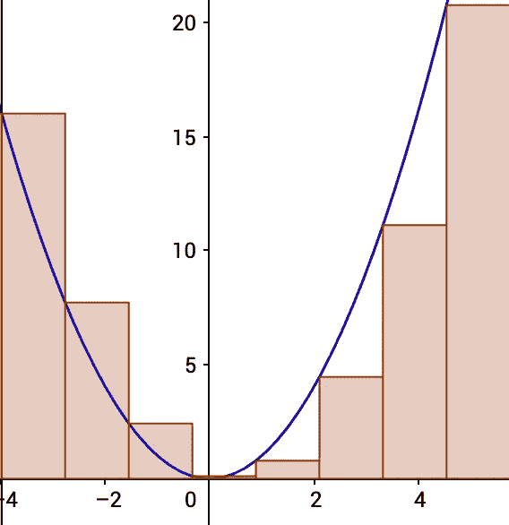

y = x 的矩形近似。

矩形越窄、越多，近似值就越好:

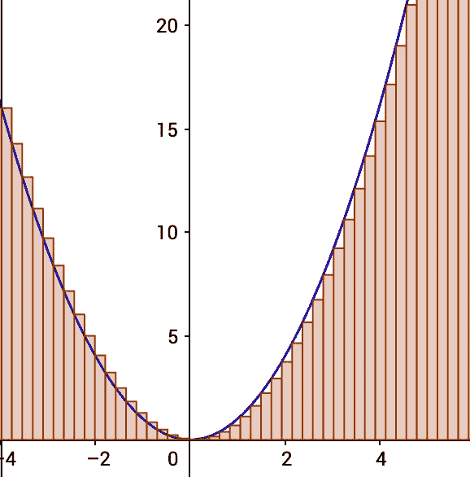

更多的矩形，更好的近似。图片作者。

因此，如果我们能创建任意宽度和高度的矩形，并把它们放在我们想要的任何地方，我们就能逼近任何函数 y = f(x)。现在我们应该怎么做呢？

我们的第一个提示来自神经网络中常用的激活函数，tanh 函数。k = 1 的函数 y = tanh(kx)如下所示:

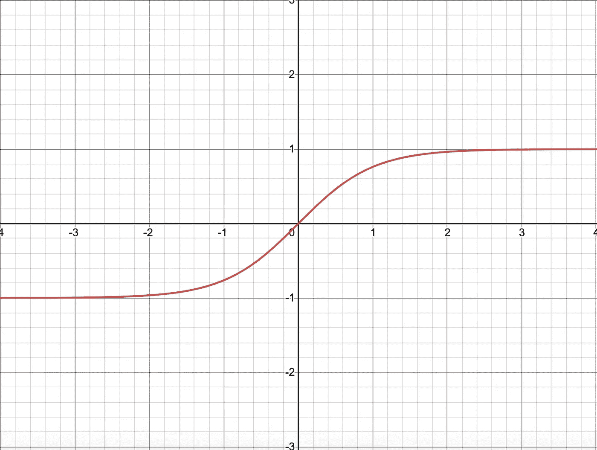

y = tanh(x)。图片作者。

随着 k 的增加，请注意图形的对角线部分变得越来越垂直。这里是 y = tanh(10x):

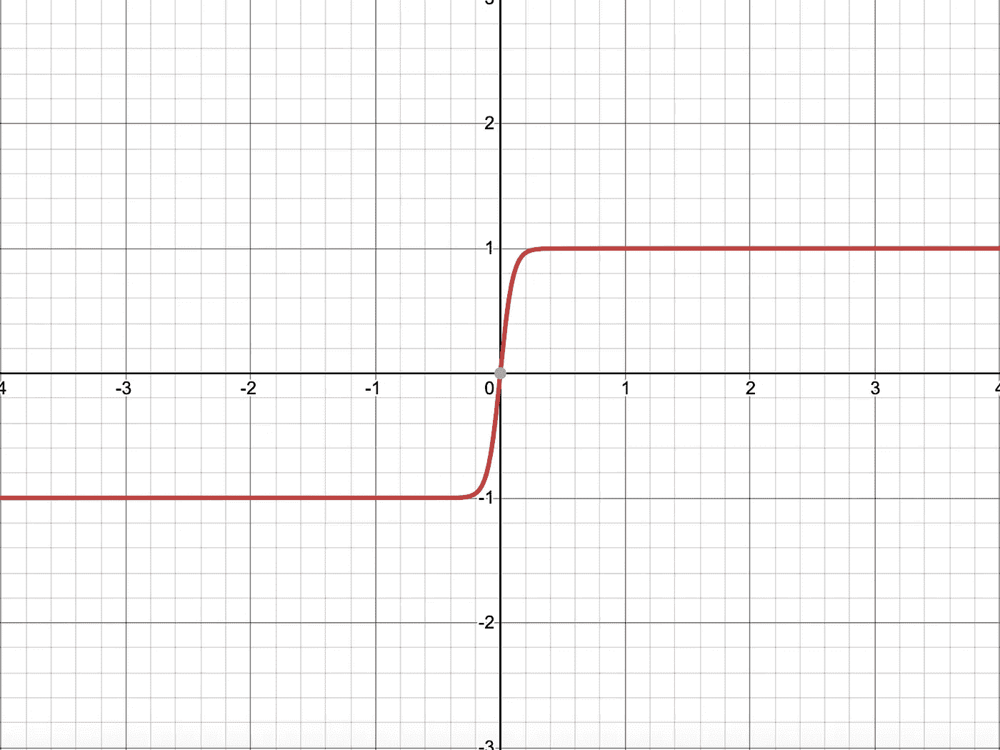

y = tanh(10x)。图片作者。

这里是 y = tanh(1000x):

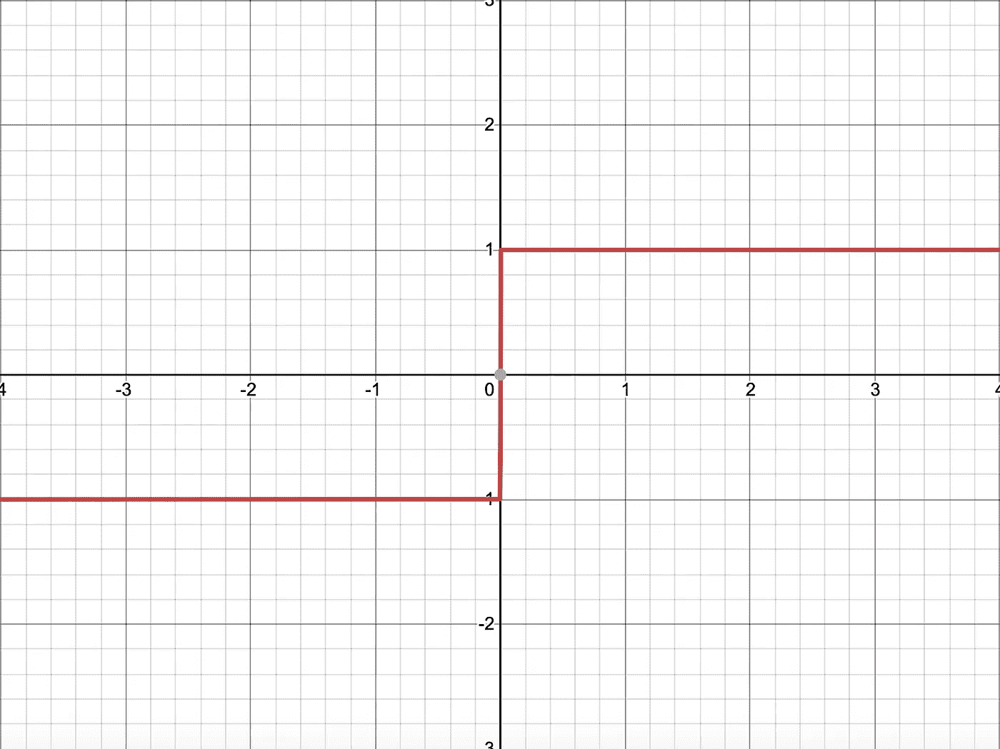

y = tanh(1000x)。图片作者。

我们现在有一个矩形的左边缘。但是仍然有一些问题:我们希望图的水平部分是 0，而不是-1 和 1，而且我们还没有构造右边。幸运的是，有一种方法可以同时解决这些问题。请注意，如果我们反转(取负值)双曲正切函数并向右移动 1，我们会得到这个函数:

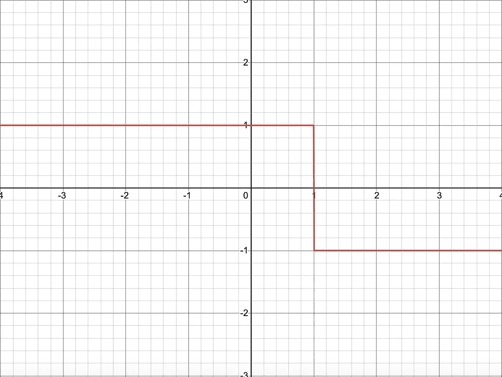

y = -tanh(1000(x-1))。图片作者。

现在，如果我们将这两个函数相加，我们得到:

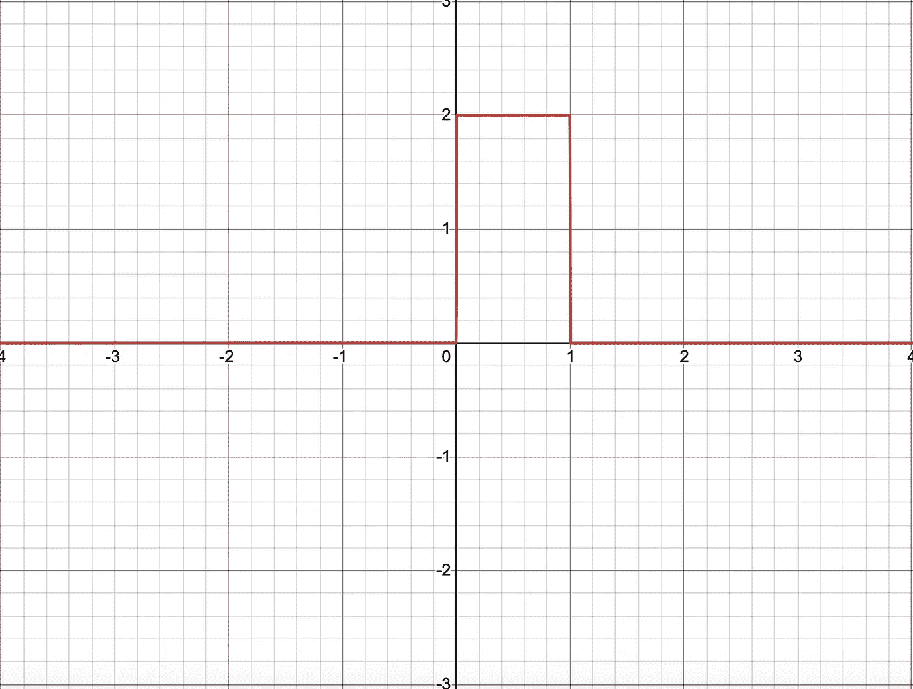

y = tanh(1000 x)-tanh(1000(x-1))。图片作者。

我们已经实现了制作矩形的目标！现在让我们花一些时间来观察矩形函数的属性。

*   首先，除了矩形所在的地方(这里是区间(0，1))，矩形函数在任何地方都是 0。这意味着我们可以添加任意多的其他矩形函数，只要没有矩形相互重叠。
*   第二，我们可以任意调整矩形的宽度。例如，如果我们希望宽度为 2，我们的函数将是 y = tanh(1000 x)-tanh(1000(x-2))。
*   第三，我们可以任意调整矩形的高度。如果我们想要高度为 3，我们的函数将是 y =(3/2)tanh(1000 x)—(3/2)tanh(1000(x-1))。
*   最后，我们可以调整矩形在 x 轴上的位置。如果我们想要一个从 x = -1 而不是 x = 0 开始的矩形，我们的函数应该是 y = tanh(1000(x+1)) — tanh(1000x)。

我们可以用下面的规则来概括这些观察结果。如果我们想要一个矩形，其左侧为 x = s，高度为 h，宽度为 w，近似精度为 k(k 越高越精确),我们的等式为:

> y =(h/2)tanh(k(x-s))—(h/2)tanh(k(x-s-w))

例如，对于一个左侧为 x = -2，高度为 2，宽度为 3，精度为 1000 的矩形，一旦您插入数字，等式就是 y =-tanh(1000(x+2))+tanh(1000(x-1))。见下文:

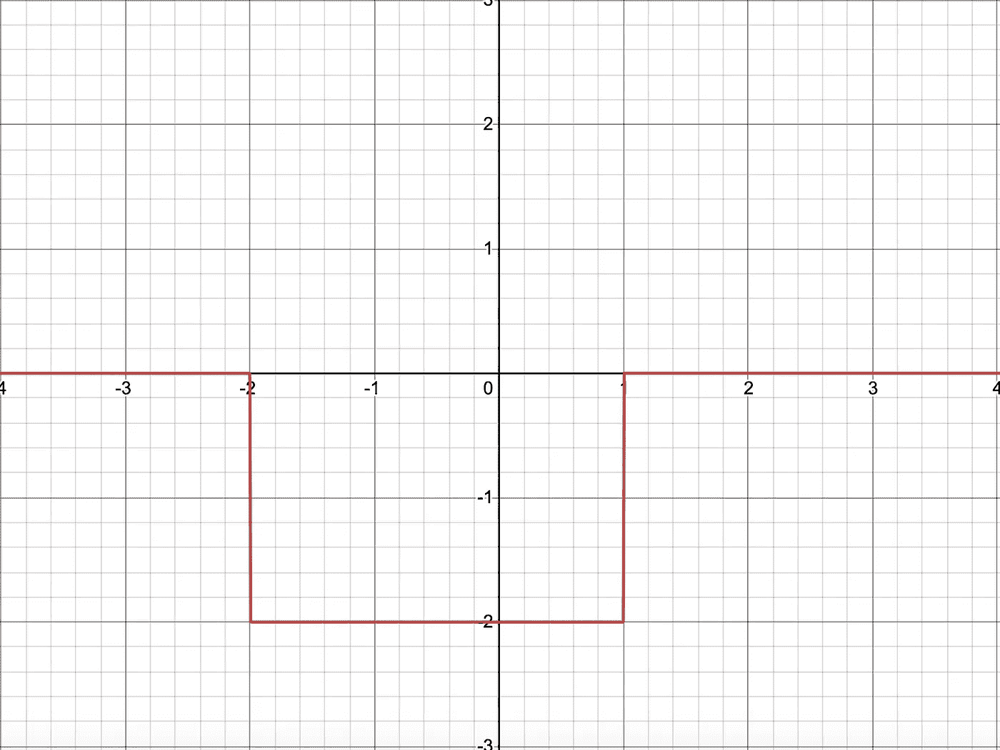

y =-tanh(1000(x+2))+tanh(1000(x-1))。图片作者。

现在我们有了逼近任何函数所需的工具。例如，我们可以使用三个矩形来粗略地逼近从 0 到 3 的恒等函数:

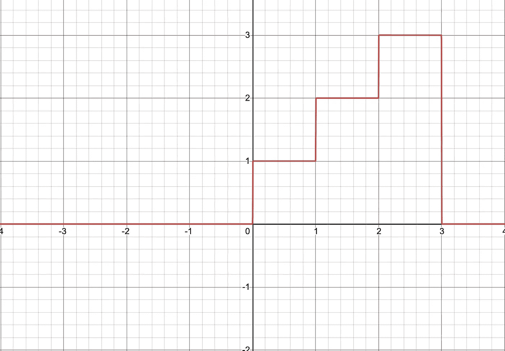

y =[(1/2)tanh(1000 x)—(1/2)tanh(1000(x-1))]+[tanh(1000(x-1))—tanh(1000(x-2))]+[(3/2)tanh(1000(x-2))—(3/2)tanh(1000(x-3))]。图片作者。

如果我们想做得更好，我们可以使用更多的矩形:

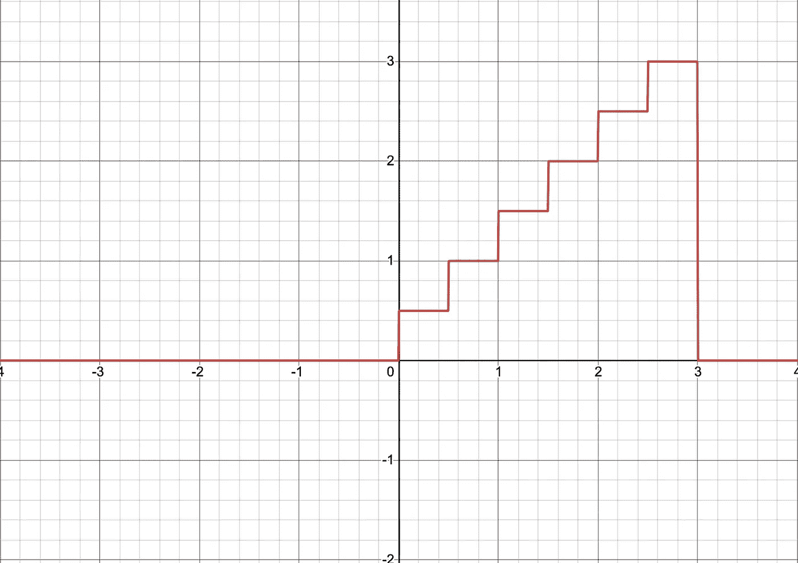

y =[(0.5/2)tanh(1000 x)—(0.5/2)tanh(1000(x-0.5))]+[(1/2)tanh(1000(x-0.5))—(1/2)tanh(1000(x-1))]+[(1.5/2)tanh(1000(x-1))—(1.5/2)tanh(1000(x-1))]+图片作者。

**第二部分:从任意矩形到神经网络**

下一步是找到一种方法，通过神经网络来表示我们的矩形。这被证明是非常简单的。让我们再来看看我们为任意矩形找到的公式:y =(h/2)tanh(k(x-s))—(h/2)tanh(k(x-s-w))。使用具有一个隐藏层的网络，我们可以表示这个函数:

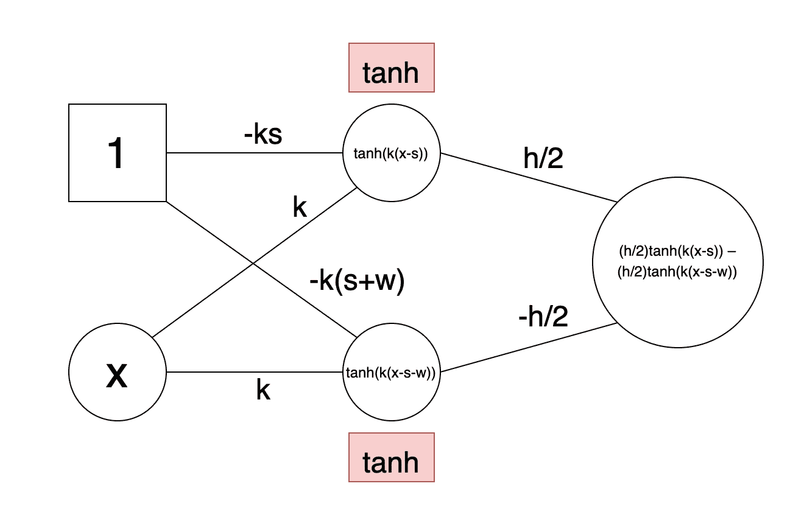

图片作者。

该网络接收一个输入 x，并有一个针对输入层的偏置项(用正方形表示)。隐藏层有两个节点，都有 tanh 激活，没有偏置项。单输出节点没有激活功能。整个网络的权重如图所示。您可以自己验证所有的权重相加，输出确实是我们的矩形函数。

最后一个问题——如果我们想要不止一个矩形呢？解决方案很简单:对于每个额外的矩形，我们向隐藏层添加两个节点，并向输入和输出层添加适当的权重/连接。这意味着每个矩形需要两个隐藏节点来代表我们的网络。例如，我们上面看到的身份函数的六个矩形近似将有十二个隐藏节点。

把所有的东西放在一起，我们现在有一种方法，用神经网络来表示任何函数 y = f(x)和 x，y 实数。这样做的方法是将函数分解成一些矩形(矩形越多，逼近越好)，并为每个矩形找到将在我们的广义矩形公式中使用的参数 h、k、s 和 w。然后，我们可以使用如上所示的找到的参数构建神经网络，对每个矩形/参数集使用两个隐藏节点。

**限制**

在这一点上，你可能会问——那么是什么阻碍了呢？如果任何功能都可以用神经网络来表示，为什么我们没有完美的自动驾驶汽车？为什么人工智能不跑来跑去解决世界上所有的问题？简而言之，问题在于神经网络很难训练。仅仅因为您知道应该有一组参数很好地逼近您给定网络架构的功能，并不意味着有任何好的方法来找到这些参数。训练神经网络最常用的方法是梯度下降法，这种方法在实际中对于某些任务(例如图像分类)非常有效，但是不能保证梯度下降法能够为任意函数找到正确的参数。这是一个棘手的问题，在未来我会写一些关于它。

请随时留下您的任何问题/意见！让我知道你还想看什么机器学习话题。