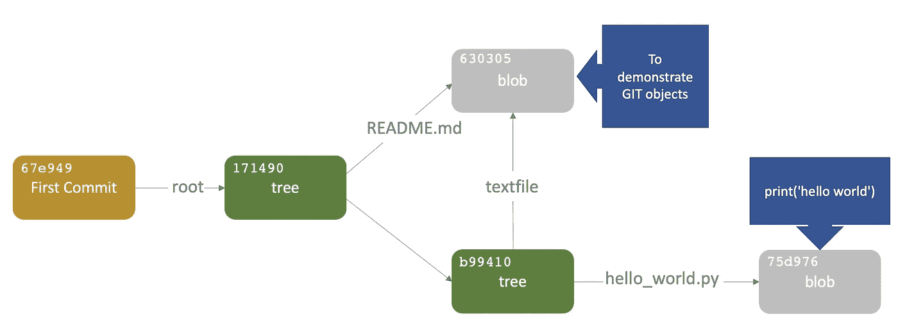
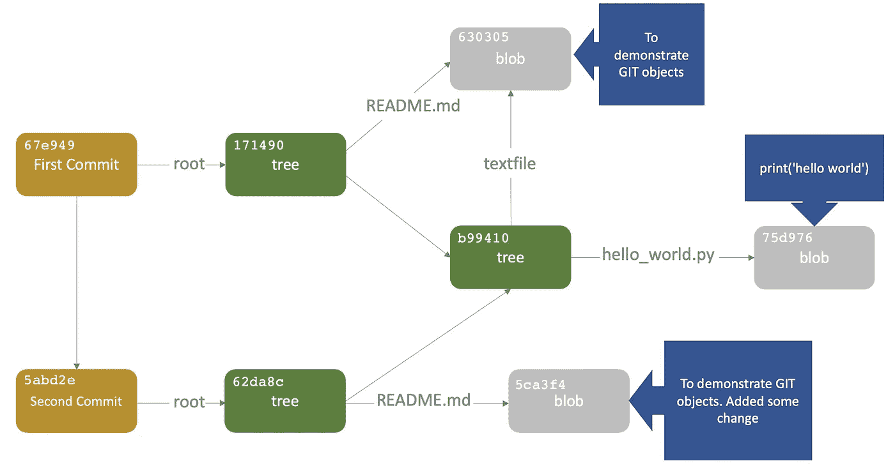

# 理解 Git 的基础知识

> 原文：<https://towardsdatascience.com/understanding-the-fundamentals-of-git-25b5b7ded3c4?source=collection_archive---------12----------------------->


由 [Roman Synkevych](https://unsplash.com/@synkevych?utm_source=medium&utm_medium=referral) 在 [Unsplash](https://unsplash.com?utm_source=medium&utm_medium=referral) 上拍摄

## 理解在幕后操作的各种 Git 对象

Git 是一个强大的工具，但是它可能会让人不知所措，尤其是对于新手来说。即使对于有经验的开发人员来说，陷入合并或重定基础冲突也是很常见的。即使有大量的博客可用，有时也很难确定原因，最终会浪费我们的生产时间。

已经有太多的教程了，但是大部分只是简单地谈论高级用户命令、语法以及如何使用它们，抽象出了大部分内部细节。

本文试图揭示 Git 是如何工作的。但是我们为什么要为此烦恼呢？从头开始了解它是如何工作的对使用命令有很大帮助。因为它不是关于学习命令，而是关于学习概念模型。因此，我们将尝试理解命令是如何工作的，而不是学习一堆命令。一旦我们开始理解它，我们在使用命令时会越来越舒服和自信，最终，我们会开始喜欢它。此外，了解内部情况总有一种极客的快感。有了这些，我们来揭开 git 的神秘面纱。

## git——一个愚蠢的内容跟踪器(如 man git 中所述)

在其核心，git 是一个简单的键值存储，一个将键映射到值的简单结构，这个结构是持久的，即它存储在我们的磁盘中。这些值只是字节序列。它可以是任何类型的内容，可以是文本文件或二进制文件等。我们可以向 git 提供一个值，git 将为它计算一个惟一的键，稍后可以使用这个键来检索内容。

作为演示，我们将使用`hash-object`命令，该命令获取一些数据并返回唯一的密钥。由于`hash-object`不直接操作字符串数据，我们必须通过管道输入并传递`— stdin`标志让`hash-object`知道。(`hash-object`是管道命令之一，如果你以前没用过完全没问题)

```
**$** **echo** "Hello Sarah" **| git hash-object** --stdin
0e170dcd3efae4d183c78dced6c5b9c7e13f70c5
```

上面生成的散列将被用作存储该内容的密钥。它是使用 SHA1 算法生成的。要深入了解 SHA1，可以参考这里的。需要注意的重要一点是，对于相同的字节序列，我们每次在每个操作系统上都将得到相同的散列。对于两个不同的内容，我们几乎不可能得到相同的散列。

因此，git 存储库中的每一部分内容都有自己的散列。现在，让我们尝试将这些内容存储在 git 中，看看它是如何工作的。首先，我们必须初始化一个新的 Git 存储库:

```
**$** **git** **init** test
Initialized empty Git repository in /workdir/test/.git/
**$** **cd** test
**$** **ls** **-a**
**.**/    **..**/   **.git**/**$** **ls** .git/objects
**info**/  **pack**/
```

现在，我们有一个`.git`目录来保存我们的内容。如果我们检查一下`.git`目录，它有一个叫做`objects`的子目录，叫做对象数据库。git 在这里保存所有用于保存内容、文件、目录等的对象。

目前，除了作为初始化的一部分创建的`pack`和`info`子目录之外，没有其他对象。再次使用`hash-object`和`-w`标志不仅会返回密钥，还会将该对象写入`.git`存储。

```
**$** **echo** "Hello Sarah" | **git** **hash-object** **-w --stdin**
0e170dcd3efae4d183c78dced6c5b9c7e13f70c5**$** **ls** .git/objects/
**0e/   info/ pack/****$** **find** .git/objects **-type** f
.git/objects/0e/170dcd3efae4d183c78dced6c5b9c7e13f70c5
```

我们可以看到，git 已经存储了我们的数据。目录由哈希的前两个十六进制数字(`0e`)创建。其中存在一个文件，该文件包含哈希的剩余字符。这是 git 遵循的命名方案。我们原始数据存在于该文件中。这个文件被称为 blob 数据。

blob 是一段普通的内容。Git 添加了一个小标题，并压缩了这个 blob 中的原始内容。我们可以用`git cat-file`命令检查内容。传递`-t`将告诉我们内容的类型，而`-p`标志将打印该对象的内容。

```
**$** **git cat-file** 0e170dcd3efae4d183c78dced6c5b9c7e13f70c5 **-t**
blob
**$** **git cat-file** 0e170dcd3efae4d183c78dced6c5b9c7e13f70c5 **-p**
Hello Sarah
```

因此，git 可以获取任何内容，为其生成一个如散列中所示的键，然后将内容作为 blob 保存在存储库中。

## 通过进行第一次提交来了解对象数据库

我们现在将稍微深入一下对象数据库。我们将探索 git 存储的各种类型的对象是什么以及如何存储的。

git 存储的对象主要有 3 种类型:

*   **Blob** :我们上面看到的这个对象存储了原始内容。
*   树:这个对象用于存储我们项目中的目录。
*   提交(Commit):这个对象在每次提交时被创建，并提取这个特定提交的所有信息。

让我们创建一个示例项目来深入理解每一个。一个`app`项目。在它的根目录下，我们将有一个`README.md`文件和一个`src`目录。在`src`目录中，我们有一个`textfile`和`hello_world.py`源文件。

```
**$ git init** app
**$ cd** app
**$ echo** "To demonstrate GIT objects" **>** README.md
**$ mkdir** src
**$ cd** src
**$** **echo** "To demonstrate GIT objects" **>** textfile
**$** **echo** "print('hello world')" **>** hello_world.py**$** **tree** .
.├── README.md
└── **src** ├── hello_world.py
    └── textfile
1 directory, 3 files
```

目前，我们的 git 存储库没有提交任何东西，所以让我们进行添加这些文件和目录的初始提交。提交完成后，我们将检查`objects`目录，查看创建的各种对象。

```
**$** **ls** **-a** .git/objects
**./**    **../**   **info/** **pack/****$ git add .****$ git status** On branch masterNo commits yetChanges to be committed:
(use "git rm --cached <file>..." to unstage)new file:   README.md
new file:   src/hello_world.py
new file:   src/textfile**$ git commit -m "**inital commit, adding README and src dir**"****$ git status** On branch master
nothing to commit, working tree clean**$ git log** commit 67e94955f7d3fffd307d0f070e17d652800b503e (**HEAD -> master**)
inital commit, adding README and src dir**$** **ls** **-a** .git/objects
**.**/    **..**/   **17**/   **63**/   **67**/   **75**/   **b9**/   **info**/ **pack**/**$** **find** .git/objects/ **-type** f
.git/objects/67/e94955f7d3fffd307d0f070e17d652800b503e
.git/objects/17/14900a9b496867b319101942b690af9e4d399e
.git/objects/75/d9766db981cf4e8c59be50ff01e574581d43fc
.git/objects/63/03057f97f1cb0222d3e916c3ab471e3c06b9b2
.git/objects/b9/941014e9cc4cb12e3b1283de8846127f96e6d7
```

我们在提交历史中看到一个提交，但是在`objects`目录中，我们看到正在创建各种对象。让我们使用`git cat-file`命令逐个检查它们，从`log`命令中查看的提交开始。

```
**$ git cat-file** 67e949 **-t** commit **$** **git cat-file** 67e949 -p
tree 1714900a9b496867b319101942b690af9e4d399e
author RachitTayal <rachit.tayal@gmail.com> 1624011001 +0530
committer RachitTayal <rachit.tayal@gmail.com> 1624011001 +0530inital commit, adding README and src dir
```

正如我们在上面看到的，提交对象包含一段简单而简短的文本。每当进行一次提交(使用`git commit`)，git 就会生成这个文本，生成它的散列，然后像存储 blob 一样存储它。提交文本包含关于提交的所有元数据。除了作者、提交者、提交日期之外，它还有树对象的散列。这个提交(`171490`)指向项目的根目录。让我们获取这个树对象的内容来进一步理解它。

```
**$ git cat-file** 171490 **-t**
tree
**$ git cat-file** 171490 **-p**
100644 **blob** 6303057f97f1cb0222d3e916c3ab471e3c06b9b2 README.md
040000 **tree** b9941014e9cc4cb12e3b1283de8846127f96e6d7 src
```

就像提交对象一样，树对象也是一段文本。它包含目录中的内容列表(由哈希表示)。在这种情况下，我们有一个 blob 和另一棵树以及它们相应的名称。blob 是根目录中的`README.md`文件，而树是根目录中的`src`目录。

让我们再次使用`git cat-file`来获取 blob 的内容。

```
**$ git cat-file** 630305 **-t**
blob
**$ git cat-file** 630305 **-p**
To demonstrate GIT objects
```

因此，blob 的内容与我们的`README.md`文件中的内容相同。

总而言之，提交指向一棵树(表示根)，而这棵树指向一个 blob ( `README.md`文件)和另一棵树(`src`目录)。blob 只是存在于`README.md`文件中的一段内容。让我们快速检查另一棵树。

```
**$ git cat-file** b99410 **-t**
tree
**$ git cat-file** b99410 **-p**
100644 blob 75d9766db981cf4e8c59be50ff01e574581d43fc hello_world.py
100644 blob 6303057f97f1cb0222d3e916c3ab471e3c06b9b2 textfile
```

它有两个斑点。其中一个 blobs 存储了`hello_world.py`文件的内容。而另一个 blob 存储`textfile`的内容。需要注意的重要一点是`textfile`和`README.md`的 blob 具有相同的散列，因为两个文件的内容完全相同。因此，git 将存储一个 blob，而不是为同一个 blob 创建两个单独的副本。

整个对象数据库可以描述如下:



提交后对象的快照

## 第二次提交

现在，让我们在`README.md`文件中做一些更改，并进行第二次提交。

```
**$ echo** "Added some change" **>>** README.md
**$ git add** README.md
**$ git status**
On branch master
Changes to be committed:
(use "git reset HEAD <file>..." to unstage)**modified:   README.md**
**$ git commit -m** "updated README"
**$ git log**
commit 5abd2e3d6903385c2d7f646811f84decd41bcdc7 (**HEAD -> master**)
...
commit 67e94955f7d3fffd307d0f070e17d652800b503e
```

让我们再次使用`cat-file`命令来查看第二次提交的内部。

```
$ **git cat-file** 5abd2e -t
commit
$ **git cat-file** 5abd2e -p
**tree** 62da8c3c87d1b7725dbcc4450d5ec25384a7614e
**parent** 67e94955f7d3fffd307d0f070e17d652800b503e
author RachitTayal <rachit.tayal@gmail.com> 1624019462 +0530
committer RachitTayal <rachit.tayal@gmail.com> 1624019462 +0530updated README
```

除了显而易见的字段之外，它还有一个父提交，指向前一个散列的提交。提交以这种方式链接。大多数提交都有一个父级。(异常是第一次提交)。这个提交中存在的树的散列(`62da8c`)不同于第一个提交所指向的，这意味着它指向一个新的树。

检查新树的内容将得到:

```
$ **git cat-file** 62da8c -p
100644 blob 5ca3f4ffb43baf06df6e3fcb0a056cc6263cf32f README.md
040000 tree b9941014e9cc4cb12e3b1283de8846127f96e6d7 src
```

我们可以看到，它有另一棵树(`src`目录)和一个 blob ( `README.md`)文件。blob 不具有与前一次提交相同的散列，因为我们已经对`README.md`文件添加了更改。因此创建了新的斑点。

然而，树对象与前一次提交具有相同的散列，因为没有进行任何更改，git 将重用前一个树对象。第二次提交后，对象数据库的文件结构如下所示:



第二次提交后对象目录的文件结构

至此，我们大致了解了 git 对象模型的工作原理。一旦理解了这一点，理解进一步的复杂操作，如合并、重定基础和分支策略就变得非常直观了。(我们将在下一篇文章中讨论)。

## 总结:

我们已经看到 git 是如何基于键值结构进行内容跟踪的。密钥基于 SHA1 算法生成的哈希。我们已经看到了各种管道命令，如`git hash-object`和`git cat-file`来分别生成散列和查看目标文件的内容。

接下来，我们看到了每当我们提交项目时，git 对象数据库的幕后发生了什么。它强调了整个 git 对象模型、存储在 git 中的各种类型的对象(blobs、tree、commits)以及对象在进一步提交时是如何交织在一起的。这为理解分支和合并相关操作以及各种其他高级概念奠定了基础，我们将在下一篇文章中对此进行讨论。在那之前继续探索。