# 用计算机视觉理解新冠肺炎对交通的影响

> 原文：<https://towardsdatascience.com/understanding-the-impact-of-covid-on-traffic-in-singapore-with-computer-vision-852d2a94882f?source=collection_archive---------41----------------------->

## [实践教程](https://towardsdatascience.com/tagged/hands-on-tutorials)

## 用 Python 和 OpenCV 分析新加坡的交通

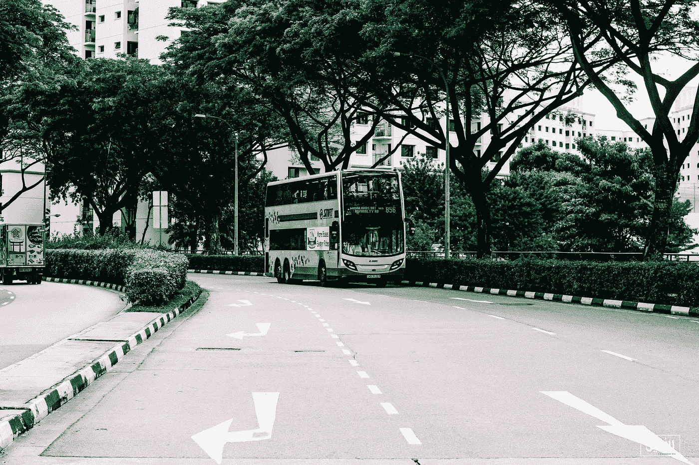

照片由来自[佩克斯](https://www.pexels.com/photo/photo-of-gray-and-orange-bus-1058830/?utm_content=attributionCopyText&utm_medium=referral&utm_source=pexels)的[阿拉明·阿-达伊](https://www.pexels.com/@alameen-a-dae-399116?utm_content=attributionCopyText&utm_medium=referral&utm_source=pexels)拍摄

ovid-19 深刻影响了我们生活的方方面面，从全球供应链到我们的工作方式。在疫情期间，大多数国家都在不同程度的限制下实施了某种形式的封锁。这些封锁的一个有趣的方面是对世界不同地区日常生活的影响，最常见的预防措施之一是留在家中的命令。新加坡作为一个人口密集的城市国家和岛屿，为观察这些影响提供了一个有趣的测试案例。这两个因素，加上强有力的政府干预，应该为这些影响提供了充分的证据。通过使用政府的交通摄像头数据库和计算机视觉，我们将试图了解城市中心附近的交通如何受到并仍然受到整个疫情的影响。

这篇文章的重点是回答以下问题:

> 新冠肺炎对新加坡的交通有影响吗？如果是，影响是什么，是什么造成的？

本文中的代码是用于解释目的的补充工具，已经从原始代码中进行了缩写和略微修改；这不是一次演练，而是如何解决问题的一个可能的脚手架。如果您只是对数据感兴趣，请随意跳到结果部分。

# 数据收集

ingapore 拥有一个令人难以置信的公共数据库，涵盖了城市及其功能的方方面面。你可以去参观:[https://data.gov.sg/](https://data.gov.sg/)。该项目利用由陆路运输管理局管理的[交通摄像头](https://data.gov.sg/dataset/traffic-images)部分。该 API 允许用户指定时间戳，并返回城市中每个摄像机的所有数据。我们可以使用 python 中的请求库来指定时间戳，并接收一个 JSON 对象，该对象包含所有摄像机的位置和视频帧。

返回的 JSON 对象是每台摄像机和各种数据的列表，包括位置、视频帧的链接和一些关于图像的元数据。我们对三个方面最感兴趣:

*   camera_id —嵌套在相机键内的相机数组中
*   image:一个 URL，包含摄像机当时看到的图像
*   位置:相机的 GPS 线，嵌套在相机对象中

为此，需要对 JSON 响应进行规范化和解析。这可以通过熊猫图书馆来完成，它将用于管理我们的数据。

这将给我们留下一个 87 行 8 列的熊猫数据帧。

前十行

这个数据帧是对于给定的时间戳，城市周围的所有 摄像机的 ***。为了减少收集的数据量并控制范围，我们将把摄像机的数量限制为 1702 和 1711。它们位于璧山区和实龙岗区之间的 [CTE 高速公路](https://en.wikipedia.org/wiki/Central_Expressway,_Singapore#/media/File:Expressways_and_Semi-expressways_of_Singapore_2012.png)上。在主干道上，交通的任何显著变化都应该很容易被发现。下面是每个摄像机看到的一个例子。***

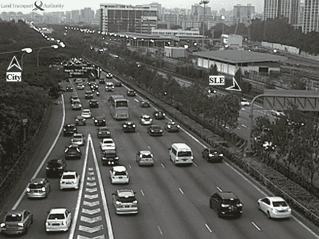

照相机 1702 例子

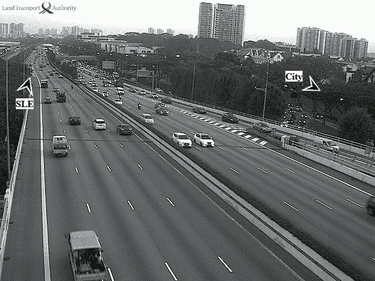

照相机 1711 的例子

下一步是建立一个测量流量模式的时间框架。选择了 2019、2020 和 2021 年从 3 月 1 日到 5 月 1 日的两个月时间，以每三分钟为增量。选择这一点有三个主要原因:

1.  包含三年的时间框架可以实现 COVID 之前、之中和之后的评估，其中 2019 年作为正常流量模式的示例。
2.  这个时间框架在封锁方面也很重要-因为最严格的措施是在 2020 年 4 月推出的，限制将在 2021 年取消。
3.  将时间范围限制为每三分钟，可以更好地管理要标记的图像数据集。

使用 pandas，可以建立批量请求的框架。首先，用 date_range 函数制作时间戳的数据帧:

其次，将时间戳格式化成可以传递给 API 的格式。

现在我们有了要循环的日期，我们可以利用并发库使用 futures 函数进行并发请求。未来的库通过创建不同的工人，使批量请求数据变得容易得多，这些工人可以彼此并行地进行请求。关于如何使用期货的一个很好的指南可以在这里找到。

下面是将要使用的功能的基本概要。Fair wairing:每个电话仍然需要大约 2 个小时才能完成。

这将产生一个包含所有响应的庞大列表。下一步是按 camera_id 列对响应进行排序，并将它们保存为各自的. csv 文件。我还建议将原始列表保存为 DataFrame，以便以后需要时可以引用。(因此，如果我们想在未来研究其他相机，我们不必重复 2019 年的 API 调用。)

2020 年和 2021 年重复这些步骤，总共留下 6 个单独的文件，每个相机 3 个。请求部分的总运行时间约为 6 小时。我们现在有了图像的链接，可以继续从数据库中抓取图像了。为了获取图像，我们将使用与之前相同的结构来进行并发调用，但是首先，加载上一步中创建的数据帧。

加载数据帧后，我们可以编写新的请求函数和并发请求框架。

关于上面的代码块及其输出，有几点需要注意。首先，我们正在抓取**大量**图像；所以要确保有足够的空间来存放它们。第二，每个呼叫大约需要 1.5 到 2 个小时，具体取决于定义的工作人员数量。

收集完图像后，我们就可以开始生成数据了。我们将使用 OpenCV 并利用 google 提供给 Colab 用户的 GPU 能力。为了做到这一点，我建议按照这个[教程](/how-to-use-opencv-with-gpu-on-colab-25594379945f)来设置 OpenCV，以便在 colab 环境中使用 GPU 来加速图像的标记。

设置完成后，多亏了 OpenCV，标记图像变得相当简单。

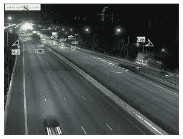

OpenCV_example.py 的输出

关于如何设置 detect_common_objects 函数，有一些重要的注意事项:

1.  你可能已经注意到，它既没有标记图像前面的模糊汽车，也没有标记旁边的汽车。这是因为默认过滤级别为 0.5。置信度值低于 0.5 的任何对象都不会被认为可以防止误报。通过在函数调用中定义 nms_thershold，可以将该级别调整为所需的任何级别。更多信息可以在[这里](https://docs.cvlib.net/object_detection/)找到。
2.  您可以使用 model 关键字修改在其中对模型进行训练的标记数据集。然而，YOLOv4 非常适合这项任务。如果你有兴趣了解更多，[这里有一个 YOLOv4 结构和设计](https://reckoning.dev/blog/yolo-v4/)的链接。

我们的基本工作流现在已经设置好了，我们可以编写函数来处理 2019 年数据集中的所有图像，并建立一种方法来跟踪标签并将它们添加回数据帧。

接下来，我们可以使用该函数遍历收集的所有数据，并生成可用于分析的标签数据帧。下面是摄像头 1702 的 2019 年图像的通话情况。

然后，我们对每一年和每一台相机重复这一步。最后，我们准备开始做一些分析！如果您已经完成了数据采集过程，我想澄清几个可能出现的问题。

1.  数据集仅限于调用 api_imageRequest 函数返回的内容。我使用了一个 try-expect 块，这样即使调用失败，它也不会抛出错误，并且不是所有的时间戳都有有效的图像可以提取。因此，您的数据集可能与我生成的数据集有所不同，但流量数据的总体趋势应该仍然相对相似。此外，抓取 2021 年的图像导致图像减少了约 35%,这很可能是在数据库方面。
2.  为什么我们没有在 get_label_count 块中定义要计数的标签？我们想跟踪摩托车、卡车和任何可能在路上行驶的车辆。虽然人或其他物体有可能被计算在内，但由于每个数据集包含数以千计的图像，因此它对流量的整体趋势只会产生极小的影响。
3.  下载图片时，3 月 17 日和 18 日 1711 相机的 2019 都不完整。严重缺乏白天的图像导致那些日子的数据不准确。经过调查，在此期间进行了定期维护，这可以解释异常现象。我们通过替换在数据分析部分对此进行了说明。

# 数据分析

在进行探索性数据分析时，记住我们在项目开始时提出的“全局”问题并使用这些问题来指导过程是很重要的。

> 【COVID 对新加坡的交通有影响吗？如果是，影响是什么，是什么造成的？

第一步是加载所有以前收集的数据，并开始将其聚合成我们可以使用的东西。

关于编码示例的注意事项:我们将查看相机 1711，因为它提供了一些有趣的挑战(如上所述)，然而，相同的步骤应用于相机 1702 以生成本文中的图形。

在数据被加载之后，我们可以通过添加一个名为“num_cars”的新列来将标签 DataFrame 与原始数据合并，该列表示生成的标签。

我们还可以继续修改“时间戳”列，这对以后的重采样很重要。

通过运行。在我们的每个数据帧上描述()，我们可以了解我们正在处理的数据。

从该输出中得出的最重要的细节之一是 2020 年到 2021 年的计数差异。虽然大约 13k 的数据点仍然为这种分析提供了典型的流量模式，但实际上不可能比较总计数。

下一步是了解我们数据的形状，我们可以通过观察标签的频率来做到这一点。这使我们对交通模式的分布有了一个大致的了解。我们将使用 pandas 的 count_values()函数来生成这些数据。

我们使用 normalized 关键字来获得标签的比例，而不是精确的计数，然后将它们四舍五入到最接近的百分之一，以使绘制它们更容易！

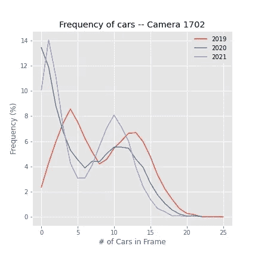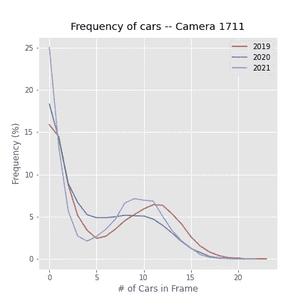

一定数量汽车的车架比例

我们可以从图表中看到，2020 年和 2021 年，较大流量急剧下降，空帧或稀疏帧大幅增加。这些图表提供了一个很好的概览，并显示了很大的差异。然而，为了得出有意义的结论，处理当前数据集的一些问题是很重要的。

每年之间数据点数量的差异和偏斜分布使得很难知道到底发生了什么。我们可以对数据进行重新采样，以更好地了解整个人口，并进行时间序列分析。由于我们的数据是有时间戳的，panda 内置的重采样工具是获取时间序列的有效方法。为了处理年份之间的计数差异，我们将避免任何依赖于总计数的度量，而是使用描述数据的度量，如平均值、最大值和中值。

如上所述，2019 年的数据集存在问题。3 月 17 日和 18 日显示异常低值。我们可以使用列索引将其与数据集中的其他日期进行比较。

确定异常值是否是真实数据点的一个重要部分是查看生成它们的元素——在这种情况下，是图像。在对图像进行了一些检查之后，很明显，在那些日子里，大量的图像丢失了，而 serval 实际上是维护消息。

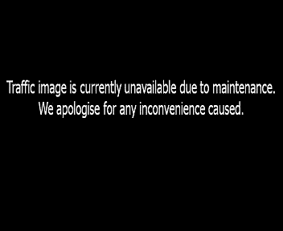

从数据库返回的维护消息

因为我们已经确定这两个数据点很可能不具有代表性，所以可以用几种不同的方法来解决这个缺失的数据。一种方法是尝试只在那几天再次请求映像，但是如果维护是他们捣乱的原因，这将不起作用。另一种方法是使用数据集中的其他星期日和星期一来生成值。这种方法将给出一个合适的近似值来代替缺失的数据，并且可以通过将这些天的平均值作为每个测量值的替代来实现。

准备好数据集后，下一步是可视化数据。如上所述，我们应该对数据的形状有一个概念，因为它将指导未来的步骤和统计测试。我们将使用箱线图来理解数据的形状，并使用 pyplot 的 subplot 函数来为两台摄像机生成信息丰富的紧凑视图。生成可视化后，将上下文应用到数据中以真正理解每个图表所表达的内容是很重要的。

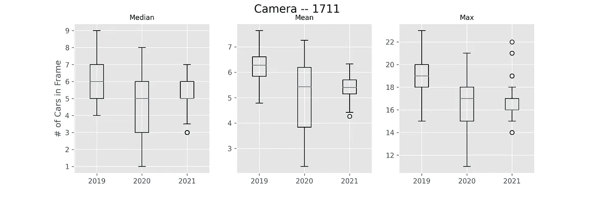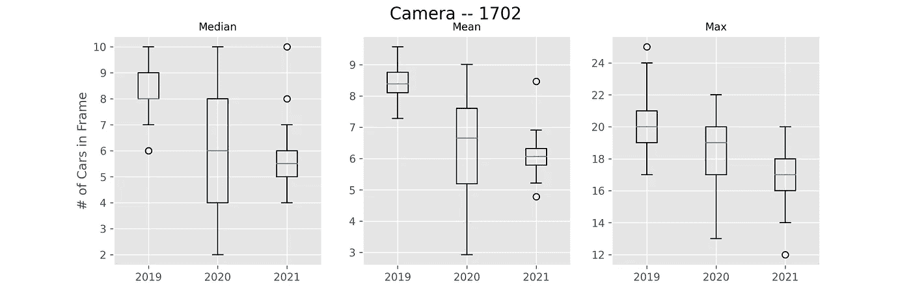

*   中位数——这是一个很好的指标，可以衡量在任何给定的时间你在路上会看到多少辆车。
*   均值-也是在任何给定时间你期望在路上看到的东西的度量，但它更容易受到异常值的影响。
*   max——当天一帧中的最大汽车数量，这是衡量交通高峰的一个很好的指标。

我们可以收集到一些东西(新冠肺炎)在 2020 年引起了巨大的变化，展开数据:每个指标都有总体下降的趋势。平均值的线形图可用于观察这一趋势。

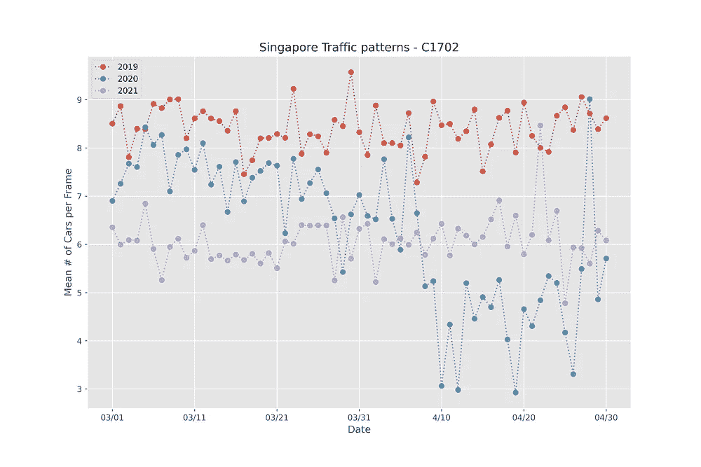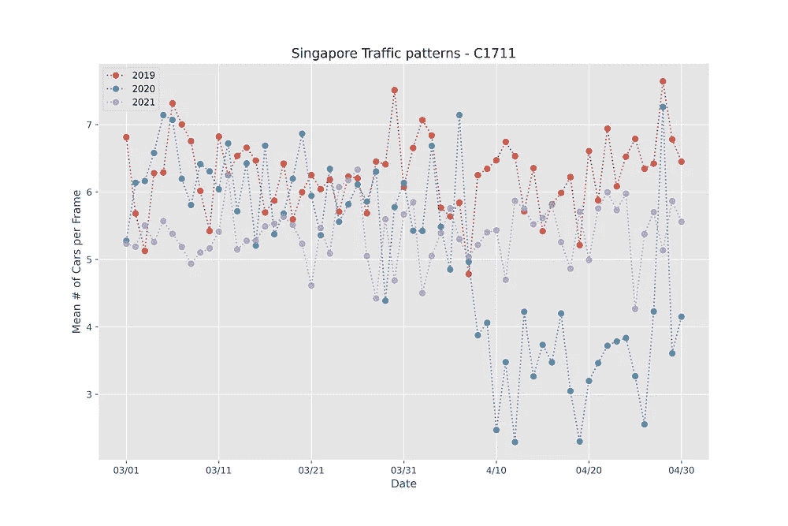

# 理解数据

很明显，这两个地点在 4 月 7 日左右显示出 2020 年的急剧下降，这与总理的“电路中断”相吻合，该中断大大限制了旅行，并呼吁所有个人限制在公共场所聚集。每个摄像头都显示，除了 4 月 27 日星期一之外，本月剩余时间的平均流量大幅减少了 50%。虽然当天没有重大新闻或事件，但数据与其他周一一致。这一减少证明了疫情及其相关政策极大地减少了交通流量。

交通流量似乎还没有恢复到 2021 年疫情之前的水平。这个假设可以用单侧韦尔奇 T 检验来检验。这个统计测试将有助于了解每年的流量水平是否实际上在变化，并且不在变化范围内。我们将测试数据集的平均值(道路上汽车的平均数量)和最大值(高峰业务),以了解全貌。Scipy 库的[。ttest_ind()](https://docs.scipy.org/doc/scipy/reference/generated/scipy.stats.ttest_ind.html) 函数提供了一种简洁的方法。

运行 T-test 函数会给出两个输出:T-stat 和 P-value。T-stat 表示两个样本组差异的方向和水平，P 值表示确定性水平。在这种背景下，负 T-stat 意味着 2021 组小于 2019 组。确定性是 P 值减 1，或我们确定存在差异的程度。确定性值> 95%被认为是显著的。将所有这些放在一起，对于每个测量，两组在每帧的平均汽车数量以及最大数量方面显示出统计上的显著差异。

在该项目中，两个交通摄像头与 OpenCV 结合使用，以了解新冠肺炎疫情对新加坡交通的影响，包括 2020 年 4 月交通流量减少 50%，以及统计测试，以提供新加坡交通仍未恢复到疫情之前水平的证据。虽然不可能把一切都归咎于疫情，但有强有力的证据表明，疫情周围的政策和公众反应已经改变了新加坡最繁忙道路之一的交通状况。

# 提及和最终注释

这个项目的灵感来自于一个探索更有限的日期和时间范围的高级编码项目。这些项目是有指导的，但不会给用户任何代码，这使得它成为一种很好的实践方式，同时仍然提供了一个体面的挑战。我还想说，如果你自己做这个项目，你的数据集将很可能与我的不同，只是由于调用的数量和最终用户与数据库之间的通信。也就是说，数据的总体趋势和分布应该是相似的，因为我试图摆脱依赖于计数的测量。另外，对于那些对使用新加坡数据库感兴趣的人，你可以在这里找到[条款和服务](https://data.gov.sg/privacy-and-website-terms#api-terms)的链接！最后，感谢您花时间阅读这篇文章，我希望它能激励其他人。