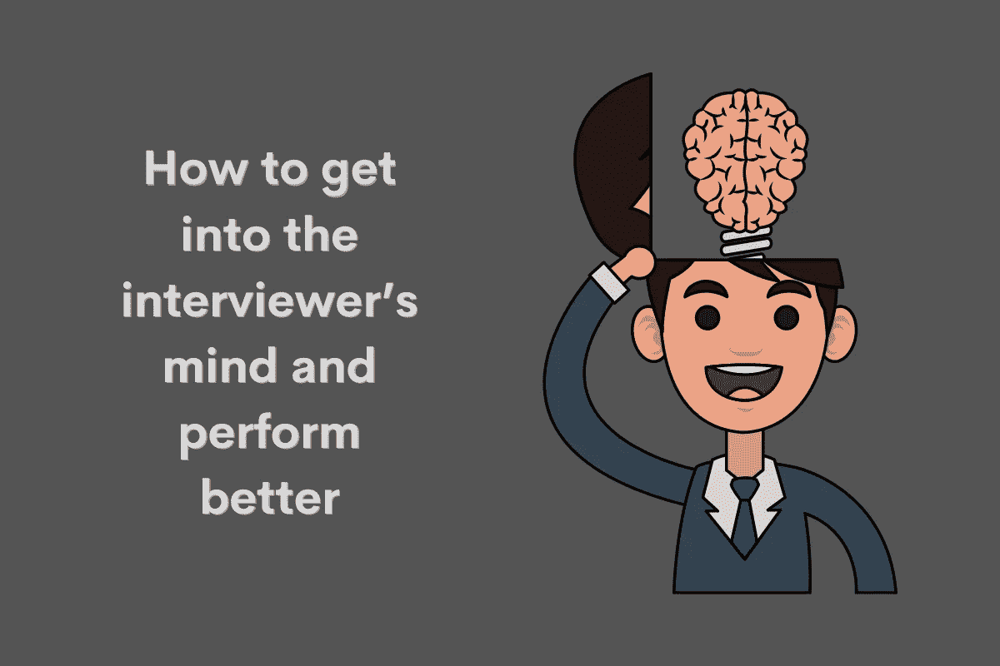
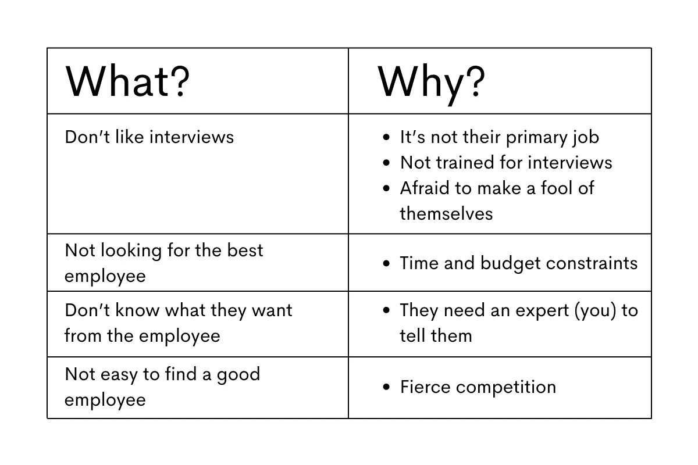

# 理解面试官的心态

> 原文：<https://towardsdatascience.com/understanding-the-interviewers-mindset-aacb39be64b2?source=collection_archive---------15----------------------->

## *如何进入面试官的思维并在数据科学工作面试中表现得更好*

作者在 [Canva](https://www.canva.com/) 上创建的图片

对于求职者来说，工作面试可能看起来像是单方面的相遇。他们问，我答。我说，他们听。他们很强大，我无能为力。他们有选择，我没有。

嗯，那通常是真的。采访者处于有利地位。他们隐藏在组织的背后，你自己去面对他们。除了你的知识，你的经验，你的个性，你一无所有。你只有你自己。他们有工作。你不知道。犯一点小错误，你的命运就掌握在他们的手中。

虽然在某种程度上这是对的，但也不完全对。尽管他们通常比你占优势，但这并不是说你完全无能为力。当他们试图理解你是如何做的时候，没有人说你不被允许去理解是什么让他们做的。

一旦你明白了这一点，你会发现你可以很容易地扭转局面。你就能把面试变成双方平等的对话。这样双方都可以得到他们想要的，而没有他们不得不翻身的感觉。那比妥协好多了。毕竟，妥协被定义为让双方都不开心的解决方案。

为了避免这种情况，我在这里来看看一些让面试官更人性化的事情。在理解了他们的不安全感之后，我会深入了解他们在面试中想要什么。最后，我会给你一些关于[如何准备这种数据科学面试](https://www.stratascratch.com/blog/5-tips-to-prepare-for-a-data-science-interview/?utm_source=blog&utm_medium=click&utm_campaign=medium)的建议。

# 是什么让面试官更有人情味？

这里有一个简短的汇总表，让你有个感觉。一会儿我会详细阐述这四点。

作者创造的形象

## 面试官也不喜欢面试。

在那里，你们至少有一个共同点。事实是，面试官和你一样讨厌面试。因为一些其他的原因，但尽管如此，感觉是一样的。

他们不喜欢面试，因为面试会让他们脱离工作。

然而，他们知道他们不应该让他们的时间表超过他们的专业水平。你应该能理解。你压力太大，没有工作，或者离开办公室去参加面试。如果你尊重面试官的时间，你可以让他们不那么讨厌这段经历。准时参加面试。做好准备，这样你对你的工作经历、公司等的回答。，更切题，也更省时。遵循面试结构，坚持面试官引导你进入的话题。这是你应该做的。但是如果面试官忽略了这三点，那么这三点也可能成为你的危险信号。

采访者通常也没有接受过进行采访的培训。他们中的大多数人在见到你之前，只会凭借他们的经验和纯粹的责任心去谷歌“如何进行面试”。就像你会利用你以前面试的经验和阅读大量关于如何在面试中表现出色的文章一样。甚至可能是一篇关于理解面试官心态的文章。

他们和你一样，害怕自己出丑。

## 他们不是在寻找最优秀的人。

我的意思是，他们试图找到理想的候选人。但是现实是理想最大的敌人。事实是，在给定的环境和限制条件下，他们试图找到最佳候选人。基本上，考虑到招聘的时间和预算，他们会寻找相当优秀的人。他们会将候选人的素质与获得他们所需的时间和金钱进行比较。如果他们有一个几乎拥有他们需要的一切的人，和一个稍微好一点但需要多几倍时间和金钱投入的人，公司可能会满足于第一个候选人。

当你认为你的经验、教育和知识不够时，你应该意识到这一点。你唯一应该做的就是突出你作为候选人的所有优点。你不需要完美，只要够好就行。完美是好的敌人。

## 他们不知道自己想要什么。

这些公司通常不知道他们在寻找什么，确切地说他们需要什么资格等等。

例如，公司可能认为他们需要擅长数据分析的人。但并不能保证他们知道自己需要哪些技能，数据分析会用到哪些工具等等。你知道当他们问你“你认为自己五年后会怎样”时，你有多纠结吗？对他们想要的候选人没有明确的想法表明他们也在这个问题上挣扎。

当你明白这一点时，你就更容易与面试官进行双向对话。他们没有必要试图在你的知识中寻找漏洞。不，他们通常想以专家的身份和你谈谈，看看你对你申请的工作理解如何。他们希望你帮助他们更清楚地了解他们需要什么，他们需要谁。例如，他们可能会询问您使用 PostgreSQL 的体验。也许他们会问这个问题，因为他们正在考虑过渡到这个数据库。在与他们的交谈中，您可以问一些关于数据量、他们想用这些数据做什么、数据库现在看起来如何的问题。从这一点出发，你可以谈论为什么 PostgreSQL 是一个好的选择。或者为什么其他数据库可能更适合他们的需求。也许是您更熟悉的 SQL Server。在这里，你是在帮助他们创造需求，而不是回应他们的需求。你在帮助他们找到最好的候选人:希望是你自己。

## 找到一个好员工并不容易。

不要以为你申请的所有工作都有比你优秀的候选人。不一定是这样。公司经常很难找到一名好员工，尤其是当他们经常与一些大型科技公司争夺候选人时。这意味着你并不像你想象的那样可以随意处置。当然，你不应该在面试时大喊，“你需要我，我知道你需要我！你，现在就雇用我！”。但重要的是要记住，很有可能公司需要你，就像你需要他们一样。

在某种程度上，所有这四点都显示了一些面试官和公司的不安全感了解某人的不安全感会让他们更有人情味。这让他们更像你。

现在你知道面试官(可能)的不安全感，他们不喜欢什么，不知道什么。我想我们该谈谈他们知道些什么的话题了。因为可以肯定的是，大多数面试官都在他们的候选人身上寻找一些特质。

# 面试官想要什么？

图片来自 [Canva](https://www.canva.com/)

## 无风险雇佣

理想情况下，他们寻找的是没有风险的人。当然，没有这样的候选人。但可以肯定的是，面试官的工作是雇佣风险尽可能低的人。

无风险雇佣意味着找到一个有值得尊敬的相关经验的人。面试官希望这种经历尽可能贴近公司的需求。如果他们找到了这样的候选人，很有可能这个候选人在新工作上的过渡会很顺利。这是合乎逻辑的；如果你正在处理你以前已经处理过的情况，机会是你学到了一些东西，你知道如何处理这些情况(更好)。再说一遍，如果有时间和金钱，无风险的候选人是他们能得到的最好人选。

他们也在寻找对工作环境有积极贡献的人。愉快共事的人。那些不把别人的成就归功于自己的人，那些在压力下不崩溃的人，那些在离开时不推卸责任的人变得强硬起来。

当然，他们在寻找一个对公司满意的人。一个会尽可能长时间贡献的人。如果他们发现你对和他们呆在一起不感兴趣，他们会犹豫是否在你身上投资时间和金钱。

## 即时贡献

说到贡献，这些公司真的希望找到一个能立即做出贡献的人。即插即用型员工。这通常发生在急需雇人的情况下。对于这种情况，找到一个可以立即做出贡献的人是一个理想的解决方案。

然而，有时不可能找到这样的候选人。或者公司有意雇用某人是因为他或她的潜力，而不是当前的知识或以前的经验。毕竟，即使是即插即用的员工也需要花一些时间来适应新的环境。也许学习使用一个新的核心系统，理解数据结构，业务的一些细节，或者公司本身。当然，如果你有经验，花的时间会少一些。但有时，公司希望建立在一个长期的时间尺度上，开发员工未来利益的潜力，并在某种程度上，从零开始按照员工的需求塑造他们。他们寻找的是学习的能力，而不是当前的知识。毕竟，大多数工作并没有那么复杂，因此，一些相当聪明的人，或者可能受过相关教育的人，无法学到所需的技能。当然，其中一些需要很多时间，但是公司有时愿意投资这些时间。

## 进步和良好的品牌

你如何选择你想去的公司？我相信你在考虑公司的形象和其他事情。同等条件下，在一家拥有某种声望和形象的公司工作总是更好。

求职者也是如此。面试官希望让他们的公司变得更好。在实践中以及在他人眼中也是如此。要做到这一点，他们会关注你曾经就读的学校和/或学院。通常，最受重视的大学是有原因的。在某种程度上，大学为他们做了最初的选择。虽然名牌大学不能保证一个好员工，但它至少(在某种程度上)保证了某人的知识和学习能力。

但是，总有但是！大学一般只有在你没有任何(或很少)经验的情况下才重要。在比较这样的候选人时，面试官必须根据你上的大学和你的成绩来评估你。在几乎所有其他情况下，经验胜过任何教育。雇主看的是你在实践中的能力。如果你以前在一些知名公司工作过，这看起来会稍微好一点。同样，和名牌大学一样，如果你不够优秀，你就不可能为这样的大公司工作。

不仅如此，它可能会给他们的公司带来一个有价值和有知识的员工。当公司可以吹嘘他们的数据科学团队如何如何时，这看起来也不错，比如说，FAANG 背景。

除了良好的品牌效应，雇主还希望在你的简历或数据科学求职信中看到一些进展。它可以是同一家公司内部的层级结构，也可以是更换公司。也有可能是你没有往上爬，但是隔几年就去了一家技术更先进、更有挑战性的公司。所有这些都表明你没有停滞不前。你表现出了变得更好和承担更多责任的意愿。这肯定是你的面试官会喜欢的。

## 匹配文化

已经有很多关于公司文化的文章。每个公司都认为自己是独一无二的，与其他公司相比，有着完全不同的公司文化。老实说，当谈到公司文化时，我们更多的时候是在谈论一些模糊的、通用的概念，这些概念是公司试图呈现给他们的独特概念。

他们不是。就像你对面试官说这样的话，你不会是独一无二的:

***“我是一个优秀的团队合作者，但也非常独立。”***

每个人都这么说。他们这样说是因为他们不知道面试官想听什么，所以他们试图涵盖一切。

如果你真的想引起面试官的共鸣并脱颖而出，你必须冒一点风险。不是某种盲目的冒险。如果你为面试做好了准备，并倾听面试官的暗示，你就能了解面试官在寻找什么样的合群。如我所说，没有那么多变化。所以，举例来说，如果你在面试过程中发现团队合作是至关重要的，那就专注于此。不要说你如何擅长团队合作，但也很独立。不，只关注团队合作。告诉他们你是一个优秀团队成员的故事。没有人会认为，由于你出色的团队合作，你完全依赖他人，而自己什么也做不成。

反过来也一样。如果公司刚刚起步，你必须自己解决很多问题，那么重点给出几个例子，让你看起来像一个高度独立的专业人士。这也并不意味着你是一个不想和任何人在一起并吓跑同事的隐士。

## 简单的语言

我知道这很诱人。你如此渴望向面试官展示你有多优秀，以至于尽可能地使用行话、流行语和性感的缩写。通常情况下，你无法完全避免。使用某些特定工作和/或行业的术语是很自然的。

然而，面试官通常不喜欢这样，因为这听起来像是在吹牛。甚至可能就像你在用时髦的词语来掩盖对这个话题缺乏实质性的了解。即使你不是因为这个原因才这么做的，也不要给面试官怀疑的理由。

能够用简单的语言解释你的工作和你所做的事情通常是一个人真正理解他们在谈论什么的标志。这不仅显示了他们透彻的理解，也显示了他们能够想出自己的解释，而不仅仅是使用其他人都使用的普通短语。

面试官喜欢听到简单的语言还有一个重要的原因。如今，对于数据科学家和所有其他从事数据工作的人来说，与背景、经历和知识大相径庭的各种股东交流变得越来越重要。跨部门协作是你无法避免的事情，而且越来越需要。这意味着你必须能够用一种不太专业的方式向那些甚至不熟悉你的基本工作的人解释一些事情。让他们加入的唯一方法是让他们理解你。如果你知道自己在做什么，如果你能解释清楚，他们就能做到——没有比求职面试更好的地方来展示这些特质了。毫不奇怪，面试官会问你类似的问题:“你会如何向一个 6 岁的孩子解释云技术？”。

# 如何准备这些面试

图片来自 [Canva](https://www.canva.com/)

## 研究你的雇主和面试官

你应该为面试做好准备。你不能总是为你会被问到的问题做好准备。但你必须做的是研究你的雇主。了解他们的产品、历史、行业、组织结构等等。

对你的面试官也这样做。如果你知道他或她的名字，试着对他们做一点研究。找到关于他们背景的信息:他们在哪里上学/大学，他们在哪里工作，他们的专业领域是什么。

这会显示出你对这家公司的兴趣，而且一旦你了解了这家公司的基本情况，谈论你未来的工作会更容易。熟悉面试官也有助于和他们建立联系，尤其是如果你们有共同点的话。

## 了解公司文化

这是你只有在他们的网站上阅读文化才能大致理解的事情。正如我所说的，这通常包括可能意味着任何事情和没有任何事情的一般性陈述。更重要(也更难)的是，试着从你参加面试时看到的和从面试官那里学到的东西中“感受”公司文化。你没有太多时间去做那件事，但是你可以得到一些线索。办公室看起来是空的还是挤满了人？人们是独立工作还是团队工作；有时，这是可能的，尤其是如果它是一个开放空间的办公室。办公室是不是显得很安静，还是充满了人们的喋喋不休？交流是显得冷淡专业，还是很轻松？

这些只是一些建议。但是最重要的一点是，当你参加面试的时候，要睁大你的眼睛，竖起你的耳朵，倾听你所听到的和看到的。尤其是面试官发出了什么样的信号。适应他们。

## 了解工作类型

这是你事先只能部分知道的事情。你可以试着从职位描述、做互联网调研等方面去了解工作类型。但你不可能什么都懂。这就是为什么为面试准备一些关于工作类型的问题是很重要的。例如，我是在团队中工作还是独自工作？这-和-这必须从头开始设置还是仅仅改进？你使用什么技术？你打算使用什么技术？

作为一名数据科学家，了解你在工作中必须做的工作类型的最佳方式是通过我们为你准备的一些[非编码](https://platform.stratascratch.com/technical?utm_source=blog&utm_medium=click&utm_campaign=medium)和[编码问题](https://platform.stratascratch.com/coding?utm_source=blog&utm_medium=click&utm_campaign=medium)。

当然，在面试过程中你会想到一些其他的问题。这些问题的意义不仅仅在于表明你有问题要问。这是为了更清楚地表明对你的期望。作为一个(非常令人向往的)副作用，你会表现出你理解这份工作和这个行业(可能)存在的问题。此外，有了这些问题，你就有了一个框架，来回答那些你无法准备、只能在与面试官交谈时提出的问题。

## 准备好个人故事

不，我不是说你第一次看《小王子》的时候是怎么哭的。尽管这也不应该被排除在外。尤其是如果面试官问你最喜欢的书是什么。

我想更多的是展示面试官想要的技能的个人故事。也许是一个关于你如何在项目中途被任命为项目负责人以及你如何处理此事的故事？或者，即使你是一名经济学家，你是如何从事数据科学的？或者你是如何成为某个初创公司的第一名员工的，当时的 job 和现在公司雇佣 30 人的 job 有什么区别？

看，这些故事都很有用。它们会告诉你很多关于你的事情。只有一个这样的故事可以概括你的个性，你如何处理逆境，你的[数据科学技术技能](https://www.stratascratch.com/blog/most-in-demand-data-science-technical-skills/?utm_source=blog&utm_medium=click&utm_campaign=medium)，软技能，你的沉着，机智，幽默，口才，甚至对生活的整体看法。通过讲述个人故事，你会以一种非直接的方式做到这一切，而不是吹嘘和无聊地提供你擅长的事情的清单。讲一个故事，让面试官总结他们是否喜欢听到的内容。

在面试之前，想出 4-5 个有趣的故事，突出你做得好的事情。

## 做你自己

我承认，对此毫无准备。你要么是你自己，要么不是。即使你不是你自己，那也是你自己。但是我们不要太哲学化了。我想说的是:要真实。是的，做好准备。试着读懂面试官的暗示。但是不要刻意去让他们喜欢你。不管你怎么想，人们通常会看穿这一点。很有可能，你会完全弄错。即使你在面试中骗过了他们，当你开始工作的时候，你会被发现，很快，你就会失业。

那没有意义。做你自己总是更好，诚实地回答，用你的方式说话，用你的方式思考。你应该努力展现自己最好的一面。不是别人的最佳版本。

# 摘要

理解面试官想法的第一步是接受面试官也是人。他们比你想象的更像你。他们不喜欢面试；他们可能缺乏安全感，不确定自己在寻找什么。当然，他们不是在寻找一个完美的员工。通过理解这一点，你将帮助自己打破带着恐惧或某种理想化接近面试官的习惯。一旦你意识到他们并不完美，就更容易与他们建立双向的融洽关系。

其次，你需要明白他们在找什么。他们正在寻找一个风险尽可能低的人。他们也希望有人能立即做出贡献。或者，如果没有，愿意学习的人。最重要的是，他们想要一个能与其他人和谐相处的人，一个能让工作场所尽可能愉快的人。最后，拥有令人尊敬的教育和/或工作背景对公司形象总是有好处的。

最后，明白这一点后，你需要有一定的策略来引起面试官的共鸣。这基本上可以归结为面试时的准备和警觉。你应该研究公司和面试官。确保研究公司的文化，并就地吸收。对某一类型的工作做研究，准备一些问题，并准备好在面试中根据你对这份工作的了解来提问。准备几个展示你的技术和软技能的故事。一旦你做好了所有的准备，放松，做你自己。如果做自己就是不放松，那也没关系。

*最初发表于*[*【https://www.stratascratch.com】*](https://www.stratascratch.com/blog/understanding-the-interviewer-s-mindset/?utm_source=blog&utm_medium=click&utm_campaign=medium)*。*