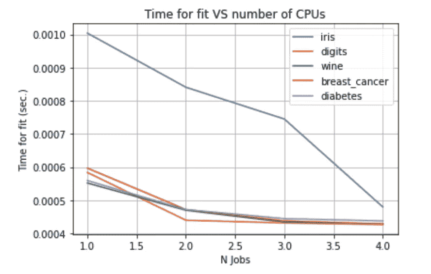

# 了解 n_jobs 参数以加速 scikit-learn 分类

> 原文：<https://towardsdatascience.com/understanding-the-n-jobs-parameter-to-speedup-scikit-learn-classification-26e3d1220c28?source=collection_archive---------9----------------------->

## 数据分析

## 一个现成的代码，演示了如何使用 n_jobs 参数来减少训练时间


作者图片

在本教程中，我说明了由`scikit-learn`库的一些类提供的`n_jobs`参数的重要性。根据官方的`scikit-learn`库，`n_jobs`参数描述如下:

> 为邻居搜索运行的并行作业的数量。除非在 joblib.parallel_backend 上下文中，否则 None 表示 1。-1 表示使用所有处理器。

这意味着`n_jobs`参数可以用来分配和利用本地计算机中所有可用的 CPU。

在本教程中，我通过将`n_jobs`参数从 1 变化到 CPU 的最大数量，来评估适应 scikit-learn 库提供的所有默认分类数据集所需的时间。作为例子，我将尝试一个带有交叉验证的网格搜索的 K-Neighbors 分类器。

# 定义辅助变量

首先，我定义了所有分类数据集名称的列表，包含在 [sklearn.datasets 包](https://scikit-learn.org/stable/datasets/toy_dataset.html)中。

```
datasets_list = ['iris', 'digits', 'wine', 'breast_cancer','diabetes']
```

然后，我计算系统中可用的 CPU 数量。我利用了`os`包提供的`cpu_count()`函数。

```
import os

n_cpu = os.cpu_count()
print("Number of CPUs in the system:", n_cpu)
```

就我而言。CPU 的数量是 4 ( **一台相当旧的电脑，唉…我应该决定造一台更新的…** )

我还定义了网格搜索的所有参数。

```
import numpy as np
parameters = {  'n_neighbors'   : np.arange(2, 25),
                'weights'       : ['uniform', 'distance'],
                'metric'        : ['euclidean', 'manhattan', 
                                   'chebyshev', 'minkowski'],
                'algorithm'     : ['ball_tree', 'kd_tree']
            }
```

# 定义主要功能

现在，我准备定义 main 函数，它将用于测试训练所用的时间。我导入所有需要的函数和类:

```
from sklearn.neighbors import KNeighborsClassifier
from sklearn.model_selection import GridSearchCV
from sklearn.datasets import *
import time
```

我定义了`load_and_train()`函数，它接收数据集名称作为输入。为了加载相应的 dataaset，我利用了`globals()`函数，它包含一个包含所有导入函数的表。因为我已经导入了 scikit-learn 提供的所有数据集，所以我可以将函数名传递给`globals()`函数。语法是:`globals()[<function_name>]()`。

```
def load_and_train(name):
    dataset = globals()['load_' + name]()
    X = dataset.data
    y = dataset.target
```

一旦加载了数据集，我就可以构建一个循环，通过改变 CPU 的数量来遍历 CPU 的数量并计算训练所用的时间。我构建了一个包含所有运行时间的列表，最终由函数返回。

```
 tdelta_list = []
    for i in range(1, n_cpu+1):
        s = time.time()
        model = KNeighborsClassifier(n_jobs=i)
        clf = GridSearchCV(model, parameters, cv = 10)
        model.fit(X_train, y_train)
        e = time.time()
        tdelta = e - s 
        tdelta_list.append({'time' : tdelta, 'bin' : i})
    return tdelta_list
```

# 绘图结果

最后，我为所有数据集名称调用`load_and_train()`函数，并绘制结果。

```
import matplotlib.pyplot as plt
import pandas as pdfor d in datasets_list:
    tdelta_list = load_and_train(d)
    df = pd.DataFrame(tdelta_list)
    plt.plot(df['bin'], df['time'], label=d)
plt.grid()
plt.legend()
plt.xlabel('N Jobs')
plt.ylabel('Time for fit (sec.)')
plt.title('Time for fit VS number of CPUs')
plt.show()
```



作者图片

对于所有数据集，通过增加作业数量来减少对 K 近邻分类器执行具有交叉验证的网格搜索所花费的时间。为此，我强烈建议您使用`n_jobs`参数。

具体来说，我建议设置`n_jobs=n_cpus-1`，以免机器卡死。

# 摘要

在本教程中，我演示了如何使用`n_jobs`参数来加速训练过程。

本教程的完整代码可以从[我的 Github 库](https://github.com/alod83/data-science/blob/master/DataAnalysis/SpeedUp%20Scikit.ipynb)下载。

现在 Medium 提供了一个新特性，即它允许**构建列表**。**如果您喜欢这篇文章，您可以将其添加到您的收藏列表**，只需点击按钮，放在文章右上角的按钮:


作者图片

如果你想了解我的研究和其他活动的最新情况，你可以在 [Twitter](https://twitter.com/alod83) 、 [Youtube](https://www.youtube.com/channel/UC4O8-FtQqGIsgDW_ytXIWOg?view_as=subscriber) 和 [Github](https://github.com/alod83) 上关注我。

# 相关文章

</three-tricks-to-speed-up-and-optimise-your-python-d9b5d49d68a6>  </how-to-spend-your-time-when-you-are-waiting-for-a-data-analysis-output-e71b383f43cb>  </how-to-speed-up-your-python-code-through-pyspark-e3296e39da6> 