# 透过数据的镜头理解疫情

> 原文：<https://towardsdatascience.com/understanding-the-pandemic-through-the-lens-of-data-44809b771e5b?source=collection_archive---------49----------------------->

## 多伦多当前新冠肺炎病例的探索性数据分析

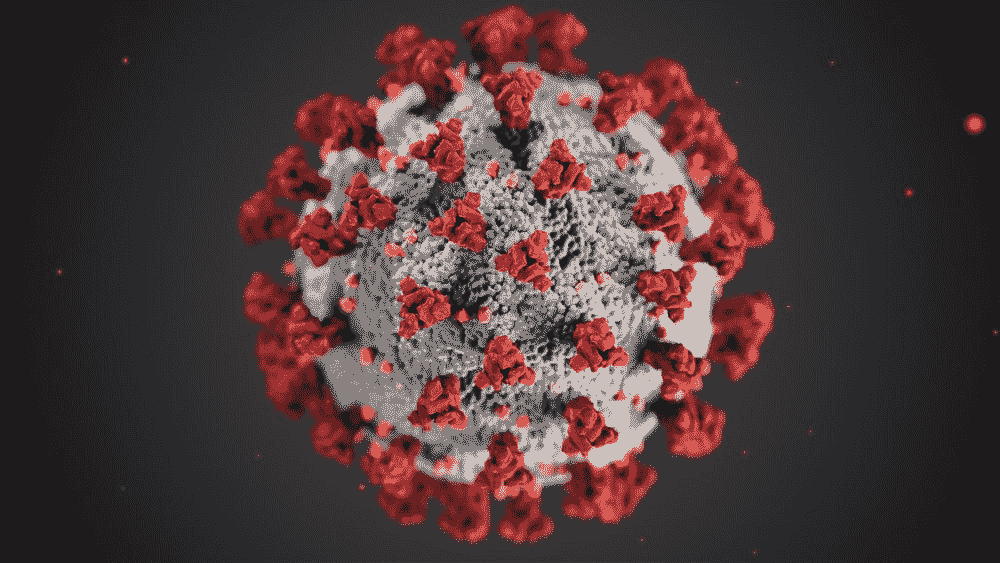

[疾控中心](https://unsplash.com/@cdc?utm_source=medium&utm_medium=referral)在 [Unsplash](https://unsplash.com?utm_source=medium&utm_medium=referral) 拍摄的照片

# 介绍

2019 年 12 月，中国武汉发现首例新型病毒。世卫组织和中国当局确认了人际传播。不久之后，它被宣布为全球疫情。这当然是新冠肺炎，一种由新型冠状病毒引起的高传染性疾病。自那以来，我们已经取得了长足的进步，目前已有超过 1 . 05 亿人受到感染(截至 2021 年 2 月)。全球病例仍在增加，一些国家采取了一些限制措施。

为了更好地了解正在进行的疫情，一些研究人员开始分析现有的数据，以提取有价值的见解。在这篇文章中，我将分析多伦多 Covid 病例的公开数据。目标是结合新闻报道来理解这些数据所提供的信息。

# 数据源

多伦多市的[开放数据门户](https://open.toronto.ca/)是一个伟大的倡议，它提供了大量的数据集来探索和了解多伦多市是如何工作的。特别是在这个项目中，我接手了[新冠肺炎病例](https://open.toronto.ca/dataset/covid-19-cases-in-toronto/)，它包含了向多伦多公共卫生部门报告的所有病例的人口统计和地理信息。该数据每周更新，当前分析包含截至 2021 年 2 月 1 日的数据。

# 探索性分析

数据集由 83474 个点和 18 个要素组成，其示例如下所示。截至 2021 年 2 月 1 日，我们有 80，775 例确诊病例和 2699 例疑似病例。

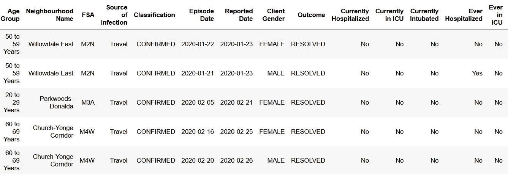

前五点来自于数据中的一些特征

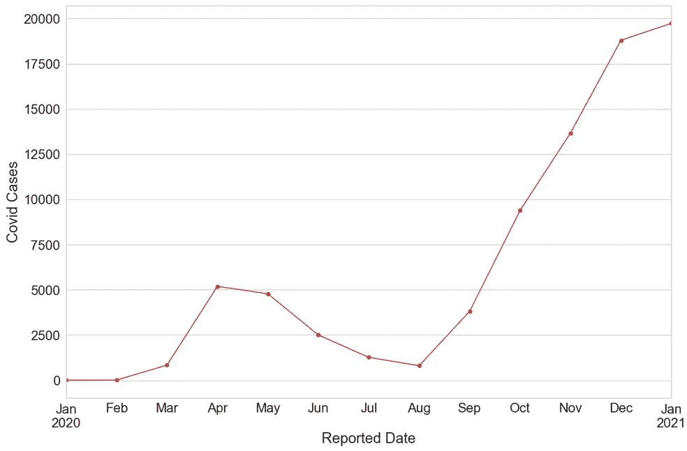

自 2020 年 1 月起每月报告的病例数

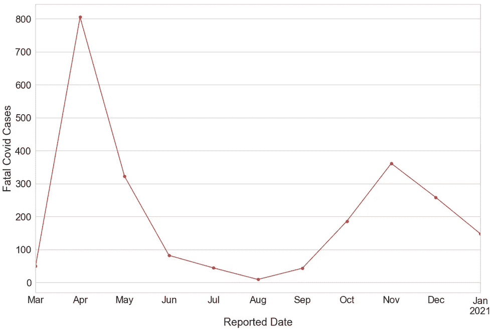

自 2020 年 1 月起每月报告的死亡病例数

上图显示了自疫情开始以来每月报告的病例总数和死亡病例数。我们可以清楚地看到两波，第二波仍在进行中。8 月份结束的第一波高潮出现在 4 月份。第二波似乎感染了更多的人群，但导致死亡病例减少。这表明，从第一波开始，我们已经学会更好地应对疫情。自疫情开始以来的每日案例如下所示。

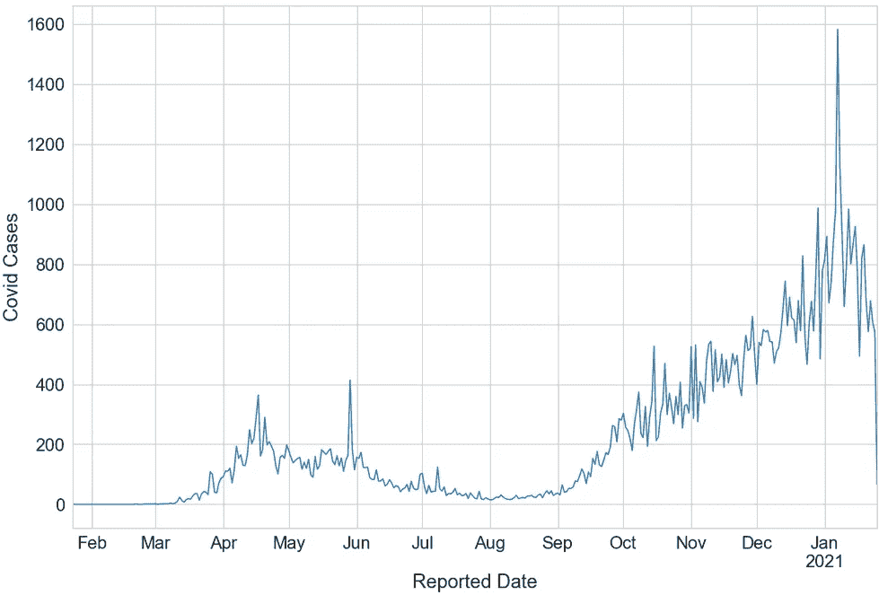

自疫情开始以来的每日病例

现在让我们了解一下各年龄组的病例分布情况。

*:考虑的年龄组有 0-19 岁、20-29 岁、30-39 岁、40-49 岁、50-59 岁、60-69 岁、70-79 岁、80-89 岁、≥90 岁。*

*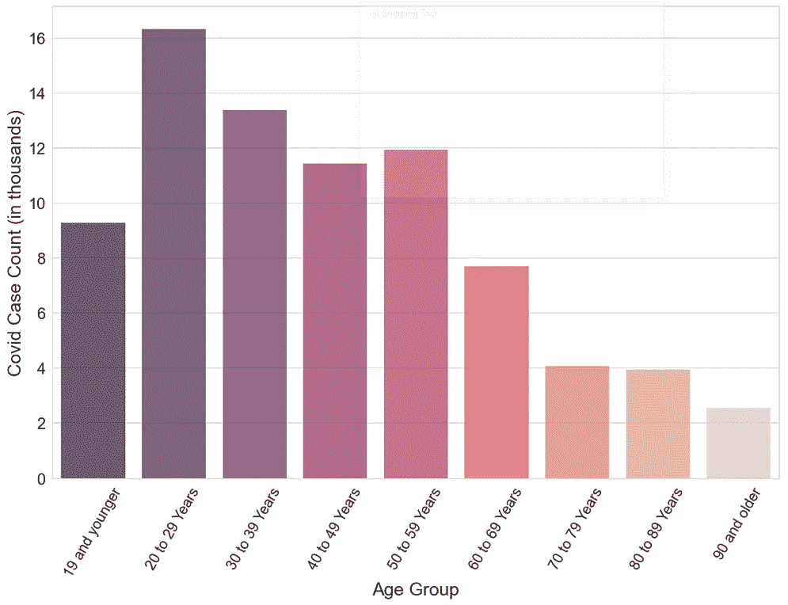*

*不同年龄组的新冠肺炎病例*

*以上显示了不同年龄组的 Covid 病例(以千计)。我们可以看到，年轻一代的病例数要高得多，这可能仅仅是因为多伦多的青年人口较多。因此，了解每个年龄组的人口统计是很重要的。这些人口统计数据来自 [StatCan](https://www12.statcan.gc.ca/census-recensement/2016/dp-pd/prof/details/page.cfm?Lang=E&Geo1=CSD&Code1=3520005&Geo2=CD&Code2=3520&Data=Count&SearchText=Toronto&SearchType=Begins&SearchPR=01&B1=All&TABID=1) 。这是 2016 年的人口普查数据，我假设到 2021 年增长 5%，略高于 2011 年到 2016 年的增长(4.3%)。*

*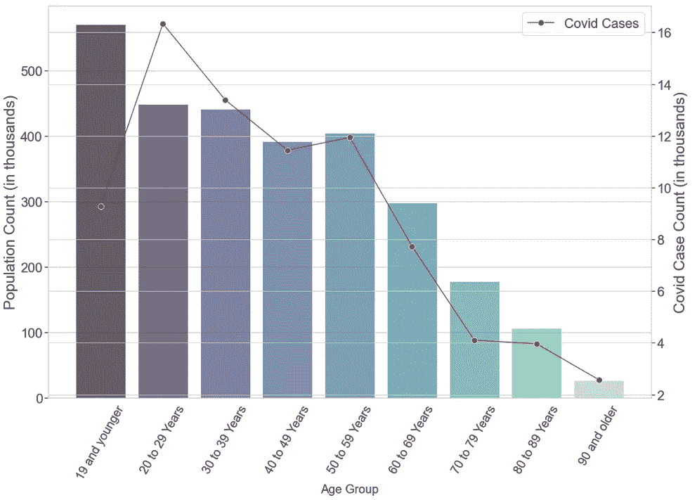*

*多伦多人口和 Covid 病例与年龄组*

*正如预期的那样，由于人口较多，较年轻年龄组的病例数明显较高。从绝对数字来看，20 至 29 岁年龄组的病例数量最多。这是有道理的，因为 20 至 29 岁年龄段的人往往相互接触最多，流动性也很高。就感染人数而言，这是受影响最严重的年龄组吗？为了找出答案，让我们画出不同年龄组的病例数与人口数的比率。*

*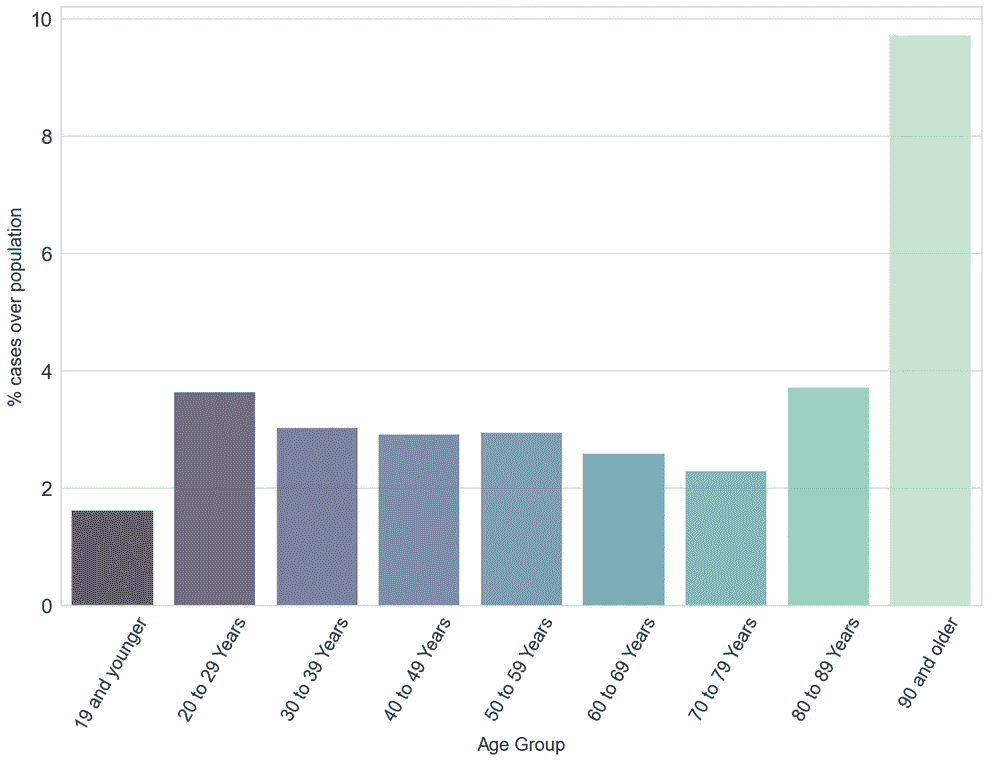*

*每个人口的病例数*

*令人惊讶的是，竟然是 90 岁以上的年龄段！病例与人口的比率(~10)明显高于其他年龄组(~3)。虽然 90 岁以上年龄组的人口是最小的，但他们中的许多人居住在观察到严重疫情的长期护理院。稍后将详细介绍。现在，让我们看看这些确诊病例的结果。*

****结果*** :活动(仍在进行中的病例)、已解决(患者已康复的病例)、致命(导致死亡的病例)*

*在多伦多的所有病例中，约 70000 例已得到解决，约 3%的病例(2265 例)是致命的。*

*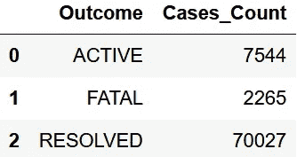*

*基于结果的病例计数*

*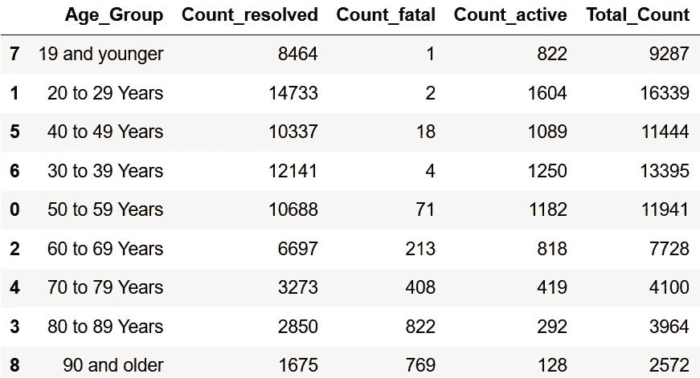*

*不同年龄组的病例结果*

*上表显示了不同年龄组的结果。我们可以看到死亡率随着年龄的增长而增加。*

*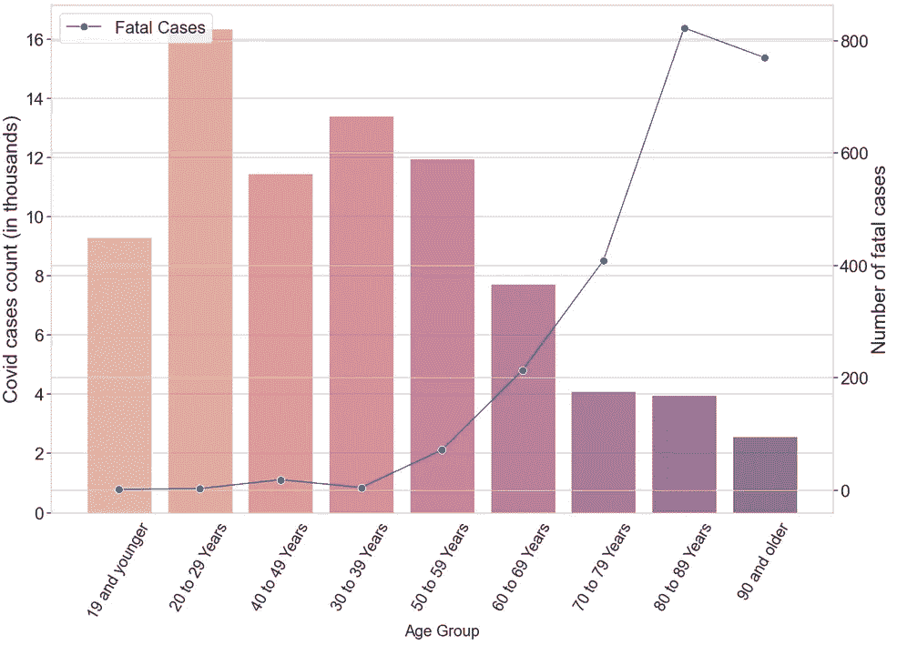*

*各年龄组的死亡率和病例数*

*这个情节很恐怖！我们可以看到，随着年龄的增长，感染人数明显减少，而致命病例却急剧增加。各年龄组的死亡率百分比如下所示。*

*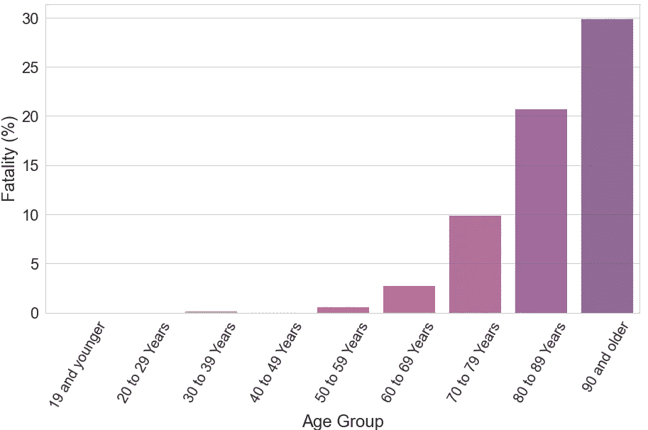*

*各年龄组的死亡率百分比*

*随着年龄的增长，死亡率急剧增加，90 岁及以上的约占 30%。我们的中和抗体越多，我们对 Covid 的免疫力就越好。不幸的是，这些抗体随着时间的推移而减少，因此老年人群更容易因 Covid 而死亡。更多关于这个的讨论可以在这里找到[。](https://www.ncbi.nlm.nih.gov/pmc/articles/PMC7288963/)*

***传染源:***

***旅行**(安大略省外旅行)**密切接触**(与确诊或疑似病例有密切接触)**机构**(长期护理院、特殊护理医院、急症护理医院等。)、**医疗保健**(家庭医生、牙医等。)、**社区**(杂货店、健身房等。)、**不明**(感染源不明)、**暴发**(与长期护理、无家可归者收容所等暴发有关的病例。)*

*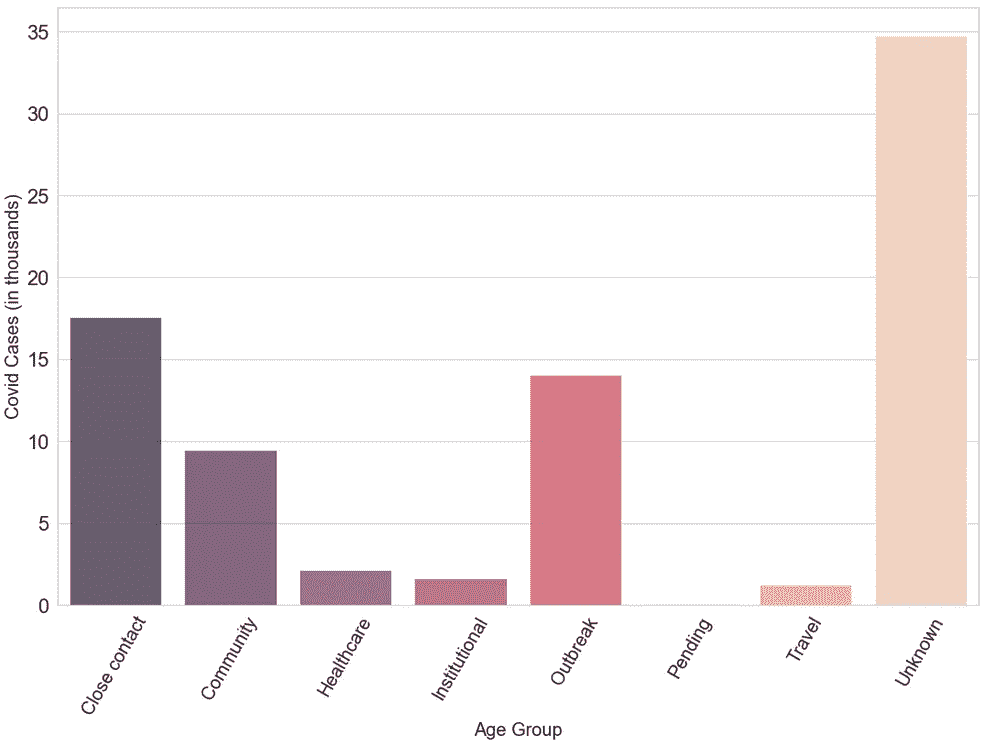*

*病例与传染源*

*大多数病例的传染源不明，这有点令人担忧，甚至令人害怕。由此可见接触者追踪有多难。我建议人们开始使用 [Covid Alert app](https://www.canada.ca/en/public-health/services/diseases/coronavirus-disease-covid-19/covid-alert.html) 来帮助追踪联系人的来源。*

*密切接触、暴发和社区是下一个最常见的传染源。*

*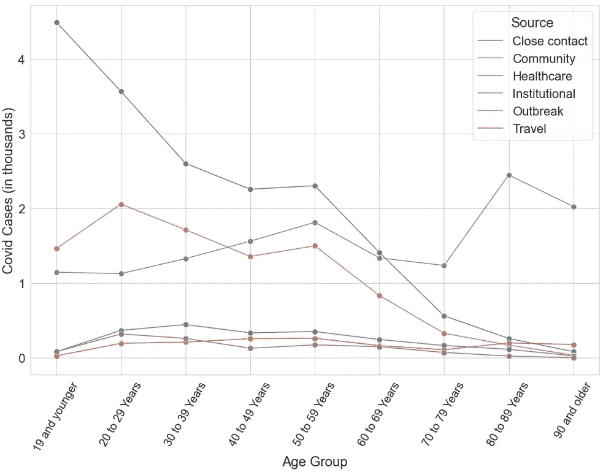*

*年龄组较年轻一侧的大多数病例对应于密切接触和社区传播。而与疾病爆发相关的感染是 80 岁及以上人群的主要感染源。这与自疫情开始以来我们一直在新闻中听到的长期护理单位爆发疫情相一致，这令人深感沮丧。*

*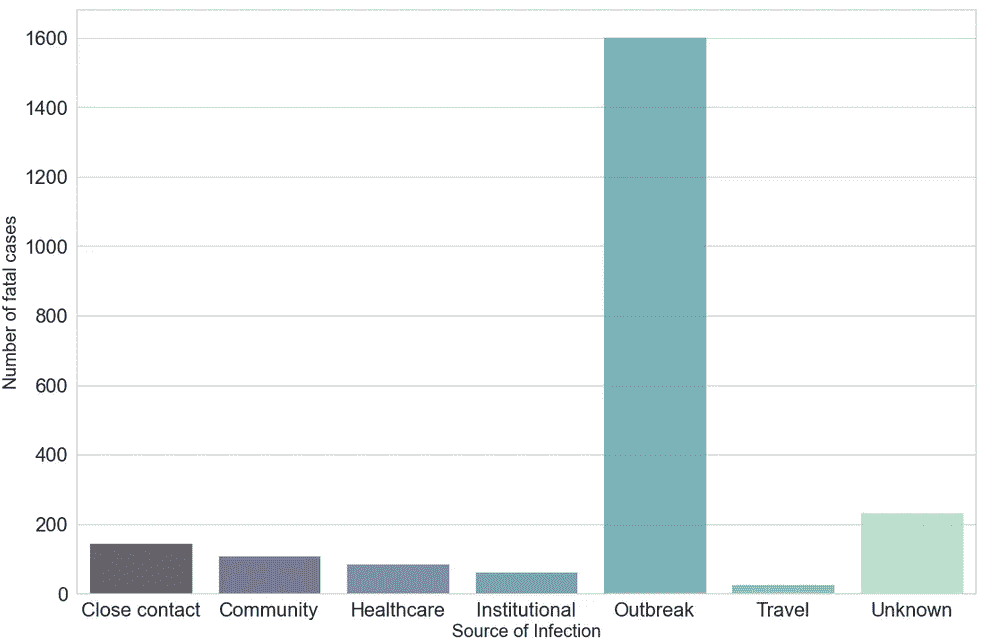*

*与死亡病例相对应的传染源*

*特别是在长期护理单位中的爆发可被视为死亡病例的主要原因。如果安大略省更好地处理长期护理单位，死亡人数本来可以大大减少！对加拿大养老院危机的详细分析可以在这里找到。*

*最后，让我们看看案件在多伦多各地区的分布情况。这个城市被分为 96 个前分拣区(FSA)。每个 FSA 对应一个以字母 m 开头的唯一的 3 位邮政编码。*

*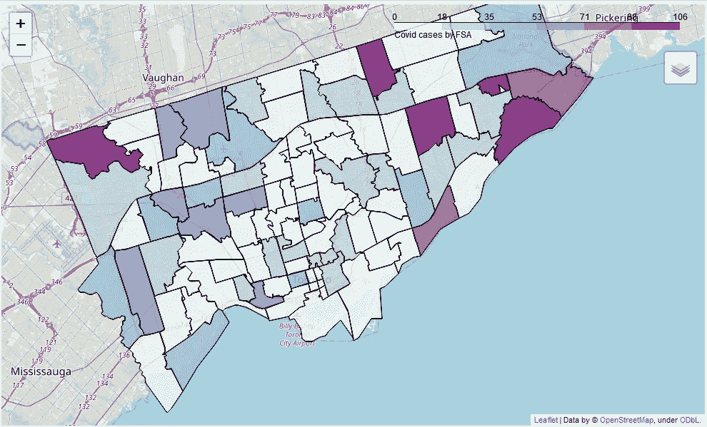*

*多伦多地图，显示每个 FSA 的死亡病例数*

*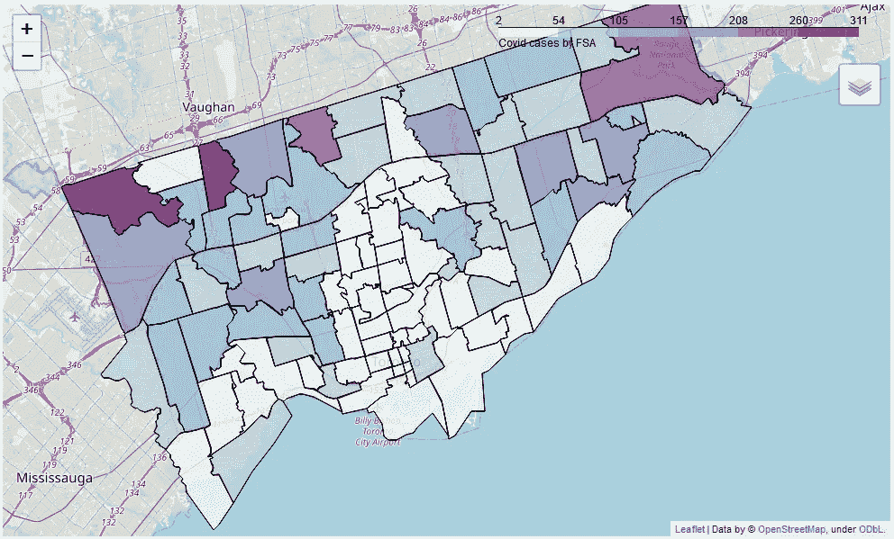*

*多伦多地图，显示每个 FSA 中的活动案例数*

*在多伦多推广疫苗时，最好针对上面显示的活跃病例数量最多的地方。这对应的是怡陶碧谷(M9V)，北约克(M3N，M2R)，斯卡伯勒(M1B)，约克(M6M)。理想的情况是开始给长期护理院的人接种疫苗，同时在上述地点进行大规模接种。*

# *结论*

*   *与第一波相比，8 月开始的第二波感染人数明显更多，但导致的死亡病例相对较少。这表明，做好应对疫情的准备有助于拯救许多生命，这是一个特别重要的教训，值得在未来发扬光大。*
*   *由于流动性大和相互接触，20 至 29 岁年龄组的感染人数最多。另一方面，大多数死亡病例发生在 80 岁及以上。这是由于中和抗体随着时间的推移而减少。*
*   *在超过 40%的病例中，感染传播的来源不明，这表明追踪接触者的困难。在已知病例中，密切接触是头号传染源。这也是安大略省总理实施严格的居家隔离令的原因。*
*   *在多伦多的所有新冠肺炎病例中，最致命的病例是由于爆发引起的，特别是在长期护理院和养老院。正如在此所讨论的，这些护理院的条件必须得到显著改善，这些护理院过度拥挤的问题必须得到解决，并且应该雇用更多合格的工作人员。*
*   *多伦多没有疫苗接种的时间表，但根据现有的数据，理想的策略是尽快为长期护理院和养老院的人接种疫苗，并在受影响最严重的地区开始大规模接种疫苗。*
*   *50 岁及以下年龄组的死亡率几乎为零，20 至 29 岁年龄组的感染人数最多。在给 50 岁以上的人和所有年龄组的脆弱人群接种疫苗后，给 20 至 29 岁年龄组的人接种疫苗似乎可以遏制病毒的传播。*

*通过数据我们可以看出，感染传播的主要原因是密切接触。隔离和留在家中是遏制病毒传播的有效策略。我明白并不是很多人有我这样的特权，与世隔绝，呆在家里。但是我强烈要求你尽可能地遵守这些命令。虽然不是强制性的，但我也强烈建议您接种疫苗，建立群体免疫，共同抗击疫情病毒！*

*所有的分析都是用 Python 完成的，相关代码可以在我的 [GitHub repo](https://github.com/srpraveen97/Toronto_Covid_visualization) 中找到。请在这里分享你的想法，或者在 [LinkedIn](https://www.linkedin.com/in/srpraveen97) 上与我联系。*

*感谢阅读！*

**编者注:*[*towardsdatascience.com*](https://slack-redir.net/link?url=http%3A%2F%2Ftowardsdatascience.com)*是一家以数据科学和机器学习研究为主的中型刊物。我们不是健康专家或流行病学家。想了解更多关于疫情冠状病毒的信息，可以点击* [*这里*](https://www.who.int/emergencies/diseases/novel-coronavirus-2019/events-as-they-happen) *。**

# *参考*

1.  *[https://open.toronto.ca/dataset/covid-19-cases-in-toronto/](https://open.toronto.ca/dataset/covid-19-cases-in-toronto/)*
2.  *[https://www12 . stat can . GC . ca](https://www12.statcan.gc.ca/census-recensement/2016/dp-pd/prof/details/page.cfm?Lang=E&Geo1=CSD&Code1=3520005&Geo2=CD&Code2=3520&Data=Count&SearchText=Toronto&SearchType=Begins&SearchPR=01&B1=All&TABID=1)*
3.  *[https://www . the lancet . com/journals/lancet/article/piis 0140-6736(21)00083-0/full text](https://www.thelancet.com/journals/lancet/article/PIIS0140-6736(21)00083-0/fulltext)*
4.  *[https://www.ncbi.nlm.nih.gov/pmc/articles/PMC7288963/](https://www.ncbi.nlm.nih.gov/pmc/articles/PMC7288963/)*