# 了解为真实世界场景构建机器学习模型的过程

> 原文：<https://towardsdatascience.com/understanding-the-process-of-building-a-machine-learning-model-for-a-real-world-scenario-30a50fc12f7f?source=collection_archive---------31----------------------->

## 构建线性回归模型以根据天气历史数据预测表观温度的实用分步指南


由[卡洛斯·穆扎](https://unsplash.com/@kmuza?utm_source=medium&utm_medium=referral)在 [Unsplash](https://unsplash.com?utm_source=medium&utm_medium=referral) 上拍摄的照片

本文的重点是找出特定要素之间的关系，并在经历了所有必要的步骤后使用天气历史数据集进行预测，

*   数据清理
*   数据转换
*   特征编码
*   特征缩放
*   特征离散化
*   降维
*   线性回归模型
*   模型评估

这里的目标是发现，湿度和温度之间是否存在**关系，湿度和表观温度**之间是否存在**关系？并且还发现**在给定的湿度下是否可以预测表观温度。****

这里使用的数据集是 Kaggle 的天气历史数据集。点击[这里](https://www.kaggle.com/budincsevity/szeged-weather)可以找到。

首先，导入所需的 python 库。

```
import pandas as pd
import numpy as np
import matplotlib.pyplot as plt
import scipy.stats as stats
import seaborn as sns
from sklearn import preprocessing
from sklearn.decomposition import PCA
from sklearn.preprocessing import StandardScaler
from sklearn.preprocessing import KBinsDiscretizer
from sklearn import linear_model
from sklearn.model_selection import train_test_split
from sklearn.metrics import mean_squared_error
from math import sqrt
from sklearn.model_selection import cross_val_score,     cross_val_predict
from sklearn import metrics
```

然后将数据集导入 Colab 并读取。

```
from google.colab import drive
drive.mount("/content/gdrive")data_set = pd.read_csv('/content/gdrive/My Drive /data            /weatherHistory.csv')
data_set.tail(10)
```

数据集中的最后 10 行可以用下面的`*data_set.tail(10)*`进行检查。

输出:

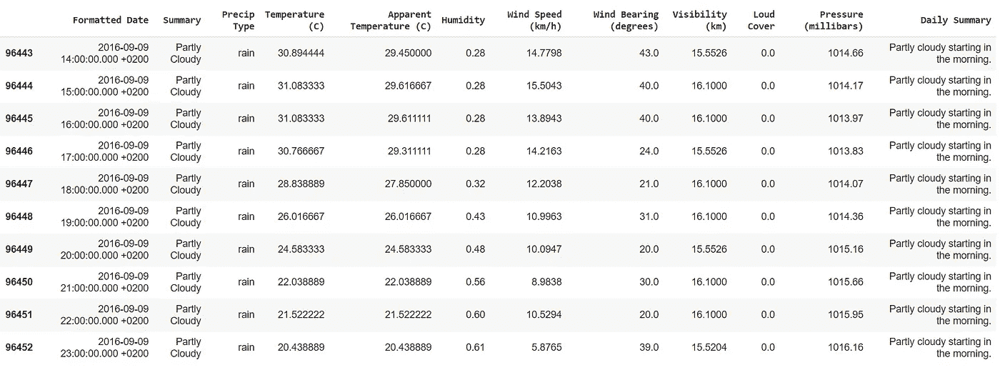

资料组

那么原始数据集的副本被创建为 x。

```
X = data_set.copy()
```

# 1.数据清理—处理缺失值、异常值和异常值

应该检查数据集是否有缺失值，下面的代码将返回 *True* 如果有任何缺失值，否则返回 *False* 。

```
X.isnull().values.any()
```

上面的代码输出 *True* ，表示数据集中有缺失的值。因此需要识别出缺少值的列。

```
X.isnull().any()
```

输出:

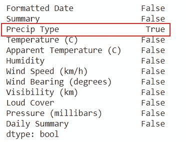

这意味着，只有 Precip 类型列有缺失值，所有其他列没有任何缺失值。

缺失值的百分比可按如下方式检查。

```
print(X.isnull().sum() * 100 / len(X))
```

输出:

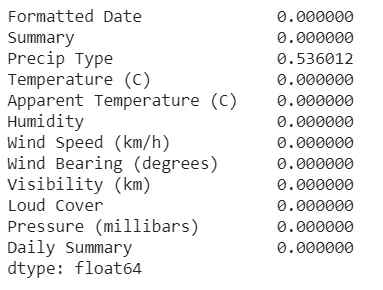

我们可以看到百分比非常低，所以我们可以用下面的代码删除数据集中所有缺失的值。

```
X = X.dropna()
```

既然缺失值问题已经解决，接下来，我们应该检查异常值或异常值。

```
X.boxplot(figsize=(18,8))
```

输出:

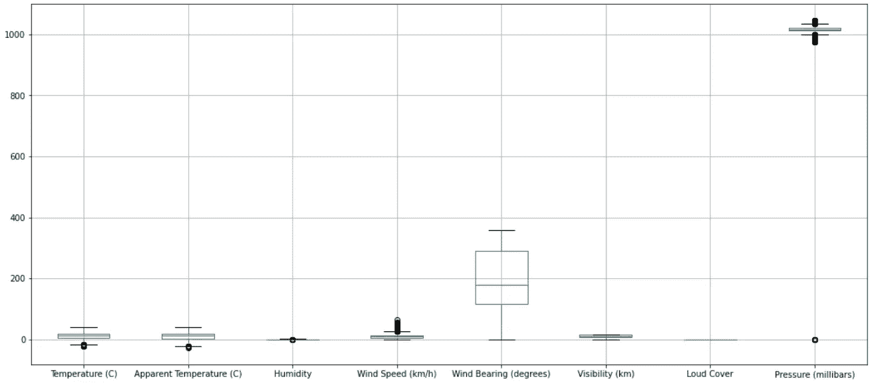

所有特征的箱线图

我们可以看到压力特征的数据分布是异常的，因为压力已经为 0。我们可以检查有多少数据显示异常。

```
X[X['Pressure (millibars)'] == 0].shape[0]
```

产量:1288

所以这些都不是离群值。这些值可能是一些人为错误或系统故障的结果。因此，我们不能简单地接受它们，也不能放弃它们，因为那样我们会错过其他功能数据。所以我们可以利用 IQR。

> IQR 或四分位数范围是基于将数据集划分为不同分位数的变异性度量。

我们可以用分位数来计算下限和上限。然后我们用下限代替小于下限的值，用上限代替大于上限的值。这也适用于左偏或右偏的数据。

```
fig, axes = plt.subplots(1,2)
plt.tight_layout(0.2)
print("Previous Shape With Outlier: ",X.shape)
sns.boxplot(X['Pressure (millibars)'],orient='v',ax=axes[0])
axes[0].title.set_text("Before")Q1 = X["Pressure (millibars)"].quantile(0.25)
Q3 = X["Pressure (millibars)"].quantile(0.75)print(Q1,Q3)
IQR = Q3-Q1
print(IQR)lower_limit = Q1 - 1.5*IQR
upper_limit = Q3 + 1.5*IQR
print(lower_limit,upper_limit)X2 = XX2['Pressure (millibars)'] = np.where(X2['Pressure  (millibars)']>upper_limit,upper_limit,X2['Pressure (millibars)'])X2['Pressure (millibars)'] = np.where(X2['Pressure (millibars)'] <lower_limit,lower_limit,X2['Pressure (millibars)'])print("Shape After Removing Outliers:", X2.shape)
sns.boxplot(X2['Pressure (millibars)'],orient='v',ax=axes[1])
axes[1].title.set_text("After")
plt.show()
```

输出:

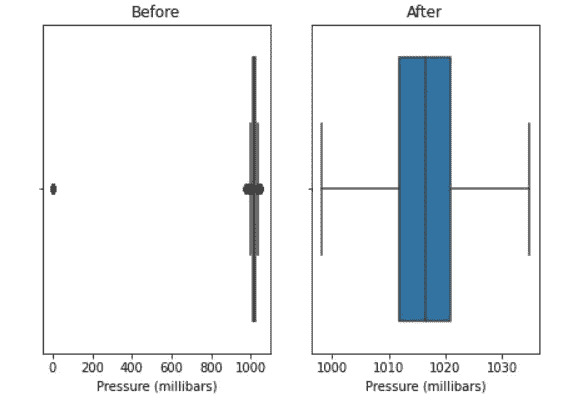

施加 IQR 压力前后的箱线图

然后，我们需要通过绘制箱线图来检查湿度中的异常值或异常值。

```
humidity_df = pd.DataFrame(X2["Humidity"])
humidity_df.boxplot()
```

输出:

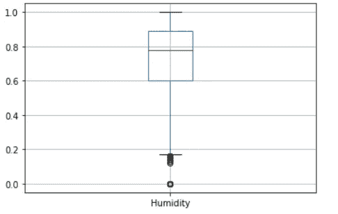

湿度箱线图

我们可以看到湿度为 0.0。所以我们要检查有多少数据值是 0.0。

```
X2[X2['Humidity'] == 0].shape[0]
```

产量:22

鉴于地球的气候和天气条件，湿度不可能为零。出现这种异常的数据点数量也非常少，因此我们可以简单地删除它们。

```
X2 = X2.drop(X2[X2['Humidity'] == 0].index)
```

现在，我们完成了数据清理。

通常，在数据清理之后，您可以继续进行数据转换。但在这里，我在分割数据之前进行了特征编码，因为这将消除为训练和测试数据单独进行特征编码的需要。稍后将解释在应用任何变换之前拆分数据集的原因。

# 2.特征编码-处理分类特征

分类特征是可以分组到类别中的数据。举个例子，我们可以拿性别、肤色等。我们需要将那些非数值转换成数值，以便训练机器学习模型。有两种处理分类数据的传统技术。

1.  一键编码
2.  标签(整数)编码

我将用天气历史数据集中的例子来解释这两点。我们的数据集中有两个分类列，Precip Type 和 Summary。让我们以“Precip 类型”为例。

```
X2['Precip Type'].value_counts()
```

输出:

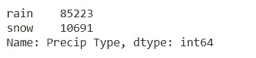

我们可以看到‘Precip Type’中的数据值不是雨就是雪。所以 Precip 类型’是一个分类特征。

## 一键编码

在这种方法中，分类特征被值为 0 或 1 的新特征所取代。Precip 类型被新的特征雨和雪所取代，如下图所示。

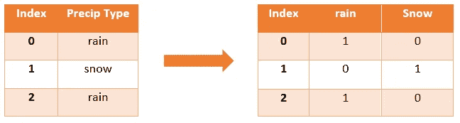

## 标签编码

在这种技术中，每个分类值都被转换成一个数值。如下图所示。

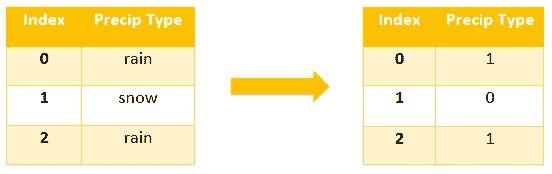

对于线性模型，一键编码更合适。如果我们对这种情况应用标签编码，那么模型将试图识别顺序，因为特征值类似于 0、1、2、3 等。但是如果是二进制类别，我们可以使用标签编码。

这里，因为 Precip 类型只有 2 个值，所以我可以使用标签编码。

```
X2['Precip Type']=X2['Precip Type'].astype('category')
X2['Precip Type']=X2['Precip Type'].cat.codes
```

但是如下图所示，summary 有许多类别。

```
final['Summary'].value_counts()
```

输出:

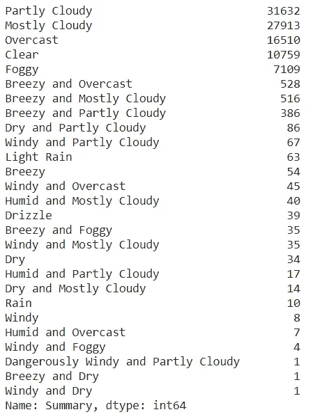

所以我们需要对汇总列进行一次性编码。`*pd.get_dummies*`将根据每个类别创建新的特性列，然后我们需要合并新的特性列并删除摘要列，如下面的代码所示。

```
dummies_summary = pd.get_dummies(X2['Summary'])
merged_summary = pd.concat([X2,dummies_summary],axis='columns')
X2 = merged_summary.drop(['Summary'], axis='columns')
X2
```

输出:

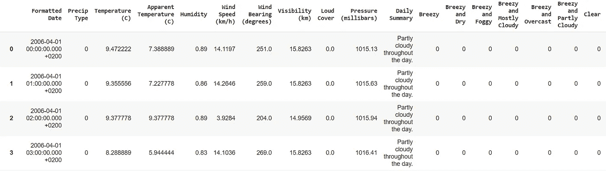

应用要素编码后的数据集

# 3.分割数据集

> 数据泄漏是指机器学习模型的创建者犯下的错误，其中他们意外地在测试和训练数据集之间共享信息。

当我们对训练和测试数据集一起(对整个数据集)应用变换、离散化和缩放等时，可能会导致数据泄漏。为了缓解这个问题，我在转换之前分割数据集，以避免模型过度拟合。

表观温度是目标特征。因此，我们需要将其从要素数据集中分离并移除。这里，数据集分为 80%用于训练，20%用于测试。

```
target_column = pd.DataFrame(final_summary['Apparent Temperature (C)'])final_summary = final_summary.drop(['Apparent Temperature (C)'], axis='columns')X_train, X_test, y_train, y_test = train_test_split(final_summary, target_column, test_size=0.2)
```

拆分数据集后，需要重置索引。

```
X_train=X_train.reset_index(drop=True)
X_test=X_test.reset_index(drop=True)
y_train=y_train.reset_index(drop=True)
y_test=y_test.reset_index(drop=True)
```

现在，我们可以分别对训练和测试数据集应用转换。

# 4.数据转换

真实数据集中的变量将遵循更偏态的分布。但是如果数据来自正态分布，那么机器学习模型可以学习得很好。因此，我们应该使用直方图和 Q-Q 图来检查这些变量是如何分布的。这里我只解释训练数据集的转换。同样的过程也应该应用于测试数据集。

```
X3 = X_train.copy() #copy of the training dataset 
Y3 = X_test.copy() #copy of the testing dataset stats.probplot(X3["Temperature (C)"], dist="norm", plot=plt)plt.show()
```

输出:

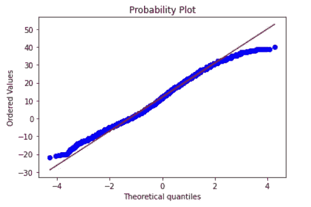

温度的 Q-Q 图

同样，对于所有特性，我们可以使用 Q-Q 图分析数据分布，以查看数据是否偏离了预期分布(红线)。这里我们可以看到温度呈正态分布。

但是当我们看到风速的 Q-Q 图时，我们可以看到数据是倾斜的。

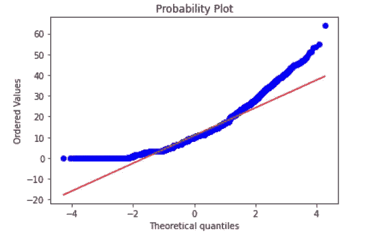

风速的 Q-Q 图

然后我们也可以绘制直方图。

```
X3.hist(figsize=(15,10))
```

输出:

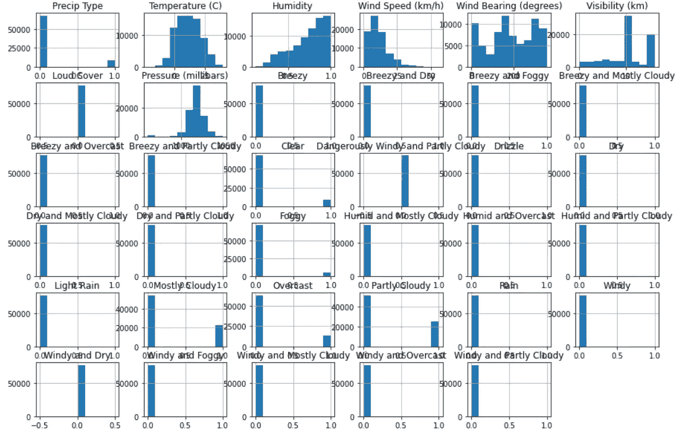

训练数据的直方图

我们可以看到湿度是左偏的，风速是右偏的。可见性也显示了一些左偏，但是在应用变换之后，它没有显示正态分布。所以我没有应用可见性的转换。

对于右偏的数据，我们应用对数变换，对于左偏的数据，我们可以应用指数变换。

```
logarithm_transformer = FunctionTransformer(np.log1p)
data_new1 = logarithm_transformer.transform(X3['Wind Speed (km/h)'])
X3['Wind Speed (km/h)']=data_new1
X3['Wind Speed (km/h)'].hist()
```

这里我使用了`*np.log1p*`，因为风速值为 0.0，而 *np.log* 仅用于正数。

输出:

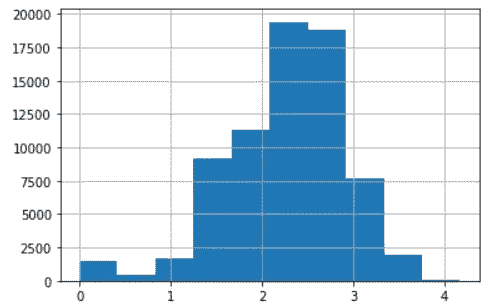

应用对数变换后的风速直方图

现在我们可以看到风速呈正态分布。

由于湿度是左偏的，我们应用指数变换。

```
exp_transformer = FunctionTransformer(np.exp)
data_new2 = exp_transformer.transform(X3['Humidity'])
X3['Humidity']=data_new2
X3['Humidity'].hist()
```

输出:

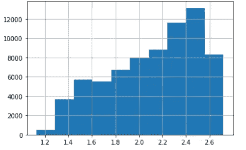

应用指数变换后的湿度直方图

在这里，我展示了直方图在转换后是如何变化的。

风速:

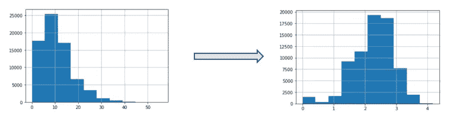

湿度:

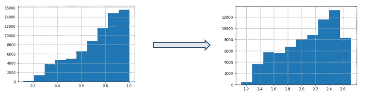

我们可以从 Q-Q 图和直方图中看到，大声覆盖始终为 0.0。因此，由于它没有影响，我们需要在训练和测试数据中消除噪声。

```
X3 = X3.drop(['Loud Cover'], axis='columns')
Y3 = Y3.drop(['Loud Cover'], axis='columns')
```

由于格式化日期是一个唯一的值，而每日摘要不是一个数值，它有如此多的不同值，我们可以将它们都删除。

```
X3 = X3.drop(columns=['Daily Summary','Formatted Date'])
Y3 = Y3.drop(columns=['Daily Summary','Formatted Date'])
```

# 5.特征缩放—标准化

> 特征缩放指的是用于归一化独立变量的值的范围的方法。

这里我使用了标准化来进行缩放。标准化将数据转换为平均值 0 和单位标准差。这一步至关重要，因为它避免了模型受到大幅度变量显著影响的机会。

标准化不适用于分类变量。因此，在对数字特征进行标准化之前，应该将它们放在一边。标准化也应该分别应用于训练和测试数据。

这里，请注意，我仅将`*scaler.fit()*`用于训练数据，因为我们需要将用于训练数据集的相同参数(平均值和标准偏差)应用于训练数据集。

```
X4 = X3.copy()
Y4 = Y3.copy()to_std_train = X4[['Temperature (C)', 'Humidity','Wind Speed (km/h)', 'Wind Bearing (degrees)', 'Visibility (km)','Pressure (millibars)']].copy()
to_std_test = Y4[['Temperature (C)', 'Humidity','Wind Speed (km/h)', 'Wind Bearing (degrees)', 'Visibility (km)','Pressure (millibars)']].copy()scaler = StandardScaler()
scaler.fit(to_std_train)train_scaled = scaler.transform(to_std_train)
test_scaled = scaler.transform(to_std_test)std_df_train = pd.DataFrame(train_scaled, columns = to_std_train.columns)
std_df_test = pd.DataFrame(test_scaled, columns = to_std_test.columns)X4[['Temperature (C)', 'Humidity','Wind Speed (km/h)','Wind Bearing (degrees)','Visibility (km)','Pressure (millibars)']]=std_df_train
Y4[['Temperature (C)', 'Humidity','Wind Speed (km/h)','Wind Bearing (degrees)','Visibility (km)','Pressure (millibars)']]=std_df_test
```

标准化数据后，我们可以使用相关矩阵进行相关分析。

```
sns.heatmap(std_df_train.corr(),annot=True);
```

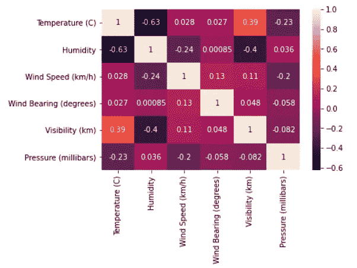

相关矩阵

我们可以知道湿度和温度之间有负相关关系。所以要回答这个问题**湿度和温度之间有**和**的关系吗？是的。湿度和温度呈负相关。**

# 6.[数]离散化

离散化用于将连续变量转换为离散变量。这里我们可以看到，当绘制风向直方图时，它不符合正态分布。当具有非标准概率分布的数值变量被离散化时，机器学习模型可以表现得更好。我已经用 K-means 离散化了风向。

```
X5 = X4.copy()
Y5 = Y4.copy()data1 = pd.DataFrame(X5, columns=['Wind Bearing (degrees)'])
data1 = data1.dropna()
data2 = pd.DataFrame(Y5, columns=['Wind Bearing (degrees)'])
data2 = data2.dropna()discretizer = KBinsDiscretizer(n_bins=8, encode='ordinal', strategy='uniform')discretizer.fit(data1)
_discretize1 = discretizer.transform(data1)
_discretize2 = discretizer.transform(data2)
X_dis = pd.DataFrame(_discretize1)
Y_dis = pd.DataFrame(_discretize2)
X_dis.hist()
```

输出:

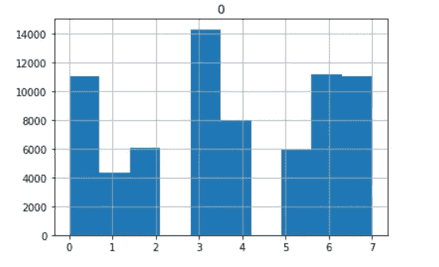

离散化后的风向直方图

我们可以绘制一个相关矩阵，以确定目标列(表观温度)的特征的重要性。

> 相关性是一种统计度量，表示两个或多个变量一起波动的程度。

```
X5['Wind Bearing (degrees)'] = X_disd_data = X5[['Temperature (C)', 'Humidity','Wind Speed (km/h)','Wind Bearing (degrees)','Visibility (km)','Pressure (millibars)']].copy()d_data['Apparent Temperature (C)'] = y_train
d_data.head(10)
print(d_data.corr())
sns.heatmap(d_data.corr(),annot=True)
```

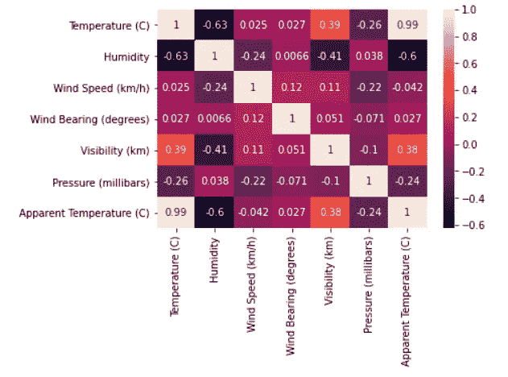

相关矩阵

我们可以看到，湿度和目标变量表观温度有着显著的高度相关性。所以回答问题**湿度和表观温度之间有** **关系吗？是的。湿度和表观温度呈负相关。**

# 7.降维—主成分分析

降维的重要性在于，我们可以通过去除冗余，只保留有用的信息来压缩数据集。太多的输入变量可能会导致维数灾难，然后模型将无法很好地执行，因为模型还会从训练数据集中的噪声中学习并过度拟合。

主成分分析是一种用于降维的强大技术，增加了可解释性，但同时最小化了信息损失。

```
pca = PCA(n_components=12)
pca.fit(X5)
X_train_pca = pca.transform(X5)
X_test_pca = pca.transform(Y5)
principalDf = pd.DataFrame(data = X_train_pca)
principalDf.head(20)
```

输出:

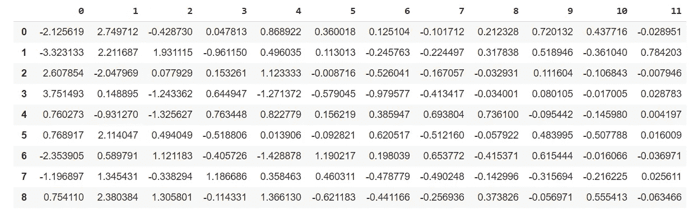

参数`*n_components*`的值通过分析下面的`*explained_component_ratio_*`来决定。

```
pca.explained_variance_ratio_
```

输出:

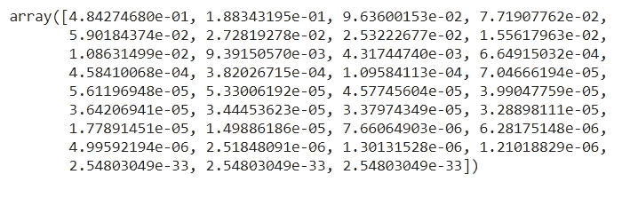

PCA 解释的方差比

当决定使用主成分的数量时，我们应该考虑上述值。数组的第一个元素是高方差维数，我们应该认为高方差维数的总和约为 0.95。这里我用了 12 个主要成分。

# 8.线性回归模型

完成所有上述步骤后，将线性回归模型应用于数据集。

```
lm = linear_model.LinearRegression()
model = lm.fit(X_train_pca,y_train)
```

# 9.模型评估

当我们评估我们的模型时，可以看到精度为 0.990223。

```
accuracy = model.score(X_test_pca, y_test)
print("Accuracy:", accuracy)
```

输出:

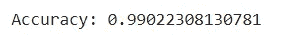

为了进一步评估模型，我们使用均方差(MSE)。

```
predictions = lm.predict(X_test_pca)
y_hat = pd.DataFrame(predictions, columns=["predicted"])
mse = mean_squared_error(y_test, y_hat)
print('Test MSE: %.3f' % mse)
```

输出:

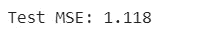

我们也使用了计算的均方根误差(RMSE)。

```
rmse = sqrt(mean_squared_error(y_test, y_hat))
print('Test RMSE: %.3f' % rmse)
```

输出:

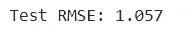

我们可以进行 6 重交叉验证。

```
scores = cross_val_score(model, X_test_pca, y_test, cv=6)
print("Cross-validated scores:", scores)
```

输出:

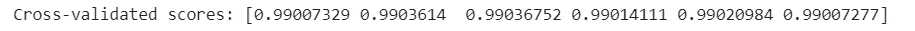

用下面的代码，我计算了交叉预测的准确性。

```
predictions = cross_val_predict(model, X_test_pca, y_test, cv=6)
accuracy = metrics.r2_score(y_test, predictions)
print("Cross-Predicted Accuracy:", accuracy)
```

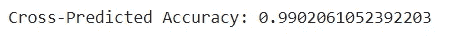

模型的精度是好的。但是检查重量参数也很重要。

权重参数是模型在新数据下表现良好的一个重要指标。如果权重参数较小，则意味着您的模型非常好，在没有数据的情况下会表现得更好。

```
#W parameters of the model
print(lm.coef_)
```

输出:

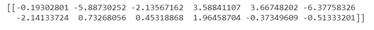

在这里，权重参数不是很低。但是我们可以通过识别和改变我们在预处理、转换等过程中所做的一些步骤来进一步减少它们。

我们可以将模型的预测可视化如下。这里我只绘制了 100 个数据点的图表。

```
plt.figure(figsize=(15, 7))
plt.plot(y_hat[:100], label = "Predicted")
plt.plot(y_test[:100], label = "Actual")
plt.title('Predictions Vs Actual')
plt.legend()
plt.show()
```

输出:

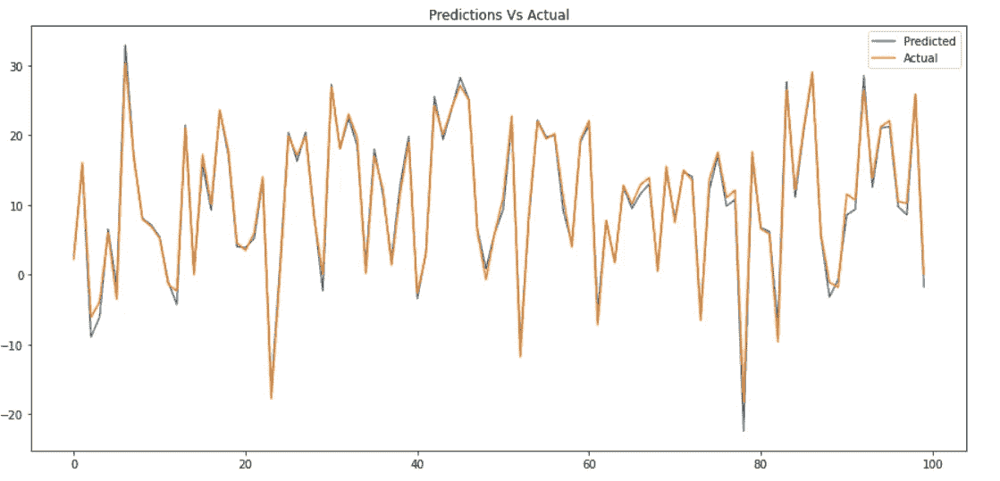

预测与实际数据图

# 10.结论

在本文中，我向您提供了如何通过应用数据清理、数据转换、特征编码、特征缩放、离散化、维度缩减来构建机器学习模型的分步指南，并且我还评估了线性回归模型。

我希望这篇文章能帮助你很好地理解我们应该遵循的重要步骤以及它们背后的主要概念，以建立一个好的机器学习模型。

编码快乐！

# 11.Colab 代码

<https://colab.research.google.com/drive/1C4GlUeLKhiC-1aX0D63M88_Rw-K7nCTc?usp=sharing> 