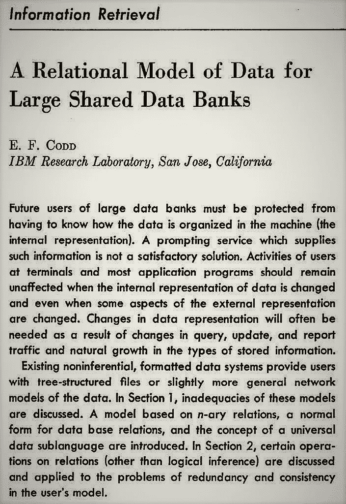
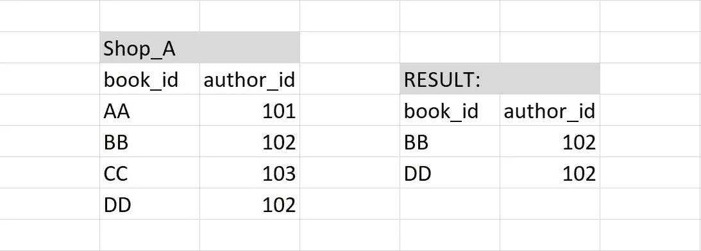
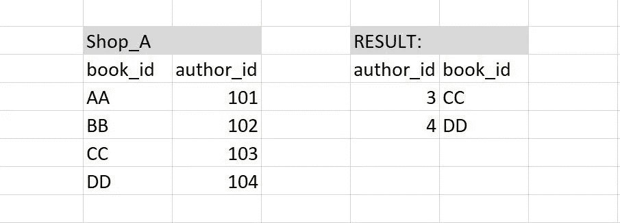
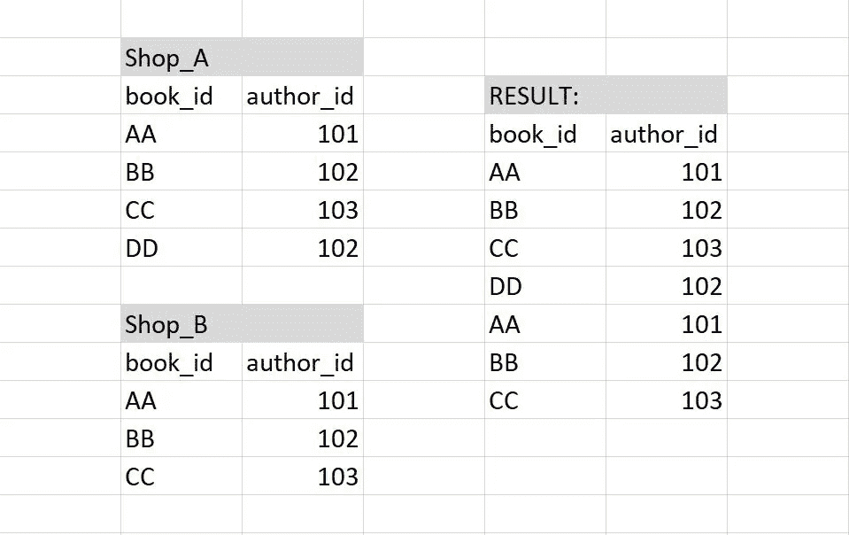
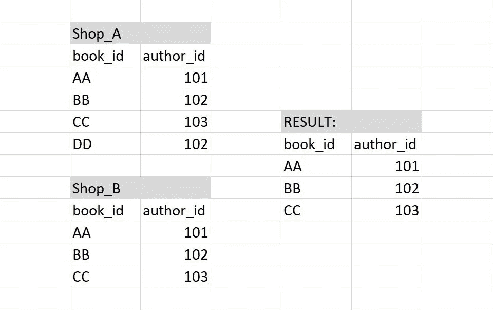
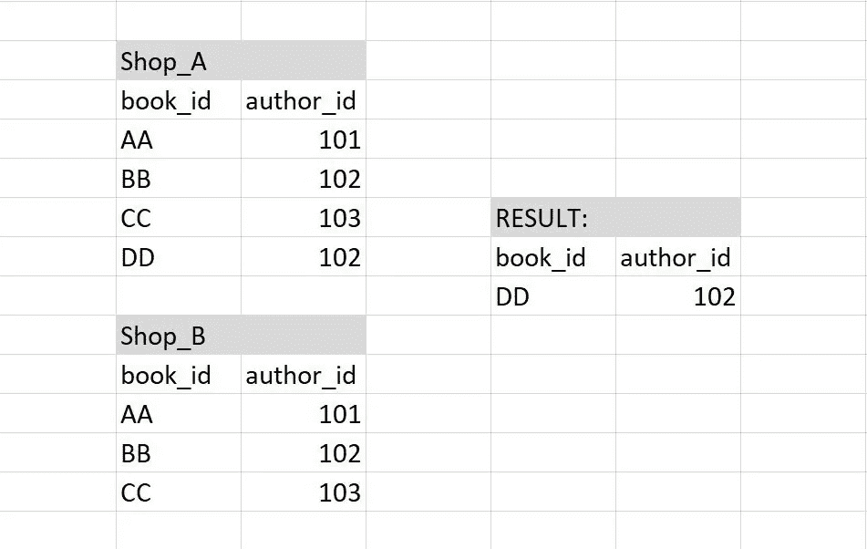
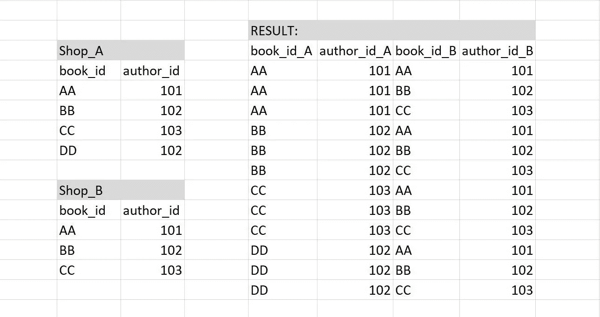
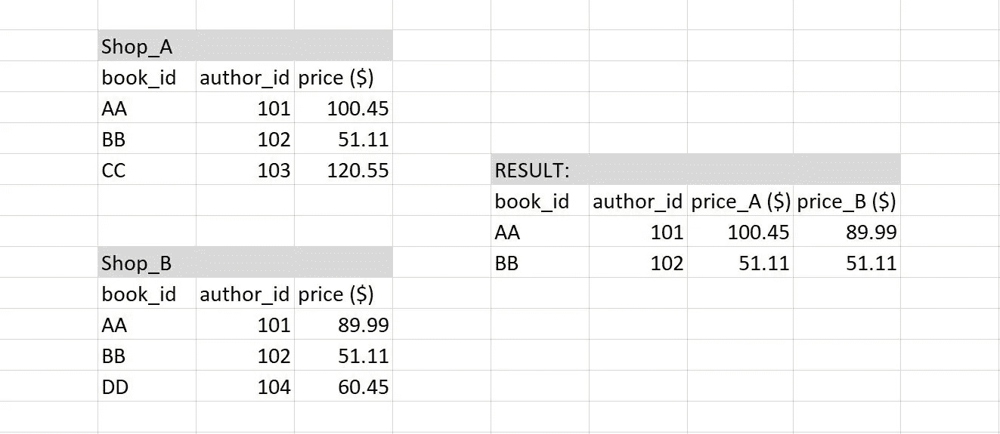

# 理解数据库管理系统(RDBMS)的关系模型

> 原文：<https://towardsdatascience.com/understanding-the-relational-model-of-database-management-systems-56f17db99f56?source=collection_archive---------19----------------------->

## 以及为什么它在整个行业如此受欢迎

在流行媒体对机器学习的大肆宣传和荣耀背后，一个有点被忽视的极其重要的组件是数据库管理系统(DBMS)的作用。当然，并不是每个人都需要知道数据库管理的细节。但是，如果你以任何身份使用机器学习，在你的职业生涯中，很大程度上，理解一定程度的机器学习可能会有所帮助。

照片由[玛格丽特·韦尔](https://unsplash.com/@margotd1?utm_source=medium&utm_medium=referral)在 [Unsplash](https://unsplash.com?utm_source=medium&utm_medium=referral) 拍摄

大约在 60 年代，开发人员仍然使用硬编码软件来管理数据。每当这些数据不适合非常严格的预定义架构时，软件每次都需要进行重构，以适应存储的数据类型和用于检索和操作数据的方法类型。如果开发人员使用哈希表来定义数据结构，随着数据库的增长和需求的发展，系统将需要重新编写。这是一个重复发生的事件。

在 IBM 工作的一位名叫 Edgar F. Codd 的数学家看到了这种对通用架构的需求，这种架构可以真正绕过硬编码的僵化，以适应不断发展的需求。进入关系数据库管理系统(RDBMS)。1970 年，他发表了一篇描述这种架构的论文，其中系统本身可以找出存储、检索和操作数据的最佳可能表示和过程。

大型共享数据库的数据关系模型。*美国计算机学会通讯*26.1(1983):64–69。*ACM 的通信。Web* 。

Codd 建议我们使用简单、原始的数据结构，如标量、整数、浮点和字符串来存储数据。数据会以**元组**的形式形成关系。也许用更简单和更容易理解的术语；想象一个数据表(也称为**关系**)，其中每个单元格都是简单的标量数据类型之一，在每一行中作为元组连接起来，形成它们自己的关系。每个实体(或行)都有一个唯一的 ID，称为**主键**。表也可以通过这些键相互对话，这些键现在被称为**外键**，使用七个基本操作形成自定义关系。下面列出了基本操作及其相应的标准 SQL 语法:

**i) Select:** 选择并返回一个新的关系，它是满足某些条件谓词的元组的子集:SELECT * FROM Shop_A 其中 author _ id = 102

**ii)投影:**返回只包含指定属性的元组的新关系，可以重新排列属性顺序，可以操作值:SELECT author_id-100，book _ id FROM Shop _ A WHERE author _ id>102；

**iii) Union:** 将两个输入关系中的所有元组作为一个新关系返回，但仅当两者中的输入数据类型和属性相同时才有效:(SELECT * FROM Shop _ A)Union ALL(SELECT * FROM Shop _ B)；

**iv) Intersection:** 返回两个输入关系中的元组的新关系，但仅当两者中的输入数据类型和属性相同时才有效:(SELECT * FROM Shop _ A)INTERSECT(SELECT * FROM Shop _ B)；

**v) Difference:** 返回元组在第一个输入中但不在第二个输入中的新关系，但仅当两者的输入数据类型和属性相同时才有效:(SELECT * FROM Shop _ A)EXCEPT(SELECT * FROM Shop _ B)；

**vi) Product:** 返回一个新的关系，即两个输入的点积，aka。所有可能的组合，一般用于测试:SELECT * FROM Shop _ A CROSS JOIN Shop _ B；或者，选择* FROM Shop_A，Shop _ B；

**vii) Join:** 返回两个输入关系中都有的元组的新关系，但与 Union 不同，数据和属性类型不需要相同，只要元组内至少有一个匹配即可:SELECT * FROM Shop _ A NATURAL Join Shop _ B；

此后，又增加了更多高级操作，如除法、聚合、排序等等。

这些较低级的操作被用来用一种叫做关系代数的技术来评估关系。RDBMS 使用这些原始的关系代数表达式来确定最有效的*如何*这就是关系演算。系统中一个非常复杂的组件叫做**查询优化器** 来完成这项工作。

假设您想在表 A 和表 B 之间创建一个新的关系，每个表都包含 50 亿行，您希望所有主键小于 500 的元组都同时出现在表 A 和表 B 中，并且具有相同的属性。一种方法是首先自然连接所有 100 亿行，然后过滤少于 500 的选择键。另一个过程可以是首先从 A 和 B 中过滤选择少于 500 个键，然后自然连接 1000 个(最多)条目。根据数据库的实际大小，第二个过程的性能因素将比第一个过程有效得多。

这就是关系模型的优势所在。用户只需要说出他们想要做什么，RDBMS 就会计算出 T2 如何以最有效的方式做这件事。这就是像 SQL 这样的查询语言被称为“非过程化”的原因。系统内置了明确的步骤(或程序)。与 Python 或 C/C++等编程语言不同，在这些语言中，用户需要显式声明对数据进行多次迭代，寻找这一特性，如果 n 大于某个数字，请选择另一种方法，yada yada，SQL 只需被告知所需的最终结果。

RDBMS 主要基于三大支柱:

**i)结构(模式):**关系及其内容，如属性、类型、数据内和数据间的关系。

**ii)完整性:**确保数据库的内容满足约束条件(也就是一些预定义的本地结构，比如内存分配),以在给定这些约束条件的情况下验证数据库的实例，没有冗余。

**iii)操作:**如何通过运行查询来访问或修改数据。

因为该系统可以随着不断发展的数据和需求而发展，所以它非常通用，适合大多数数据库的业务需求。RDBMS 由于其智能化设计，可以说是数据库管理系统的人工智能。

 [## Python 与 R 在数据科学中的对比

### 为什么你在浪费时间

towardsdatascience.com](/python-vs-r-for-data-science-cf2699dfff4b)  [## 你的机器学习模型表现不佳的 4 个原因

### 建立更好的 ML 模型的图解方法

towardsdatascience.com](/3-reasons-why-your-machine-learning-model-is-garbage-d643e6f0661)  [## 学习数据科学的 5 个阶段

### 以及如何战胜它们

towardsdatascience.com](/5-stages-of-learning-data-science-40bca61f11b1) 

***参考文献:***

1.  *帕夫洛 A，2019，数据库系统介绍，讲义，15-445/645，卡内基梅隆大学*
2.  大型共享数据库的数据关系模型。美国计算机学会 26.1 (1983 年)通讯:64-69。ACM 的通信。网络。

> 附言:要获得更多关于数据科学、编程以及生物学家如何在数据革命中导航的简明扼要的文章，可以考虑关注我的[博客](https://sukanta-saha.medium.com/)。
> 
> 由于每分钟都有成千上万的视频被上传，所以过滤掉它们是很重要的，这样你就可以只使用高质量的数据。我亲自挑选的，我会把你感兴趣的主题的教育视频发邮件给你。报名[这里](https://docs.google.com/forms/d/e/1FAIpQLScO4RtaXjJjYDdnEFyI3l73tcj59OGdY_cRnPGV-wsAEMhVwg/viewform)。
> 
> 感谢您的阅读！