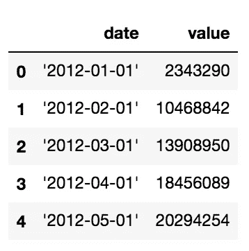
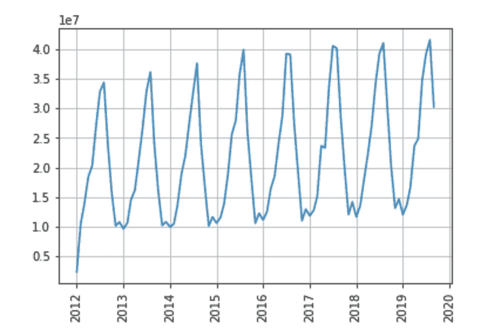
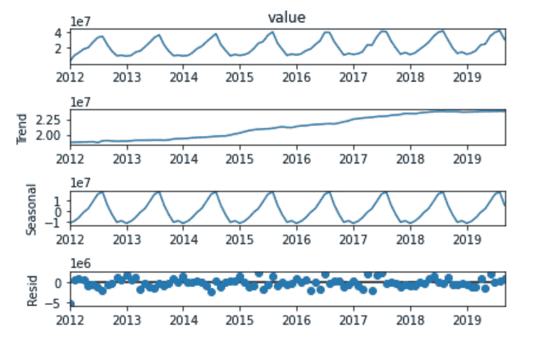
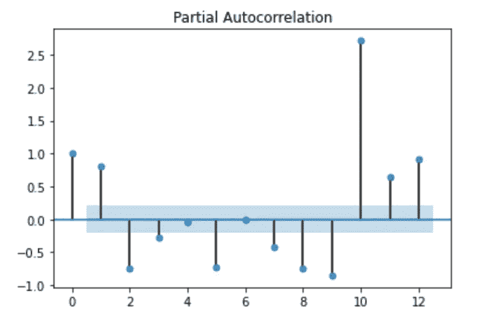
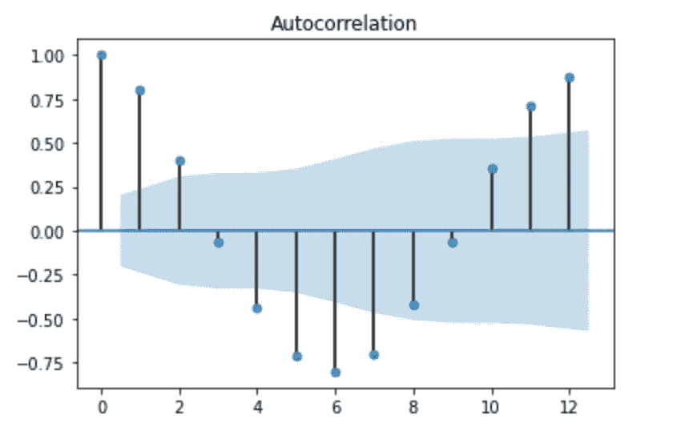
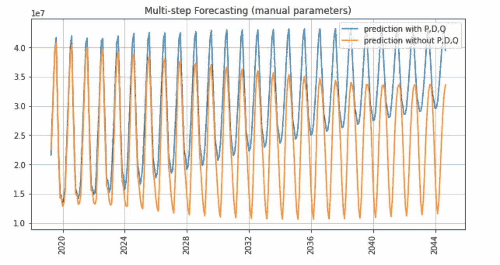

# 了解萨里玛模型的季节顺序

> 原文：<https://towardsdatascience.com/understanding-the-seasonal-order-of-the-sarima-model-ebef613e40fa?source=collection_archive---------2----------------------->

## 了解 Python statsmodels 库的 SARIMA 模型的(D，P，Q，M)季节顺序的快速概述和现成代码。


图片来自 [Pixabay](https://pixabay.com/?utm_source=link-attribution&utm_medium=referral&utm_campaign=image&utm_content=4240338) 的[romnyepez](https://pixabay.com/users/romnyyepez-12641300/?utm_source=link-attribution&utm_medium=referral&utm_campaign=image&utm_content=4240338)

几个月前，我写了一篇[文章](/4-different-approaches-for-time-series-analysis-7e2364fadcb9)，描述了**为时间序列预测**构建 SARIMA 模型的全过程。在那篇文章中，我解释了如何调整 SARIMA 模型的 p、d 和 q 阶，并根据 NRMSE 评估了训练模型的性能。

关于文章的一个评论是，提议的模型基本上是 ARIMA 模型，因为**没有考虑季节顺序**。我感谢评论的作者，我调查了这方面。

现在我在这里向你们解释我发现的一个有趣的方面，不幸的是，我在网上找到的文章中没有很好地解释它。

# 萨里玛模型订单

SARIMA 模型可通过两种订单进行调整:

*   **(p，d，q)顺序**，是指时间序列的顺序。这个顺序也用于 ARIMA 模型(不考虑季节性)；
*   **(P，D，Q，M)季节顺序**，是指时间序列的**季节成分**的顺序。

在本文中，我将重点介绍季节性订单的重要性。

# 加载数据集

首先，我导入了 1990 年至 2019 年意大利入境游客的相关数据集作为一个`pandas`数据框架。数据摘自[欧洲统计:旅游业年度数据](https://ec.europa.eu/eurostat/web/tourism/data/database)。

```
import pandas as pddf = pd.read_csv('source/tourist_arrivals.csv')
df.head()
```



作者图片

现在我把数据集转换成时间序列。这可以分三步完成:

*   我将`date`列转换为日期时间类型
*   我将`date`列设置为数据帧的索引
*   我将数据帧的`value`列赋给一个新变量，名为`ts`。

```
df['date'] = pd.to_datetime(df['date'])
df.set_index('date', inplace=True)
ts = df['value']
```

我通过绘制时间序列来探索它。我开发了`matplotlib`库。

```
from matplotlib import pyplot as pltplt.plot(ts, label='prediction seasonal')
plt.grid()
plt.xticks(rotation=90)
plt.show()
```



作者图片

我注意到时间序列呈现季节性，因此 SARIMA 模型是合适的。此外，时间序列也呈现增长趋势。

# (p，d，q)顺序

现在我将时间序列分成两部分:训练集和测试集。训练集将用于拟合模型，而测试集将用于评估模型。

```
ts_train = ts[:'2019-03-01']
ts_test = ts['2019-04-01':]
```

在另一个笔记本中，我已经解释了如何计算 SARIMA 模型的(p，d，q)阶，因此我将其手动设置为发现的值:

```
d = 1
p = 10
q = 7
```

# (P，D，Q，M)顺序

(P，D，Q，M)阶是指自回归参数、差异、移动平均参数和周期的模型的季节性组件:

*   d 表示季节性过程的积分顺序(使时间序列稳定所需的转换次数)
*   p 表示季节成分的自回归顺序
*   q 表示季节性成分的移动平均顺序
*   m 表示周期性，即一个季节中的周期数，例如每月数据为 12。

为了评估季节顺序，我们必须从时间序列中提取季节成分。出于这个原因，我们利用了由`statsmodels`库提供的`seasonal_decompose()`函数。在输入参数中，我们可以指定分解模型(加法或乘法)以及我们是否想要推断趋势。该函数返回趋势、季节和剩余部分。

```
from statsmodels.tsa.seasonal import seasonal_decomposeresult = seasonal_decompose(ts, model='additive',extrapolate_trend='freq')
result.plot()
plt.show()
```



作者图片

# 订单

为了提取 D，我们必须检查季节成分是否是平稳的。我们定义一个函数，利用 Adfuller 测试来检查平稳性。

```
from statsmodels.tsa.stattools import adfuller
import numpy as npdef check_stationarity(ts):
    dftest = adfuller(ts)
    adf = dftest[0]
    pvalue = dftest[1]
    critical_value = dftest[4]['5%']
    if (pvalue < 0.05) and (adf < critical_value):
        print('The series is stationary')
    else:
        print('The series is NOT stationary')
```

然后，我们对时间序列的季节性部分调用`check_stationarity()`函数:

```
seasonal = result.seasonal
check_stationarity(seasonal)
```

级数是平稳的，因此我们不需要任何额外的变换来使它平稳。我们可以设置 D = 0。

# 采购订单

P 的值可以通过查看季节分量的偏自相关(PACF)图来提取。在排除中间滞后的贡献后，PACF 可以被想象为序列和它的滞后之间的相关性。

```
from statsmodels.graphics.tsaplots import plot_acf, plot_pacf
plot_pacf(seasonal, lags =12)
plt.show()
```



作者图片

在 PACF 图中，值超出置信区间(浅蓝色)的最大滞后是 12，因此我们可以设置 P = 12。

# q 顺序

Q 阶可以通过自相关(ACF)图计算。自相关是单个时间序列与其自身滞后副本的相关性。

```
plot_acf(seasonal, lags =12)
plt.show()
```



作者图片

从上图中，我们注意到，值超出置信区间的最大滞后是 8，因此 Q = 8。

# 火车模型

为了显示调整和不调整(P，D，Q，M)顺序的 SARIMA 模型之间的差异，我们拟合了两个模型，第一个模型没有季节性顺序，第二个模型有季节性顺序。

# 不按(P，D，Q，M)顺序拟合

我们利用了`statsmodels`包的`SARIMAX()`类，并将其配置为只处理(p，d，q)顺序。

```
from statsmodels.tools.eval_measures import rmse
nrmse = rmse(ts_pred, ts_test)/(np.max(ts_test)-np.min(ts_test))
nrmse
```

它给出了以下输出:

```
0.0602505102281063
```

# 符合(P，D，Q，M)顺序

我们通过传递`seasonal_order`参数来拟合模型。此操作比上一个操作要求更多。

```
model_seasonal = SARIMAX(ts_train, order=(p,d,q), seasonal_order=(P,D,Q,12))
model_fit_seasonal = model_seasonal.fit()
```

我们计算预测和 NRMSE:

```
ts_pred_seasonal = model_fit_seasonal.forecast(steps=n_test)
nrmse_seasonal = rmse(ts_pred_seasonal, ts_test)/(np.max(ts_test)-np.min(ts_test))
nrmse_seasonal
```

它给出了以下输出:

```
0.08154124683514104
```

# 考虑

我们注意到，就 NRMSE 而言，没有季节性订单的模型优于另一个模型。

(P，D，Q，M)顺序没用吗？的确不是。对于短期预测，这两个模型的行为方式几乎相同。然而，对于长期预测，具有(P，D，Q，M)阶的模型更现实，因为它反映了增长趋势。

为了解释这个概念，我们可以在两种情况下计算一个长期预测:

```
N = 300
ts_pred = model_fit.forecast(steps=n_test+N)
ts_pred_seasonal = model_fit_seasonal.forecast(steps=n_test+N)
```

我们可以画出结果。我们注意到这两个模型之间有很大的不同。虽然没有(P，D，Q，M)阶的模型倾向于随时间减少，但是另一个模型反映了增加的趋势。

```
plt.figure(figsize=(10,5))
plt.plot(ts_pred_seasonal, label='prediction with P,D,Q')
plt.plot(ts_pred, label='prediction without P,D,Q')
#plt.plot(ts_test, label='actual')
plt.title('Multi-step Forecasting (manual parameters)')
plt.legend()
plt.grid()
plt.xticks(rotation=90)
plt.show()
```



作者图片

# 摘要

在本教程中，我解释了 SARIMA 模型中季节顺序对于长期预测的重要性。

本文解释的所有代码都可以作为 Jupyter 笔记本从我的 Github 库下载。

如果你想了解我的研究和其他活动的最新情况，你可以在 [Twitter](https://twitter.com/alod83) 、 [Youtube](https://www.youtube.com/channel/UC4O8-FtQqGIsgDW_ytXIWOg?view_as=subscriber) 和 [Github](https://github.com/alod83) 上关注我。

# 相关文章

</4-different-approaches-for-time-series-analysis-7e2364fadcb9> [## 4 种不同的时间序列分析方法

towardsdatascience.com](/4-different-approaches-for-time-series-analysis-7e2364fadcb9) <https://alod83.medium.com/june-articles-a-summary-of-my-june-articles-in-case-you-have-missed-them-8bc370375419>  </three-tricks-to-speed-up-and-optimise-your-python-d9b5d49d68a6> 