# 理解计算机视觉中的转换；

> 原文：<https://towardsdatascience.com/understanding-transformations-in-computer-vision-b001f49a9e61?source=collection_archive---------3----------------------->

克里斯多夫·伯恩斯在 [Unsplash](https://unsplash.com?utm_source=medium&utm_medium=referral) 上拍摄的照片

## 入门指南

## 仿射变换和单应性概述

# 内容

*   仿射变换
*   单应性

—齐次坐标

—针孔摄像机型号

—单应性方程

*   参考

变换是计算机视觉的重要组成部分，理解它们如何工作为更高级的技术奠定了基础。

在这里，我将主要介绍**仿射变换**和**单应性。**

# 仿射变换:

仿射变换是最简单的变换形式。这些变换在满足以下特性的意义上也是线性的:

*   线条映射到线条
*   点映射到点
*   平行线保持平行

仿射变换的一些常见例子是**平移**、**扩展**、**旋转**、**剪切**和**反射**。此外，这些变换的任何组合(如膨胀后的旋转)都是另一种仿射变换。

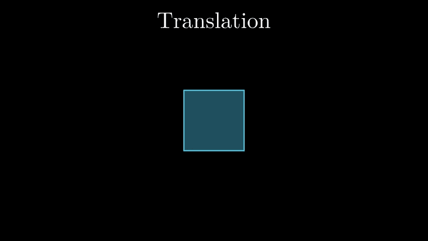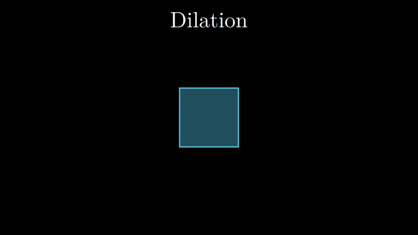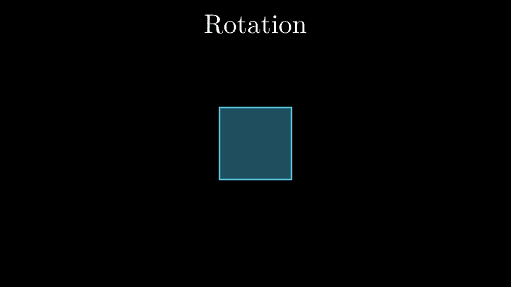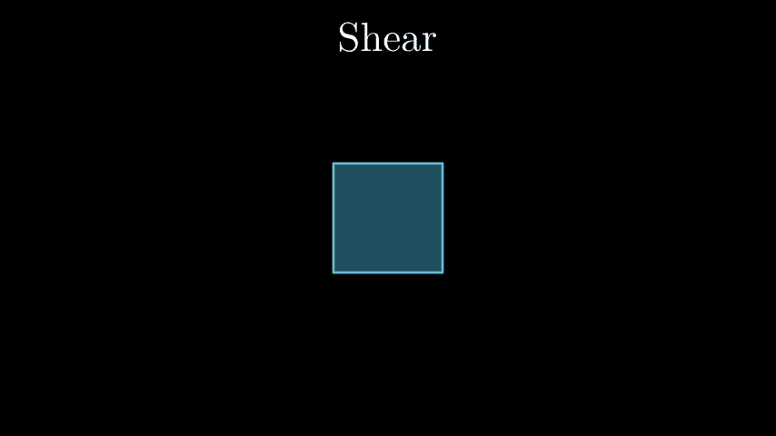

基本仿射变换的示例(图片由作者提供)

与其将仿射变换分解成不同的情况，不如有一个统一的定义。因此，我们转向使用矩阵作为线性变换来定义仿射变换。如果你不熟悉将矩阵解释为空间的线性变换，3Blue1Brown 有一个关于这个主题的精彩视频:

为了将矩阵理解为线性变换

本质上，我们可以把仿射变换看作是首先用矩阵进行某种线性变换，然后用某种平移进行组合。

在 2D 的情况下，仿射变换的等式由下式给出:

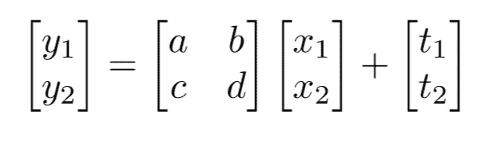

2D 仿射变换的方程式(图片由作者提供)

这里，矩阵用条目( *x* 1 和 *x* 2)表示向量上的一些线性变换，例如反射、剪切、旋转、膨胀或所有四者的组合。需要注意的是，由于变换是线性的，所以它也一定是可逆的，所以矩阵的行列式是非零的。转换的最后一步是向量[ *t* 1， *t* 2]的平移，完成到向量[ *y* 1， *y* 2]的转换。

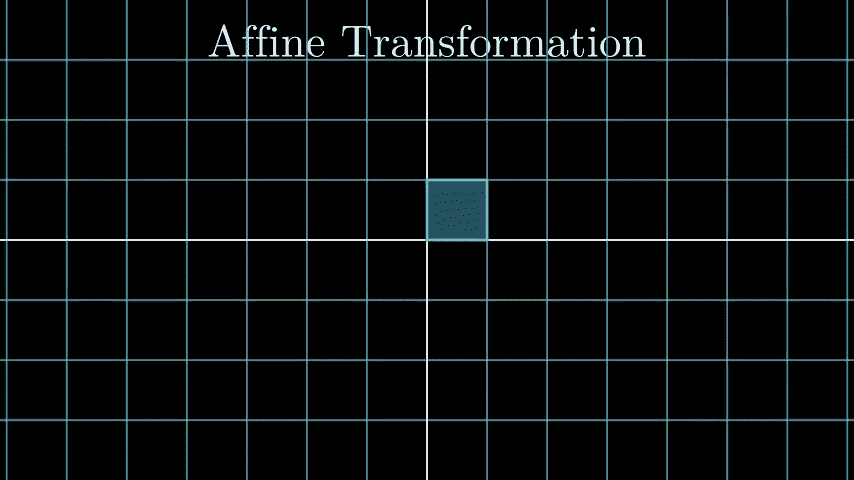

2D 仿射变换的例子(图片由作者提供)

仿射变换也可以用下面的等式推广到 n 维的*维:*

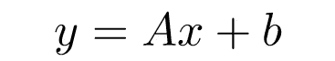

n 维仿射变换方程

这个变换通过应用线性变换 *A* (其中 *A* 是一个 *n×n，*可逆矩阵)，然后应用向量 *b* ( *b* 具有维度 *n* ×1)的平移，将向量 *x* 映射到向量 *y* 。

总之，仿射变换可以表示为由一些平移组成的线性变换，并且它们在为计算机视觉修改图像方面极其有效。事实上，图像预处理很大程度上依赖于仿射变换来进行缩放、旋转、移位等。

# 单应性:

单应是一种投影变换，因为我们利用投影来关联两个图像。同形异义词最初被引入来研究视角的变化，它们使人们能够更好地理解当我们从不同的角度看图像时，图像是如何变化的。

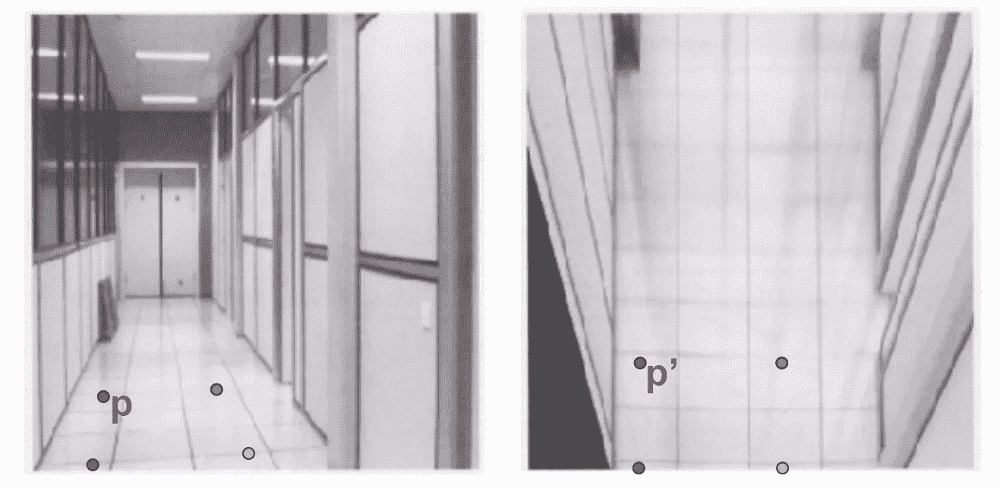

使用单应变换视角(鸣谢:[马里兰大学](http://www.cs.umd.edu/class/fall2019/cmsc426-0201/files/16_Homography-estimation-and-decomposition.pdf)

单应性的研究是通过检查相机根据其位置和方向拾取不同图像的事实来进行的。本质上，单应是同一场景的两个图像之间的变换，但是从不同的角度。只有两种情况适用单应性(这两种情况都假设世界视图可以用平面来建模):

1.  图像是由同一个相机从不同的角度拍摄的(世界现在基本上是一个平面)
2.  两台摄像机从**不同的位置**观察**同一平面**

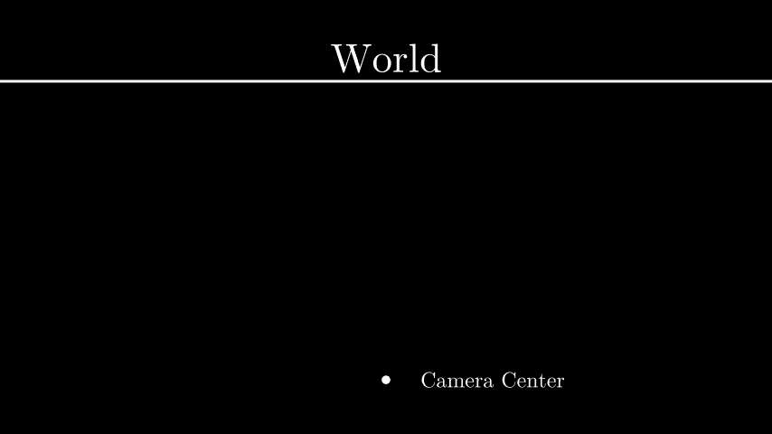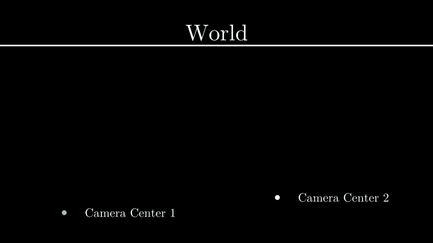

鸟瞰单应性的两个案例(图片由作者提供)

然而，为了使用单应性，我们必须首先设计工具来描述一幅图像在相机上的表现。更具体地说，如果给我们一个**摄像机**和一个**图像平面**(图像出现的地方，也是摄像机的属性)，我们必须找到世界上的一个点(称为**世界点**)出现在图像平面上的位置。

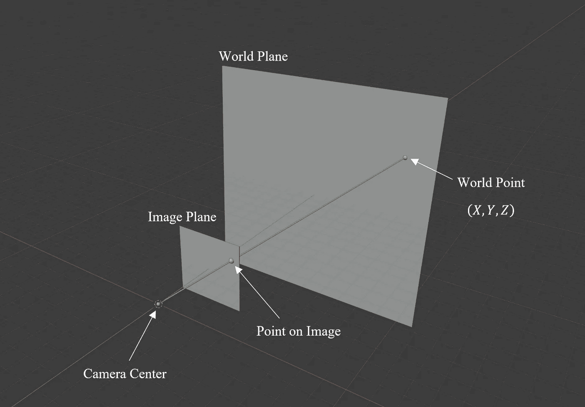

找到图像上的点的坐标是单应性的关键

因为光是直线传播的，所以我们知道在图像平面上出现了一个笛卡尔坐标的世界点( *X，Y，Z* )，它位于图像平面与经过相机中心和世界点的直线(这条线就是光到达相机的路径)的交点处。

然而，为了正确地定义这个公式，我们必须绕道到射影几何中一个叫做齐次坐标的概念。

## 齐次坐标:

齐次坐标(或**射影坐标**)是另一种坐标系，其优点是齐次坐标的公式往往比**笛卡尔坐标**(x-y 平面上的点)中的公式简单得多。相比之下，齐次坐标使用 3 个坐标( *x* '， *y* '， *z* ')来表示空间中的点(一般来说，它们比笛卡尔坐标多使用一个坐标)。另外，将齐次坐标转换为笛卡尔坐标相对简单:

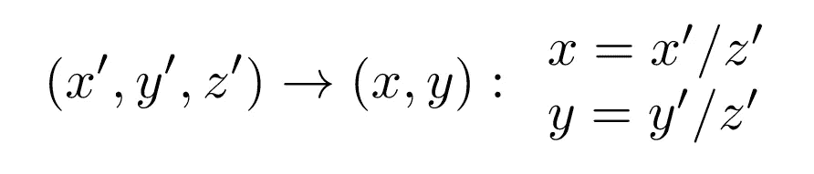

将齐次坐标转换为笛卡尔坐标

注意，当 *z'* =1 时，齐次坐标很好地映射到笛卡尔坐标。再者，当*z’*= 0 时，我们把对应的笛卡尔坐标解释为无穷远处的一点。记住这一点，让我们研究齐次坐标的一些应用。

首先，齐次坐标中的直线，只用 3 个点就可以表示出来。具体来说，你可以把一条线 *l* 在齐次坐标下表示为( *l* 1， *l* 2， *l* 3)。那么，这条线就是所有点的集合 *p=* ( *x* ， *y* ， *z* )，使得 *l* 与 *p* 的点积为 0。

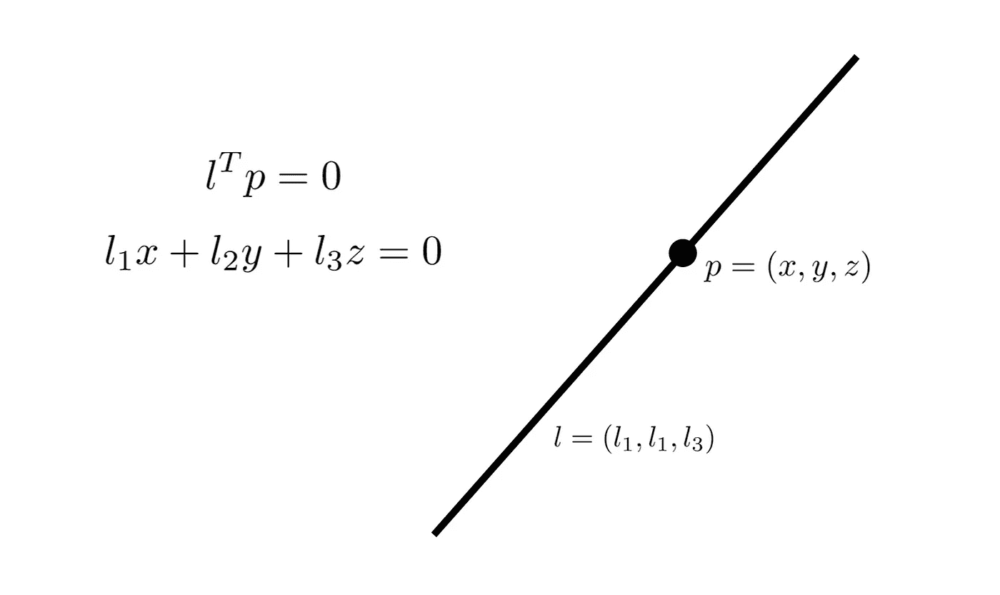

用齐次坐标表示的线(图片由作者提供)

注意的第二个性质是，给定两点 *p* 1=( *a* ， *b* ， *c* )和 *p* 2 = ( *d* ， *e* ， *f* )，直线 *l* 经过 *p* 1 和*p*

*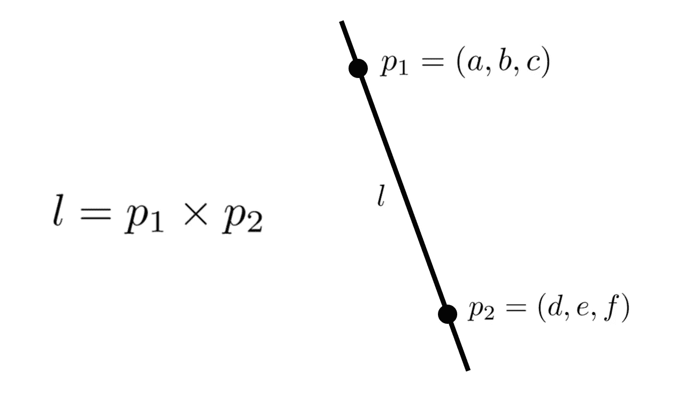*

*齐次坐标中两点之间的线(图片由作者提供)*

*注意的最后一个性质是:两条直线 *l* 1 和 *l* 2 的交点(齐次坐标中)是两条直线的叉积给出的点 *p* 。*

*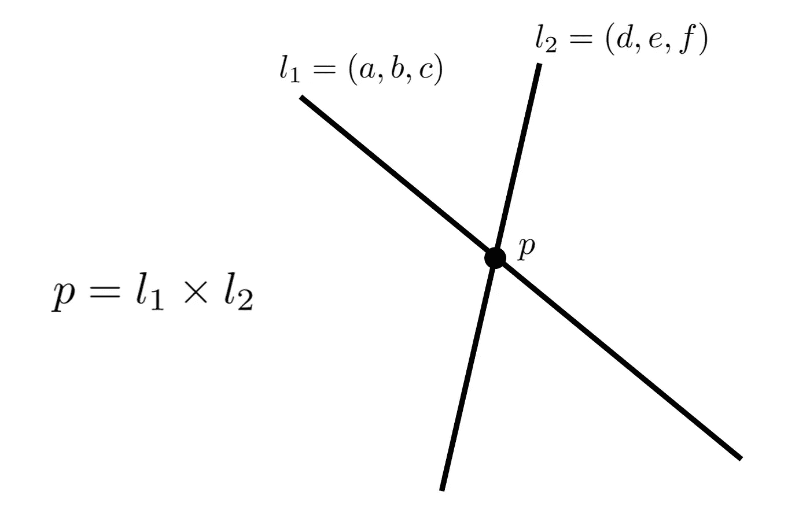*

*齐次坐标中两条线的交点(图片由作者提供)*

*有了这些性质，我们现在就能很好地理解单应性背后的公式。*

## *针孔摄像机型号:*

*我们现在回到我们的问题，在给定所述摄像机的位置和方向的情况下，找到一个**世界点** ( *X* 、 *Y* 、*Z*)——这是在笛卡尔坐标中——位于所述摄像机的**图像平面**的位置。*

*特别地，我们发现世界点( *X* ， *Y* ， *Z* ，1)位于图像平面的点(*X’*，*Y’*，*Z’*)上，其中两个点在齐次坐标中，并且通过以下等式相关( *f* 是描述相机焦距的常数):*

*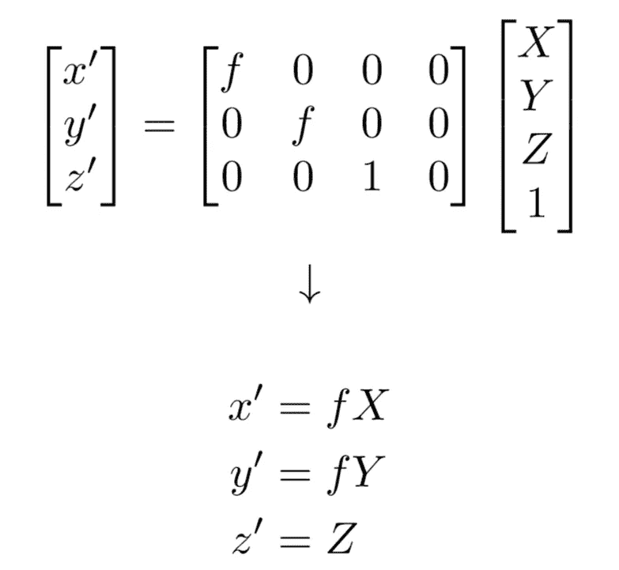*

*世界点齐次坐标与像平面齐次坐标的关系方程*

*从这里我们可以把( *x* '， *y* '， *z* ')转换成前面所说的图像平面上的笛卡尔坐标( *x* ， *y* )。*

*事实证明，将世界点转换为图像平面上的点的矩阵可以很好地分解，为我们提供了一种直观的方式来理解矩阵的作用:*

*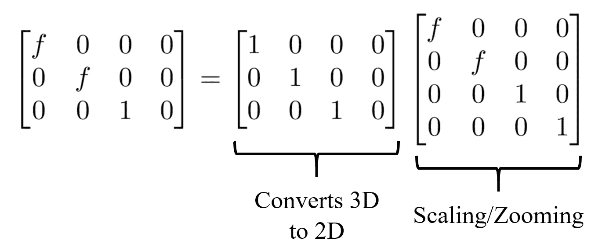*

*矩阵可以理解为两个动作:(1)缩放，(2)压缩到更低维度*

*但是，由于图像上的坐标系不同于笛卡尔坐标系(左上角是像素坐标中的(0，0))，我们必须执行一次最终转换，以从同质图像平面坐标(*x’*、*y’*、*z’*)转换为同质**像素坐标**(*u’*、*v’*、*w’*)。*

*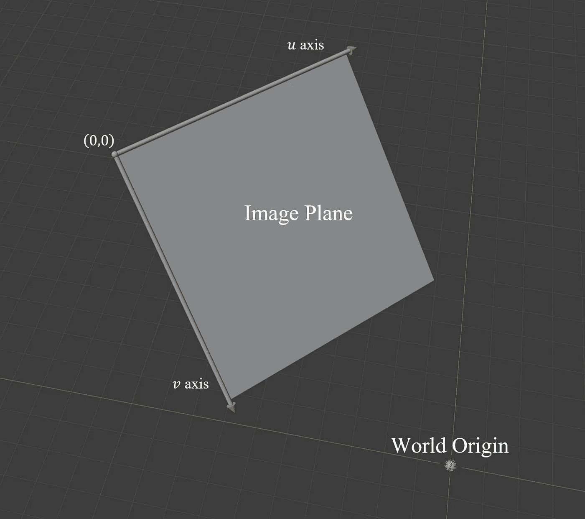*

*像素坐标的表示(图片由作者提供)*

*因此，我们首先通过除以像素的大小来缩放我们的图像平面坐标(以便将它们转换成像素)，像素的大小在 *u* 方向上是 *ρu* 并且在 *v* 方向上是 *ρv* 。你可以认为这是把米这样的单位转换成像素。接下来，我们必须通过一些 *u* 0 和 *v* 0 来平移坐标，这样像素坐标的原点就在适当的位置。把这两个变换放在一起，我们得到下面的公式:*

*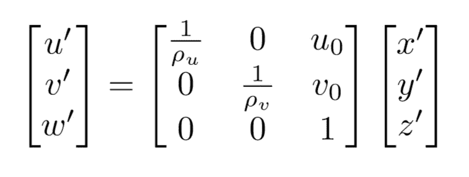*

*将图像平面坐标转换成像素坐标。*

*最后，将所有东西放在一起，我们可以通过将世界点( *X* ， *Y* ， *Z* ，1)转换为像素坐标(*u’*，*v’*，*w’*)，来完成我们的相机模型，其中两者都以齐次坐标给出:*

*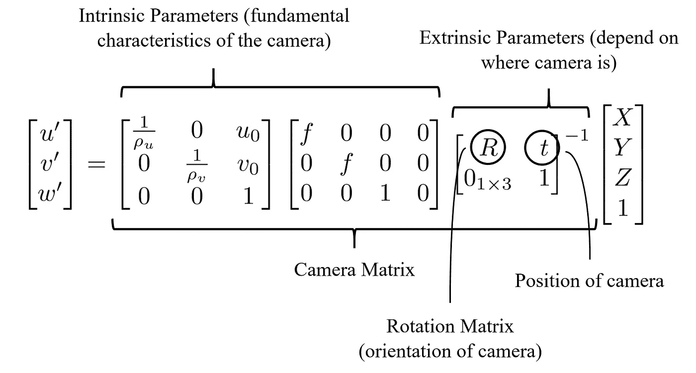*

*相机模型的方程式*

*外部参数可以被认为是一个术语，它为我们提供了关于摄像机的方向(存储在旋转矩阵 *R* 中)和位置(存储在向量 *t* 中)的信息。*

*在实际中，我们并不经常知道所有的参数，所以我们可以近似相机矩阵来代替，它只是一些 3×4 的矩阵(通过矩阵乘法性质)；这是通过校准摄像机来实现的。*

*此外，相机矩阵的一个重要属性是缩放 *C* 的条目给出了描述同一相机的新相机矩阵。这是因为如果我们将 *C* 乘以某个常数 *λ* ，那么**同质**像素坐标的所有条目也会被 *λ* 缩放。然而，当我们从齐次坐标转换到笛卡尔坐标时(如前所示)， *λ* 被抵消，留下与缩放前相同的笛卡尔坐标。因此，因为比例因子是任意的，所以让相机矩阵的右下角的条目为 1 已经成为惯例。*

*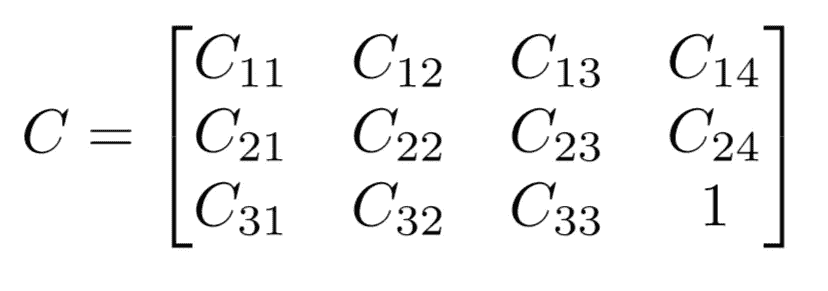*

*相机矩阵的标准形式*

*有了这些定义的方程，我们就非常接近获得单应性的公式。*

## *单应方程；*

*让我们再一次检查针孔摄像机的设置。在这个设置中，我们的摄像机将拍摄位于一个平面上的点 *P* =( *X* ， *Y* ， *Z* )，其中点 *P* 在图像平面上的同质像素坐标中显示为(*u’*，*v’*，*w’*)。现在，我们可以用一个聪明的技巧来选择坐标系。也就是说，我们让 *X* 和 *Y* 轴位于平面内，使得 *Z* 轴指向平面外。因此，平面上所有点的 *Z* 坐标为 0，意味着 *P* 的形式为 *P* =( *X* ， *Y* ，0)。*

*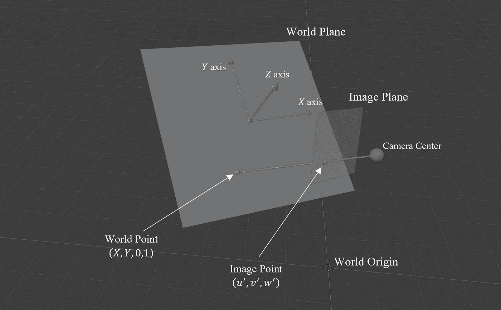*

*方便选择坐标系(**坐标显示为** **齐次**)(图片由作者提供)*

*现在，将其代入我们的相机方程，并使用 *Z* =0，我们得到以下简化:*

*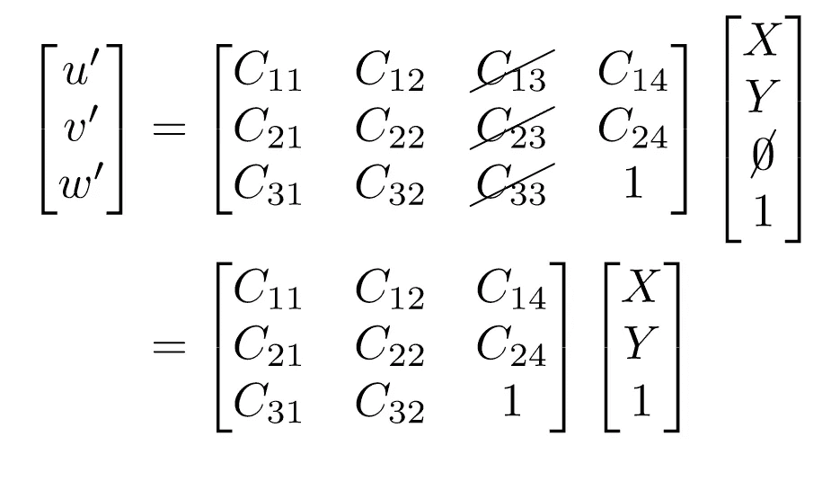*

*利用照相机等式中的 Z=0*

*这个新的相机矩阵被称为**单应矩阵** **矩阵** *H* ，有 8 个未知条目(因为右下角的 1 是固定的)。通常，平面单应矩阵的条目用 *H* 而不是 *C* 表示，如下所示:*

*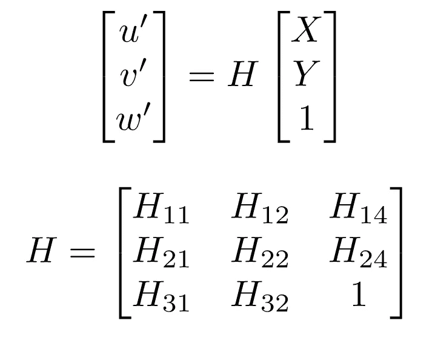*

*平面单应性方程*

*我们现在最后的任务是估计 *H* 的条目。由于单应矩阵中有 8 个未知数，并且平面上的每个世界点有 2 个坐标，我们将需要**在 4 个世界点**上校准摄像机，以便估计 *H* 的所有条目。*

*概括地说，单应性是一种变换，当两个图像是同一平面的图片，但从不同的角度看，我们可以使用它将一个图像转换为另一个图像。在数学上，这种变换由单应矩阵执行，该单应矩阵是具有 8 个未知数的 3×3 矩阵，并且可以通过用 4 个对应点校准图像来估计(使用更多点获得更好的近似，但是 4 是所需的最小值)。*

*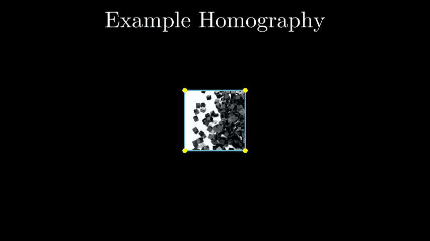*

*带有黄色校准点的单应性示例(图片由作者提供)*

*总而言之，homgraphies 是一个强大的工具，可应用于像**增强现实**(将某些图像投影到环境中)和**图像拼接**(将多幅图像组合起来创建一个更大的全景图)等领域。*

## *参考*

*【https://en.wikipedia.org/wiki/Homogeneous_coordinates *

*[http://www . cs . UMD . edu/class/fall 2019/cmsc 426-0201/files/16 _ homo graphy-estimation-and-decomposition . pdf](http://www.cs.umd.edu/class/fall2019/cmsc426-0201/files/16_Homography-estimation-and-decomposition.pdf)*

*[https://medium . com/swlh/image-processing-with-python-image-warping-using-单应矩阵-22096734f09a](https://medium.com/swlh/image-processing-with-python-image-warping-using-homography-matrix-22096734f09a)*

*[https://www.youtube.com/watch?v=l_qjO4cM74o](https://www.youtube.com/watch?v=l_qjO4cM74o)*

*[https://www.youtube.com/watch?v=fVJeJMWZcq8](https://www.youtube.com/watch?v=fVJeJMWZcq8)*