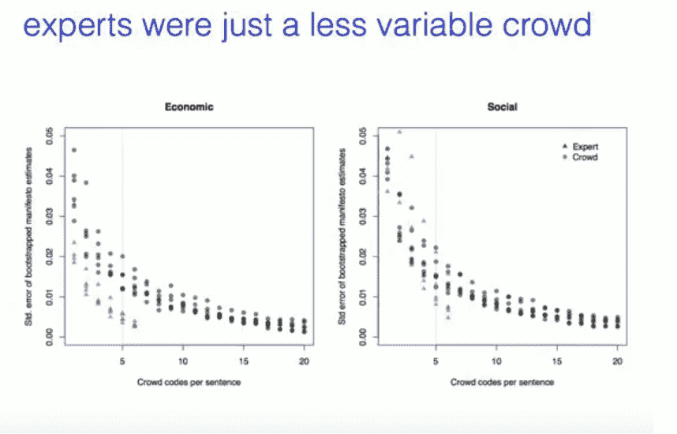
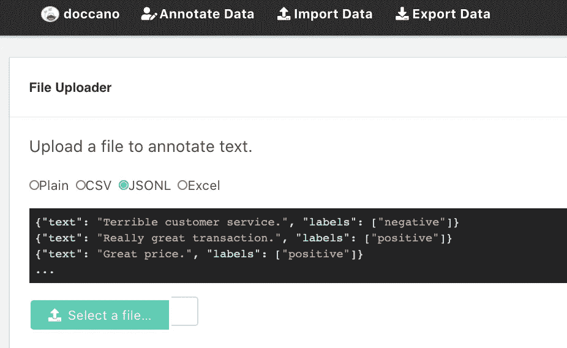
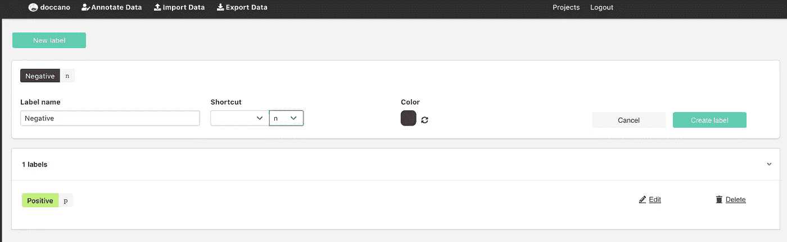
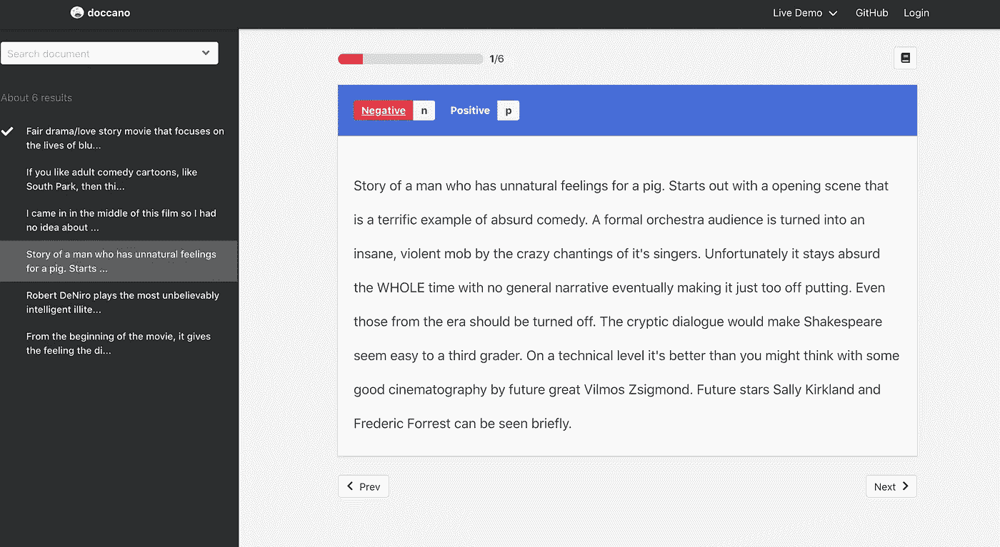
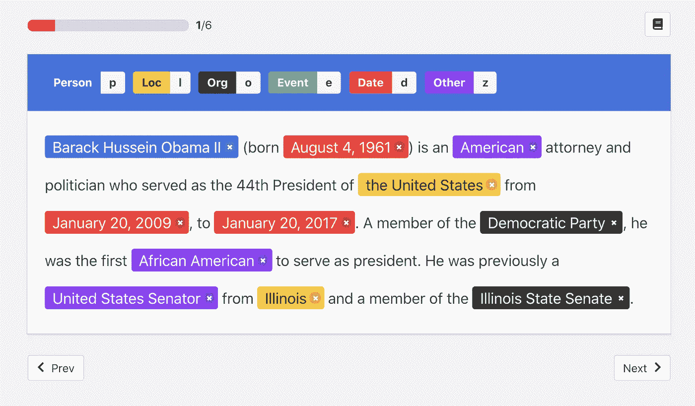
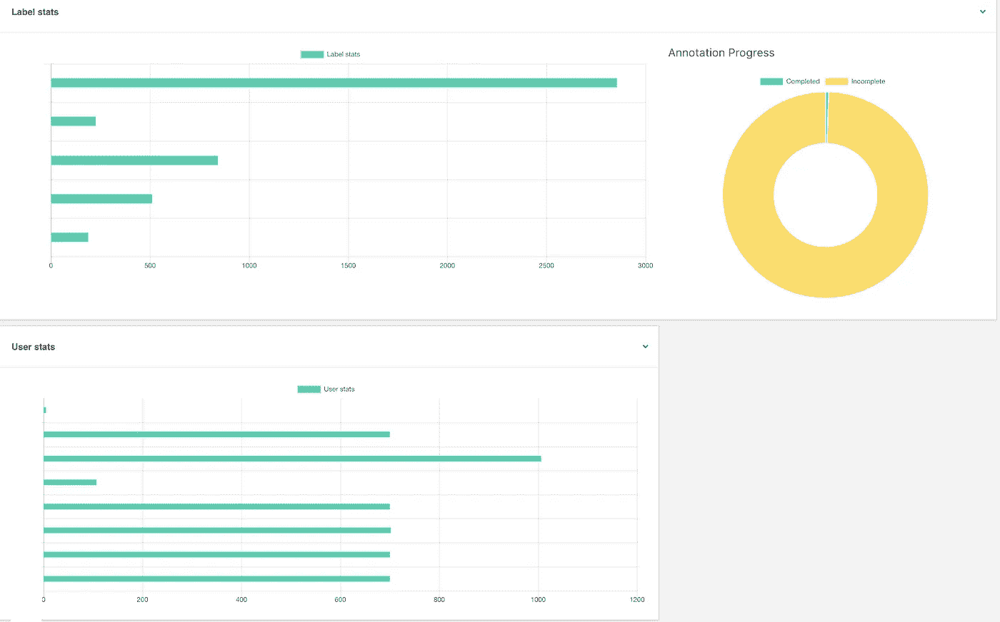
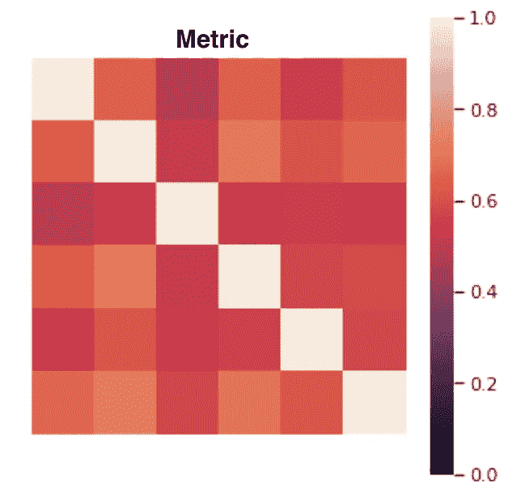

# 使用 Doccano 了解文本数据

> 原文：<https://towardsdatascience.com/understanding-your-textual-data-using-doccano-70e51656c2d2?source=collection_archive---------15----------------------->

## 文本标注工具不仅仅用于创建数据集。


图 1: [Doccano](https://github.com/doccano/doccano)

每个研究人员应该做的第一件事就是了解他们的数据和领域。有许多方法可以做到这一点，从手动检查列和行，打印统计数据，使用 pandas_summary，使用特征选择方法，使用通气管，可视化数据，解释您的模型等。

**我认为当你遇到*新数据*需要被标记成几个类的时候，你需要做的第一件事就是自己注释它。**

坐在房间里，在屏幕前，对你的数据做几个小时的注释，可以让你深入理解它。设置完成后，大多数注释工具允许您进入*工厂*思维模式，您可以在每个屏幕上获得一个注释，通过使用快捷键，您可以简化并适应快速标记程序。

## 问题是

然而，您可能需要考虑另一个场景，想象一个专家团队，每个人对所讨论的领域都有自己的观点。

你认为每个人都同意他们的同事吗？

你觉得大家都一致吗？

**当然不是！**

## 7 个注释神话

这些神话是人们不能就任何事情达成一致的一些最常见的原因，也是为什么你的带注释的数据集充满了噪音。全文请看[人群真相和人类注释的七大神话](https://www.aaai.org/ojs/index.php/aimagazine/article/view/2564/2468)。

1.  **一个事实**大多数数据收集工作都假设每个输入示例都有一个正确的解释。
2.  **不一致是不好的**为了提高注释数据的质量，应该避免或减少注释者之间的不一致。
3.  **详细的指导方针有助于**当具体案例持续引起分歧时，增加更多说明以限制解释。
4.  **一个就够了**大多数带注释的例子都是一个人评估的。
5.  拥有领域知识的专家是更好的人类注释者提供更好的注释数据。如图 2 所示。
6.  所有的例子都是平等的，运用基础真理的数学对每个例子都一视同仁；你要么匹配正确的结果，要么不匹配。
7.  一旦完成，**永远有效**一旦为一项任务收集了人工注释的数据，这些数据就会被反复使用而不会更新。新的批注数据与以前的数据不一致。



图 2: [神话 5](https://www.youtube.com/watch?v=ktZLuXPXPEI) —专家是更好的人类注释者，拥有领域知识，可以提供更好的注释数据。**不是** **真的！**以下是专家和众包的对比。我们可以看到，专家收敛得更快，但结果质量相似。

## 解决方案

是使用多用户注释工具，并在对每个样本进行强制多数投票后，创建一个可以与之前的假设**进行比较的数据集，这可以暂时作为您的基本事实(参见误区 7)。此外，我们希望验证我们的团队在多大程度上彼此一致，以及他们是否彼此一致，即**评分者间可靠性**和**评分者内可靠性** **。****

这是我建议你每次进入一个新的领域都要做的事情。如果你想知道你可以使用哪些工具，这几天有很多文本注释工具，如 [Doccano](https://github.com/doccano/doccano) (用于本文)、 [Prodigy](https://prodi.gy/) 、 [LightTag](https://www.lighttag.io/) 等。

> 如果你好奇的话，我写了一篇关于如何[创建带有行业要求和约束的学术级数据集的指南](/the-definite-guide-for-creating-an-academic-level-dataset-with-industry-requirements-and-6db446a26cb2)。

## 多卡诺

[Doccano](https://github.com/doccano/doccano) 是一款面向机器学习从业者的开源注释工具。它为文本分类、序列标记和序列到序列任务提供了注释功能。使用 Doccano，您可以为情感分析、命名实体识别、文本摘要等创建标记数据。你可以在几个小时内建立一个数据集。它具有协作注释、多语言支持、移动支持、表情符号支持和 RESTful API。”如果你好奇，你可以试试他们的注释演示[这里](http://doccano.herokuapp.com/)。

## 装置

如果您想自己添加注释，安装非常简单

```
pip install doccanodoccanonavigate to [http://localhost:8000/](http://0.0.0.0:8000/)
```

但是，如果您想将 Doccano 放在远程机器上，以便允许协作注释，即多用户、持久性和健壮性。您将需要使用 Docker 安装过程。

docker 安装有其独特之处。目前，它允许您将数据保存到 docker 内的一个目录中，但如果发生一些事情，数据将会消失。为了在外部保存您的数据，您需要将 *-v data:/data* 参数添加到 docker create 命令中。这个命令允许你将你的本地目录指向一个外部目录，因此如果发生什么事情，不会丢失你的 *doccano.db* 文件。

```
1\. Install Docker.
2\. docker pull doccano/doccano
3\. mount a persistent drive onto /data.
4\. docker container create --name doccano_db -v /data:/data -e “ADMIN_USERNAME=admin” -e “ADMIN_EMAIL=admin@example.com” -e “ADMIN_PASSWORD=password” -p 8000:8000 doccano_db
5\. docker container start doccano_db
```

## 设置

Doccano 允许您轻松地导入和导出数据。我推荐使用 JSONL(图 3a)。Doccano 还允许您轻松地设置类标签及其快捷键，如图 3b 所示。



图 3a:导入用户界面。



图 3b:标签创建 UI。

## 注释

Doccano 可以开箱即用，用于多类任务，例如，情感分析、命名实体识别和翻译任务，如图 4a、4b 和 4c 所示。



图 4a: Doccano 情感分析任务



图 4b: Doccano 命名实体任务


图 4c: Doccano 翻译任务

## 管理模式

作为项目的管理员，您可以检查一些统计数据，比如标签分发、项目完成、用户进度，如图 5 所示。这些工具非常方便，尤其是当你在做这个单调乏味而且非常无聊的注释任务的时候，如果你需要游戏化并且给团队成员注入一些激情的话。



图 5:管理仪表板。

## **指标**

在导出多用户注释数据集后，有多种方法可以测量一致性。我推荐使用来自 Github 和 Scikit-learn 的 Oliver 的 [Disagree 包](https://github.com/o-P-o/disagree)。

1.  Cohen 的 Kappa(0–1，两个注释者，根据概率进行了修正)
2.  fleiss Kappa(0–1，多个注释者，根据概率进行了修正)
3.  krippendorff alpha(0–1，多个标注器，随机修正，允许缺少值)
4.  精确度/召回/ F1

正如我们在图 6 中看到的，即使是专家也不会完全同意彼此的观点。



图 6:一个一致矩阵，X 和 Y 轴是专家，在对角线上我们可以看到他们同意自己，但不出所料专家之间的一致度不高。

## 好处

我们从这个过程中得到了一些有价值的东西:

1.  我们对数据有了更深入的了解。
2.  我们可以让专家讨论分歧和未标记的样本，并进一步了解领域内的困难
3.  我们有一个基于多数的基础事实数据集，我们可以计算一段时间。

## 结论

在本文中，我想说服您为什么注释主要对于理解您的领域很重要，而不仅仅是对于创建数据集以及如何使用 Doccano 来实现这个目标。

我恳求你在进入一个新的领域时练习自我注释，同时制定你的类标签，甚至在考虑寻找算法解决方案之前。

我要感谢塞缪尔·杰弗罗金的宝贵见解，感谢他在许多个月前为我指明了道路。

Ori Cohen 博士拥有计算机科学博士学位，主要研究机器学习和脑机接口(BCI)。他在一家智能城市初创公司领导了一个数据科学团队，主要利用机器和深度学习进行自然语言处理(NLP)和理解(NLU)研究。目前，他是 TLV 新遗迹公司在 AIOps 领域的首席数据科学家。他定期在 Medium.com 的[上撰写关于管理、流程和所有数据科学的文章。](https://cohenori.medium.com/)