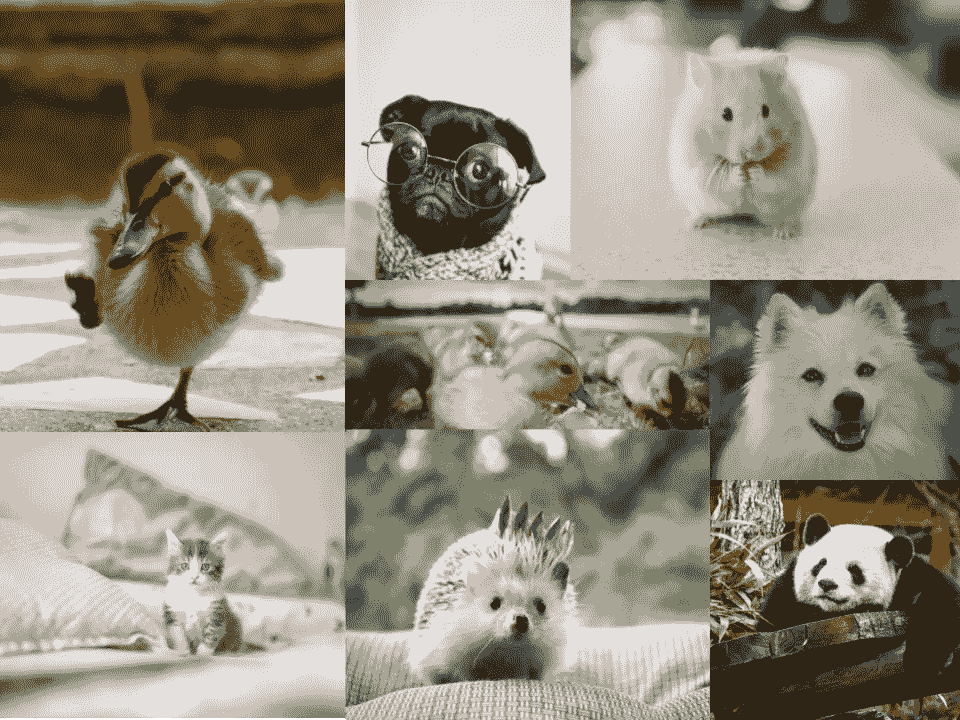
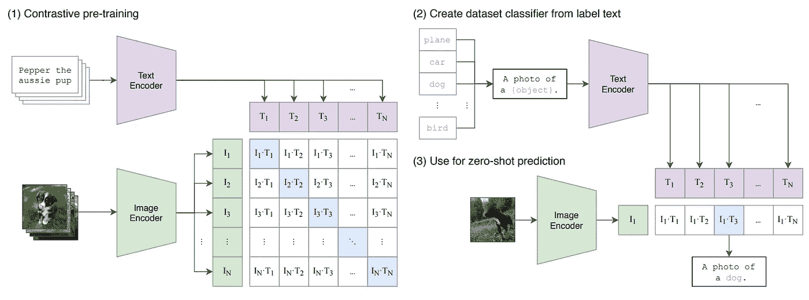
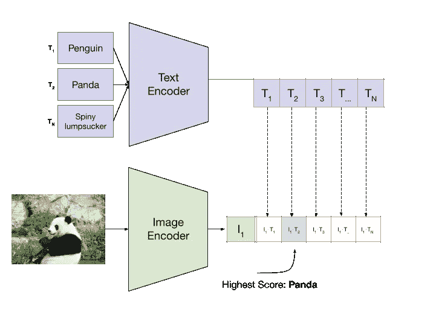
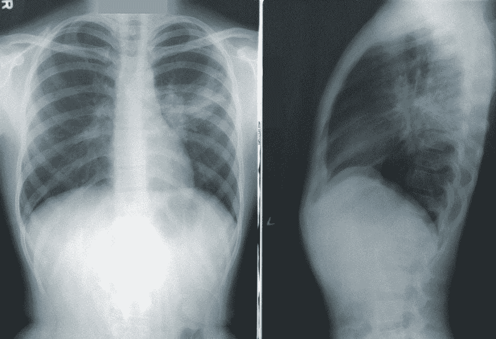
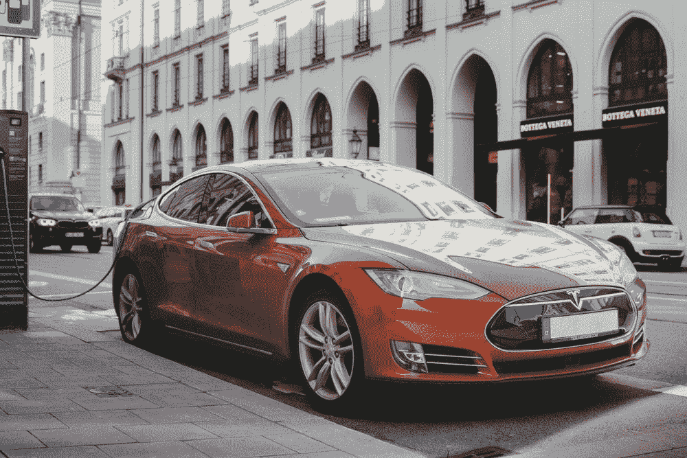

# 理解零射击学习——让 ML 更人性化

> 原文：<https://towardsdatascience.com/understanding-zero-shot-learning-making-ml-more-human-4653ac35ccab?source=collection_archive---------0----------------------->

## 一个模型如何识别它没见过的东西的直观概述。

[梁杰森](https://unsplash.com/@ninjason?utm_source=medium&utm_medium=referral)在 [Unsplash](https://unsplash.com?utm_source=medium&utm_medium=referral) 上的照片

# **简介——什么是零起点学习？**

> Z ero-shot 学习允许一个模型识别它**以前没有见过的东西。**

想象一下，你的任务是设计最新最棒的机器学习模型，可以对所有动物进行分类。*是的，所有的动物。*

使用您的机器学习知识，您会立即理解我们需要一个带标签的数据集，每个动物至少有一个例子。世界上有 1，899，587 种已描述的物种，所以你需要一个包含大约 200 万个不同类别的数据集。

呀。

你的模型要分类的动物。Unsplash 上的照片。

你可能已经注意到了，获取大量高质量的标签数据是很困难的。非常辛苦。

当你的模型需要学习大量不同的种类(比如动物种类)时，这并没有什么帮助。

那么我们如何解决这个问题呢？

一种方法是**减少我们的模型对标记数据的依赖**。这就是**零触发学习背后的动机，*在这个过程中，你的模型学习如何对以前没有见过的类进行分类。***

在动物物种分类示例中，您的模型可能能够预测右下角的图像是一只“熊猫”，即使它在训练期间没有明确看到一只“熊猫”的标记示例。

很疯狂吧。！

在下一节中，我们将通过一些采用零拍摄设置的模型示例来了解这种看似神奇的方法是如何工作的。

# 零拍学习是如何运作的？

虽然在文献中有多种零镜头学习的方法，但本文主要关注 OpenAI 最近提出的一种称为对比语言-图像预训练(CLIP)的方法，该方法在零镜头设置中表现良好[【2】](https://arxiv.org/abs/2103.00020)。

CLIP 的目标是学习如何在没有任何明确标签的情况下**对图像**进行分类。

## 直觉

就像传统的监督模型一样，CLIP 有两个阶段:**训练阶段(学习)**和**推理阶段(做出预测)**。

在*训练阶段*，CLIP 通过“阅读”每个图像对应的辅助文本(即句子)来学习图像，如下例所示。

CLIP 架构的可能输入示例。幸运的猫在 [Unsplash](https://unsplash.com/photos/rplhB9mYF48) 上的照片

作为一个人类(假设你以前从未见过猫)，你可以阅读这篇文字，并可能破译图像中的三个*的东西*是“猫”。如果你看到了足够多的配有“猫”字说明的猫的图片，很有可能你会非常擅长判断一张图片中是否有猫。

类似地，通过查看不同对象的 4 亿个图像-文本配对，该模型能够理解特定短语和单词如何对应图像中的特定模式。一旦有了这种理解，模型就可以使用这种积累的知识来推断其他分类任务。

但是等一下。

你可能会疑惑，这种“辅助文本”在技术上不就是一种标签吗，从而渲染这个过程*而不是*我一开始承诺的无标签学习？

虽然辅助信息(即标题)*是*一种监督形式，但它们*不是标签！*通过这些辅助信息，我们能够使用*信息丰富的* **非结构化数据**，而不是必须自己解析非结构化数据来手工制作单个标签(即“这是我的三只可爱的猫……”→“猫”)。

设计一个标签需要时间，并删除潜在有用的信息。通过使用 CLIP 的方法，我们可以绕过这个瓶颈，最大化模型可以访问的信息量。

## 潜水更深——零射击训练

模型究竟如何能够从这些辅助文本中学习？

正如该架构的名字所暗示的那样，CLIP 使用了一种叫做**对比学习**的技术来理解图像和文本配对之间的关系。如果你不熟悉对比学习，我建议在继续之前先看看这篇关于对比学习的文章。

 [## 理解对比学习

### 学会无标签学习。

towardsdatascience.com](/understanding-contrastive-learning-d5b19fd96607) 

剪辑方法概述。图来自[2]。

本质上，CLIP 的目标是*最小化图像编码和相应文本之间的差异。*换句话说，模型应该学会使图像的编码和相应文本的编码尽可能相似。

让我们进一步分析这个想法。

**什么是编码？**编码只是数据的低维表示(上图中的绿色和紫色方框)。理想情况下，图像或文本的编码应该分别代表*该图像或文本最重要的、可区分的信息*。

例如，所有猫的图像应该有*相似的编码*，因为它们都有猫在里面，而它们应该有*不同于狗的编码*。

请注意，在这个理想世界中，相似对象的编码也是相似的，不同对象的编码也是不同的，对图像进行分类变得非常容易。如果我们给模型输入一个图像，编码与模型见过的其他一些“猫”编码相似，它就可以说是一只“猫”！

看起来好的图像分类的关键是学习理想的图像编码。这实际上是 CLIP(和大部分深度学习)背后的整个前提！我们从糟糕的编码开始(即每个图像的随机编码)，我们希望模型*学习*理想的编码(即猫图像有相似的编码)。

为了更直观地了解这种学习数据表示的想法，我推荐下面的文章:

 [## 理解机器学习中的潜在空间

### 学习深度学习的一个基本的，但经常是“隐藏的”概念

towardsdatascience.com](/understanding-latent-space-in-machine-learning-de5a7c687d8d) 

**为什么图像编码应该与其对应的文本编码尽可能相似？**现在我们知道了什么是编码，以及为什么学习好的编码很重要，我们可以探索为什么我们要强制模型使图像和文本编码相似。

回想一下，我们的最终目标是学习如何对*图像和*图像进行分类，因此我们需要学习好的图像表示(编码)。当我们有标签时，我们能够通过最小化*模型输出*和*预期输出*(标签)之间的差异来学习好的编码。

但是在 CLIP 的情况下，我们没有单一的*模型输出*，也没有单一的*期望输出*。相反，我们可以将训练图像的图像编码视为模型输出，将相应标题的文本编码视为预期输出。

事实上，我们可以想象**模型正在学习如何为我们创造好的标签。**由于文本编码器也在这个过程中更新，随着时间的推移，模型学习如何从文本中提取*更重要的信息*，从而给我们一个更好的文本编码(预期输出)。

考虑到这一点，我们应该尽量减少图像和文本编码之间的差异。*这是因为我们知道相似的图像可能会有相似的文本编码，*就像在标签设置中相似的图像会有相同的标签。因此，模型将学习为相似的图像生成相似的编码。

## 潜得更深——零射击推断

一旦该模型在足够多的图像-文本配对上得到训练，它就可以用于*推理(使用该模型对看不见的数据进行预测)。*这是设置变得非常聪明的地方。

在*推理*阶段，我们通过首先获得*所有可能标签*的列表来设置典型的*分类任务*。因此，如果我们要预测动物物种，我们将需要一个所有动物物种的列表(例如，企鹅、熊猫、刺螈等。)(图中步骤 2)。

Polina Razorilova 在 [Unsplash](https://unsplash.com/photos/rIDlMH07nRY) 上拍摄的照片。作者图改编自[2]中的图。

然后，每个标签将由步骤 1 中预先训练的文本编码器进行编码。

现在我们有了标签编码，从 T₁到 Tₙ，我们可以把我们想要分类的图像，通过预训练的图像编码器，并使用一个叫做 [**余弦相似度**](/understanding-cosine-similarity-and-its-application-fd42f585296a) **的距离度量来计算*图像编码与*每个文本标签编码*的相似度。***

我们现在将图像分类为与图像具有最大相似性的标签*。我们可以这样做，因为我们知道模型已经学会了为图像生成尽可能与其文本副本相似的编码，其中大多数可能包含我们试图分类的标签。*

瞧啊。我们已经实现了零射击能力！

有趣的是， [CLIP](https://github.com/openai/CLIP) 是一种相对较新的方法，与更传统的零镜头学习方法相比，它具有独特的简单性。这些概念中的一些，包括基于**嵌入的方法**和**生成方法**将在下面的文章中直观地解释。

 [## 零射学习:你能在没有看到一个物体的情况下对它进行分类吗？- KDnuggets

### 开发能够对以前从未见过的数据执行预测功能的机器学习模型已成为一项挑战

www.kdnuggets.com](https://www.kdnuggets.com/2021/04/zero-shot-learning.html) 

> 无论使用哪种方法，零射击学习的一个共同主题是，我们可以使用一些不是明确标签的**辅助信息(即文本描述)**作为监督的弱形式。

# 零射击学习的潜在应用

一般来说，零触发学习在需要大型标注数据集但不容易获得的情况下最有用。

下面，我们来看看[【3】](https://arxiv.org/abs/2004.14143)中概述的一些潜在的现实应用。

## 新冠肺炎胸部 x 光诊断

**新冠肺炎胸部 x 射线诊断**是一个完美的(如果你在 2021 年阅读这篇文章，这是一个热门话题)例子，说明零射击学习如何应用于医学相关和低标签设置。

由于在疫情的初始阶段很少有新冠肺炎阳性的胸部 x 射线，因此很难创建一个高性能的模型来区分 COVID 与非 COVID，或 COVID 与更常见的呼吸系统疾病，如肺炎。

胸部 x 光的例子。照片由[疾控中心](https://unsplash.com/@cdc)在 [Unsplash](https://unsplash.com/photos/NMZdj2Zu36M) 上拍摄

为了解决这个标签很少的问题，我们需要一个模型，它可以了解新冠肺炎只看过其他疾病的图像和新冠肺炎胸部 x 光片的一些辅助信息——没有 COVID 的显式标签。

在这种情况下，我们可以使用新冠肺炎胸部 x 光片的文本描述作为一种辅助信息。下面是一个例子。

> "可见双侧多灶斑片状 GGOs 和实变."—[【3】](https://arxiv.org/abs/2004.14143)

据我所知，还没有正式发表的作品证明零炮适用于 COVID 分类。然而，辅助文本信息的可用性突出了零射击学习应用于这样一个医学上重要任务的潜力。

## 自动驾驶汽车

特斯拉的图像。亚历山大·赞恩在 [Unsplash](https://unsplash.com/photos/re8FigEQ4eQ) 上拍摄的照片

人工智能几乎肯定会看到它以前没有看到的东西的另一个关键例子是自动驾驶汽车的感知系统。

事实上，即使是人类在路上看到新的物体，他们也不知道如何做出反应。如果我们想设计安全、坚固的自动驾驶汽车，我们需要让它们具备适应未知环境的能力。

同样，据我所知，很少有作品将零射击方法应用于自动驾驶感知系统。然而，一些有趣的想法包括使用概念车的文本描述来教一个模型区分普通汽车[3]，并以零射击的方式将模拟中学习的政策转移到一个城市[1]。

# 关键要点

*   **零镜头学习**是一种设置，在这种设置中，模型可以学习识别以前在训练中没有明确看到的东西。
*   有不同的**零射击学习**方法，但一个共同点是在训练过程中使用或编码辅助信息，如文本描述，而不是显式标签。
*   零射击学习在现实世界中有几个潜在的应用——从新冠肺炎病诊断到无人驾驶汽车。

本文讲解的作品只是冰山一角！随着该领域的发展，我们稳步朝着我们许多人设想的人工智能前进:一个不受标记数据结构严格限制的人工智能，一个可以理解以前从未见过的东西的人工智能，一个更像人类的人工智能。

# 参考

[【1】Jang，k .，Vinitsky，e .，Chalaki，b .，Remer，b .，Beaver，l .，Malikopoulos，a . a .&Bayen，A. (2019，4 月)。模拟成比例的城市:通过自动车辆的交通控制的零射击政策转移。第 10 届 ACM/IEEE 信息物理系统国际会议论文集*(第 291-300 页)。*](https://arxiv.org/abs/1812.06120)

[【2】拉德福德、a .、金、J. W .、哈拉奇、c .、拉梅什、a .、戈、g .、阿加瓦尔、s .……&苏茨基弗，I. (2021)。从自然语言监督中学习可转移的视觉模型。arXiv 预印本 arXiv:2103.00020 。](https://arxiv.org/abs/2103.00020)

[【3】雷扎伊，m .&沙希迪，M. (2020)。零触发学习及其在自主车辆新冠肺炎诊断中的应用:综述。*智能医学*，100005。](https://arxiv.org/abs/2004.14143)

# 笔记

1.  是的，“带刺的笨蛋”是真实存在的。请参见[https://www . tree hugger . com/animals-with-completely-almony-names-4864307](https://www.treehugger.com/animals-with-completely-ridiculous-names-4864307)
2.  这是对 CLIP 的简化解释。建议看一下 OpenAI 的[论文](https://arxiv.org/pdf/2103.00020.pdf)。
3.  根据[维基百科](https://en.wikipedia.org/wiki/Concept_car#:~:text=A%20concept%20car%20(also%20known,may%20not%20be%20mass%2Dproduced.)的说法，**概念车**是“展示新款式和/或新技术的汽车”。换句话说，它们看起来很古怪，足以与普通汽车区分开来。