# 歧视性人工智能举例说明

> 原文：<https://towardsdatascience.com/unethical-ai-this-is-how-it-looks-like-fd14ec94410d?source=collection_archive---------26----------------------->

## 歧视性人工智能以实例和视觉效果展示

右边的照片由 [Unsplash](https://unsplash.com/s/photos/discrimination?utm_source=unsplash&utm_medium=referral&utm_content=creditCopyText) 上的 [Divya Agrawal](https://unsplash.com/@divya_agrawal?utm_source=unsplash&utm_medium=referral&utm_content=creditCopyText) 拍摄，左边的图片由作者拍摄

人工智能越来越多地用于做出直接影响我们的决定，例如工作申请、我们的信用评级、约会网站上的配对。因此，人工智能是非歧视性的，决策不会偏向某些种族、性别和肤色，这一点很重要。

歧视性人工智能是一个非常广泛的主题，超出了纯粹的技术方面。然而，为了让它更容易理解，我将使用例子和视觉效果来展示歧视性的人工智能。这将会给你一个发现歧视性人工智能的方法。

# 语境

让我首先建立这个例子的背景。业务环境与银行业务中的信用贷款流程相关。让我们假设银行已经建立了一个人工智能，它将查看贷款申请数据，并决定是否批准或拒绝它。

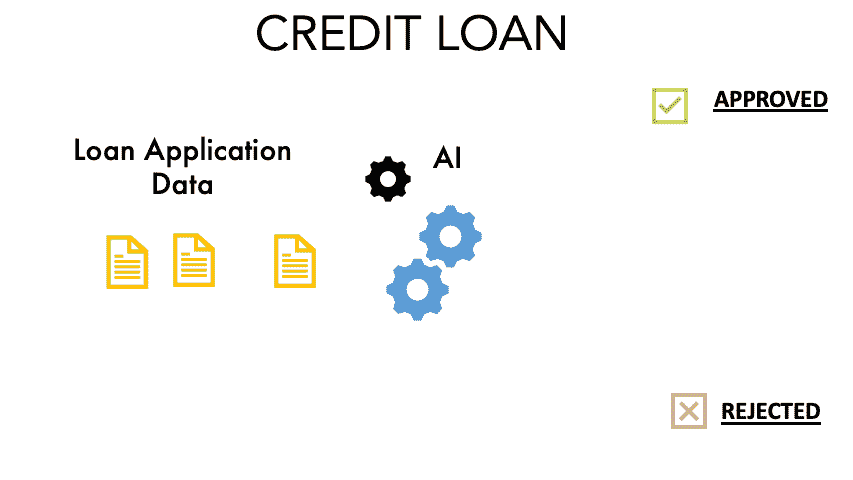

业务内容的图示(作者提供的图片)

贷款申请数据包含以下信息:收入、性别、职业、子女数量、个人是否拥有房屋或汽车等资产。

# **先看**歧视**艾**

人工智能接受训练的数据也具有关于先前贷款是否被接受的决策的历史信息。

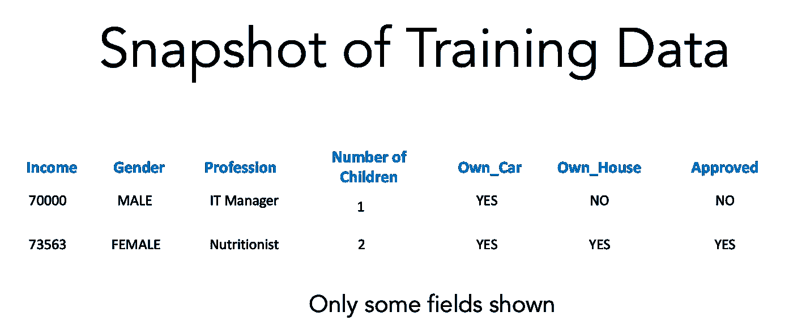

训练数据快照(图片由作者提供)

让我们假设人工智能已经在决策树算法上接受了训练，如下所示。决策树中的每个节点代表数据列和一个阈值。

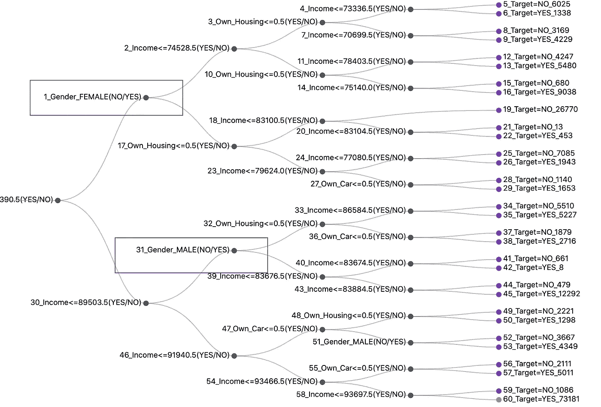

基于决策树的贷款审批 AI 模型(图片由作者提供)

该决策树的输出是“是”或“否”,指示信用贷款是被接受还是被拒绝。现在，当你看到性别 _ 女性或性别 _ 男性等节点时，这已经表明人工智能模型正在区分男性和女性，以做出贷款批准的决定。这是一个可能的迹象，表明这个人工智能是歧视性的。

# 确认大赦国际的歧视性质

现在让我们举一些例子来证实人工智能是否具有歧视性。让我们看看这两个应用程序。一封来自职业为护士的女性，另一封来自职业为销售经理的男性。

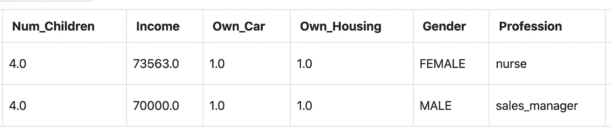

证实 AI 歧视行为的例子。仅显示示例字段(图片由作者提供)

工资水平大致相等，女性的工资略高于男性申请人。两位申请人都拥有一辆车和一栋房子。

现在让我们为两个申请人做贷款批准预测。女性申请人的决策途径如下所示。决定是不批准贷款。你可以看到路径中的一个决策节点是性别是女性。

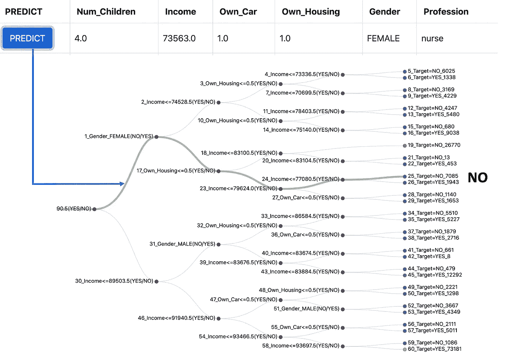

女性候选人的决策路径(图片由作者提供)

现在让我们预测一下男性申请人。下面显示的是决策路径。令人惊讶的是，人工智能的决定是批准，并给出了一个大大的是。

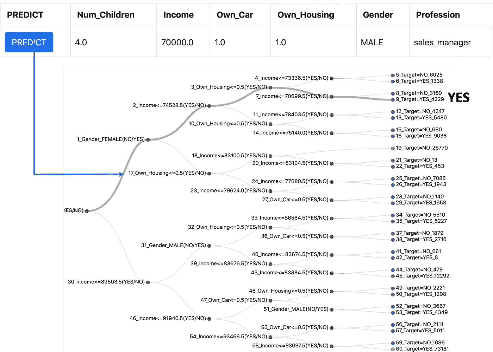

男性候选人的决策路径(图片由作者提供)

尽管两位申请人的收入水平相似，拥有的资产也相似，但女性申请人被拒绝了，而男性申请人获得了批准。

这是一个明显的迹象，表明这是一个歧视性的人工智能。

# 理解为什么这个人工智能是歧视性的

让我们使用 SHAP(Shapely Additive Explanation)分析来深入理解为什么 AI 会做出如此歧视性的决定。这是女申请人的 SHAP 分析。

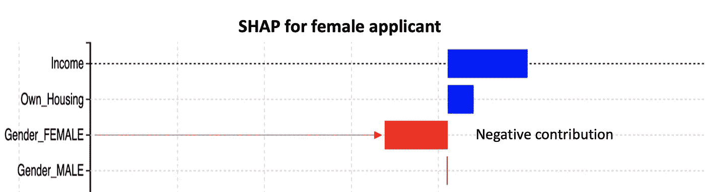

女性申请人的 SHAP 分析

蓝色条表示对信贷批准有积极贡献的因素，红色条表示对信贷批准有消极贡献的因素。收入和拥有房子是积极的贡献，但身为女性有负面影响。

这是 SHAP 对男性求职者的分析。

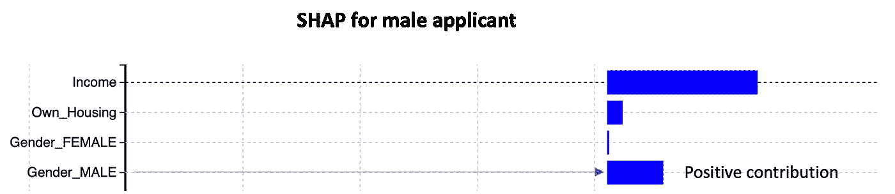

男性申请人的 SHAP 分析

对于男性求职者来说，收入和住房是积极因素，但身为男性也是积极因素。所以很明显，身为女性对女性申请者没有帮助。

# 歧视行为的根源

现在让我们看看歧视行为背后的根源。这是人工智能训练数据的柱状图。X 轴是性别，Y 轴是 AI 的训练数据中的信用贷款批准数。

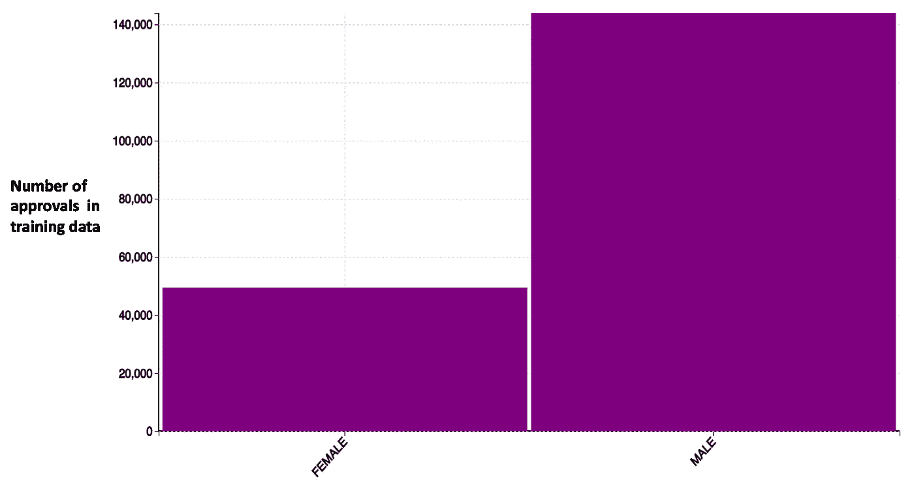

训练数据中的偏差

培训数据中获得批准的男性申请者人数几乎比女性申请者多 3 倍。这被称为“偏见”,这导致了歧视性的人工智能。

# 无性别模式——一种可能的解决方案？

我们可以尝试创造一个没有性别的模型。让我们看看是否有帮助。这是没有性别的决策树模型。它在决策过程中没有性别特征。

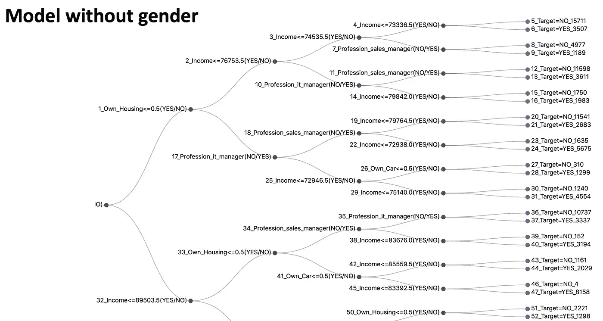

没有性别的决策树模型(图片由作者提供)

以下是女性候选人的决策路径(不考虑性别领域)。决定仍然是不批准信用贷款。

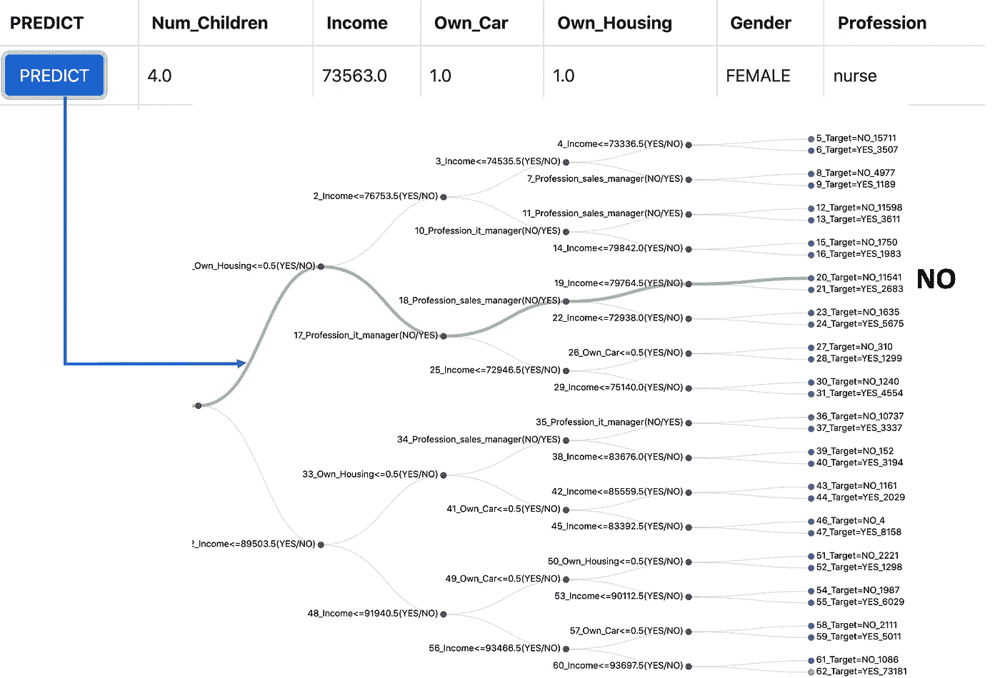

女性候选人在无性别模型上的决策路径(图片由作者提供)

以下是男性候选人的决策路径(不考虑性别字段)。决定是批准信贷贷款。

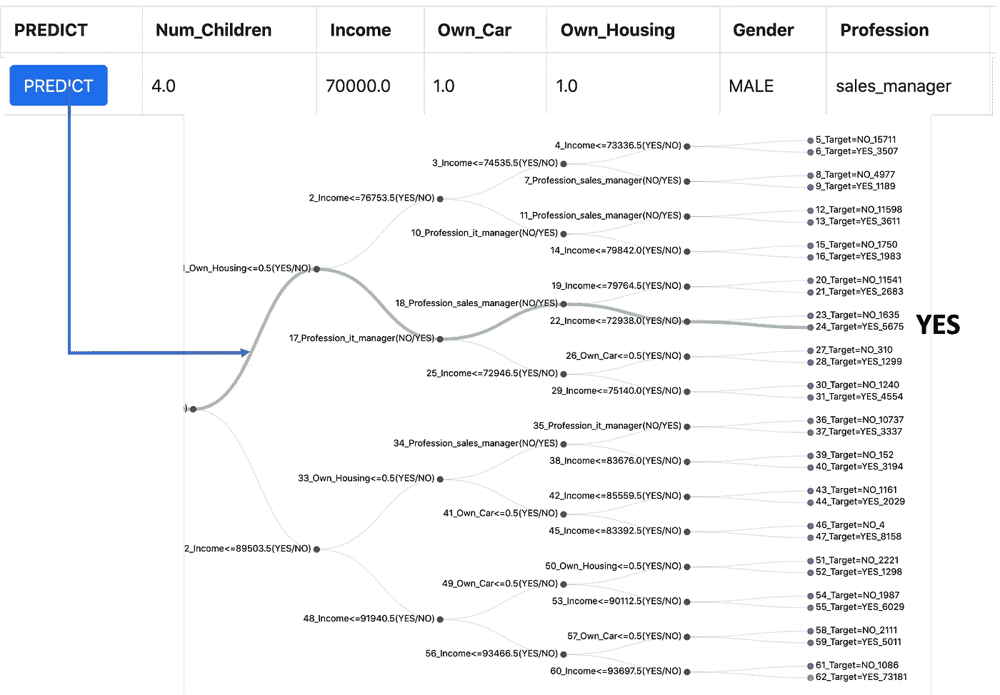

无性别模型中男性候选人的决策路径(图片由作者提供)

所以即使我们去掉了性别，也没有什么变化。为什么会这样？现在让我们再一次使用这里显示的热图来分析 AI 被训练的历史数据。

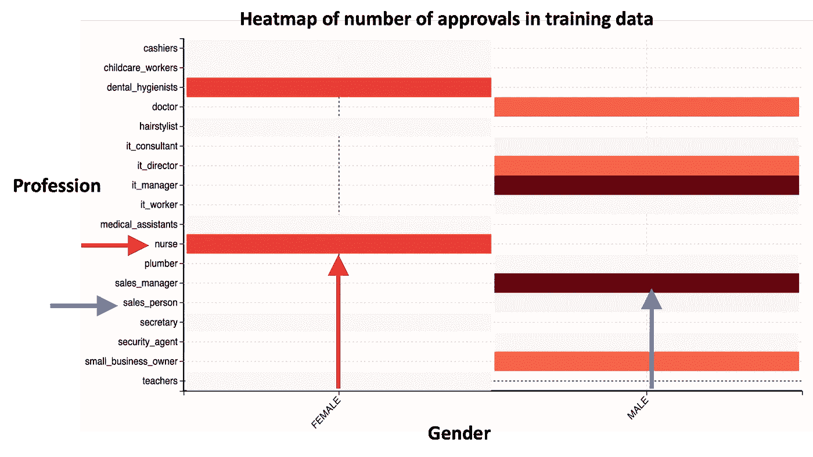

培训数据中批准数量的热图

热图的 X 轴是性别，Y 轴是职业。我们看到人工智能被训练的数据有更多的女性是护士，更多的男性是销售人员。

由于女候选人是护士，申请被 AI 拒绝。同样，由于男性候选人是一名销售人员，申请被 AI 接受。

因此，即使我们去除了性别领域，职业仍然是性别的替代品。

因此，无论有无性别，这两种模式都会导致相同的歧视性结果。

# 数据中性别的平等代表性

歧视性人工智能的解决方案是在用于训练人工智能的数据中男女具有平等的代表性。

> 性别平等原则也需要适用于数据。

# 额外资源

# 网站(全球资讯网的主机站)

你可以访问我的网站进行零编码分析。https://experiencedatascience.com

每当我发布一个新的故事，请订阅保持通知。

<https://pranay-dave9.medium.com/subscribe>  

你也可以通过我的推荐链接加入 Medium

<https://pranay-dave9.medium.com/membership>  

## Youtube 频道

这是我在 https://www.youtube.com/c/DataScienceDemonstrated 的 YouTube 频道
T5 的链接