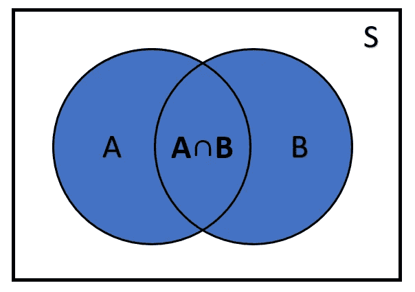
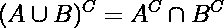
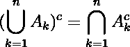
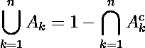
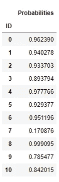

# 概率事件组的联合

> 原文：<https://towardsdatascience.com/union-of-probabilistic-event-groups-b415d23e1a62?source=collection_archive---------35----------------------->

## 如何计算概率事件分组的并集


由 [Unsplash](https://unsplash.com/s/photos/statistic?utm_source=unsplash&utm_medium=referral&utm_content=creditCopyText) 上的 [Edge2Edge 媒体](https://unsplash.com/@edge2edgemedia?utm_source=unsplash&utm_medium=referral&utm_content=creditCopyText)拍摄

概率是对随机实验中某一事件发生的可能性的度量。事件是样本空间的子集(实验的所有可能结果的集合)的表示。随机实验是指我们一遍又一遍地重复类似的过程，但结果却无法预测。

对于两个事件的合并，我们必须有相同的样本空间( **S** )。让我们考虑 A 与 B 的并集 ***(A U B)*** 的两种可能情况。

**A∩B =φ**

如果集合 A 和 B 的联合形成一个空集，即集合没有共同项(**独立事件**)，考虑到样本空间不为零，我们得出如下结论:

**P(A U B) = P(A) + P(B)**

如果集合 A 和 B 之间的联合形成一个非空集，则表明它们有共同的元素(**依赖事件**)，因此这两个集合联合的概率可以定义如下:

**P(A U B)= P(A)+P(B)-P(A∩B)**



作者图片

遵循德摩根 的[T21 定律，证明了两个集合的并的补数等于这些集合的补数的和:](https://en.wikipedia.org/wiki/De_Morgan%27s_laws)



然后，三个或更多集合的并集的补集可以被计算为这些集合的补集的乘积。该等式表示如下:



所以，我们可以得到集合的并集，得到这些集合的补集的乘积的补集。



**申请**

从那里，我们演示了如何从给定数据集的每个组中计算多个集合的并集。数据是随机创建的，考虑到它们代表了一些事件发生的概率，通过 ID 进行分类。在按 ID 分组后，应用 lambda 函数来计算每个组的这些集合的并集。

```
#import libraries
import pandas as pd
from random import seed
from random import random
from random import randint#generate random data
seed(1)
id = []
prob = [] 
for _ in range(30):
    value_id = randint(0, 10)
    value_prob = random()
    id.append(value_id)
    prob.append(value_prob)#create DataFrame
df = pd.DataFrame(prob, id, columns=['Probabilities'])
df.index.name = 'ID'#grouping by ID
g = df.groupby(df.index)#applying union function
g.apply(lambda x: 1 - (1 - x).prod())
```



让我们假设每个概率都代表某个设备发生故障的可能性。另外，假设有 10 种不同的设备类型，您想知道每种设备类型中至少有一种会出现故障的概率。这就是函数所做的，每个 ID 代表这些概率的联合。每个概率将代表至少一个该类型(ID)的设备发生故障的可能性。

**结论**

考虑到德摩根定律，该函数的计算基于多个集合的联合方程。该函数能够聚合概率事件联合中的数据，显示某个事件在每个组中发生的概率。该函数可用于更好地制定决策，提供一种特定的方法来解释数据。

**参考文献**

安迪·海耶斯和胡炜昇。**德摩根定律**。[https://brilliant.org/wiki/de-morgans-laws/](https://brilliant.org/wiki/de-morgans-laws/)