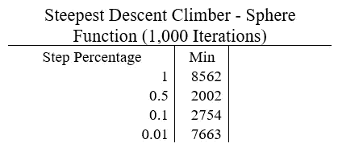

# 单元 1)爬山器—优化

> 原文：<https://towardsdatascience.com/unit-1-hill-climber-optimization-985d5b79bd5?source=collection_archive---------11----------------------->

## 非经典最优化课程

## 涵盖爬山及其许多变种:简单，贪婪，随机，等等！

大家好，欢迎回到这个关于非经典优化的完整课程！在这篇文章中，我们将从第一个算法开始:爬山！如果您是本课程的新手，您可以查看下面的概述！

 [## 非经典优化算法(全部课程)概述

### 简要概述一个新的完整的课程，涵盖三个主要的非经典优化算法:爬山，模拟…

towardsdatascience.com](/non-classical-optimization-algorithms-full-course-overview-8ef7091905b0) 

首先，什么是爬山？爬山属于局部搜索领域，其目标是找到目标函数的最小值或最大值。该算法被认为是局部搜索，因为它通过相对于其当前位置的小步前进来工作，希望找到更好的位置。

# 目录

*   **概述和基本爬山算法**
*   **常见问题**
*   **登山者的变种**
*   **构建我们的实现**
*   **测试目标函数**
*   **代码**
*   **结论**

# 概述和基本爬山算法

爬山者得名于类似于徒步旅行者通过走向山的下一个最高部分爬到山顶。徒步旅行者不是走下山坡到达山顶，而是向山坡迈一步，使得下一步在海拔上比前一步更高。

我们可以通过从当前位置向不同的方向步进，并向最大化目标函数(或以最小化的方式最小化)的方向移动，将这种思想带到优化领域！因为爬山器总是向比当前位置更好或相等的位置移动，所以爬山器被认为是一种**贪婪算法**。例如，如果给我们下面的二维问题:

作者图片

我们的目标是找到最大值点，它出现在(0，0)。爬山者如何找到最高点？首先，我们选择一个随机的初始点，在每个可能的方向上迈出一步，然后移动到函数值最高的位置。对于这个问题，我们对每个位置有八种可能的移动。两个仅用于在 **x** 方向移动(正向和负向)；两个仅用于在 **y** 方向移动(正向和负向)；四个用于在 **x** 方向(正向和负向)和 **y** 方向(正向和负向)移动。在我们测试了接下来的八个位置后，我们选择一个最佳的位置。下面左手边描绘的就是这个场景。我们的初始点是红色的，周围的八个彩色点是可能的前进方向。但是，请注意，步进的方向是黄色的左上角点，因为它产生了最佳值。我们简单地重复这个过程，直到收敛。在右手边我们有一个首字母

例如，下面左手边的图片。我们的初始点是红点。我们可以在蓝色向量中看到爬山者在蓝色点达到最终全局最大值之前的步伐。

基本的爬山算法可以描述如下。首先，我们随机选择一个初始状态，然后我们选择不同的变量来步进，步长，然后测试所有生成的新位置。测试后，我们选择最佳位置，并重新开始该过程。当我们的算法已经达到用户定义的最大迭代次数时，或者当算法停滞/收敛时，终止发生:当在指定的迭代次数之后当前位置没有改变时。

# 常见问题

当实现算法的基本版本时，会出现三个常见问题:

1.  对于多维问题，我们在步入之前选择测试多少个变量？
2.  每个方向的步长应该是多少？
3.  卡住的问题

如果我们有一个 n 维目标函数，存在**个 2^n** 个可能的状态移动要考虑。对于上面在三维高斯分布中给出的例子，有 8 个可能的移动，2 = 8。这呈指数增长的原因是，我们必须考虑“对角线”移动，即我们在考虑多个变量而不是一个变量之间的相互作用的方向上移动。现在显而易见的问题是，当 n 大于 15 左右时，在每个时间步长评估 **2^n** 点是一项极其昂贵的任务。我们可以通过不考虑“对角线”状态来减少这种情况；相反，我们只考虑单变量移动。在这个框架中，假设没有对角移动，有 **2*n** 个可能的单态移动(每个变量向前和向后)。这样，对于贪婪的方法，我们需要在选择最佳状态之前测试出 **2*n** 个可能的状态。对于大的状态空间，或者当我们允许有限数量的函数求值时，对于较大的 n，这也会消耗时间。处理这个问题的一个常见方法是通过简单地从给定的变量集中随机抽取样本，并且只测试那些变量中的步骤，来减少要步进的变量的数量。

另一方面，步长是一个棘手的问题。大步长可以覆盖地面，但通常会跳过最小值或最大值。小的步长可以通过不跳过最大值或最小值来确保算法具有良好的收敛性；然而，如果当前位置很远，那么在算法到达该位置之前，将需要多次迭代。我们稍后将讨论这一点。

因为爬山器是局部搜索，所以在存在许多局部最优的高度模态函数中，它很难找到最优/全局最小或最大点。使用标准算法，该算法没有能力逃脱这些局部陷阱。此外，如果达到所有邻近点都具有相同函数值的平台，则该算法将收敛，因为如果它们都具有相同的结果，则该算法将不知道要进入哪个方向。

# **爬山器变体**

如上所述，有三个常见的问题困扰着爬山者。作为回应，已经开发了许多变体来处理这些问题。到目前为止，针对爬山者描述的算法被称为**最陡爬坡爬山者、**，其中传统的**简单爬山者**逐个测试每个位置，并选择第一个产生更好值的位置，而不是测试所有相邻位置并移动到最佳位置。**随机爬山器**是另一种流行的变体，它根据概率选择并移动到一个位置。这是三个众所周知的变体——下面将要描述的其余变体没有传统的名称。

一个真正的贪婪方法将不得不在每次迭代中评估 2^n 或者 2*n 个可能的位置，这取决于是否允许对角线。如前所述，当 n 较大时，这会浪费计算时间。为了减少这种情况，我们既可以检查单个随机变量，也可以检查几个随机变量。这可以称为**随机变量选择爬山法。**

另一方面，假设我们总是选择评估所有 2*n 个可能的位置，那么我们的算法将总是从初始点到收敛确定性地遵循相同的精确路径，因为它将总是选择局部最佳邻居。当算法陷入局部最优时，这可能是有问题的。为了引入方差，算法可以移动到由它们的函数值概率确定的位置。以下面的例子为例，我们有五个可能的邻居。我们计算它们的函数值，并将每个值除以函数值之和，以获得一个概率:

作者图片

现在，在选择最大的 F(x)值时，我们不再总是选择邻居 2，而是从给定的概率中进行采样，以给路径增加一些方差。这可以称为**随机邻居选择爬山法**。明显的缺点是需要更多的迭代才能收敛到一个点；然而，包含的方差可能是跳出局部最优所需要的。

步长的选择对算法的收敛性和质量有很大的影响。保持步长静态简化了事情，但是不允许算法适应环境。一种解决方案是使用步长缩减计划，以允许在探索的早期使用较大的步长，在实现收敛的后期使用较小的步长。存在许多不同的缩减计划，从线性、指数、余弦到均匀。这些变体可以被称为**预定步长的爬山者**。

# **构建我们的实现**

对于我们的实现，我们将创建两个不同版本的 Hill Climber。首先，我们将创建经典的**最陡爬坡机，**它将创建 2*n 个可能的邻州来进行评估，然后选择最佳的邻州。第二，我们将混合使用**预定步长**和**随机变量选择**。我们的算法不是在当前位置测试每一个可能的步骤，而是在每次迭代中随机选择一组变量，并为这些选择的变量测试步骤。对于调度步长，我们的算法将采取随机步长，通过**统一步长**在所选变量中向前或向后。统一步长的工作原理是在两个值之间采取统一的随机步长。例如，我们从 **U(-0.1，0.1)** 中取一个随机值，将其用作步长。

对于我们的**最陡爬坡者**，我们需要定义一个步长。因为每个变量的域可能不同，所以我们不能假设一个全局的静态步长；相反，我们需要为每个变量定义一个步长。经典的方法是对每个变量取总域大小的百分比步长。例如，假设在一个 2 输入维度问题中，我们对 **x=[-5，5]** 和 **y=[0，15]** 有以下域边界。因此，我们的变量的下界将是 **[-5，0]** ，而上界将变成 **[5，15]** 。我们可以创建**总界限**，衡量每个变量的定义域空间有多大，用每个变量的下界减去上界: **[5-(-5)，15-0] = [10，15]** 。然后我们取百分比步长，比如说 **0.01** 。然后 **0.01*[10，15]=[0.1，0.15]** 。这些是我们现在对于各个变量的步长， **0.1** 对于 **x** 和 **0.15** 对于 **y** 。以下是最陡爬坡的实现:

对于我们在**预定步长**和**随机变量选择**之间的混合的第二个实现，我们需要启用一些微小的修改。首先，我们将只从可能的变量中选择一个随机样本，而不是检查所有可能的 2*n 个可能的邻居。此外，我们将实现**统一步长**，而不是通过静态步长进行加减，这将在步长之间加减一个统一的随机值。下面是实现过程:

# **测试目标函数**

现在是时候在一些真实的目标函数上测试我们的两个实现了！如果你还记得课程概述页面，我们将在三个函数上测试我们的算法:**球体**、**舒伯特**和**蛋架**——每个函数的目标都是找到全局最小值。球函数的全局最小值对舒伯特来说是 **F(X)=0** ， **F(X)=-12870.88** (不同 n 的变化)，对蛋架来说是 **F(X)=-959.64** 。球是一个凸函数，没有局部最小值，而舒伯特和 Eggholder 都是高度模态的，有许多局部最小值和最大值。

对于 Sphere 和 Shubert，我们将测试 n=1000，并允许 100，000 次函数求值。因为算法的每次运行都依赖于初始随机位置，所以将对每个函数重新运行 30 次，并将保留平均结果用于比较。此外，将在以下值测试步长百分比:**【1，0.5，0.1，0.01】**。现在，人们应该注意到，步长百分比 1 对于爬山者的局部搜索来说是非常大的，因为步长的最大值大到足以跨越整个域；然而，每当我们测试我们的统一步长时，这将帮助我们创建探索，因为步长是从整个域中统一采样的，而不是静态的。

# 测试最陡下降

首先，让我们测试我们的**最速下降**算法。因为该算法测试 2*n 个可能的邻居，并且 n=1000，所以每次迭代将测试 2000 个函数评估。因此，最大迭代次数为 50 次。结果如下:

正如我们所看到的，只有 100，000 个函数评估，最速下降攀岩者找不到最小点，甚至接近实际的全局最小点。这可能是因为我们只运行了 50 次迭代，让我们运行 1000 次迭代:相当于 200 万次函数求值！结果如下:

即使我们运行了 20 倍以上的迭代，最终找到的最小点仍然远离实际的全局最小点。请注意，对于球体函数，步长百分比为 0.5 和 0.1 时性能最佳，而对于舒伯特函数，步长百分比为 1 时性能最佳。这表明，步长百分比是另一个需要针对特定问题进行调整的超参数。

# 用均匀步长检验随机变量

现在让我们用统一的步长测试我们定制的**随机变量！为了简单起见，我们将只在 10 个变量中创建邻居，这本身也是另一个需要优化的超参数。因此，在每次迭代中，我们将测试 10 个邻居，每个随机采样变量一个，相当于每次迭代 10 次函数求值。因此，最大迭代次数将是 10，000，以达到最大 100，000 次函数计算。结果如下:**

正如我们所看到的，这个爬山器的自定义实现比传统的随机下降爬山器做得更好。这展示了随机步长的威力。尽管我们在这里使用了 uniform，但也可以从高斯分布或任何其他类型的分布中进行采样。球函数的最佳步长百分比是 0.1，而舒伯特函数的最佳步长百分比是 1 和 0.5。为了保持事物的相似性，让我们看看该算法在 200 万次函数求值中的表现如何:

正如我们在上面看到的，在 200 万次评估中，全局最小值几乎是在球面函数的步长百分比为 0.01 和舒伯特函数的步长百分比为 1 的情况下找到的。

# 测试蛋架功能

有人可能会反对最速下降由于域空间的高维数而表现不佳，在前两个目标函数中 n=1000。相反，让我们在 2 维输入 Eggholder 函数上测试这两种算法，限制为 1000 次函数求值。结果如下:

正如我们从上面可以看到的，最速下降法在寻找一个好的最小值方面做得很好，但是平均值相对较差，并且标准偏差较大。另一方面，习惯爬山的平均值是最陡下降的两倍；此外，它还具有较低的标准偏差和绝对最小值。

# **代号**

如果你对上面的算法感兴趣，在我的 GitHub 资源库中可以找到这门课的所有代码！

 [## 非经典优化/第 1 单元:主要学生的爬山者/非经典优化

### 通过在 GitHub 上创建帐户，为学生/非经典优化开发做出贡献。

github.com](https://github.com/OUStudent/NonClassicalOptimization/tree/main/Unit%201:%20Hill%20Climber) 

# 结论

总之，爬山法是一种在机器学习中发现的局部搜索方法，用于优化-找到目标函数的全局最小值或最大值。登山者有许多变种，因为其经典形式的斗争。在这篇文章中，我们比较了经典的最速下降爬山器和定制的随机变量选择器以及统一步长的爬山器。后者在三个非常高级的目标函数上优于前者:球体、舒伯特和蛋架。

请继续关注本系列的下一单元，我们将讨论模拟退火！