# 单元 1)最优化理论

> 原文：<https://towardsdatascience.com/unit-1-optimization-theory-e416dcf30ba8?source=collection_archive---------10----------------------->

## 进化计算课程

## 最优化理论和四种主要最优化问题的概述

大家好，欢迎回到进化计算的完整课程！在这篇文章中，我们将从课程的第一单元开始，最优化理论。在上一篇文章中，我们介绍了课程的基本概况，你可以在这里查看:

 [## 进化计算(完整课程)概述

### 关于我将在这个全新的系列中涉及的材料、概念和应用的介绍性帖子！

towardsdatascience.com](/evolutionary-computation-full-course-overview-f4e421e945d9) 

首先，最优化理论到底是什么？最优化理论是数学的一个分支，致力于解决最优化问题。优化问题是数学函数，我们希望最小化或最大化函数值。这类问题在计算机科学和应用数学中大量存在。找到这些问题的良好解决方案是赋予数据科学和机器学习模型良好准确性的原因，因为它们本身是建立在用于找到良好解决方案以最小化误差函数的数值方法之上的。机器学习中常见的优化问题的例子是最小化 MSE、MAE、交叉熵等。

# 目录

*   概观
*   无约束问题
*   受限问题
*   多解问题
*   多目标问题
*   基准测试功能
*   结论

# 概观

简单地说，最优化理论可以归结为三个问题:

1.目标函数是什么？

2.感兴趣的变量集是什么？

3.约束集是什么？

在选择算法时，了解你的目标函数在维数、定义域和局部极值计数方面的情况是至关重要的。此外，有必要了解每个变量的数据类型:离散型还是连续型？最后，了解约束集对于限制您的算法在域空间中只搜索可行解是很重要的。

如果你还记得微积分，optima，也称为临界点，是定义域空间中的点，使得函数在该点的斜率为零。这些点通常被称为极值，分为最小值或最大值。极值可以分为三四种主要类型:

1.弱极值

2.强极值

3.全局极值

4.鞍点

作者图片

弱极值是临界点，使得周围的相邻点具有相同的函数值，从而创建一个平台(如上图所示)。强极值是临界点，它具有相邻点的最大(最大化)或最小(最小化)函数值，从而形成山谷或山脉。全局极值是强极值点，使得它的函数值对于所有强极值点是全局最大的(对于最大化)或最小的(对于最小化)。最后，鞍点，我们不会在课程中过多讨论，但它们确实存在。鞍点代表向上凹和向下凹趋势之间的拐点。因为我们不会处理鞍点，所以我不会涉及太多他们的直觉。

有四种主要类型的优化问题，无约束、约束、多解和多目标。

# 无约束问题

无约束问题就像他们听起来的那样，无约束。在这些函数中，给定一组变量，其定义域是连续的、离散的或两者兼有，我们希望最小化或最大化函数。这里我们有一个定义:

作者图片

# 受限问题

就设置而言，约束问题类似于无约束问题，但是具有输入空间的唯一约束。这里我们有一个定义:

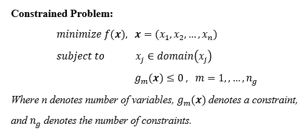

作者图片

作为一个说明性的例子，下面我们有一个这些组件的例子。首先，我们有由 **A** 表示的目标函数。然后我们在右下角的点 **E** 得到全局无约束最小值。然而，我们引入由线 **D** 表示的不等式约束，其中在方格区域中的任何值都是不可行的。因此，我们只剩下领域的一部分来处理。点 **B** 和 **C** 是可行域空间中的两个临界点。然而，约束环境中的下一个全局最小值将在点 **F** 处。因此，在这种情况下，我们希望我们的算法避开不可行域空间，找到下一个最佳最小值。

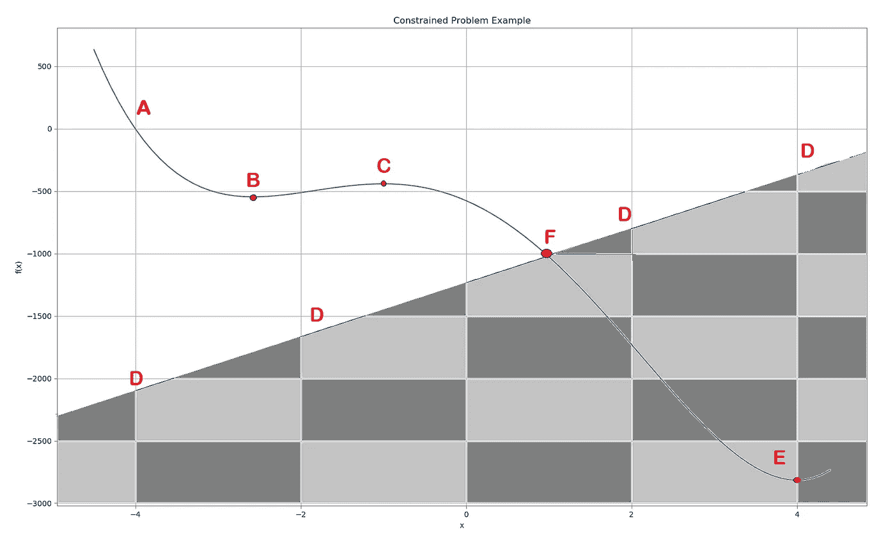

作者图片

下面我们有一个在约束环境中两个变量之间的定义域空间相互作用的例子。这里我们可以看到 X 和 Y 是连续变量，范围在 0 和 2 之间。然而，我们添加了一个约束，使得当 X 趋向于 2 时，Y 减小；但是如果 Y 趋向于 2，X 开始减小。这可以通过蓝色半环看出，蓝色半环代表可行输入空间，透明背景代表不可行域空间。

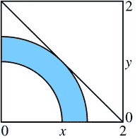

[https://en.wikipedia.org/wiki/Nonlinear_programming](https://en.wikipedia.org/wiki/Nonlinear_programming)

# 多解问题

多解问题是不存在唯一全局极值的函数；取而代之的是捆绑在一起的全球解决方案。在这些情况下，我们希望返回所有绑定的全局解决方案(因此称为多解方案),以便我们有一系列选项可供选择。在实际应用中，我们可能希望最小化某种类型的成本函数，我们发现存在多种解决方案。我们的目标是返回这些多解，以便我们能够选择变量值的哪个点或向量最符合我们的兴趣。这里我们有一个确切的定义:

作者图片

下面我们有一个多解类型问题的例子。它是正弦波函数的一个变体。正如我们所看到的，我们已经找到了这个问题的全局最小值和最大值。然而，请注意，并不是所有的多解问题都像正弦波一样周期性地出现，在正弦波中很容易预测下一个值，这些束缚的全局极值很可能在整个域空间中是虚假的，并且没有模式。

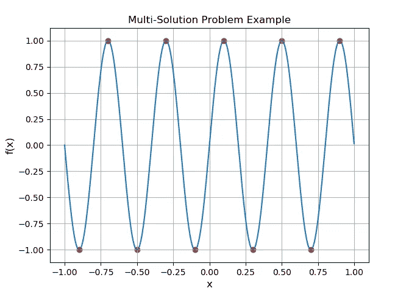

作者图片

# 多目标问题

多目标问题(MOP)是指我们有许多不同的目标，或者优化问题，我们需要同时解决。解决这类问题有两种主要方法:

1.加权聚合

2.帕累托最优

**加权聚合**是所有目标函数的简单聚合。我们简单地对每个目标函数求和，乘以相关的权重值，并尝试最小化或最大化该和。通常假设权重之和等于 1。这里我们有一个示例聚合函数，我们希望同时最小化 F1 和 F2。请注意，每个函数都有一个关联的权重值，其中较大的权重值表示哪个函数的影响最大。

作者图片

下面是加权聚合的确切定义:

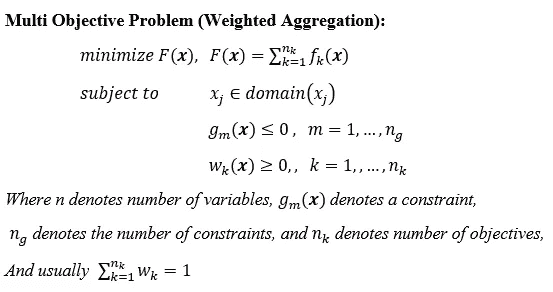

作者图片

**帕累托最优**是通过在支配结构中对可能的解决方案进行分类来解决 MOP 的另一种方法。支配是区分好的解决方案和坏的解决方案的一种方式。支配主要有两种类型:强势和弱势。当一个可能的解决方案在所有目标上等于或优于另一个可能的解决方案，并且至少在一个目标上优于另一个可能的解决方案时，强支配就发生了。这是教科书上的确切定义:

作者图片

另一方面，弱控制表明一个可能的解决方案在所有目标上并不比另一个解决方案差。这里有一个确切的定义:

作者图片

作为这两种支配类型的例子，这里我们有一个教科书上的数字，其中有些数字被我夸大了:

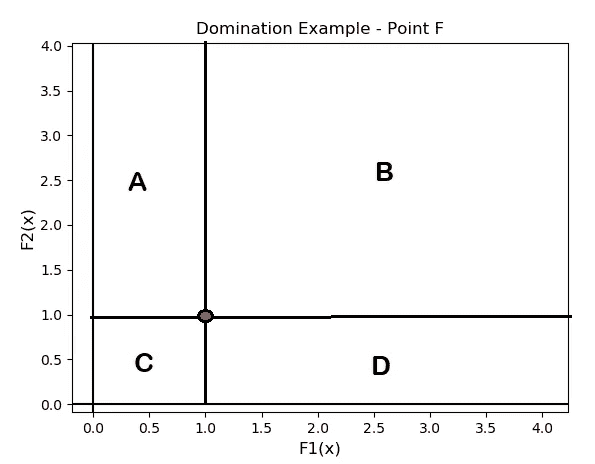

作者图片

x 轴上是 F1 值，y 轴上是 F2 值。在这种情况下，我们希望最小化 F1 和 F2，因此当 F1 == F2 == 0 时，绝对最佳解出现在原点。点 F 用红色圆圈表示在左下方。首先我们有所有被 F 强支配的点，被 b 部分支配，这些点被 F 强支配，因为它们在 F1 和 F2 中有更差的值。另一方面，A 和 D 部分仅受 F 的弱支配，因为它们至少在一个目标上有更好的值。部分 A 在 F2 方面比 F 差，因为它的函数值较大，但在 F1 方面比 F 好，因为它的函数值较小。D 部分则相反，它在 F1 方面比 F 差，但在 F2 方面比 F 好。最后，我们有 C 部分，它支配着 1、2、4 部分和 F 点，因为这一部分至少在一个目标上优于所有其他功能，同时与其他目标相等或更好。

引入支配这个概念的全部目的是找到**帕累托前沿**。Pareto-Front 是一组决策向量，使得每个向量弱地支配彼此，但是强地支配输入空间中的所有其他向量。这里我们有一个两个目标的帕累托前沿的例子:

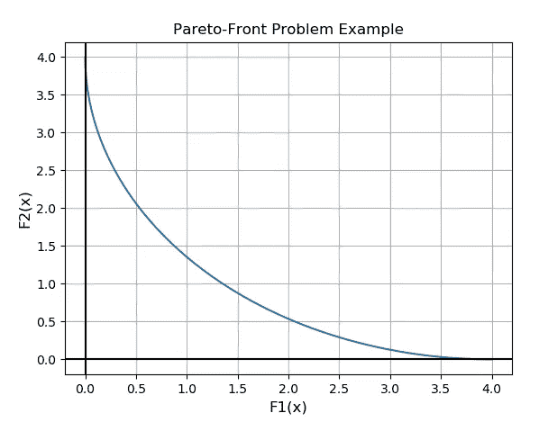

作者图片

我们可以看到，当 F1 == F2 == 0 时，最小值出现；然而，问题是 F1 的最小点可能和 F2 的不一样。因此，我们得到了一系列可供选择的值。如前所述，Pareto 前沿弱支配自身，而强支配域空间的其余部分；通过这种方式，返回前端使用户能够选择最适合其需求的解决方案。例如，如果 F1 对最小化 F2 更重要，那么你可以选择有利于 F1 的弱劣解。这是另一个离散问题的帕累托前沿的例子:

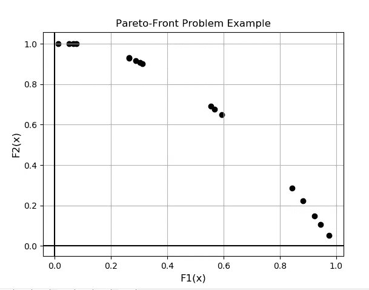

作者图片

我之所以包括上面这张图片，是为了展示帕累托前沿并不总是像以前一样是一条漂亮的凸曲线，而是可能是零星的，难以预测的。

# 基准测试功能

基准测试函数是为测试算法而设计的数学优化问题。这些都是人为设计的问题，没有应用，但设计的方式使它们比真实世界的应用“困难”或更“困难”。在文献中，不是基于可能需要关于主题的广泛领域知识的某些应用来比较算法；研究人员通常通过在这些基准测试函数中找到全局极值的能力来比较函数。有许多不同类型的基准测试函数，下面是文献中常见的三种测试函数:

作者图片

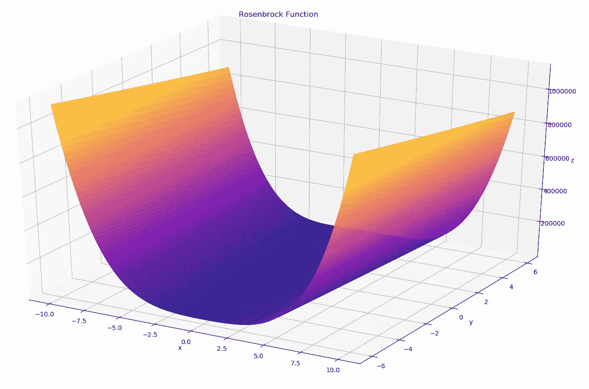

作者图片

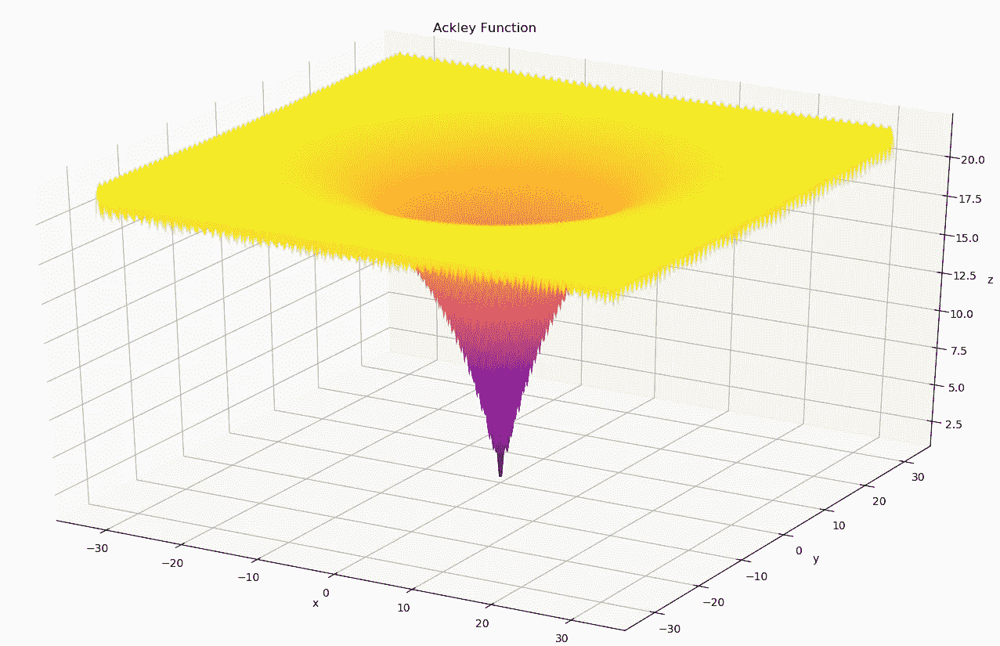

作者图片

在课程的后面，我们会在这样的测试函数上测试我们的算法。

# 结论

总之，最优化问题可以分为四个不同的类别。边界固定不变的无约束问题。区域根据变量值变化的约束问题。多解问题，其中没有唯一的全局最小值/最大值，我们希望返回所有值。最后，我们希望找到帕累托前沿的多目标。

优化问题在众多研究领域中极其丰富，无论是从交通调度、基于不同变量的最大化生产、高效用电到神经网络训练、游戏建模，还是优化数据科学模型。这些情况下的目标是最小化或最大化优化函数，其中每个最优值代表一个可能的解决方案。然而，我们不仅仅想要一个可能的解决方案，我们想要最好的解决方案，全局最小值或最大值。那么我们如何找到这些全局极值点呢？我们可以使用标准的数值方法，如牛顿法或共轭梯度法；或者我们可以使用其他优化方法，如蛙跳法、爬山法或模拟退火法。在本系列中，我们将介绍如何使用进化计算来寻找这些全局极值。

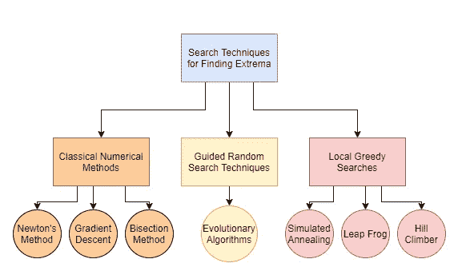

作者图片

为什么我们要首先使用进化计算而不是经典的优化技术呢？经典优化算法的问题通常是它们是确定性的，也就是说你给它相同的初始点，它总是给你相同的输出，它也是顺序的，也就是说算法一次只能使用一个点，它可能需要微分信息，特别是一阶和二阶导数。另一方面，进化计算是一种随机搜索方法，这意味着如果你给它输入相同的初始点，它不能保证输出是相同的，无论是好是坏，它也通过与初始点群体而不是一个群体一起工作来使用并行搜索，当问题不可微时，它工作得非常好。由于这些原因，进化计算通常用于解决 NP 难问题，如旅行商或调度，或者当优化函数不可微时。

单元 1 的优化理论到此结束，请继续关注单元 2 的进化计算介绍，这是一种解决优化类型问题的方法:

 [## 单元 2)进化计算简介

### 进化计算和遗传算法概述！

towardsdatascience.com](/unit-2-introduction-to-evolutionary-computation-85764137c05a)