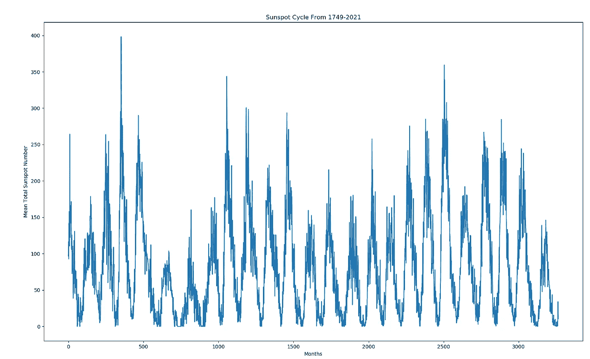
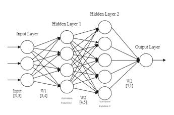
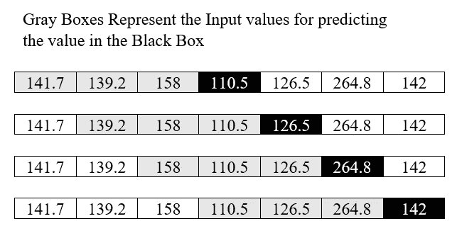
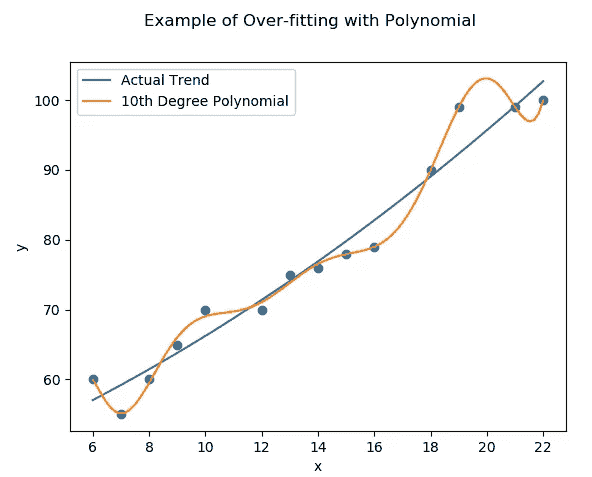
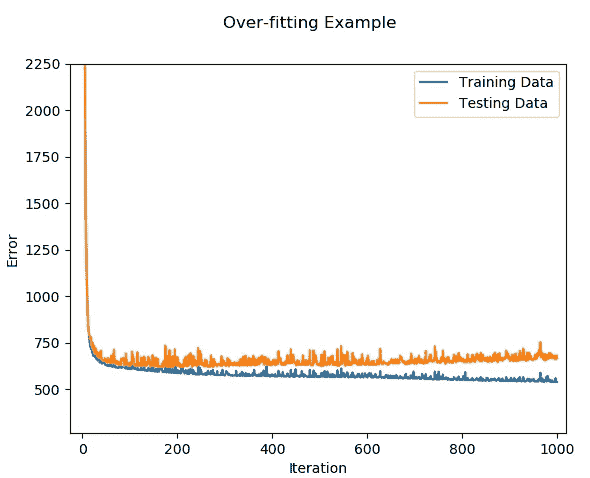
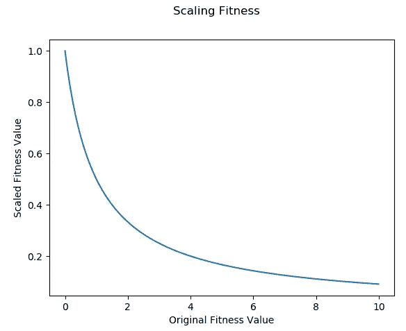
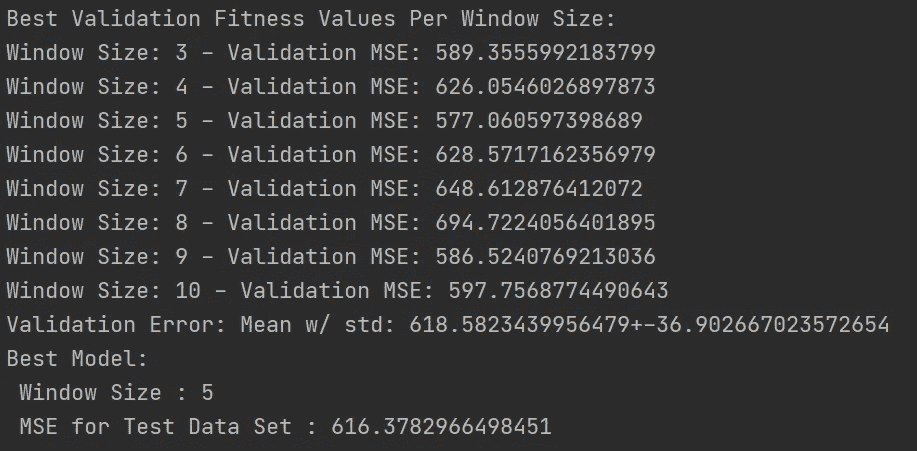
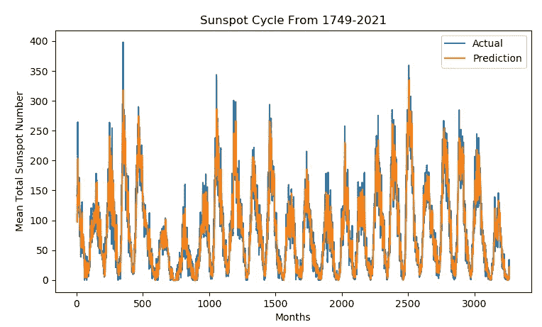
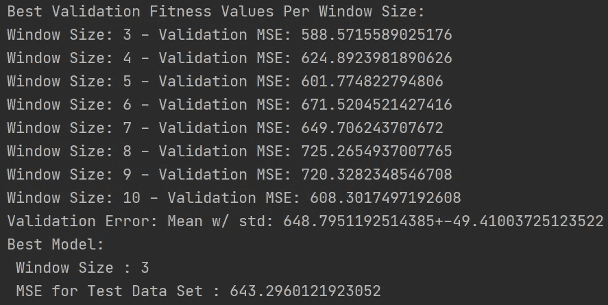
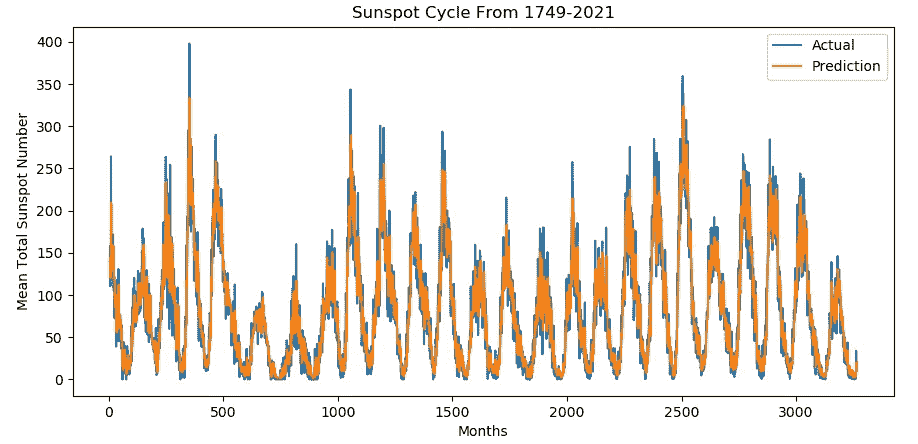

# 单元 3 应用)用于时间序列分析的进化神经网络

> 原文：<https://towardsdatascience.com/unit-3-application-evolving-neural-network-for-time-series-analysis-63c057cb1595?source=collection_archive---------23----------------------->

## 进化计算课程

## 第三单元的高潮是应用我们的概念来发展一个预测时间序列问题的神经网络

大家好，欢迎回到进化计算的完整课程！在这篇文章中，我们将总结第 3 单元，这是一个非常令人期待的应用，为时间序列分析进化神经网络的权重！

为了更好地理解本材料，你需要知道的概念和材料是神经网络如何工作的基础，进化计算的全面概述，以及遗传算法如何工作。如果这是您第一次看到这个系列，请阅读我以前写的这两篇文章，以便您能够最好地理解我是如何开发我将很快详述的算法的:

 [## 单元 2)进化计算简介

### 进化计算和遗传算法概述！

towardsdatascience.com](/unit-2-introduction-to-evolutionary-computation-85764137c05a)  [## 单元 3)遗传算法(第一部分)

### 遗传算法概述—主要是交叉和变异算子

towardsdatascience.com](/unit-3-genetic-algorithms-part-1-986e3b4666d7) 

# 目录

*   时间序列问题
*   神经网络综述
*   实现我们的神经网络
*   神经网络的设计
*   培训、验证和测试数据集
*   遗传算法
*   评估我们的算法
*   通过反向传播训练的神经网络进行比较
*   最终代码和视频实现
*   结论

# 时间序列问题

时间序列分析是指任何一系列的数据，其中的数据是按时间顺序排列的。时间序列分析非常适用于许多场合，从经济到天气预测和预报。我们将要分析的问题是太阳黑子时间序列数据集。太阳黑子周期是发生在太阳上的太阳磁场活动。自 1749 年以来，太阳黑子的月平均数就有记录。我们的问题是要看看我们能多好地模拟这个时间序列问题，并预测未来的月平均数。这里我们看到了时间序列数据集在其整个生命周期中的样子:

作者图片

你可以在 Kaggle 网站上找到这些数据:

 [## 雀斑

### 月平均太阳黑子总数-1749 年至 2018 年 7 月

www.kaggle.com](https://www.kaggle.com/robervalt/sunspots) 

# **神经网络综述**

我们将尝试通过前馈神经网络来解决这个问题。人工神经网络是受生物神经网络(大脑的基本单元)的启发而产生的。这些模型能够执行分类、回归和其他技术。神经网络在机器学习和人工智能中已经变得非常普遍，因为它们在许多问题类型中取得了意想不到的成功。因为我们将大量涉及神经网络，我将简要概述它们是如何工作的。如果你有任何使用神经网络的经验，请随意跳过这一部分，因为它主要是回顾。

神经网络的体系结构分为三个部分，即隐藏层数、每层的节点数和每层的激活函数。每层之间的权重由矩阵表示。我们可以在下面的基本示例中看到，我们有三个输入节点(意味着三个变量)，第一个隐藏层中有四个节点，第二个隐藏层中有五个节点，还有一个输出。

作者图片

我们用一个权重来表示两个神经元之间的每一个连接，这个权重可以组合起来形成一个矩阵。因此，我们的输入是一个[N，3]矩阵，N 代表我们想要传递的观察值的数量，3 是变量的数量。通过我们的网络向前传递就是简单地将矩阵相乘，在每一层应用我们的转移函数，然后得到我们的结果。图中没有列出的一个关键因素是各层的偏置矢量。偏差是在激活函数之后添加到每个观测值的[1，M]向量，其中 M 是该层的节点数。

神经网络通常通过某种形式的反向传播来训练；其中当前误差(MSE 或交叉熵)从输出层传播回整个隐藏层，以调整权重，使得它们最小化误差。然而，在我们的应用中，我们将使用遗传算法来训练权重，而不是使用反向传播。

# 神经网络的设计

对于我们的问题，如何用一个神经网络来预测一个时间序列问题？对于一维时间序列问题，你只有一个单一的变量和一个时间指数，你怎么能预测基于时间的变量呢？在神经网络中解决时间序列问题的最常见实现是使用所谓的**递归神经网络。****递归神经网络是一个的网络，其中有一个来自输出的递归层，它被反馈到输入层，用于在随后的时间索引处的下一个值。然而，绕过这个实现的一个简单方法是简单地使输入层成为一个“窗口”,它跨越当前值之前的一些索引值。**

****

**作者图片**

**以上图为例，这里我们有一个时间序列问题的子集。我们的目标是预测黑盒中的值。对于第一行，我们希望预测值 110.5，这可以通过将 141.7、139.2 和 158 作为神经网络的输入来实现。注意，在上面的例子中，我们的“窗口”大小是三。我们将使用之前的值(不包括当前值)作为预测的输入变量。窗口的确切大小取决于问题，通常需要测试。对于我们的问题，我们将测试不同的窗口大小。为了简单起见，我们的神经网络将有三个隐藏层，每个层有 5 个隐藏节点和 ReLU 激活函数。然而，输入的数量将根据“窗口”的大小而变化。**

# ****实现我们的神经网络****

**因为我们将进化神经网络的权重，所以我们需要从头实现一个，因为在常见的 Python 实现中，这需要大量的操作。我们将实现我们的网络，以适应任意数量的层和每层的节点，但将只有每层的 ReLU 激活功能。我会试着解释下面的代码，但它处理神经网络矩阵乘法的细节，这可能会变得非常快；所以现在，如果你不明白它到底是如何工作的，不要担心，因为这不是本文的重点。**

# **培训、验证和测试数据集**

**所有机器学习模型最常见的失败被称为**过度拟合**。当我们的模型有如此多的可调参数，以至于它开始记忆输入时，就会发生这种情况。因此，当预测一个它从未见过的值时，它的表现比它被训练的值差。下面是一个过拟合的例子，我们可以通过简单地增加多项式的次数来人为地最小化残差的误差；然而，这种预测对于数据来说是极度超参数化的，并且不能准确地代表实际趋势，因此对于以前没有见过的数据来说是极其错误的。**

****

**作者图片**

**所有机器学习和数据科学的目标都是创建简单但强大的模型，这些模型可以适应并准确地插入新值。有许多不同的方法来防止神经网络中的过拟合，从**丢弃层**到**交叉验证**；然而，最常见的仅仅是**提前停止**。为此，我们可以将数据集分为两个主要部分，训练数据集和测试数据集。我们使用我们的**训练数据集**来训练我们的模型，然后使用**测试数据集**来测试它的性能。这样，我们在我们的训练集上训练，一旦我们开始看到过度拟合，这意味着我们的测试集中的误差开始增加，我们就停止我们的算法。这就是所谓的**提前停止。**如下所示，我们的模型开始过度拟合训练数据，因为训练误差仍在减少，但测试数据停滞不前，并开始略有增加。在几次迭代之后，当我们的测试数据误差增加了某个值时，我们需要执行早期停止，以确保我们防止过度拟合。**

****

**作者图片**

**然而，这有一个关键问题，当我们的模型开始在我们的测试数据集上产生更坏的错误值时，我们就停止训练；这样，我们实际上已经在测试和训练数据集上训练了我们的模型，因为当我们的模型在测试集上表现更差时，我们已经停止了。这正是我们一开始想要摆脱的…为了解决这个问题，我们可以引入**验证数据集**，它取代了早期停止中的测试数据集。我们现在将数据集分成三部分，训练集、验证集和测试集。我们在训练集上训练我们的模型，然后我们使用验证集执行早期停止、参数调整和模型比较。在我们选择了最终模型及其最终架构之后，我们才评估测试数据集。通过这样做，我们可以确保我们的模型从未见过测试数据集中的值，以便获得我们模型的准确评估。**

**这些是重要的概念，当我们为我们的神经网络实现遗传算法以防止过度拟合时，我们将回头来看。**

# **遗传算法**

**现在是时候讨论我们进化算法的具体实现细节了。正如在以前的帖子中所讨论的，每个个体都是由其**基因型**和**表现型**组成的。**基因型**代表个体的实际遗传密码，**表现型**代表环境中的个体。在我们的问题中，基因型由权重矩阵和偏差矩阵组成，其中每个矩阵都是基因组中的一个基因。对于表型，一起编译的权重和偏差矩阵在环境中形成神经网络。既然我们知道了我们将如何编码我们的染色体，是时候讨论繁殖算子了。对于选择，我们将使用**轮盘赌轮选择**，它的工作原理是根据个体的适应度值从被选择的个体比例中创建一个累积分布:**

**对于交叉，我们将实现**平均技术**，它采用父值的线性组合。对于我们的问题，子代权重和偏差矩阵将只是父代矩阵的线性组合。为此，我们首先实例化一个新的 EvolvableNetwork，但这次 initialize 等于 False，因为我们不希望权重和偏差矩阵被初始化为随机值，因为我们将从父级创建它们:**

**对于突变，我们将简单地为所有矩阵的权重和偏差矩阵的每个条目添加一些小的随机值:**

**与我们以前的遗传算法实现不同，这个特定的实现将不具有用于变异、交叉或精英化概率的超参数。相反，我们可以通过去掉这些参数来降低调整算法的复杂性。为了做到这一点，我们的父母将创建一组四个孩子，这些孩子将与他们的父母一起被集中起来，最适合的个体将被选择存活下来。对于子代，四个都将通过不同系数值的交叉产生，然后最后两个交叉子代将通过不同的随机值进行变异。通过这样做，我们保证我们的算法将收敛，因为后代和父母中的最佳个体将被选择存活，并且我们减少了调整算法的需要，因为后代集将包含交叉和变异的个体。这是我们对双亲的复制函数的样子:**

**现在是我们的适应度函数的时间了，它将取我们的时间序列问题的预测值和实际值之间的均方误差:**

****

**作者图片**

**因为我们想要最小化 MSE 误差函数，所以我们需要缩放我们的适应值，使得较小的值产生较大的值，较大的值产生较小的值，然后最大化缩放的适应值。我们可以通过下面的函数做到这一点:**

**有关其工作原理的直观表示，请参见下图，其中 x 轴是原始适应值，y 轴是缩放后的适应值。缩放后，接近 0 的值将趋向于 1，然后对其执行标准的最大化。**

****

**作者图片**

**接下来，我们需要将数据分成训练集、验证集和测试集。我们将使用训练数据集来训练我们的算法，并使用验证集来比较我们的模型，并通过提前停止来防止过度拟合。最后，在我们选择了最终的模型之后，我们将通过测试数据集来评估它的准确性。我们将把我们的训练和验证数据传递给我们的进化算法。如前所述，我们将测试不同的窗口大小，因此我们将循环所有可能的窗口大小，创建数据，并测试我们的算法:**

**既然我们已经定义了所有的辅助函数，是时候定义我们进化算法的主体了。我们的算法将通过对训练数据进行训练来工作，并且如果当前代的验证数据的平均误差连续三代增加，则提前停止。在收敛或提前停止后，验证数据将再次用于从当前代中选择最佳模型。**

**对于评估，我们将从每个窗口大小中找到具有最佳验证分数的模型，然后基于该窗口大小重新创建数据来评估我们的测试 MSE 分数。**

# **评估我们的算法**

**最后，是时候测试我们的遗传神经网络了。在编译了到目前为止给出的脚本之后，在种群大小为 100 个个体、最大突变值为 0.1、网络架构为[5，5，5]的情况下，在从 3 到 10 的每个窗口大小下运行 200 代之后，结果如下:**

****

**作者图片**

**从每个窗口大小的最佳模型的结果来看，窗口大小为 5 的模型对于验证数据集具有最小的 MSE，因此我们选择它作为最终模型。在测试数据集上对最终模型进行评估后，我们得到的误差为 616.378。平均验证误差徘徊在 618 左右，标准偏差为 36。对于视觉效果，以下是使用窗口大小为 5:**

****

**作者图片**

# **测试通过反向传播训练的神经网络**

**现在我们已经评估了我们的算法，是时候用通过反向传播训练的神经网络来测试它，看看所有这些麻烦是否值得。因为在一天结束时，如果通过反向传播训练的神经网络能够胜过我们的遗传算法，那么为什么要浪费时间这样做呢？因为大多数人都安装了 **scikit-learn** ，所以我将使用 scikit-learn 中的神经网络实现，称为 **MLPRegressor** 。与我们的遗传算法一样，我将在不同的窗口大小下测试每个神经网络，并根据最佳验证数据集误差为每次运行选择最佳模型作为最终模型。为了确保公平的比较，通过反向传播训练的神经网络将使用相同的训练、验证和测试数据集。不幸的是，MLPRegressor 中的提前停止机制从给定的训练数据创建验证数据集，而不是传入特定的数据。在 scikit 中培训 MLPRegressor 的效果如何-了解:**

**因此，验证数据仅用于比较模型。结果如下:**

****

**作者图片**

**从结果中我们可以看出，窗口大小为 3 产生最小的验证误差，这与遗传算法有很大的不同；然而，窗口大小为 3 的验证分数与大小为 5 的遗传算法的验证分数相当。为了比较这两个框架，我们可以通过使用验证误差的平均值和标准偏差来并列。遗传算法具有较好的平均验证误差 4.65%和较小的标准偏差 25%。此外，其测试均方误差优于 4.18%。因此，有理由得出结论，对于这个特定的问题，我们的遗传算法在训练神经网络方面优于反向传播算法。下面是我们对通过反向传播训练的神经网络的整个时间序列数据集的预测。**

****

**作者图片**

# **最终代码和视频实现**

**这篇文章中有很多代码，这里有一个到我的 GitHub 的链接，整个脚本是完整的，实际上和我在这里使用的一样。运行它，看看奇迹发生吧！**

** [## 学生/进化计算课程

### 通过在 GitHub 上创建一个帐户，为 ou student/evolutionary computationcourse 开发做出贡献。

github.com](https://github.com/OUStudent/EvolutionaryComputationCourse/blob/main/Unit3/time_series_problem.py) 

对于任何想要更深入了解代码的人，我将在这里制作一个视频实现视频，并放在这里。(也就是说，如果你看到这条消息，但网址没有发布，请等待一周左右)

# 结论

在这篇文章中，我们应用了我们在过去两篇文章中学到的知识来进化用于时间序列分析的神经网络的权重。通过将我们的数据分成训练、验证和测试集，它允许我们精确地训练、比较和评估我们的模型。结果表明，对于给定的时间序列问题，遗传算法在训练神经网络方面优于反向传播算法。这些结果非常有希望。

在计算智能领域，将遗传算法应用于神经网络实际上是一个被称为**神经进化**的子领域。神经进化可以有许多不同的形状和大小。在这个范例中，不仅权重被进化，而且层数、节点数、激活函数和神经元连接方向也被进化。当适应度函数不可微时，神经进化通常应用于强化型问题，因此不能应用反向传播；或者当神经网络规模较小时，如本例所示。不幸的是，神经进化并不是训练**深度神经网络**的竞争领域，因为这些网络具有成千上万个用于权重连接的参数，这使得标准遗传算法中的交叉和变异极其耗时，因为评估每个权重矩阵需要 O(n*m)。然而，神经进化是一个越来越感兴趣的领域，不是为了进化深度神经网络的权重，而是为了进化结构和超参数，然后使用标准的数值方法(例如反向传播)来训练这些结构和超参数。这种情况的一个例子可以是发展每层的节点数、层激活函数、包含退出或卷积层、以及用于反向传播的算法超参数，例如动量和学习速率。这被称为**自动机器学习**，不再需要数据科学家来“调整”算法；相反，利用遗传算法来为给定的神经网络找到最佳的超参数集和结构。

总之，这篇文章总结了单元 3)遗传算法。尽管这个单元已经写了四篇文章，时间有点长，但我希望它对你理解遗传算法的工作原理以及它们在实践中的应用非常有帮助。在下一篇文章中，我们将开始**单元 4)遗传编程**，这将是非常短的，并在这里处理相同的时间序列问题！**