# 单元 3)遗传算法:基准测试函数

> 原文：<https://towardsdatascience.com/unit-3-genetic-algorithm-benchmark-test-function-1-670a55088064?source=collection_archive---------15----------------------->

## 进化计算课程

## 将遗传算法课程中的概念应用于一系列实际的优化问题！

大家好，欢迎回到进化计算的完整课程！在本帖中，我们将介绍一种遗传算法，用于评估从第 3 单元遗传算法中学到的基准测试函数。由于这是该系列的继续，如果您还没有检查那篇文章，请这样做，以便您不会被遗忘在黑暗中！你可以在这里查看:

</unit-3-genetic-algorithms-part-1-986e3b4666d7>  

# **目录**

*   问题陈述
*   新论据
*   一些帮助
*   履行
*   各种超参数的结果
*   视频讲解
*   评估其他基准测试函数
*   结论

# **问题陈述**

在上一篇文章中，我们扩展了进化计算的主要概念，即交叉和变异算子，最后以那个“简短”的小例子结束。假设你已经理解了这些材料，那么是时候将我们的知识应用到一个真正的优化问题上了。我们的问题将是**六峰驼背功能:**

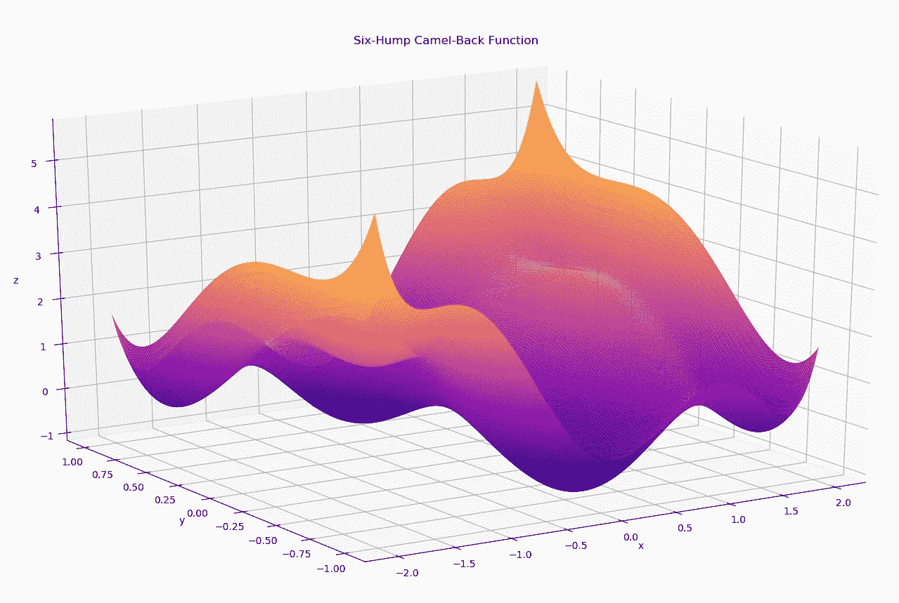

作者图片

我们的工作是找到上界函数的最小值:x1 在[-2，2]之间，x2 在[-1，1]之间。为了直观起见，我们在上面有一个域空间的图表。全局最小值出现在两个位置:

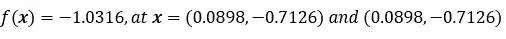

作者图片

# **新参数**

我们将创建一个带有许多参数的遗传算法。首先，它将包含通常的参数，就像在上一单元的简短示例问题中使用的一样:

1.  交叉/变异的概率
2.  变量值的界限
3.  适应度函数
4.  变异所依据的边界百分比
5.  精英主义的百分比
6.  最大世代数

此外，我们将添加一些新组件，即用于**选择方法**和用于**再现方法**的参数。在简短琐碎的示例问题中，我们仅通过轮盘赌使用比例选择，并对交叉进行平均。然而，现在我们将包括用于选择的轮盘赌、随机或锦标赛风格的参数，以及用于平均或“直觉”交叉的参数。

# **有人帮忙**

到目前为止，在这个系列中，我们只讨论了寻找适应度函数的最大值，而不是最小值，那么我们如何调整我们的算法来找到正确的最小值呢？我认为最好的解决方案是不要颠倒我们排序的顺序，而是像往常一样找到最大值；然而，我们衡量我们的健康值，它们越小就变得越大，越大就变得越小。我们将在第一层缩放之后进行第二层缩放，这使得所有适应度值都为正:

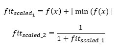

作者图片

如前一篇文章所述，因为一些适应值可能是负的，我们需要使它们都是正的，以便当我们计算总和除以每个适应值时，它将创建一个比例分布。如果我们最大化，我们不执行第二层缩放，但是如果我们最大化，我们就使用上面的等式进行缩放。例如，如果缩放的适应值是[4，5，1]，那么第二层缩放创建[0.2，0.167，0.5]。正如我们所看到的，最大值 5 现在变成了最小值 0.167，最小缩放值 1 变成了最大值 0.5。这样，除了增加第二层缩放，我们仍然可以在不改变太多的情况下找到最大值。

# **实施**

因为我们将处理许多移动的组件，所以我将通过用函数调用替换每个组件来使我们的‘evolve’函数变得非常紧凑。

首先，我们有扩展数据的函数:

接下来，我们有三种选择方法，轮盘赌、随机和锦标赛选择。我们之前已经见过轮盘赌轮盘选择:

另一方面，随机选择只是从 0 到代的大小中选择随机指数:

对于锦标赛的选择，会有一点不同。请记住，在锦标赛选择中，我们随机选择一组个体，并选择最优秀的生存者，因此我们需要另一个参数来确定锦标赛的规模。我们稍后将讨论这一点。现在，我们简单地循环，在每次迭代中，我们创建一个竞争对手的随机样本，其中我们找到具有最大适应值的个体，并将其附加到所选的指数中。

现在我们已经实现了选择方法，是时候使用复制方法了。该方法将接受一组亲本、它们的适应值、变异和交叉的概率，以及变异的界限和繁殖方法。如果再现方法等于 1，我们将使用平均技术，否则我们将使用“直觉”技术:

现在我们已经定义了我们的繁殖方法，是时候进入交叉和变异方法了。第一，跨界。我们有两种类型，平均型和‘直觉型’。与以前不同，我们需要在我们的方法中考虑多维度，以允许可扩展性。因此，我们对每个变量值进行循环，并执行交叉技术:

现在我们有了“直觉”交叉方法。在这个方法中，我们创建了一个随机位的列表，其中如果一个位是零，我们从第一个父项继承该变量值，如果是一个，我们从第二个父项继承该变量。在只有两个变量的情况下，后代有 50%的机会从同一个父代继承两个变量值，因此为了避免这种情况，如果有两个维度，我们强制在两个父代之间分割交叉:

现在我们终于实现了所有的辅助函数，是时候创建算法了。不幸的是，这个算法很长，差不多有 100 行代码。我不认为我能在这里解释这一切，但是如果你真的跟随这个系列并且没有睡着，我想你能推断出正在发生什么:

好了，现在我们已经实现了我们的算法，是时候看看它是如何解决我们的问题的了！这里我们有我们的六峰驼背函数以及我们的初始世代和边界:

现在让我们称之为 25%的交叉，50%的变异，1%的边界最大变异值，10%精英主义，锦标赛选择(sel_method = 3)，10%锦标赛大小，“直观”交叉的再现方法(rep_method = 1)，并运行 30 次迭代:

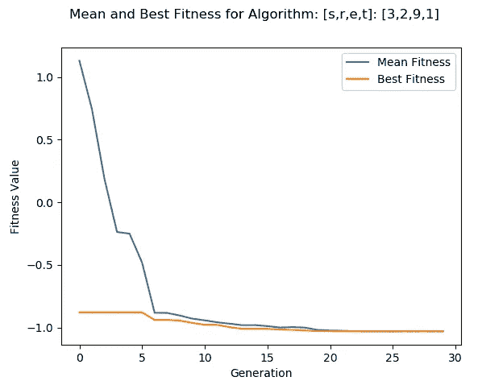

作者图片

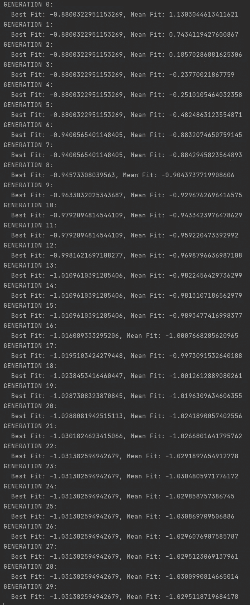

作者图片

正如我们所看到的，我们的算法几乎已经收敛到全局最小值-1.0316。

# **各种超参数的结果**

现在我们要用不同的超参数运行我们的算法，这里有 5 次不同的运行。为了区分，每个地块在标题中都有一个[s，r，e，t]: [#，#，#，#，#]，其中的 **s** 位置指数表示所使用的选择方法， **r** 指数表示所使用的繁殖方法， **e** 表示精英主义延续下来的个体数量， **t** 指数表示锦标赛规模(除非 s = 3，否则没有任何意义)。所有的运行都进行了 35 代，1%的最大突变界限，和 10 人的群体规模。这里我们用 0.75%来表示杂交和变异:

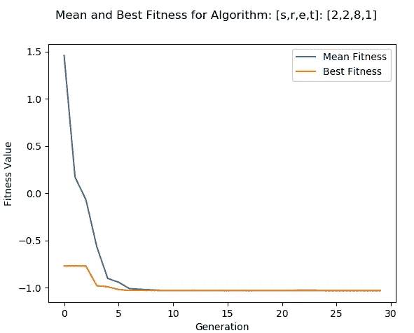

作者图片

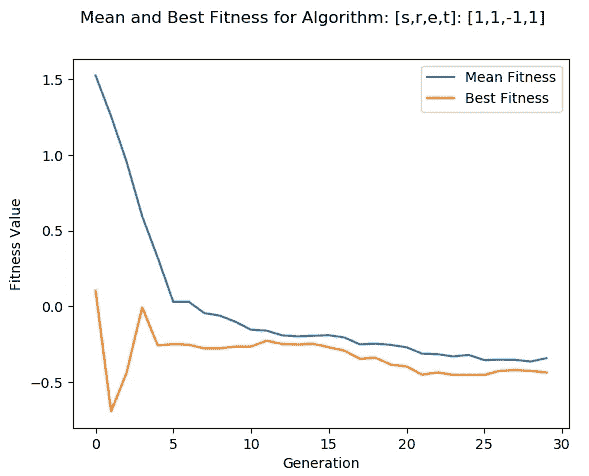

作者图片

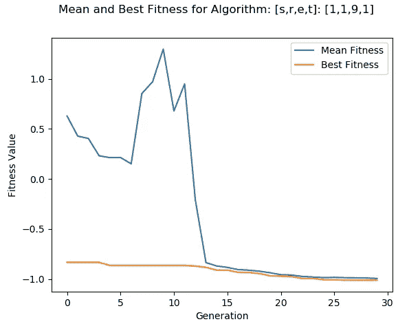

作者图片

现在有 25%的交叉和变异:

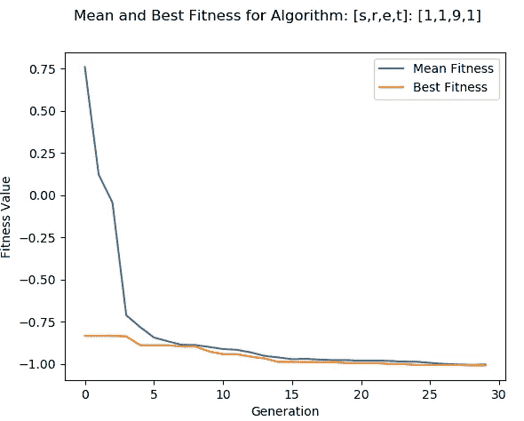

作者图片

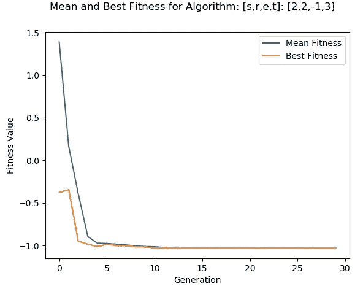

作者图片

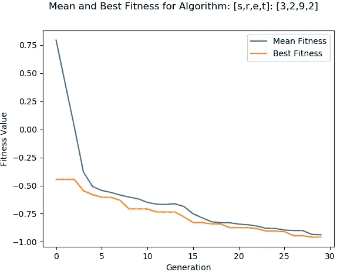

作者图片

# **视频解说**

因为这篇文章有很多复杂的组成部分，我决定在一个视频中为你实现这个算法，我会更深入地解释它，你可以在这里查看:

# **评估其他基准测试函数**

之前的优化问题比较容易；然而，我们可以通过测试更难的优化问题来评估我们的算法。我们还将评估另外两个问题，即**蛋架函数**、**罗森布鲁克函数**和**阿克利函数**。为了保持平等，我们将运行每个算法 300 代，初始规模为 100 个个体，75%用于变异/交叉，10%用于精英主义，1%用于最大变异值的界限，以及随机交配。即使我们使用随机选择进行交配，我们也会将它与精英主义结合起来，这样我们就永远不会失去每一代的最佳解决方案。现在，因为算法的成功很大程度上依赖于初始群体的初始点，所以我们的算法将对每个问题运行 30 次，以便我们从域中获得广泛的值，并且每次找到的最小值将被记录。最后，为了查看两种交叉方法之间的差异，我们将对每种交叉方法运行每种算法 10 次。

首先是 **Eggholder 函数**，这里是下面这个函数，全局最小值只发生在一点:f(x)=-959.6407 at X=(512，404.2319):

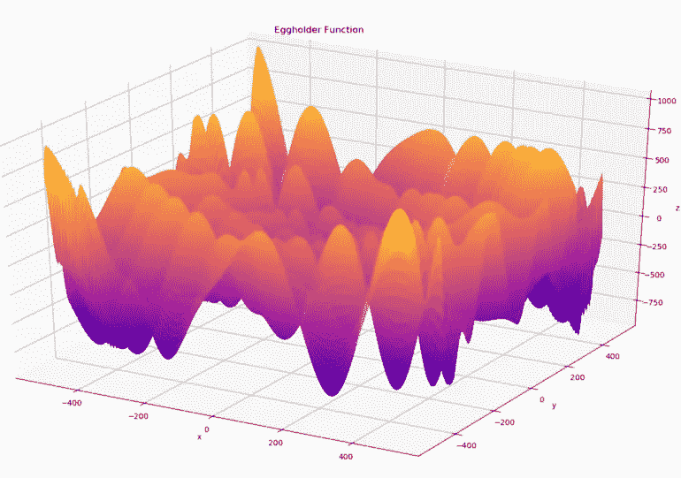

作者图片

这里我们有 30 个独立试验的结果，使用的是“直觉”交叉。为了阅读下面的结果，汇编了来自所有运行的最后一代的最佳和平均适应度；然后，如下图所示，计算每一次运行的平均值和标准偏差。例如，任何运行的最后一代的最小平均适合度为-889.967，其中每次运行的平均适合度的平均值为-814，标准偏差为 103。你可以同样解读为最佳健身。我们可以看到，在所有的试运行中，找到的最佳全局最小值是-939，与全局最小值相差 20 个值。这仍然是一个好的结果，因为从图中可以看出有许多局部极值点。

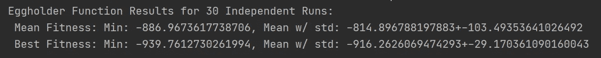

作者图片

现在，我们将使用交叉技术 1(平均法)来运行该算法。

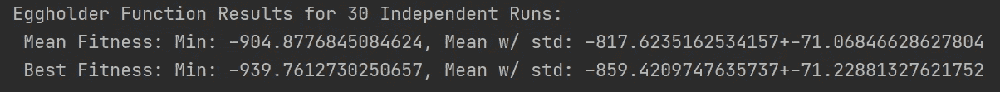

作者图片

乍一看，我们可以看到直观的交叉方法对于每次运行的最佳适应值具有更好的均值和更小的标准差。然而，这两种方法确实找到了相同的最佳最小值。

二、 **Rosenbrock 函数**，这里是下面这个函数，全局最小值只发生在一点:f(x)=0 在 X=(1，1):

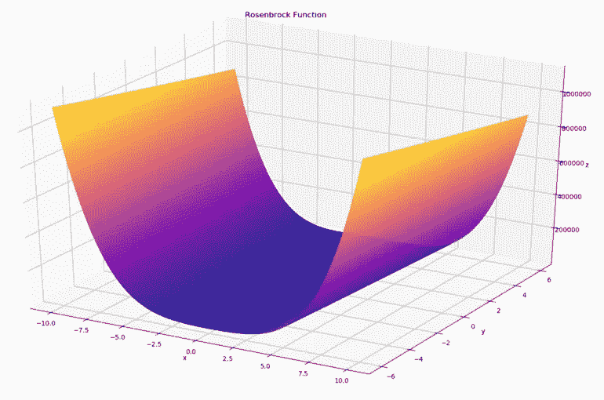

作者图片

现在，我们将使用“直觉”交叉技术运行该算法:

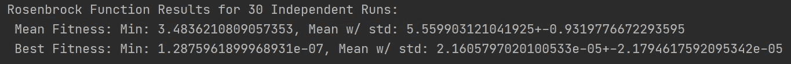

作者图片

现在，我们将使用平均交叉技术运行该算法:

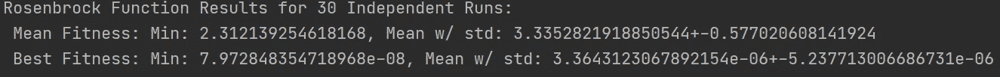

作者图片

从结果中，我们可以看到平均交叉技术对所有统计数据都产生了更好的结果，对平均值和最小值都产生了更好的平均值和最佳拟合度。在所有代中找到的最佳适应值是 7.97e-8，其可接受地接近实际的全局最小值 0。

第三， **Rosenbrock 函数**，这里是下面这个函数，全局最小值只发生在一点:f(x)=0 在 X=(0，0):

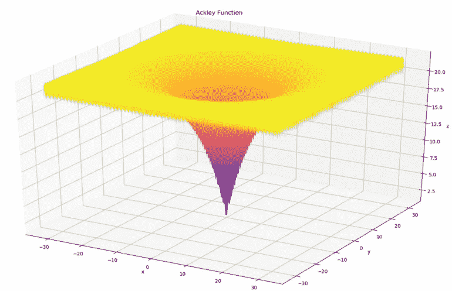

作者图片

现在，我们将使用“直觉”交叉技术运行该算法:

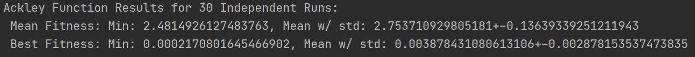

作者图片

现在，我们将使用平均交叉技术运行该算法:

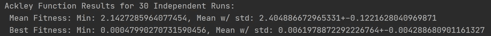

作者图片

通过评估结果，我们可以看到直观的交叉方法找到了更好的全局最小值，并且对于所有代的最佳最小值具有更好的平均值和标准偏差。找到的最佳最小值是 0.000217，接近全局最小值 0，但不到上一个问题答案的程度。

最后，我希望您能看到，没有一组参数会比其他参数更好，这完全取决于问题。因此，必须使用不同的超参数组合多次运行该算法，以“感受”结果。正如我在以前的文章中提到的，创建抽象和简单的遗传算法实际上是进化更高级遗传算法的超参数；然而，这可能很快变得极其计算昂贵。

# 结论

好了，这个帖子到此结束！希望你已经学到了很多关于遗传算法的知识。我想让你们看到的主要观点是，算法的成功严格依赖于你们给它的超参数。如果适应度函数极其复杂，则通常创建更简单的遗传算法，以在原始函数上进化复杂算法的超参数。这就是所谓的“调整”超参数。如果你熟悉**自动机器学习**，遗传算法是用来进化机器学习模型，尤其是神经网络的超大型的常用工具。在本单元的最后，我们将讨论为时间序列分析问题训练一个神经网络。请继续关注下一篇文章，我们将讨论遗传算法中的高级概念:

<https://morganscottbrandon.medium.com/unit-3-genetic-algorithms-part-2-advanced-topics-a24f5be287d5>  

请继续关注下一篇文章，我们将讨论遗传算法中的一些高级主题！你可以在我的 GitHub 上找到所有代码:

<https://github.com/OUStudent/EvolutionaryComputationCourse/blob/main/Unit3/benchmkar_test_function_1.py> 