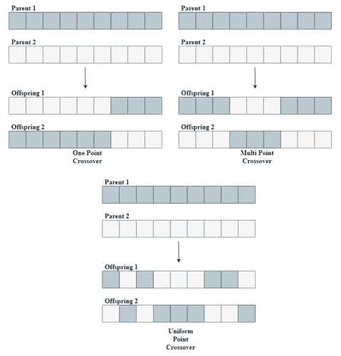
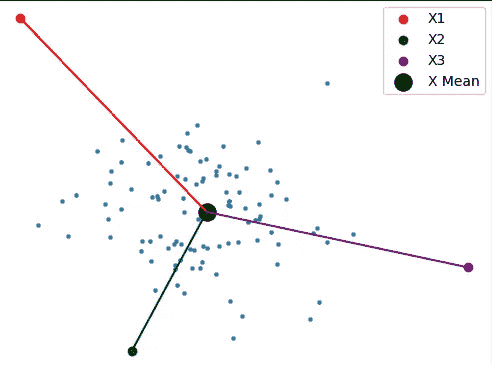
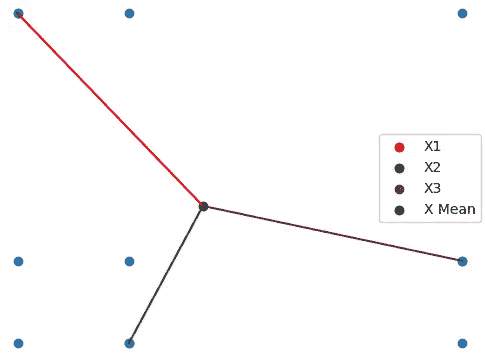
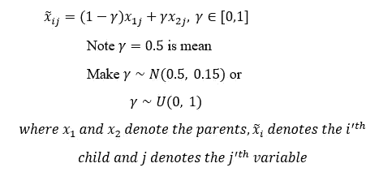
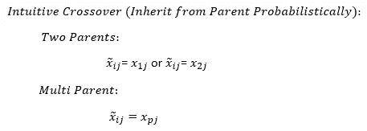
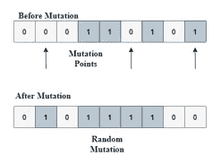
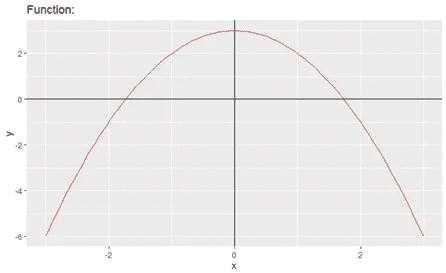

# 单元 3)遗传算法(第一部分)

> 原文：<https://towardsdatascience.com/unit-3-genetic-algorithms-part-1-986e3b4666d7?source=collection_archive---------7----------------------->

## 进化计算课程

## 遗传算法概述—主要是交叉和变异算子

大家好，欢迎回到进化计算的完整课程！在这篇文章中，我们将讨论课程的第三单元，遗传算法。在上一篇文章中，我们讨论了第二单元——进化计算导论。如果你还没有阅读那篇文章，请这样做，因为我们将在这里详细地展开那篇文章，你可以在这里查看:

 [## 单元 2)进化计算简介

### 进化计算和遗传算法概述！

morganscottbrandon.medium.com](https://morganscottbrandon.medium.com/unit-2-introduction-to-evolutionary-computation-85764137c05a) 

在这篇文章中，我将扩展上一单元的内容，并将这些概念应用到一些真实的例子中。首先，我们将介绍标准的**规范遗传算法**。然后我们将讨论浮点表示，并直接讨论交叉和变异操作符。然后，我们将涵盖遗传算法变体，高级主题，以及如何处理不同的优化问题。在整篇文章中，我们会用 Python 代码给出一些例子。因为这个单元会比较广泛，所以会分解成几个部分。

# **目录(第一部分)**

*   典型遗传算法
*   二进制与浮点表示法
*   交叉技术
*   突变技术
*   变异交叉
*   简短的例子
*   视频讲解
*   结论

# **标准遗传算法**

作者图片

标准遗传算法被认为是最简单的，也是实践中最早使用的遗传算法之一。它利用基因组的二进制/位串表示进行编码和解码，通过轮盘赌进行比例选择，在基因组中进行单点交叉和均匀变异。虽然我们还没有谈到单点交叉或一致变异，但我们将在本帖的后面讨论它们。在这种算法中，那些存活下来的是被选中的父母的后代。此外，不是总是通过变异或交叉来创建后代，而是后代具有被交叉或变异的概率，其中如果它们没有被交叉或变异，它们默认为具有最佳适应值的父代的副本。实施交叉和突变概率的目的是防止来自父母的基因信息丢失，因为后代可能比父母更差。

# 二进制与浮点表示法

实际上，基因组通常有两种表示方式:

*   二进制的
*   浮点

经典遗传算法利用**二进制表示**，因为它更受生物学的启发，通过改变化学化合物在 DNA 中发生进化，如翻转比特以进行基因组的突变或交叉。然而，由于必须将浮点数编码和解码为二进制的问题，二进制表示不再大量使用，特别是如果使用格雷斯编码来解决前一单元中讨论的汉明悬崖问题。

另一方面，**浮点表示法**保持数字不变，从而通过不编码或解码成二进制来节省时间；然而，它不如二进制表示直观，因为它如何变异或交叉浮点数？我们稍后将解决这个问题。最后，可能会质疑两种表示法的准确性，在寻找解决方案方面，浮点表示法比二进制表示法更好吗？事实证明，浮点表示也可以工作得很好，有时甚至比标准二进制编码更好，所以如果使用浮点表示，没有理由担心算法质量。

# 交叉技术

交叉算子可以分为三种类型，无性、有性和多重重组。**无性**是指一个后代由一个父母产生，**有性**是指两个父母产生一个或两个孩子，然后**多重组**是指利用两个以上的父母产生一个或多个后代。此外，从所选择的用于产生后代的亲本中，我们具有执行交叉的概率，以便不由于总是交叉而丢失亲本的遗传信息，其中较高的交叉概率等同于较高的交叉机会。如果没有应用交叉，那么子代是最适合的父代的副本。此外，如果产生了一个后代，它可以直接或通过类似玻尔兹曼选择的方式概率性地取代最差的亲本。

作者图片

如前所述，我们可以使用二进制或浮点表示进行编码。这里我们将讨论二进制编码交叉技术。有三种主要类型的交叉技术，一点、两点和均匀。我们可以在上面看到这些例子。首先在左上角，我们有一个单点杂交，我们选择一个随机点，交换父母的基因组来创造两个杂交后代。第二，我们有多点交叉，如右上角所示，我们选择多个点进行交叉。最后，我们有统一的交叉，如底部所示，基因组的每个基因都有可能被父母遗传。

对于二进制来说，交叉技术是非常直观的，但是现在的问题变成了我们如何对浮点数进行交叉？有两种主要的浮点交叉技术。下面我们可以看到一个使用多亲本重组的几何例子。

按作者分类的图像(交叉 A)

首先，我们有以上三个选择的亲本用于繁殖，接下来我们计算来自亲本的平均向量，表示为中间的 X 均值，然后我们在亲本的任一方向上向该平均向量添加一些方差以获得后代。这样，后代就是父母之间的某种平均值

按作者分类的图像(交叉 B)

接下来，在上图中，我们通过切换每个变量的浮点值来执行交叉。这种类型的交叉只有离散数量的可能值，因为在创建后代时不包括方差，只有父代中存在的变量值。这是一个问题，因为我们没有办法引入新的遗传物质；然而，我们将通过使用突变来解决这个问题。

对于我们的例子，我们将使用两种常见的交叉技术。第一个操作符是通过组件的线性组合在双亲之间的一种类型的**几何平均**，当仅使用两个双亲时，这由下面的等式给出:

作者图片

请注意，当 gamma 为 0.5 时，线性组合是两个父项之间的几何平均值。通常要么使γ成为以 0.5 为中心的正态随机值，标准偏差为 0.15，以便它可以在 0.05 到 0.95 之间变化三个标准偏差，要么使它在 0 到 1 之间保持一致，平均值为 0.5。请注意，这可以扩展到多个父代，其中每个父代值都有自己的灰度值，灰度值之和等于 1:

作者图片

然而，当使用多个父对象进行交叉时，可能会出现一个问题，即如何选择 gamma 值。如果你允许伽马值都相等，你就促进了良好的多样性；然而，你可以根据适合度值对父母进行排序，并使适合度最好的父母拥有最大的 gamma 值，以使后代倾向于该父母；但是，如果伽玛值太高，可能会导致过早收敛。实际上，几何平均数通常用于多亲本繁殖。

作者图片

第二种交叉方法是我喜欢称之为**‘直觉’**的交叉方法；如前所述，这种方法的工作原理是让后代从父母中的一方继承他们的基因。这种方法也可以扩展到多个父母，现在后代的基因是从选择的父母中取样的。在这种方法中，问题变成了孩子应该继承哪个基因，这被称为**扫描策略**。从父母中的任何一方遗传基因的概率可以是一致的，或者可以通过使用比例选择方法基于他们的适合度值。

# 按代交叉示例

作者图片

上面我们有一点视觉表现，当我们使用第一个交叉技术时会发生什么。这是通过随机选择两个个体进行交配并通过线性组合繁殖后代来实现的，其中λ从 0 到 1 是均匀随机的。在左上图中，我们的初始种群在边界上——x 和 y 都是 100 到 100。在左下图中，我们有交叉技术到第 10 代的累积搜索空间。我们可以清楚地看到，由于平均效应，这种技术倾向于缩小搜索空间。我们将在高级主题部分解决这个问题。右边是第 100 代和第 300 代的累积搜索空间。我们可以明确地看到，我们的交叉技术彻底探索了原点周围的区域，因为边界-100 到 100 的均匀分布的平均值为零，因为(100-(-100))/2 = 0/2 = 0。

作者图片

现在，当我们使用第二种交叉技术时，我们有了一个直观的表示。这是通过随机选择两个个体进行交配，并交换双亲的 x 和 y 值来产生两个后代。同样，在左上角的图片中，我们有我们的初始代，在左下角，我们有第 10 代的累积搜索空间。我们已经可以看到，由于其交换性质，这种交叉技术更均匀地探索了搜索空间。然而，我们可以在右边的图片中看到，到了第 300 代，该算法留下了一些没有探索的主要漏洞。这是由于这种杂交技术没有引入任何新的遗传物质；因此，域中不存在的任何值，后代将永远不会获得该值。在我们的例子中，因为没有初始值具有-50 的 x 值，所以到第 300 代时，没有后代探索该区域附近。这就是为什么交叉技术与突变配对是至关重要的，我们将在接下来讨论。

# 突变技术

作者图片

好了，现在我们已经对我们的后代进行了杂交，我们需要一种方法来引入新的遗传物质，这是通过**突变**完成的。对于二进制表示，我们通常有两种主要的方式来执行变异，其中一种是通过均匀变异，其中每个位都有相等的机会被翻转，或者仅通过随机翻转其中一个位。

作者图片

对于浮点表示，有许多不同的变异技术；然而，我将首先介绍一个基本的突变方法，其中我们从每个给定变量的边界的一致域中给后代的每个组成部分添加一个随机的一致值，正如我们在上面看到的。请注意，如果这个界限很大，它将鼓励勘探，而如果它很小，它将鼓励开发。最大突变值的选择取决于设计者，但是对于给定的变量，通常将其保持在总域空间的 1%左右。在后面的高级主题中，我们将介绍带有突变值的逻辑衰减，以便它们在整个算法中不断变化。

# 世代突变示例

作者图片

上面我们有一个当我们在浮点表示中使用变异技术时会发生什么的可视化表示。这是通过在每个个体的 x 和 y 方向上增加一个小的随机值来实现的。左上角的图片是我们最初的一代，左下角是我们第 10 代的累积搜索空间。我们已经可以看到，突变只是简单地探索和创造了一个围绕点的小集群。我们可以在右侧看到，这种突变模式导致在第 300 代探索关于初始点的大型集群。这通过引入新的遗传物质显示了突变的力量。在下一小节中，我们将看到第二种交叉方法与变异相结合，以及如何使用它来探索输入空间。

# 逐代交叉变异实例

作者图片

最后，我们上面有一个可视化表示，当我们使用第二个交叉技术与变异配对时会发生什么。这是通过随机选择两个个体进行交配，并交换两个亲本的 x 和 y 值来产生两个后代，然后在 x 和 y 方向上添加一个小的随机统一值来实现的。同样，在左上角的图片中，我们有我们的初始代，在左下角，我们有第 10 代的累积搜索空间。然而，如果我们跳到右下方的第 300 代，我们可以看到一个与之前完全不同的交叉画面。如果你还记得的话，接近-50 的值没有被探索，因为最初的一代缺乏任何具有该值的点；然而，因为我们增加了突变，它引入了新的遗传物质，允许交叉探索那个区域。这显示了交叉和变异作为遗传算法可行的搜索工具的威力。希望通过这些简单的小图表，你能理解这些机制如何探索输入空间。

# **简短琐碎的例题**

既然我已经介绍了遗传算法的基础知识。让我们看一个简单的例子。假设我们有下面这个我们想要最大化的函数:

作者图片

函数为 f(x)=-x +3，其中最大值出现在 f(0) = 3 时 x=0。在我们开始之前，我们有几个设计问题。首先，我们最初的人口会是什么样子？记住，我们的算法依赖于初始代的变化；因此，我们必须创建一个跨越整个域空间的初始群体，因此我们将从-3 到 3 的域空间中均匀随机地创建我们的初始点。接下来我们需要确定我们的代的大小，这也与算法的成功成正比。因为这是一个很小的例子，我们可以有几千个初始大小，因为适应度函数不需要很长时间来评估；但是，为了简单起见，我们只使用 5。接下来，我们需要选择我们的适应度函数；因为我们希望找到函数的最大值，所以我们的适应度函数将是优化函数本身，因为我们将奖励具有较大输出值的点。接下来，我们需要选择我们的基因组编码，我们将使用浮点表示，因为它比二进制编码和解码更快，并且它是现代实践中使用的。现在，我们需要决定哪些个体将被选择进行繁殖，我们可以通过将轮盘赌和精英主义配对来完成。对于这个问题，我们将精英主义设定为 20%，这意味着这一代中最优秀的 20%将永远被保留下来；然而，因为我们的初始规模只有 5，20%实际上只意味着一个个体。对于繁殖，我们将使用亲本的平均值，其中γ从 0 到 1 均匀分布，突变值将是整个界限的 1%。因为我们并不总是希望执行交叉或变异，因为它可能会丢失来自父代的信息，所以我们可能只在 75%的情况下执行这些操作。最后，我们的算法将在达到允许的最大迭代次数时停止。既然我们已经讨论了我们算法的架构，让我们来看看 Jupiter notebook 并用 Python 实现它吧！

# **视频解说**

我知道所有这些代码可能看起来令人生畏，所以我决定制作一个半短视频来解释这些代码及其工作原理:

# **结论**

在这篇文章中，我们介绍了浮点表示的交叉和变异操作符的基础知识，以及一个简单例子的基本算法。在下一篇文章中，我们将通过处理一个实际的基准测试函数进行更深入的探讨！您可以在这里找到它:

 [## 单元 3)遗传算法:基准测试函数 1

### 将遗传算法课程中的概念应用到实际的优化问题中！

morganscottbrandon.medium.com](https://morganscottbrandon.medium.com/unit-3-genetic-algorithm-benchmark-test-function-1-670a55088064)