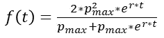
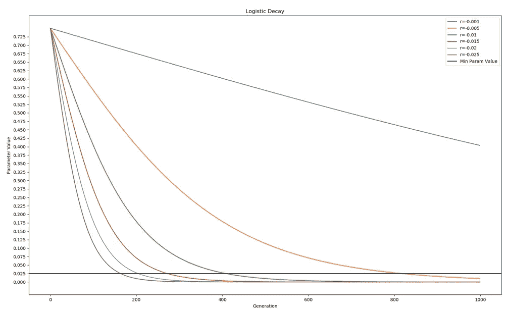
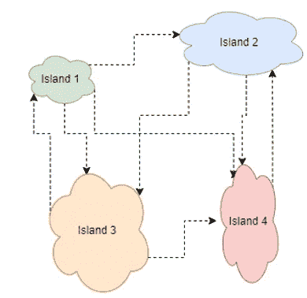
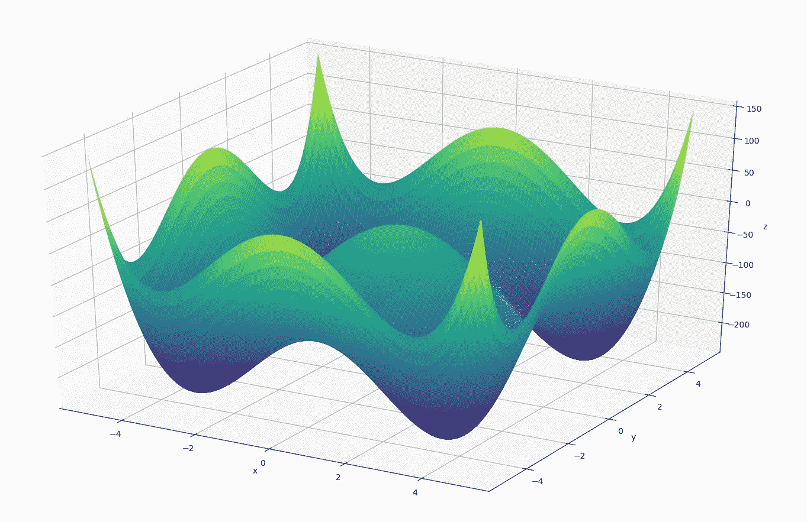
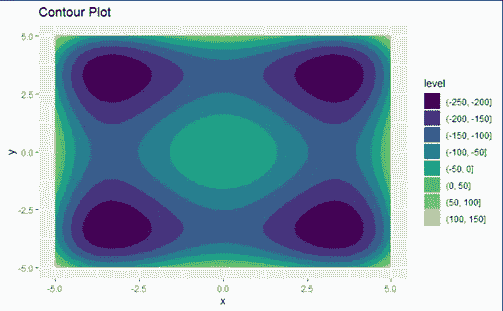
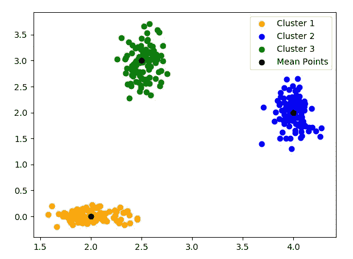

# 单元 3)遗传算法(第二部分)高级主题

> 原文：<https://towardsdatascience.com/unit-3-genetic-algorithms-part-2-advanced-topics-a24f5be287d5?source=collection_archive---------24----------------------->

## 进化计算课程

## 遗传算法的高级主题——控制参数、选择性交配和遗传变异

大家好，欢迎回到进化计算的完整课程！在这篇文章中，我们将讨论课程的第三单元(第二部分)，遗传算法——高级主题。在前一篇文章中，我们实现了一个简单但强大的遗传算法来解决一系列优化问题。如果你还没有阅读这篇文章，请阅读它，因为它将详细阐述所涉及的内容，你可以在这里查看:

 [## 单元 3)遗传算法(第一部分)

### 遗传算法概述—主要是交叉和变异算子

towardsdatascience.com](/unit-3-genetic-algorithms-part-1-986e3b4666d7) 

在这篇文章中，我将通过介绍一些高级话题来总结第三单元遗传算法的材料和概念。这些主题包括控制参数(超参数)，遗传算法的各种变体，通过聚类的选择性交配，以及如何处理约束。

# **目录**

*   控制参数
*   遗传算法变体
*   集群选择性交配
*   约束处理
*   结论

# 控制参数

如果您一直关注这个系列，您应该已经注意到超参数有很多选择，它们直接影响算法的质量。最常见的超参数是变异概率、交叉概率、最大变异界限百分比和精英百分比。这些超参数可以是三种类型之一:

1.  静态
2.  动态的
3.  自适应

**静态**超参数就像它们听起来一样，它们在算法的整个评估过程中都是静态的。大的静态值鼓励探索(精英主义除外)，小的静态值鼓励剥削(精英主义除外)。到目前为止，我们已经在整个系列中使用了静态超参数。**动态**超参数在算法执行过程中从大值动态减小到小值。这样做是为了允许在算法的早期阶段进行探索，并在以后进行开发。动态超参数的问题是，随着每一代的过去，无论发生什么，参数都会减少，即使它们表现良好，而静态超参数的问题是它们从不改变。为了解决这个问题，**自适应**超参数仅根据它们的成功程度而改变，如果最大突变界限值太低，它将自适应增加，如果太高，则减少。在本帖中，我们将不讨论自适应超参数，因为它们是进化规划单元 5)的一个组成部分。

对于动态超参数，处理这种动态减少的最常见方式是通过线性或非线性函数。对于**线性**函数，您给算法最大和最小超参数值，它将在给定代数上创建从最大到最小的直线值。非线性函数通过非线性方式实现这种值的减少。最常见的非线性函数是**逻辑衰减:**

作者图片

其中 **p_max** 是参数的最大值， **t** 是世代， **r** 是衰减率。较小的 **r** 值鼓励开采，而较大的 **r** 值鼓励勘探。因为逻辑衰减本质上是逻辑的，随着代计数接近无穷大，参数值将接近零，这将导致停滞和过早收敛。我们不希望在实践中发生这种情况，所以我们实现了一个 max 操作，这样如果新的参数值低于某个最小值，它将被设置为该最小值。

作者图片

上面我们有一个逻辑衰减的各种速率值的图表。第 0 代的参数值从 0.75 开始，以 **r** 的速率逻辑衰减。我们设置的最小值为 0.025，用水平黑线表示，因此当逻辑衰减值低于该值时，我们只需恢复到最小值。选择我们的速率取决于我们期望算法收敛多长时间。可以看到，虽然这个新的增加可以帮助我们的算法在探索-开发权衡，但它确实增加了另一个需要针对问题进行调整的参数级别。

# **遗传算法变体**

与所有算法一样，对于特定的问题，可以实现许多不同的算法。有三种主要类型的流行遗传算法变体遵循迄今为止给出的类似格式:

1.  代沟方法
2.  不断增长的人口
3.  并行运行
4.  孤岛算法

**代沟方法**是实施不同存活选择方法的变体，用于确定谁存活到下一代。这种方法有三种流行的方法:

*   亲子之战
*   杀戮锦标赛
*   精英主义策略(精英主义的形式)

首先，我们可以创造后代并决定后代和父母中谁会存活，而不是总是接受后代而不是父母。这个过程的好处是，它消除了调整突变和交叉概率的超参数的需要，因为后代总是被创建。在**父母-后代**的战斗中，一对父母对抗他们的后代，后代根据他们的适应值被概率接受。最常见的处理方式是通过玻尔兹曼选择，我们将在下一篇文章中讨论。

第二，和第一种方法一样，我们总是创造后代，这样就不需要交叉和变异的概率，并把它们和双亲放在一起。在将父母和后代集合在一起后，你使用锦标赛选择来生存，除非最不适合的个体被杀死。执行此操作，直到后代父池减小到原来的大小。这种方法的好处是，这种竞争不直接发生在父母和后代对之间，而是发生在总的混合群体中，因为一组父母之间的后代可能比另一组父母更差，但却更好。

最后，精英策略类似于第二种策略，将所有的父母和后代聚集在一起，然后根据健康状况或年龄对他们进行分类。如果根据适合度进行排序，这种方法就像精英主义一样，从排序的个体中选择最好的一半来生存。除了健康分类之外，人们还可以根据年龄和健康分类，年轻人比老年人更受欢迎。在算法中，年龄是通过它们存活了多少代来表示的。这个过程的好处是，算法不会抓住旧的解决方案不放，旧的解决方案可能会导致停滞；但是接下来的问题是，算法会拒绝好的旧解决方案，而支持新的解决方案，即使它们更差。

**不断增长的人口**变体就像它们的声音一样，算法的人口规模动态增长以模拟自然界的人口规模。有两种常见的方法，一种是通过逻辑衰减和增长。从我们最初的人口规模开始，我们的逻辑增长或收缩取决于特定的环境。例如，如果我们的算法收敛，我们可能会增加我们的规模，以允许更多的探索，而如果我们的算法不收敛，以鼓励开发。这个过程中的主要问题是准确地确定何时衰退或增长，以及衰退或增长的程度，从而给问题增加了更多的超参数。

**并行运行**变体是设计成并行运行的遗传算法。在工业中，在现实世界的问题上运行遗传算法是非常耗时和耗电的。我们可以通过并行运行我们的算法来降低复杂度。这可以通过三种方式实现:并行执行我们的适应度函数，为每个个体分配一个处理器，或者为每个处理器分配子种群。

作者图片

最后，**孤岛算法**，正如我们在上面看到的，**非常接近于并行运行，因为它们通常在多个处理器上执行，其中每个处理器代表一个孤岛；然而，这些算法可以在单个处理器上实现。在孤岛算法中，我们有所谓的**迁移策略**，它包含初始化、通信拓扑、迁移速率、迁移选择和替换选择。通信拓扑表示哪些岛能够相互通信，哪些不能。通常，相邻的岛屿具有通信能力。交流通常以迁移的形式发生，即把个人从一个岛送到另一个岛。这些超表的选择是迁移率、迁移选择和替换选择。迁移率意味着一个人从一个岛迁移到另一个岛的频率。迁移选择指的是选择要迁移的一个或多个个体。最后，一旦这些移民到达他们的新岛屿，就需要有一个替换策略来确定移民替换了哪个个体。迁移和替换选择可以使用本系列到目前为止讨论的任何选择策略来执行。迁移的目的是将新的遗传物质引入一个岛屿。岛通常由具有相同超参数或均匀但具有不同超参数(如突变率、概率和交叉算子)的分段域初始化；或者，岛可能是不同的遗传算法变体。有许多方法来创建这些“岛”。**

# 通过群集进行选择性交配

交叉的一个主要问题是，它可能会导致较差的个体。以下面的函数为例:

作者图片

作者图片

我们可以从拓扑中看到，在域的每个角上有四个相等的全局最小值。如果我们的算法有两个个体具有相似的适应值，但是在不同的位置，并且我们使用平均策略进行交叉，我们的后代将会在中间一个差的位置结束。这就是子代父代之争是一种有用的机制，因为父代不会因为子代的不足而被取代。另一方面，如果我们没有这个组件，我们可以通过集群实现选择性交配。这意味着个体只允许与同一个群内的个体交配，从而阻止两个欧氏距离较远的个体交配。然而，这种思路的唯一问题是，由于个体仅在同一集群内交配和繁殖，因此可能导致较差的探索，从而减少遗传物质的全球共享。选择交配可以很容易地用岛算法实现，因为只有同一岛内的个体才允许交配和繁殖。唯一的问题是确定岛屿的数量和谁去哪里。岛屿数量的解决方案是使用某种类型的标准，如 K-means 聚类中的轮廓得分

作者图片

k 均值聚类的工作原理是选择聚类的数量，选择初始 k 均值点，并根据其周围的点更新这些中心点。k 均值聚类的问题是聚类的选择和聚类的初始点。不幸的是，除非已知数据的先验信息，否则没有好的方法来定义初始点；但是，我们可以通过**剪影法**选择最佳的聚类数。该方法从两个初始聚类开始，并且增加，直到找到每个点聚类和对应的 k 个平均点之间的距离最小的聚类计数。这由介于-1 和 1 之间的轮廓得分表示，其中 1 表示聚类非常密集，没有重叠，正如我们在右侧图片中看到的那样，而-1 表示数据不属于聚类。我们不断增加分类计数，直到我们的最大分类选择，并选择具有最佳分数的分类计数。这可以在初始群体上使用，以将它分成要在孤岛算法中划分的聚类。请注意，选择统一的初始群体对 K 均值聚类不起作用；因此，当使用统一的初始种群时，我们可以改为将域空间分成正方形，并将这些子域中的每一个给定为一个岛，然后使用 K-means 聚类来选择谁与谁繁殖。

# 约束处理

如果你还记得单元 1)最优化理论，有四种类型的最优化问题

1.  不受拘束的
2.  约束
3.  多目标
4.  多解

无约束问题很简单，我们一直在做。然而，有一件事我们还没有涉及到，领域是离散的问题。解决这个问题最流行的方法是不简单地改变任何东西，而是在测试适应度函数时将变量值四舍五入到下一个整数。对于约束问题，通常的解决方案是简单地为不可行的解添加惩罚项，或者改变再生和初始化操作符，从而不产生不可行的解。对于多目标问题，可以通过简单地将所有目标函数相加并最小化总函数来创建一个集合函数；或者，可以使用帕累托优势，将父母和后代集中在一起，采用锦标赛式选择，选择最具优势的个体生存下来。

最后，多解问题可以通过使用一种形式的岛算法来解决。在多解问题中，全局最小值或最大值通常是已知的，但目标是找到发生这种情况的每个位置。因此，在我们的岛算法中，每当产生一个新个体，其适应值接近或等于全局最小值或最大值，但其欧几里德距离与岛的平均值相差某个值时，它迁移到平均值最接近的岛；然而，如果不存在其平均欧几里德距离不同于个体的某个值的岛，它自己创建自己的岛并无性繁殖，直到新的后代或新的迁移者出现。这样，岛算法可以通过使每个岛成为其自己的具有相同全局最小或最大解的聚类来解决多解问题。运行世代计数后，岛的数量表示找到的不同位置的数量。

如果您对这些类型的优化问题感兴趣，请查看我在优化理论上的帖子，在那里我详细讨论了这些类型的约束:

 [## 单元 1)最优化理论

### 最优化理论和四种主要最优化问题的概述

morganscottbrandon.medium.com](https://morganscottbrandon.medium.com/unit-1-optimization-theory-e416dcf30ba8) 

# **结论**

总之，我们已经讨论了遗传算法中的高级概念，即在遗传算法中发现的主要变体，如何在进化过程中改变超参数，通过聚类进行选择性交配，以及如何处理约束问题。

在下一篇文章中，我们将总结第 3 单元，应用进化神经网络的权重进行时间序列分析！

 [## 单元 3 应用)用于时间序列分析的进化神经网络

### 第三单元的高潮是应用我们的概念来发展一个预测时间序列问题的神经网络

morganscottbrandon.medium.com](https://morganscottbrandon.medium.com/unit-3-application-evolving-neural-network-for-time-series-analysis-63c057cb1595)