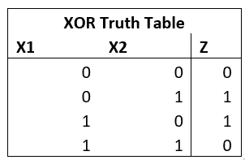
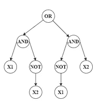
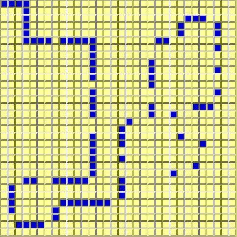
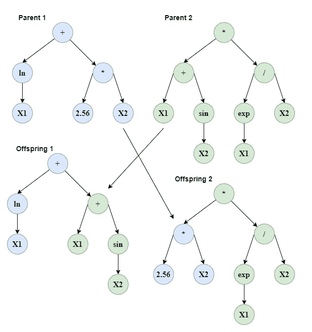
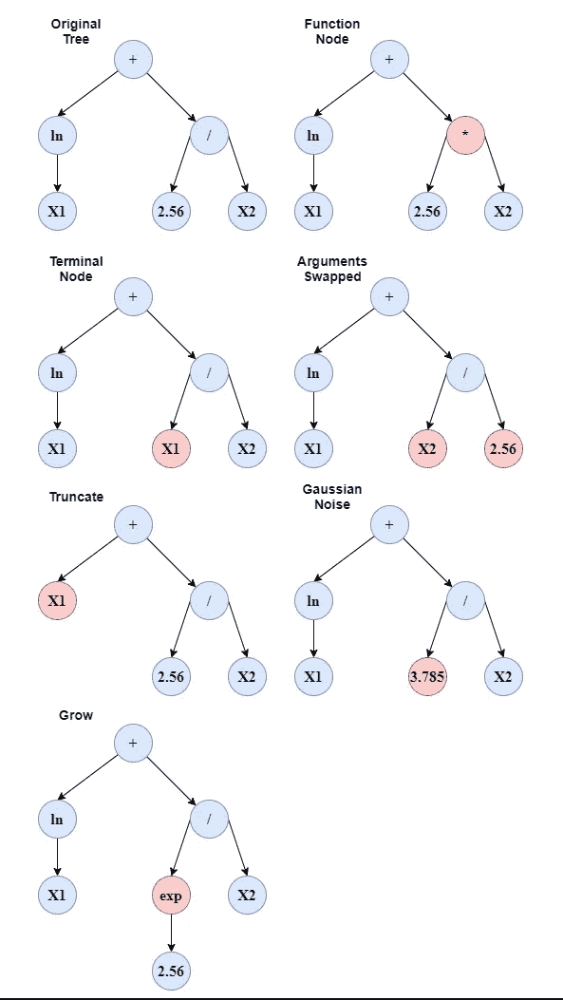
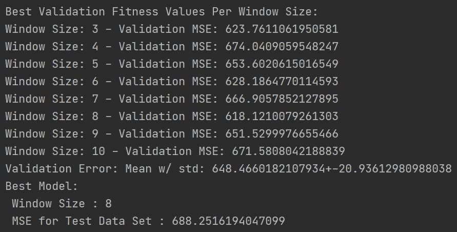
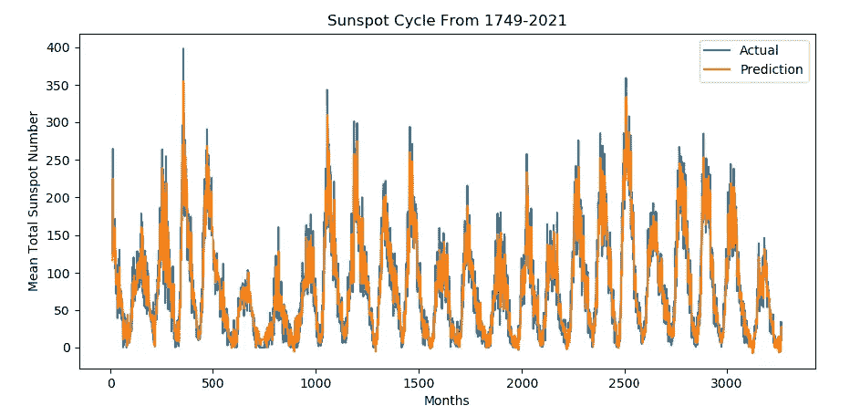
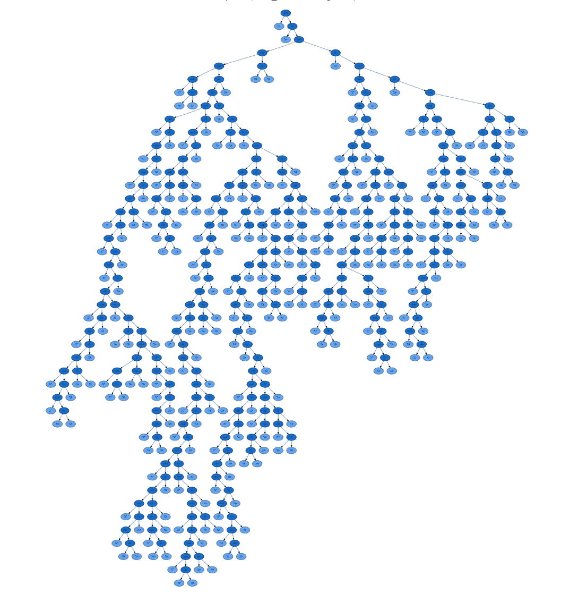

# 第 4 单元)遗传程序设计

> 原文：<https://towardsdatascience.com/unit-4-genetic-programming-d80cd12c454f?source=collection_archive---------12----------------------->

## 进化计算课程

## 涵盖遗传规划的主要课题，并将其应用于时间序列分析问题

大家好，欢迎回到进化计算的完整课程！在这篇文章中，我们将开始并完成本课程的第四单元，基因编程。在前一篇文章中，我们完成了单元 3，遗传算法，通过应用一种算法来进化用于时间序列分析的神经网络的权重。我强烈建议先阅读这篇文章，因为我们将尝试使用基因编程来解决同样的问题:

</unit-3-application-evolving-neural-network-for-time-series-analysis-63c057cb1595>  

在本帖中，我们将简要介绍遗传编程，以及它在染色体表示方面与标准遗传算法有何不同。

# **目录**

*   代表性差异
*   圣菲蚂蚁步道
*   设置问题
*   交叉算子
*   变异算子
*   应用—时间序列分析

# 代表性差异

遗传编程实际上是遗传算法的子集；然而，两者之间的主要区别是染色体的表示。标准遗传算法处理表型是点或向量的优化问题，但现在遗传编程中的表型是基于树的语法。

如果你不知道，所有的编程语言都是建立在**巴克斯-诺尔形式(BNF)语法之上的，**如果你没有上过任何自动机理论课，这仅仅意味着每种语言都有一套特定的规则来设置指令，编译器使用这些规则来确定代码是否可以运行。就像在标准英语中一样，英语语法告诉你如何将单词聚集在一起并构建句子。例如，“汤姆是……”，我们有“名词动词……”，英语语法告诉我们，动词“是”后面不能有动词，而是形容词、名词或副词。在编程中，当我们忘记一个关键字时，我们的 IDE 会告诉我们什么时候有“语法错误”,因为它知道基于这种特定于语言的 BNF 语法，什么需要在前面或后面出现。因为程序有一定的结构，遗传算法和语法的结合产生了遗传编程，它首先出现在进化指令集的场景中，称为程序。

除了遗传编程和标准遗传算法之间的表型差异，每个个体都有能力通过添加更多的终端和指令来增长或收缩其基因型。如前所述，遗传编程是基于树的，这意味着它需要自己的基于计算理论的语法，如终端集、函数和转换规则。作为一个简单的例子，下面我们有输入和目标输出的 XOR 真值表。

作者图片

给定语法、操作符和终端，我们想要发展一个基于树的指令集来解决这个问题。下面我们有一个解决这个问题的可能方案，使用一个通过遗传编程进化的基于树的结构。

作者图片

注意树的结构与**决策树是多么的相似，**遗传编程的许多应用之一是实际进化决策树和行为树，用于分类或玩游戏。

# 圣菲蚂蚁步道

遗传编程的第一个也是最广为人知的例子之一是在机器人领域。这个问题被称为圣菲蚂蚁踪迹。问题是，给定一个环境，食物被放置在地图周围的小径上，如下图所示，用有限的能量最大限度地收集食物。这个问题是用遗传编程解决的，通过进化出一套指令让蚂蚁去执行。

【https://commons.wikimedia.org/wiki/File:SantaFeTrail.gif 号

遗传编程模型在进化一个基于 if 和 else 语法树的树以基于某些输入采取定向步骤方面非常成功。

# 设置问题

在所有的进化计算中，有两个主要的先决条件需要注意，与所选的算法无关:

*   初始种群的创建
*   设计适应度函数

与标准遗传算法不同，遗传编程不能从域中均匀随机地创建初始种群。相反，它需要遵循依赖于问题的语法结构。为此，我们首先需要为问题定义 BNF 语法。然后，我们需要设置树的最小和最大深度，其中深度表示树中有多少层。定义最小值和最大值仅影响初始群体，这意味着所有初始代个体将处于最小和最大深度层之间，而后面的个体可以收缩或增长。

为了为每个个体创建树，我们从语法中随机选择一个函数元素，并通过随机选择终端或函数元素进行分支。像在用于约束问题的遗传算法中一样，使用该过程随机生成个体可能导致一些不需要的初始个体，即那些深度小于最小值或大于最大值的个体。为此，我们丢弃这些个体并继续采样，直到我们得到在这个范围内的个体。

取决于手头的问题，适应度函数可以有一系列方法来确定适应度值。就机器人学而言，可能有一些测试案例需要评估，以评估智能体的表现或游戏人工智能的行为树，你可以使用共同进化。与标准的行为和决策树一样，我们希望降低模型的复杂性，以便它可以很好地推广到新的输入，因此我们需要一种方法来惩罚过于复杂的模型。在遗传编程中，我们可以通过评估模型的**膨胀**来防止复杂模型的进化，膨胀是指当一棵树增加更多的终端节点和深度，而只是略微降低适应度值。

# 交叉算子

遗传编程中的交叉算子相当直观。正如我们从下面的第一张图中看到的，给定两个父代，我们在每个父代中随机选择一个点，并在该点交叉子树以创建一个后代。这可以针对一个后代进行，更直观的是针对两个后代，其中你得到一个父母的前半部分和另一个的后半部分。

作者图片

在进化计算的早期阶段，由于**排列问题**，遗传编程中的交叉通常不会被执行。排列问题类似于第 3 单元第 2 部分高级概念中讨论的选择交配问题。你可能有两个相似的适应值的父母，但是他们的架构是如此的不同，以至于把他们交出来会导致非常差的个体。这就是为什么在进化编程的早期，从来没有交叉，只有变异。然而，随着领域的扩大，出现了解决这些问题的方法。最常见的解决方案之一是只交换相似的个体；但是现在的问题是确定谁是相似的，因为你不能使用欧几里德距离。一种方法是实施遗传标记，允许具有相似遗传标记或子树的个体繁殖。

# 变异算子

像交叉一样，基因编程的变异是非常直观的。有许多不同的方法来执行变异，正如我们在下面看到的。在左上角我们有我们的原始树。我们的第一个突变是功能节点切换，我们将随机的功能节点切换到另一个可行的节点。接下来，我们进行终端节点切换，将一个随机终端节点与另一个可用节点进行切换。接下来，我们交换一个终结项的论点。截断是指我们通过随机删除单个功能节点来缩小树。我们还可以将随机高斯噪声添加到现有的数值中。最后，我们可以通过随机引入一个新的功能节点来扩展我们的树。

作者图片

# 应用—时间序列分析

因为遗传编程算法的表现型是基于树的，这非常适合在许多分类或游戏人工智能问题中进化行为或决策树。但是，它也可以用于执行回归。在我们的应用程序中，我们将评估前一篇文章中给出的相同的时间序列问题。为了节省空间，我不再重复问题陈述和动态，请阅读我以前的帖子:

</unit-3-application-evolving-neural-network-for-time-series-analysis-63c057cb1595>  

我们的问题设置将与之前相同，循环所有可能的窗口大小，并从验证数据中选择每个窗口大小的最佳模型，作为在测试集数据上评估的最终模型。现在，从头开始编写一个遗传编程模型需要很多课外预备知识，例如自动机理论，我不会从头开始执行算法。相反，我将使用 **gplearn，**一个免费的 python 库，专门为分类和回归的遗传编程算法而设计。

<https://github.com/trevorstephens/gplearn>  

下面是我们如何导入和运行算法，我们也可以使用许多其他超参数，但为了简单起见，我将其限制为以下几种:

我注意到该算法的成功非常依赖于初始群体，所以我在每个窗口大小下运行该算法四次，并保留运行中的最佳模型。不幸的是， **gplearn** 没有提前停止机制，因此验证数据仅用于确定最终模型；然而，为了模拟早期停止，进化的最大代数被限制为 100，以防止训练数据的过度拟合。运行脚本后，以下是最终结果:

作者图片

从结果中我们可以看到，最佳模型的窗口大小为 8。为了比较，我们将利用前一篇文章的结果，前一篇文章使用遗传算法和反向传播来训练一个神经网络来解决相同的问题。请参阅顶部链接的前一篇文章了解更多信息。遗传算法和标准反向传播的最佳模型窗口大小是 5 和 3，与遗传编程的 8 非常不同。就每个窗口大小的最佳模型的验证误差而言，平均 MSE 值大于遗传算法和反向传播；然而，标准偏差要低得多，比反向传播小 57%，比遗传算法小 42%。就测试集误差而言，MSE 大于遗传算法和反向传播算法；然而，就充分性而言，它是可接受的，仅比遗传算法差 10%，只是不比前两种方法更可取。

对于视觉效果，以下是使用窗口大小为 8:

作者图片

这是最佳模型的实际回归树:

作者图片

# 最终代码

与其他帖子相比，此帖子中使用的代码相对较短；不过，这里是我的 GitHub 页面，上面有最终回归树的完整脚本和图片:

<https://github.com/OUStudent/EvolutionaryComputationCourse/blob/main/Unit4/genetic_programming.py>  

# 结论

这就结束了整个遗传编程单元！这绝对是这个系列中最短的，因为它需要自动机理论的知识来从头开发，所以我不得不使用外部库。

标准遗传算法和遗传程序设计之间的主要区别是染色体的表示，包括表型和基因型。遗传编程模型的表型是基于树的图，其中基因组具有通过添加新的末端节点和功能来收缩或增长的能力。

对于应用程序，除了使用 **gplearn** python 库来发展数据集的基本方程之外，我们涵盖了与上一篇文章完全相同的时间序列问题。结果表明，该算法对时间序列数据集的预测是成功的；然而，在将结果与前一篇文章中的两种方法进行比较后，它并不优于它们。敬请关注下一篇文章，我们将从第五单元进化编程开始。

</unit-5-evolutionary-programming-cced3a00166a> 