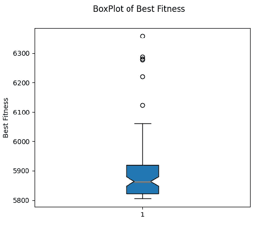

# 单元 5 应用)优化约束非线性压力容器设计问题

> 原文：<https://towardsdatascience.com/unit-5-application-optimizing-constrained-non-linear-pressure-vessel-design-problem-2fabe9f041ef?source=collection_archive---------29----------------------->

## 进化计算课程

## 我们将应用进化规划来寻找压力容器设计问题的最佳解决方案

大家好，欢迎回到进化计算的完整课程！在本帖中，我们将应用我们所学的进化编程来优化受约束的非线性压力容器的设计，从而结束本课程的第 5 单元。因为这篇文章将只涉及概念的应用，请查看我详细解释进化编程的前一篇文章。您可以在这里找到它:

 [## 第 5 单元)进化规划

### 涵盖进化编程的主要概念:变异和选择操作符

towardsdatascience.com](/unit-5-evolutionary-programming-cced3a00166a) 

在上一篇文章中，我们讨论了经典的进化编程算法，我们将从头开始实现它来解决我们的问题！

# 目录

*   问题陈述
*   文学论文的帮助
*   设计我们的算法
*   进化规划算法
*   结果
*   密码
*   结论
*   参考

# 问题陈述

我们的问题是设计一个压力容器，它的目的是装液体或气体。目标是通过优化容器的设计变量来最小化材料成本。然而，我们无法实现绝对最小化，因为我们需要满足一些约束条件，以保持容器的安全性、有效性和物理特性。有四个感兴趣的变量:

*   内径— **R**
*   圆柱段长度— **L**
*   车身厚度— **T_s**
*   帽的厚度— **T_h**

作者图片

我们的问题有四个约束，其中之一是非线性的。这是我们希望最小化的函数和约束条件:

作者图片

问题的定义域集既是连续的又是离散的。半径(R)和长度(L)是范围从 10 到 200 英寸的连续值，而头部(T_h)和主体(T_s)的厚度是从 0.0625 到 6.1875 英寸的离散值，步长为 0.0625 英寸。

正如我们所看到的，我们有最终的约束问题，一个连续和离散混合的变量域，以及四个约束，其中一个是非线性的(G3)。这将是一个完美的问题来测试我们的经典进化规划算法的效率。如果你想要一篇关于最优化理论和约束问题的评论，看看我之前的文章:

 [## 单元 1)最优化理论

### 最优化理论和四种主要最优化问题的概述

towardsdatascience.com](/unit-1-optimization-theory-e416dcf30ba8) 

# **文学论文的帮助**

约束优化问题可能非常难以处理，因为我们需要一种方法使我们的算法只关注可行域空间并避开不可行解。作为单元 1，最优化理论的回顾，有两种主要的方法来处理约束:调整我们的算法以仅产生可行解(这对于许多约束可能是困难的)或者引入惩罚项来惩罚不可行解的适应值。

在 Adam Chehouri 等人于 2016 年发表的一篇名为“***A Constraint Handling Technique for Genetic Algorithms using A Violation Factor***”的文献论文中，作者实际上陷入了关于如何处理不可行解以使用遗传算法解决约束优化问题的相同问题[1]。他们提出了两种不同的算法，这两种算法的主要思想都是将好的可行解与坏的不可行解分开。在这种分割之后，他们按照适应值对好的解决方案进行分类，按照“坏”的程度对坏的解决方案进行分类，这是由违反了多少约束条件来决定的。为了繁殖的选择，他们从汇集的好的和坏的解决方案中的两个个体之间进行了锦标赛式的选择。如果两个好的解决方案被配对来战斗，那么具有最佳适应度的解决方案被选择来生存。如果两个糟糕的解决方案被配对来对抗，那么违反约束最少的解决方案获胜。如果一个坏的和好的解决方案被配对战斗，好的解决方案总是被选择生存。

这是他们算法的简要概述，因为他们包括许多不同的复杂组件，并在许多其他优化问题上测试了它们，所以如果你想了解更多关于他们的违反因子和算法，请查看他们的论文。出于我们的目的，我们将使用他们的算法的修改来解决我们的问题。

# 设计我们的算法

对于我们的问题，我们将使用上一篇文章中讨论的经典进化编程算法。该算法通过使用高斯变异、策略参数的对数正态自适应、我们实例中的标准偏差和精英主义来工作，以从父代和子代的集合中选择最佳的一半，同时通过比赛使用相对适应度。

受前面讨论的文献论文的启发，我们将按适合度对好的解决方案进行分类，而不是按坏的解决方案破坏了多少约束，而是按它们的差异的 z 分数的总和进行分类。例如，使用上述论文中给出的算法，如果一个解决方案只违反了所有四个约束条件的 1%,那么它将被拒绝，而只违反了一个约束条件 20%的解决方案将被接受。在我看来，第一个解决方案应该比后者被接受，即使它打破了更多的约束，因为打破约束的程度比后者大得多。人们可以通过简单地对违反约束的情况下的差异求和并使用该和进行比较来实现这一点。但是，由于每个变量的定义域不同，定义域中 1%的差异可能会导致不同的总和。例如，在我们的示例中，X1 和 X2 1%的差异是 0.06125，而 X3 是 9，X4 是 19。因此，如果我们将差异相加，一个 X4 只有 1%差异的个体相当于一个 X1 有 311%差异的个体。为了解决这个问题，我们需要使用 z 分数来衡量我们的差异。 **Z-scores** 是表示一个点离其中心平均值有多远的测量值，其中大于 3 的值意味着它是一个异常值，因为它大于平均值的 3 个标准差。我们不需要担心 z 值为-3 的值，因为这表明与其他值相比，个体的差异非常小。我们想要惩罚差异大的个体，因此这就是为什么我们不取绝对值。把好的坏的排序后，把两者按顺序组合，选出最好的一半生存。我们也将利用随机锦标赛的相对适合度。

作者图片

对于我们算法的整体设计，我们将遵循上面的伪代码。首先，我们初始化我们的种群，然后我们变异种群中的所有个体来产生后代。接下来，我们将父代和子代放在一起，并使用锦标赛风格选择来计算相对适合度。然后，我们将好的和坏的解决方案进行分类和汇总，选择最好的一半来生存。

# 进化规划算法

首先，我们首先需要指定我们的适应度函数，这将是优化问题本身，以及约束条件。在“约束”功能中，我们将计算每个人违反约束的次数；如果坏了，坏了多少。因为 X1 和 X2 是离散的，我们简单地将每个个体的这些变量值四舍五入到最接近的步长 0.0625:

接下来，我们将指定我们的初始人口。记住，每个个体不仅包含他们的变量值，还包含每个变量的策略参数。因为我们使用高斯变异，我们的策略参数将是标准差参数。初始化我们的生成变量很容易，只需从域中统一采样。然而，我们如何初始化我们的策略参数呢？好吧，这取决于设计师；因为较小的标准偏差会导致开发，而较大的标准偏差会导致勘探。对于这个应用程序，我试图使标准差覆盖总域大小的 1%到 20%之间。

因为进化编程对进化个体的行为感兴趣，所以变异是用来创造后代的唯一机制，没有交叉。我们通过使用对数正态自适应更新父变量值和策略参数来创建后代，同时保留原始父值。

接下来，我们需要计算相对适应度。我们对每个人进行循环，并计算其原始体能值比锦标赛中的体能值好多少倍:

现在，是时候解决我们的主要算法了。我将把它分成几个简单的步骤。首先，因为这是一个受约束的环境，我们需要确保我们每个人都遵守领域的界限。如果个体具有大于或小于界限的变量值，那么我们需要将策略参数减少 10%，以减少该变量的突变界限:

现在是计算相对适应度的时候了。我们将父代和子代结合起来，并通过锦标赛选择来计算相对适应度，仅针对好的解决方案，即没有违反约束的解决方案:

现在，我们需要根据糟糕的程度对糟糕的解决方案进行分类，在我们的实现中，糟糕的程度是违反约束的差异的 z 分数的总和:

最后，我们将排序好的和排序坏的解决方案组合在一起，然后使用精英主义从集合的群体中选取最好的一半:

# 结果

现在是时候运行我们的算法了。因为这是文献中一个众所周知的测试问题，我们需要一个基础来比较我们的算法。在文献论文“使用人工蜂群算法*解决结构工程设计优化问题”中，Harish Garg [2]详细描述了他的人工蜂群在 50 次独立运行和平均每次运行 80，000 次函数评估后具有以下结果，其中函数评估是计算适应度函数的次数:*

**

*作者图片*

*现在我们知道了标准算法的结果，是时候运行我们的算法了。为了简单起见，我们打算每次运行 100，000 次函数求值，这将导致 1000 个初始群体和 100 次最大迭代。以下是我们独立运行 100 次后的结果:*

**

*作者图片*

*我们可以看到，我们的算法以 5805.339 的最佳适应度结束。相比之下，我们的算法确实找到了几乎等同于人工蜂群算法的最佳解决方案，只是我们的算法具有更高的中值、更高的平均值、更高的最差值和更高的标准偏差。看来我们的算法有能力找到一个接近最优的解决方案，但在重现结果是不可靠的。这是最终的最佳人选:*

**

*作者图片*

*要查看 100 次跑步的健身值范围，下面是每次跑步最佳健身值的箱线图:*

**

*作者图片*

*对于图形，下面是从所有运行中产生全局最佳解决方案的运行的平均值和最佳适应度:*

**

*作者图片*

*因为我们通过自适应策略参数来进化个体的行为，所以我们可以看到策略参数本身的进化。下面我们有用于变异第四个变量的标准差的平均值。我们可以看到，标准偏差从平均值 25 左右增加到几乎 50，并随着收敛而缓慢下降。请注意第二个峰值，它显示了自适应策略参数的能力，当在此期间减少产生不良结果时，它通过增加进行调整。*

**

*作者图片*

# *代码实现*

*正如我所有的实现一样，你可以在下面我的 GitHub 页面上找到完整的代码:*

* [## 学生/进化计算课程

### 通过在 GitHub 上创建一个帐户，为 ou student/evolutionary computationcourse 开发做出贡献。

github.com](https://github.com/OUStudent/EvolutionaryComputationCourse/tree/main/Unit5) 

# **结论**

总之，我们应用我们的经典进化规划算法来寻找一个现实世界的工程，非线性，约束优化问题的最优解。在将我们的算法与文献[2]中发现的人工蜂群算法进行比较后，我们的算法在多次独立运行后产生了寻找接近最优解的良好结果；然而，每次运行的最佳解决方案在独立运行中的适应性方面有很大差异，这表明我们的算法在仅少量运行中产生结果是不可靠的，并且需要运行多次迭代才能产生接近最佳的解决方案。

这就结束了单元 5)进化编程，请继续关注下一篇文章，在那里我们将开始和完成单元 6)进化策略，它是进化编程的表亲，并加入了交叉机制！

# 参考

[1]切胡里，亚当&尤尼斯，拉菲克&佩龙，让&伊林卡，阿德里安。(2016).使用违反因子的遗传算法约束处理技术。12.350–362.10.3844/jcs sp . 2016.350–362。

[2]用人工蜂群算法求解结构工程设计优化问题，工业与管理优化学报，10，3，777，794，2013–11–1，Harish Garg，1547–5816 _ 2014 _ 3 _ 777，人工蜂群，结构设计优化，非线性约束。约束处理，*