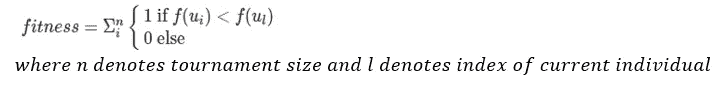
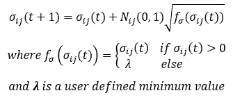

# 第 5 单元)进化规划

> 原文：<https://towardsdatascience.com/unit-5-evolutionary-programming-cced3a00166a?source=collection_archive---------10----------------------->

## 进化计算课程

## 涵盖进化编程的主要概念:变异和选择操作符

大家好，欢迎回到进化计算的完整课程！在本帖中，我们将开始课程的第 5 单元，进化编程。在上一篇文章中，我们通过解释标准遗传算法和遗传编程之间的主要区别，开始并完成了单元 4)遗传编程，此外还进化了时间序列分析问题的基本方程。你可以在这里查看:

<https://morganscottbrandon.medium.com/unit-4-genetic-programming-d80cd12c454f>  

在本帖中，我们将涵盖进化编程和标准遗传算法之间的所有主要差异；即生存的变异和选择算子。如果这是你第一次看这个课程，请查看这两篇介绍进化计算的文章，这样你就能理解这里提出的概念:

</unit-2-introduction-to-evolutionary-computation-85764137c05a>  </unit-3-genetic-algorithms-part-1-986e3b4666d7>  

# **目录**

*   进化编程和标准遗传算法的区别
*   变异算子
*   突变的分布
*   选择运算符
*   更新策略参数的自适应
*   示例实现
*   结论

# 进化编程和标准遗传算法的区别

尽管名字相似，进化和遗传编程一点也不相似。在整个遗传算法诞生的早期，有许多不同的名称和方法被用来描述文献中流传的进化算法:遗传算法、进化编程、进化策略和差分进化。这些算法中的每一个本质上都是一种进化算法，但在某些方面，由于某些特征，它们彼此不同，因此作者必须通过选择不同的名称来区分它们。

进化编程实际上是最早引入的遗传算法之一。它起源于基本的人工智能原则，并希望模拟人工智能的行为。这种范式的重点是行为进化，而不是基因型。因为基因型不是进化出来的，亲本之间不使用杂交方法，只有突变。个体只能通过变异父母来创造，变异的数量被称为**行为**。

此外，没有使用原始适应度函数，而是偏向于相对适应度。**相对适应度**值用于代替原始适应度值来衡量个人相对于周围人的表现有多好。例如，参见下表，其中我们有一个由五名随机选择的个人组成的锦标赛，以及他们的原始和相对健康值(假设在此表中最大化)。相对健康度是通过当前个体比周围人的原始健康度好多少倍来计算的:

作者图片

下图给出了进化编程的基本算法概述。我们首先初始化我们的种群，整个一个循环，其中我们变异每个个体以产生后代，然后将后代和父母集合在一起，并使用锦标赛风格选择来计算相对适应度。在这个过程之后，我们使用某种类型的选择过程来选择幸存者:

作者图片

# 变异算子

如前所述，进化规划的重点是进化个体的行为，而不是基因型，因此突变是唯一使用的繁殖算子，没有交叉。因此，变异算子需要能够足够有效地引入新的遗传物质，以适应个体之间通过交叉缺乏遗传共享的情况。对于变异算子，有三种主要类型:

*   非自适应(静态)
*   动态的
*   自适应

至此，我们已经介绍了静态和动态变异操作符。**静态**仅仅意味着我们突变的域保持不变或静态，一个例子是在[-1，1]之间的某个最大界限内突变。**动态**是指随着每一代慢慢降低这个最大变异界限，以鼓励早期世代的探索和后期世代的开发。请注意，我们已经通过使用单元 3)遗传算法第 1 部分中的逻辑衰减算法实现了动态变异。另一方面，**自适应**变异指的是变异不是静态或动态的，而是能够在任何给定时刻增加、减少或保持不变，这完全取决于环境的相对适应度。我们将在后面的文章中讨论自适应策略。下面我们有一个突变后代的一般方程:

作者图片

正如我们在上面看到的，后代是通过将某个值(δx)加到父代 x 上而创建的。这个δx 的值由下面的等式计算:

作者图片

正如我们在上面看到的，delta x 是通过将步长 nu 取向概率分布中随机生成的值(大写 eta 和策略参数 sigma)的方向来计算的。不要被符号弄得不知所措，我们以前做过这个。在单元 3)遗传算法中，我们以两种不同的方式进行变异，通过添加一个小的随机生成的值，该值来自高斯分布或均匀分布。对于高斯，我们的概率分布将是正态高斯，我们的策略参数将只是标准差，而我们的步长将是平均值。对于基于均匀变异的变异，我们的概率分布将是均匀的，我们的策略参数将只是分布的界限，而我们的步长将是 1。

我们可以为每个个体个性化一组策略参数，而不是对整个世代使用相同的策略参数，这样他们就有能力表征他们的突变范围。因为每个个体可能需要用不同的值来变异，所以我们可以改变染色体，不仅包括个体的变量值，还包括他们自己的策略参数。这方面的一个例子是贫穷的个体比健康的个体有更高的变异标准偏差。这可以从下面看出:

作者图片

在进化编程中，进化的“行为”机制是这些策略参数，这意味着，除了被进化的个体的变量之外，它们的策略参数也是如此。

# 突变的分布

在进化规划中有许多用于变异的分布；最常见的有以下几种:

*   制服
*   高斯的
*   柯西
*   征收
*   指数的
*   混乱
*   组合分布

作者图片

因为我们介绍了一些您可能没有听说过的发行版，所以我决定回顾一下每个发行版的基础知识。**柯西分布**类似于正态高斯分布，只是尾部非常宽，我们可以在左上图中看到一个例子，我们已经绘制了分布密度的 95%。 **Levy 分布**，看起来非常类似于**卡方分布**，模拟非负值并且有一个大的驼峰。**双指数分布**类似于柯西分布和正态分布，因为它具有类似的钟形曲线形状，除了它在均值和较长的尾部有一个峰值。对于**混沌分布，**有许多不同的类型，但上面是一个使用正弦波函数的例子。在 EP 中，最常见的**组合分布**是高斯与柯西配对。

作者图片

# **选择运算符**

如前所述，所有的亲本都根据它们自己独特的策略参数变异一些值来产生后代。这些后代和他们的父母被集中在一起，某种类型的选择过程被用来选择谁存活下来。相对适合度用于原始适合度，其中将一些随机选择的竞争者汇集在一起，并使用以下公式计算它们的相对适合度值(假设最大化):

作者图片

作者图片

我们已经执行的第一个等式，简单地说，就是一个人比锦标赛中的其他人拥有更大(假设最大化)的原始体能分数的次数总和。然而，第二个等式是计算相对适合度的不同方式，它创建适合度值之间的比例，并查看该比例是否大于 0 和 1 之间的随机均匀值。

在计算出相对适合度值后，我们使用某种标准的选择程序从将存活下来的后代和父母中进行选择。这可以通过锦标赛选择来实现，其中平局由**波尔兹曼选择**解决，比例选择，或精英主义(精英主义只是指选择最好的一半，而不是一些最高百分比)。

# 更新策略参数的自适应

现在，我们将讨论三种非常常见的策略参数自适应运算符:加法、乘法和对数正态。在**加法**(如下图)中，策略参数通过将某个函数的平方根乘以一个均值为 0、标准差为 1 的随机正常值相加来更新。如果大于零，此函数返回策略参数，如果策略参数为负，则返回某个下限 gamma:

作者图片

对于**乘法**方法(如下所示)，您将启动策略参数乘以下面右侧显示的值，其中 *gamma* 1、2、3 是用户选择的控制参数， *n* sub *t* 表示允许的最大代数。

作者图片

最后，最常用的方法是**对数正态**运算符。在这种情况下，后代创建如下:

作者图片

其中，我们的概率分布是以 0 为中心的高斯正态分布，标准差为 1，步长为σ。随着每次迭代，我们通过下面的等式更新我们的策略参数 sigma

作者图片

现在，在实践中，已经注意到对数正态算子在较小的参数值下有收敛过快的趋势，因此它通常伴随有最小值，这样，如果它下降到最小值以下，它就切换到该值。

# **示例实现**

这里，我们将介绍 EP 算法的三个常见示例实现:

*   经典进化编程
*   快速进化编程
*   指数进化规划

首先，**经典进化规划**算法使用高斯变异来变异基因组，使用对数正态适应来更新策略参数，使用精英主义来选择生存。

第二，**快速进化规划**算法使用柯西分布来变异尺度参数为 1 的基因组，使用对数正态适应来更新策略参数，使用精英主义来选择生存。

最后，**指数进化规划**算法使用双指数分布作为变异算子，其中策略参数和选择过程是可变的。

# 结论

总之，进化规划不同于标准的遗传算法，它关注的是个体的行为，因此没有使用交叉来支持变异。行为由分布中的策略参数建模。此外，不是使用玻尔兹曼选择来选择是孩子代替父母，还是孩子总是代替父母，而是将孩子和父母聚集在一起，基于他们在整个一代中的相对适应度为生存而战，这是通过他们比随机选择的比赛中有多少对手更好来计算的。相对适应度揭示了个人相对于当代人的表现有多好。在计算相对适合度后，可以使用标准的生存选择方法。

作者图片

在应用方面，进化规划最常用于调度与路由、电力系统、设计系统等约束环境。请继续关注下一篇文章，我们将通过解决一个真正的约束非线性规划问题来结束第 5 单元，这个问题被称为**压力容器设计问题，**我们可以在上面看到一个基本的图表。

</unit-5-application-optimizing-constrained-non-linear-pressure-vessel-design-problem-2fabe9f041ef> 