# 单元 6)进化策略——寻找帕累托前沿

> 原文：<https://towardsdatascience.com/unit-6-evolutionary-strategies-finding-the-pareto-front-65ad9ae54a34?source=collection_archive---------14----------------------->

## 进化计算课程

## 涵盖进化策略的主要概念:加号和逗号策略，并应用它们来寻找多目标问题的帕累托前沿

大家好，欢迎回到进化计算的完整课程！在这篇文章中，我们将开始课程的第 6 单元，进化策略。在前一篇文章中，我们开始并完成了第五单元进化编程:

</unit-5-evolutionary-programming-cced3a00166a>  </unit-5-application-optimizing-constrained-non-linear-pressure-vessel-design-problem-2fabe9f041ef>  

在本帖中，我们将讨论进化策略和标准遗传算法之间的主要区别。我们还将涵盖进化策略的主要概念，即选择的**加**和**逗号**策略。作为总结，我们将应用我们的算法来寻找**多目标问题**的**帕累托前沿**。

如果你不熟悉多目标问题或帕累托前沿，请查看我之前在优化理论方面的帖子:

</unit-1-optimization-theory-e416dcf30ba8>  

此外，因为进化策略是进化编程的一个扩展，请参见上面链接的我以前关于进化编程的文章。

**目录**

*   进化策略和标准遗传算法的区别
*   选择运算符—逗号和加号
*   多目标问题陈述
*   文献论文:多目标算法
*   进化策略算法
*   结果
*   密码
*   结论

# 进化策略和标准遗传算法的区别

尽管名字中有“策略”一词，进化策略并不是进化算法的“策略”领域；相反，它本身是进化算法的一个子领域，只是碰巧被称为进化策略。

进化策略与进化编程极其相似，从某种意义上说，是进化编程的延伸。进化编程主要关注通过一种先进的自适应变异算子来进化个体的**行为**。因此，个体之间没有使用基因共享，这意味着没有交叉，只有突变。这样，进化规划是一种有限的算法，因为后代只有一个父母的遗传组成，而不是通过多组父母的全局共享。进化规划算法的成功是由于其先进的变异算子。通过这种方式，我们可以将进化规划扩展到包括交叉，即多个父母之间共享基因组成。这正是进化策略所做的，它是进化编程的交叉扩展。

进化策略与标准算法的区别还在于它们的生存选择算子，即**逗号**和**加**算子。在进化策略中，基本算法如下图所示:

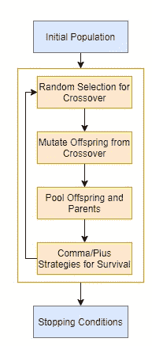

作者图片

初始化我们的种群后，我们进入一个循环，在这个循环中，我们通过交叉使用随机选择来创建后代；然后，我们通过先进的自适应变异算子对所有交叉子代进行变异；接下来，我们将我们的后代和父母聚集在一起，使用逗号或加号策略来生存。此外，在进化策略中，交叉后代的变异只有在更好的情况下才会被接受。

# 选择运算符—逗号和加号

在进化策略中，通过随机选择来进行交叉选择；然而，有两种选择谁幸存的特定策略:逗号和加号。 **Plus** 策略产生与父代数量相同或更多的后代，然后执行精英主义，从汇集的一代中选择最好的。**逗号**策略产生比父代更多的后代，并执行精英主义，从汇集的一代中选择最好的，并添加年龄成分。年龄是通过解决方案存活了多少代来计算的。一旦解的年龄达到其最大值，无论如何它都被丢弃，即使它具有最大的适应值。下面我们有这两者的确切定义:

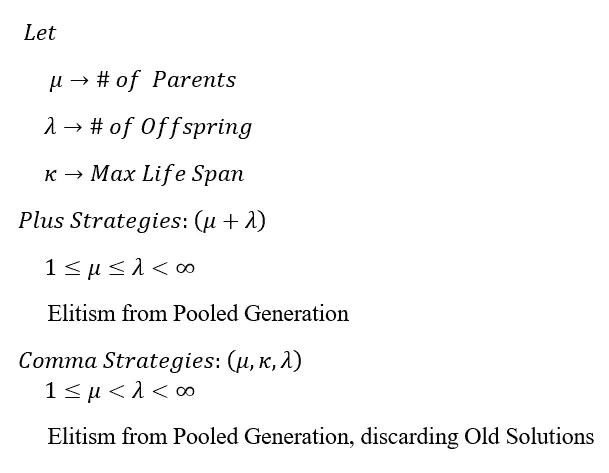

作者图片

# 多目标问题陈述

到目前为止，我们一直在处理寻找单个优化问题的最小值。现在，我们将进入多目标问题(MOP)。MOP 是指我们希望使用相同的领域空间同时最小化一组优化问题的问题。有两种主要的方法来处理 MOP，加权聚合和帕累托占优。**加权聚合**的工作原理是简单地对每个函数进行加权，并将它们的函数值加在一起形成一个聚合，并试图使该和最小化。另一方面，**帕累托优势**引入了解决方案之间优势的概念，目标是返回**帕累托前沿**，这是一个决策向量前沿，它强烈支配输入空间中的所有其他决策向量，但彼此仅微弱支配。如果你不熟悉帕累托占优，请查看我以前关于最优化理论的帖子，这样我就不会在这里重复了。

</unit-1-optimization-theory-e416dcf30ba8>  

我们要解决的目标是同时最小化以下两个目标:

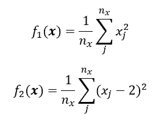

作者图片

通过使用微积分，F1 函数的全局最小值在 x=0 向量处，而它在 F2 的 x=2 向量处。正如我们在所有 MOP 中看到的，每个目标的全局最小值都是不同的，因此找到一种在目标之间折衷的方法是至关重要的。在给定一组权重的情况下，我们可以很容易地将其转换为聚合函数，然后将该值最小化，这没有问题:

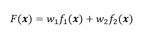

作者图片

然而，我们将使用帕累托优势来寻找最佳决策向量的帕累托前沿。这个问题的精确帕累托前沿如下:

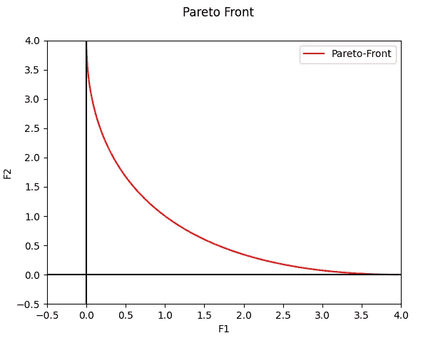

作者图片

可以看出，我们有能力以 F2 为 4 为代价将 F1 最小化为 0，以 F1 为 4 为代价将 F2 最小化为 0，或者选择帕累托前沿上导致两个函数的最小化之间的折衷的任何其他决策向量。

# 文献论文:多目标算法

我们以前从未讨论过如何实现基于 Pareto 优势的 MOP 算法。作为一点启发，我们要看看文献论文中提出的通用算法，***《帕累托存档进化策略:帕累托多目标优化的新基线算法》*** 约书亚·诺尔斯和大卫·科恩[1]。他们的算法使用了一种我们还没有介绍过的进化策略，即 **(1+1)加策略**。这个策略实际上甚至不是一个基于种群的算法，因为它接受 1 个父代并产生 1 个子代。他们的用于解决多目标问题的 Pareto 存档算法以两种方式工作，第一种是候选生成器，第二种是存档更新器。目标是创建候选解决方案，然后将其添加到包含不受任何其他解决方案支配的解决方案的“档案”中，本质上是构建帕累托前沿。它们的候选生成器算法如下所示:

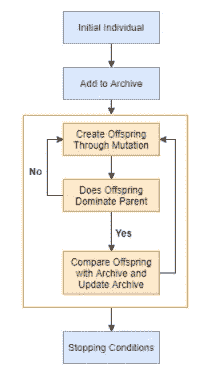

作者图片

它的工作原理是创建一个初始个体，将其添加到档案中，然后通过突变连续创建一个单独的后代，然后根据优势取代父代被拒绝或接受。如果子代比父代被接受，则它进入档案更新算法以查看它是否被档案接受。存档接受算法如下所示:

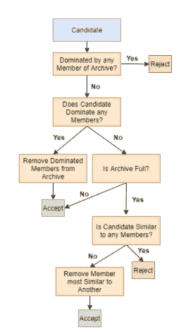

作者图片

归档的目标是自下而上地构建帕累托前沿，并提供固定大小的解决方案。我们希望我们的存档具有跨越整个 pareto 前沿的解决方案，而不仅仅是单个位置，因此我们实现了一个相似性度量，以防止解决方案过于接近和聚集。

我们将通过实现基于群体的 plus 算法而不是单个个体来为我们的应用程序更新该算法。我们将使用三个随机选择的亲本之间的全局交叉来创建后代，对数正态自适应高斯变异，以及基于 Pareto 优势的锦标赛式相对适应度。此外，我们使用上面描述的相同算法更新我们的档案，其中我们通过欧几里德距离测量解决方案的相似性。这样，与档案中的成员解具有相似欧几里德距离的候选解将被扣分。我们算法的基本流程如下:

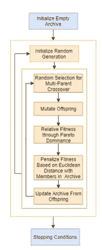

作者图片

我们创建两个循环，一个内部循环负责创建后代并更新档案，另一个外部循环使用不同的随机生成的群体重复内部循环多次。用许多不同的初始代重复我们的算法的原因是，我们的内部循环的群体将最终收敛到已经存在于档案中的点，因此它们将由于相似性而受到严重惩罚。因此，在我们收敛到一个点之后，我们用一个全新的群体重新开始，以便它现在学会避开归档中已经存在的解决方案。对于生存的选择操作符，我们将实施加法策略，其中后代的数量等于父母的数量，并且我们使用来自混合的后代和父母的精英主义来计算下一代。

# 进化策略算法

既然我们已经讨论了问题陈述和我们的算法，是时候用 python 来实现它了。首先，让我们为我们的 MOP 定义两个目标:

我们将使用相对适应度，通过锦标赛选择，基于帕累托优势。相对适合度是通过个人在锦标赛中“支配”其他解决方案的程度来计算的:

现在我们将定义我们的交叉和变异方法。我们将有两种交叉方法来处理多亲重组，平均和“直觉”，参见我以前的帖子对这两种方法的解释。此外，我们的变异操作符将与进化编程的前一单元中的相同，如果你不熟悉变异操作符，请参阅那篇文章。

在这里，我们将定义我们的繁殖函数，它将接受一组父母，他们的策略参数，交叉方法，并输出后代。将产生两个后代，一个仅来自交叉，另一个来自交叉后代的突变。因为变异只有在交叉后产生更好的后代时才会被接受，我们将会有一场基于帕累托优势的后代之战，在这场战争中，支配另一个后代的后代将被选择。如果双方都弱于对方，将随机选择获胜者:

现在是我们主要进化算法的时候了。不幸的是，这是太长的细节在这里，所以我留下了评论，将解释到底发生了什么。请务必理解上面给出的算法图，因为下面的代码遵循相同的结构:

[https://gist . github . com/ou student/66122 ce 9 e 2249 b5 a 76 f 450979740 da 25](https://gist.github.com/OUStudent/66122ce9e2249b5a76f450979740da25)

# 结果

现在是时候测试我们的算法了。我们将以 100 个个体的初始化规模运行我们的算法，10 个变量用于我们的 MOP，3 个双亲用于交叉。因为这是一个相对简单的 MOP，我期望每个种群在 40 代内收敛到一个解。我们将重复这个过程总共 100 次。我们将使用两种交叉方法和两种不同的最大相似性度量来测试我们的算法。

以下是使用最大相似距离为 2 的第一种平均交叉技术的结果:

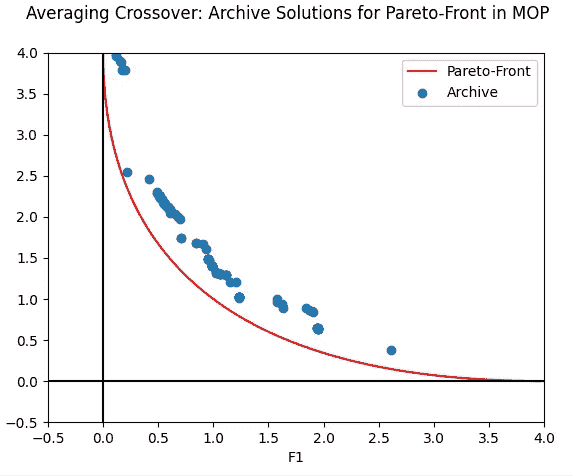

作者图片

正如我们所看到的，我们的档案几乎跨越了整个 pareto 前沿，在左上角聚集成 F1 的最小值，在中间是 F1 和 F2 的折衷。我们的大多数解决方案并没有完全触及帕累托前沿，只是在它上面徘徊了一点点。

下面是使用第二种直观的交叉技术的结果，最大相似性距离为 2:

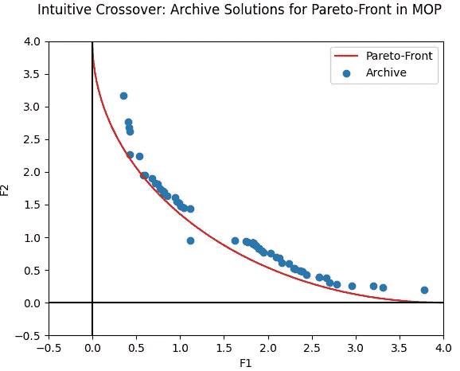

作者图片

正如我们所见，直观的交叉技术跨越了比平均更多的帕累托前沿，同时也更接近实际前沿。

# 最大相似距离为 0.75 的测试

现在，我们将再次测试我们的交叉方法，除了最大相似性距离为 0.75:

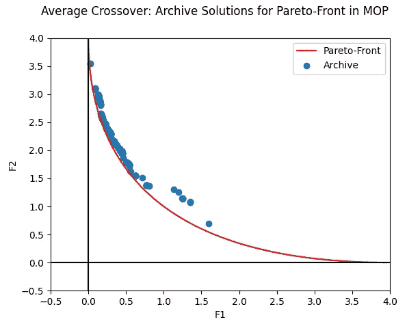

作者图片

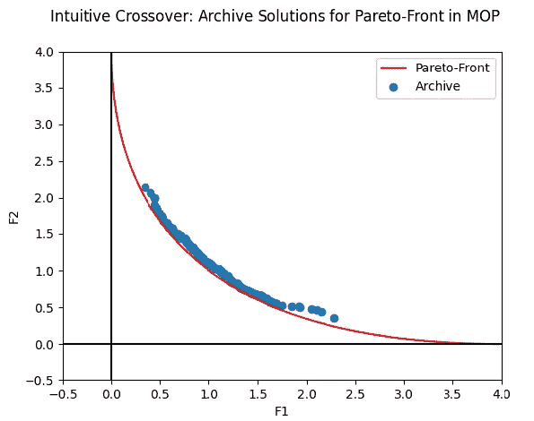

作者图片

从结果中我们可以看出，两种交叉方法仍然探索不同的帕累托前沿范围；然而，减少的最大相似性距离导致档案聚集在一起并更靠近前端。

总之，这两种交叉方法将导致对 pareto 前沿的不同探索，因此在实践中有必要执行这两种方法，并将最终档案汇集在一起，并基于 pareto 优势进行更新。此外，最大相似性距离的选择直接影响档案中的点可以变得多接近。较小的最大距离将导致点更接近帕累托前沿，同时也更接近。最大距离越大，点离帕累托前沿越远，但前沿的跨度也越大。

# 密码

你可以在我的 GitHub 上找到这个进化课程的完整代码:

<https://github.com/OUStudent/EvolutionaryComputationCourse/tree/main/Unit6>  

# 结论

进化策略是进化编程的扩展，其中进化编程的焦点是仅通过变异来进化解决方案的行为。然而，进化策略在此基础上进行了扩展，引入了基因组的交叉以允许种群内的基因共享，同时还使用了先进的自适应变异算子。

在这篇文章中，我们研究了用于处理多目标问题的 Pareto 存档进化策略算法[1]，并受此启发，设计了我们自己的算法来寻找一个简单的多维 MOP 的 Pareto 前沿。结果表明，两种交叉方法导致对 pareto 前沿的不同探索，其中档案的紧凑性与最大相似性距离成正比。

敬请关注下一篇文章，我们将在其中讨论第 7 单元自动机器学习的差异进化！

</unit-7-differential-evolution-automated-machine-learning-eb22014e592e>  

# **参考文献**

[1] J. Knowles 和 D. Corne，“Pareto 存档进化策略:Pareto 多目标优化的新基线算法”，1999 年进化计算大会会议录-CEC99(目录。№99TH8406)，1999 年，第一卷第 98–105 页，doi: 10.1109/CEC.1999.781913。