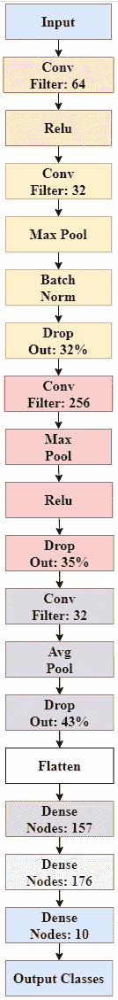

# 第 7 单元)差异进化—自动机器学习

> 原文：<https://towardsdatascience.com/unit-7-differential-evolution-automated-machine-learning-eb22014e592e?source=collection_archive---------12----------------------->

## 进化计算课程

## 将差分进化的概念应用于在 CIFAR-10 数据集上进化深度卷积神经网络的架构

大家好，欢迎回到进化计算的完整课程！在这篇文章中，我们将开始并完成课程的第 7 单元，差异进化。在前一篇文章中，我们应用了一种进化策略算法来寻找多目标问题的 Pareto 前沿。您可以在下面找到它:

</unit-6-evolutionary-strategies-finding-the-pareto-front-65ad9ae54a34>  

如果你是这门课程的新手，请看看我以前的帖子，尤其是这两篇，因为我在那里详细介绍了进化计算和遗传算法的基础知识，因为我没有太多时间在这里重复我自己:

</unit-2-introduction-to-evolutionary-computation-85764137c05a>  </unit-3-genetic-algorithms-part-1-986e3b4666d7>  

在这篇文章中，我们将介绍差分进化和标准遗传算法之间的主要差异，变异和交叉的单位向量的创建，不同的参数策略，然后以一个**自动机器学习**的应用程序结束，在这个应用程序中，我们将进化一个**卷积神经网络**的架构，用于对 **CIFAR-10** 数据集上的图像进行分类。我没有时间介绍卷积神经网络是如何工作的，也没有时间介绍通过 Keras 创建模型的微调，所以请在进一步深入之前刷新一下自己。

这篇文章将是我迄今为止最长的一篇，所以请喝一杯，准备好潜入兔子洞吧！

# 目录

*   **差异进化和标准遗传算法的区别**
*   **通用变异和交叉算子**
*   **单位向量的创建**
*   **参数策略**
*   **问题陈述**
*   **创建模型架构:模块化**
*   **排列问题**
*   **差分进化算法**
*   **结果**
*   **代码**
*   **结论**

# 差异进化和标准遗传算法的区别

尽管差分进化有“差分”这个词，但遗传算法的这个子领域与微分导数或方程没有任何关系，我知道这可能会让一些人松一口气。差分进化与标准遗传算法的不同之处在于，它依靠单位向量中的距离和方向信息进行繁殖。另一个独特的特点是，交叉应用于变异后，而不是相反。此外，变异算子不是像前面的算法那样由概率分布产生的，而是由**单位**向量产生的。该算法的一般流程可以描述如下:

作者形象

初始化种群后，我们使用某种类型的选择程序(我们将在下面讨论)进行多亲生殖。从亲本集合中，我们通过创建单位载体进行突变，然后与“主要”亲本杂交，创建最终的后代。从后代和“主要”亲本中选出最好的，供下一代存活。

# 一般变异和交叉算子

差分进化中的变异算子由两部分组成，即差异向量和目标向量。**差异向量**是两个或多个父代之间差异的向量，其中**目标向量**是在创建**单位**向量时其方向将被优先化的父代。单位载体是突变过程的最终产物，然后传递给当前“主要”亲本，即突变操作中不包括的感兴趣亲本。下面我们有一个精确的定义:

作者形象

我们可以在下面看到单位向量的几何幂:

作者形象

以上我们有三个亲本载体，即 **X1** 、 **X2** 、 **X3** 。我们创建了 **X2** 和 **X3** 之间的差异向量，然后按β进行缩放。经过这个尺度后，我们将其加入到我们的目标向量 **X1** 中，得到最终的单位向量 **U** 。正如我们所看到的，差分进化依赖于这些单位向量来操纵域空间，而不是使用来自概率分布的随机突变。差异进化的力量在于能够利用群体中的方向信息来创造后代。

差分进化中的交叉就像标准遗传算法，这意味着我们有两种类型:平均型和直觉型。在我们创建我们的单位向量之后，我们选择不同于上面使用的“主要”亲本，然后在这个新亲本和单位向量之间执行交叉以获得最终的后代。我们可以在下面看到一个例子，我们在父向量和单位向量之间交换变量值，以创建两个新的后代:

作者图片

# 单位向量的创建

希望你现在可以看到，创建新后代的主要机制是通过单位向量的可变性，这直接影响模型的结果。

在差分进化领域，有许多不同的策略来创建单位向量，称为 **DE/x/y/z** 策略，其中 **x** 表示选择的目标向量， **y** 表示差异向量的数量， **z** 表示交叉方法。以下是最常见的策略:

**DE/Best/1/z:** 该方法仅使用一个差向量，其中父代是随机选择的，其目标向量是当前种群中的最佳个体:

作者图片

**DE/Rand/n/z:** 该方法通过选择一个随机目标向量和 **n 个**随机选择的差异向量来工作:

作者图片

**DE/Rand-to-Best/n/z:** 该方法通过在最佳个体和随机母体之间引入线性组合来创建目标向量，并且 **n** 随机选择的差异向量的数量:

作者图片

**DE/Current-to-Best/n/z:**该方法通过将“主要”父代与最佳个体合并来创建目标向量，以及 **n** 随机选择的差异向量的数量:

作者图片

使用随机个体作为目标向量的问题是，我们的算法没有全局方向可循，导致收敛性差，但探索性好。然而，使用目标向量的最佳个体将引导群体朝向中心位置，但是会导致过早收敛。通过使用**组合策略**可以在两者之间达成妥协。组合策略只是在一组策略之间来回切换，或者是迭代地，或者是概率地。

# 参数策略

与进化算法中的所有参数策略一样，我们可以使用静态、动态或自适应更新过程。你可以通过阅读前面的单元来深入了解这些类型，特别是**单元 3)用于动态的遗传算法高级概念**和**单元 5)用于自适应的进化编程**:

差分进化中的主要参数是缩放系数， **beta** ，通常取值在**【0，无穷大】**之间。其中较小的值相当于较小的步长(收敛)，较大的值相当于较大的步长(探索)。当使用一个差向量时，标准情况是β值在值 **0.5** 附近，并按照差向量数量的比率减小。

对于动态更新，我们可以使用逻辑衰减或线性减少，这在上面发布的前几个单元中有所涉及。对于自适应，我们可以调整我们的算法，使得当最小值和最大值之间的适应度差距开始缩小时，β将增加，或者当适应度差距开始增大时，减小β。通过这种方式，当群体中存在大量多样性时，我们会采取较大的步骤，当我们开始收敛时，我们会采取较小的步骤。

# 问题陈述

我们的问题将是为 CIFAR10 小图像分类数据集发展卷积神经网络的最佳架构。 **CIFAR10** 数据集包含 **60，000 张 32x32 RGB** 彩色图像，有十个可能的类别。在这里，我们可以看到 10 个可能类别的一些例子:

作者图片

如果您想了解更多关于数据的信息，请访问下面的机器学习知识库:

  

选择卷积神经网络的模型结构一直是参数调整的一个非常不确定的领域。通常，模型架构是由具有丰富经验的领域专家构建的；然而，随着**自动化机器学习的出现，**新颖的程序员可以在几乎没有经验的情况下构建高效的模型。自动机器学习是优化和机器学习理论的一个领域，其目标是为给定的算法找到最佳的超仪集。在我们的例子中，这些超参数对应于 CNN 的架构。

**为什么要用差分进化进行自动机器学习？**与所有进化算法一样，差分进化是一种先进的导向随机搜索技术，在优化函数的导数未知的优化问题中取得了很好的成功。当优化问题不可微时，如何使用标准的数值方法来调整神经网络的结构？简而言之，你不能，这就是为什么我们求助于非经典优化算法，如进化计算。其他用于调整 CNN 架构的非经典优化算法包括**网格搜索**；然而，网格搜索的主要问题是层的可能组合的数量随着每个附加层呈指数增长，因此网格搜索实际上在计算上是浪费的和昂贵的。

**为什么使用差分进化而不是其他进化算法？**几乎在每种情况下，对于大多数优化问题，标准遗传算法都将优于差分进化；然而，差分进化是唯一使用方向信息的进化算法。方向信息的使用是至关重要的，因为该算法通过朝向目标向量的方向采取“贪婪”方法。这样，差分进化将比其他进化算法更快地找到最小值；然而，这个最小值不能保证是全局的或好的最优值，因为算法的探索性很差。因此，当优化问题只有一个或几个局部最优解时，差分进化优于标准进化算法；然而，当输入空间有许多局部最优解时，差分进化应该是你最后的选择。在进化深度神经网络上使用标准进化算法的问题是，适应度函数实际上是从给定的架构中训练模型，这可能需要几个小时甚至几天。这样，我们需要一个快速收敛的算法，以防止运行几天或几周。因此，我们作出一个关键的假设，即我们的结构的输入空间只有一个或几个局部最优值。另一方面，如果您有多个处理器和 GPU 可以分散计算，那么使用标准的遗传算法将是有益的。

在进化模型架构中，另一个可行的差异进化的竞争者是**进化编程**，在第 5 单元中介绍。在不同的架构上执行交叉可能会产生所谓的**置换问题**，这将在后面讨论，尽管父母非常优秀，但后代却非常差。一个快速的解决方案是不执行交叉，只执行变异，这正是进化编程所执行的。此外，因为进化编程不执行交叉，它允许**物种形成，**物种形成，这将很快被涵盖。

# 创建模型架构:模块化

为了创建我们的算法，我们首先需要定义 CNN 的可能架构。我们的 CNN 将由**个模块**组成，其中每个模块都是一组可能的层。为了扩大我们的网络规模，我们可以堆叠这些模块，以在我们的模型中创建深度。我们的网络将分为两个部分，即**卷积网络**和**深度网络**，其中每个网络都由各自的模块组成。首先，对于我们的**卷积模块**，我们有可能的层:卷积、池化、批量归一化、激活函数和退出。为了给我们的模型创造深度，我们把这些模块堆叠起来，得到一个完整的网络。正如我们在下图中看到的，网络中的每个模块都可以扩展为以下几层:

作者图片

为了让我们的算法更强大，它将有能力在每个单独的模块中包含这些层。此外，如果选择包含，它还将能够为每个层选择超参数。以下是每个单独卷积模块中每个层的可能选择:

作者图片

正如我们所看到的，该算法将能够包括非卷积层以及调整它们的超参数。然而，该算法将不具有进化激活或优化算法的能力。这背后的原因将在下一节解释。

对于**深度模块**，我们有可能的层:密集、批量标准化和丢弃。与卷积部分一样，我们可以堆叠多个**深度模块**来创建深度网络:

作者图片

为了让我们的算法更强大，它将能够在每个单独的模块中包括批量范数和漏失层。此外，如果选择包含，它还将能够为每个层选择超参数。以下是每个单独模块中每层的可能选择:

作者图片

正如我们所看到的，该算法将能够选择密集层的节点数量，以及是否包括其他层及其相关的超参数。

总的来说，训练的每个模型将具有下面的结构，其中算法将具有关闭每个单独模块内的某些层并调整它们的超参数(如果包括的话)的能力。

作者图片

如果你不知道，在这个实验中，我们将允许算法发展四个卷积模块，并与两个深度模块配对，以创建网络模型。

# **排列问题**

排列问题是进化计算中常见的问题。**排列问题、**又称**竞争约定问题、**特指与两个或两个以上的父母进行杂交以获得后代的问题。下面的例子很容易解释。假设我们正在进化网络群体的权重、层数、节点数以及每层的激活函数。下面我们有两个被选中的父母和他们的单个后代:

作者图片

正如我们所看到的，两个父架构非常不同，一个父架构只有 2 个隐藏层，每层 9 个节点，而另一个父架构有 4 个隐藏层，节点数从 6 个减少到 3 个。尽管他们的架构不同，让我们说两个父母有相似的健康分数。这里我们有一个竞争约定问题的主要例子，我们有两个不同的模型架构用于解决同一个问题。问题是，父代之间的架构如此不同，以至于当我们执行交叉时，我们会得到一个混合后代，它具有来自父代的权重组合，这些权重是针对一个架构专门设计的，它们被扔在一起以创建一个全新的架构。更具体地说，当父母之间的网络架构的**表型**如此不同，以至于许多遗传信息在交叉过程中丢失，经常产生极其差的后代时，就会出现**置换问题**。排列问题最常见的解决方案是要么不要以这样的方式进化架构，这样问题就不会发生，要么不执行任何交叉，只执行变异，这正是进化编程所执行的，在第 5 单元中讨论。然而，另一种常见的策略是创造**物种形成**，其中只有结构相似的个体被组合在一起形成一个物种，只有同一物种内的个体才被允许繁殖和杂交。这样，我们就可以在进化过程中拥有相互竞争的物种。

在我们的问题中，我们可以有两个完全相同的 CNN 架构，但是具有不同的优化器或激活函数，结果将会显著不同。改进优化器或激活函数将比包含一个层或多个节点产生更大的影响，从而产生排列问题。为了避免这一点，我们可以在我们的算法中实现物种形成，但这将是未来的冒险，因为我不想在这里过于复杂的事情。因此，取而代之的是，我们不会进化优化器或激活函数，让它们保持静态。

# 差分进化算法

我们将遇到的主要问题是，我们的适应度函数将是训练模型。这里我们有一个选择，我们要么训练几个时期，要么直到收敛/提前停止。如果我们只训练几个时期，我们会限制较大模型的适合度，这可能需要更长的时间来获得好的结果，但是如果我们训练到收敛，那么每个模型可能需要 20 分钟来运行。为了确保我们的算法不会偏向于较小的模型而不是较大的模型，我们必须训练直到收敛/提前停止。因此，现在我们不得不处理长时间的训练。

我测试了模型的初始群体，训练每个模型平均需要 12-15 分钟。假设我们的初始种群只包含 10 个个体，运行每一代大约需要 2 个小时…四天半的时间来运行 50 代…没有人能做到…

为了绕过这个问题，我们可以在来自训练数据的小样本上训练我们的模型，然后在算法已经收敛于实际训练数据之后训练我们的最终一代，以获得我们的结果。 **CIFAR10** 数据集有 50，000 张训练图像和 10，000 张测试图像。我们可以通过只对 20，000 张训练图像进行训练，将每个模型的平均训练时间减少到 1.5 分钟。这样，我们可以将初始种群增加到 20 个个体，每一代只需要 30 分钟，相当于一天多一点的时间运行 50 代，比以前好得多。

对于预处理，我们将通过最大像素值 255 来缩放我们的图像，使得每个像素值的输入在 0 和 1 之间。此外，执行图像增强以增加模型的泛化能力也是常见的。**图像增强**是一种通过简单地随机翻转、旋转和移动现有训练图像来人工创建更多训练图像的方法，以便模型可以很好地推广到不同的图像增强。下面是一个例子，我们稍微改变了单个图像的方向:

作者图片

执行图像增强的问题在于，它会创建新的图像，从而增加训练数据集的大小和训练时间，这正是我们在训练数百个模型时所不希望的。为了解决这个问题，我们将在进化过程中只在训练数据集的给定子样本上训练我们的模型，然后在完整的训练数据集上训练最终模型，然后在具有增强图像的数据集上训练最佳模型。这样，我们可以最小化训练时间，最大化进化搜索过程的能力。

如前所述，差分进化有一个贪婪的方法，通过使用目标向量。为了防止在演进过程的早期就提前收敛到特定的架构，我们将只使用一个不同的向量来实现 **DE/Rand/n/z** 策略。换句话说，这就是我们创建单位向量的方式:

作者图片

我们的算法将如下工作。对于这一代中的每个个体，我们将通过上述突变过程创建一个单位向量，然后进行交叉以获得后代。如果子代架构比“主要”父代产生更好的验证准确性，则父代将被替换。对于交叉，我们将实现平均技术，我们将简单地平均父母之间的每个模块以获得后代。

即使我们利用随机个体作为目标向量，因为我们只接受比‘主要’父代更好的后代，我们的算法也不会丢失好的解，并且最终会收敛或停滞。

# 结果

每个模型被允许进化四个卷积模块和两个深度模块。在初始种群为 20 个个体的 50 代之后，我们的算法已经收敛到一个架构。以下是每代的最佳和平均验证准确度分数:

作者图片

我们可以看到，我们的算法在大约 22-24 代时收敛到一个特定的架构，因此最佳适应度停滞不前；然而，随着方向向量开始指向该通用架构，平均适合度仍然缓慢增加。

收敛后，在整个数据集上训练最终生成，直到收敛，这里是最终验证准确度分数的箱线图:

作者图片

正如我们从上面看到的，模型在整个数据集而不是子样本上训练后，在获得更好的验证分数方面表现得更好。现在，从上面描述的运行中选择最佳模型再次在整个数据集上运行，除了这次使用图像增强的训练数据来提高通用性。这是最终的模型架构，其中每个模块都有颜色编码:

作者图片

更具体地说，以下是来自 Keras 的模型摘要:

作者图片

在对增强图像训练数据集进行训练之后，我们获得了以下结果。以下是 75 个训练周期后的训练和验证准确性趋势:

作者图片

我们可以看到，随着训练精度的提高和验证分数的停滞，我们的模型开始稍微过度拟合数据。

现在是时候在剩下的 10，000 张图片上测试我们的模型了。在通过最终模型运行测试数据集之后，我们获得了以下**测试精度:0.8359** 。这是一个非常好的结果！这意味着我们进化的 CNN 架构在几乎 84%的时间里正确预测了测试数据的分类！尽管模型很小，只有 **278，247 个可训练参数**，但这是一个非常有希望的结果。

尽管 84%的测试准确率是可以接受的，但这并不“有声望”，因为大多数训练有素的模型在这个特定的数据集上可以达到接近 95%的测试准确率；然而，我声称这是我在这个数据集上见过的最好的测试分数之一，因为可训练参数的架构很小，因为我见过的大多数模型要么有数百万个可训练参数，要么使用预训练的网络，要么使用复杂的网络。

为了在进一步的实验中获得更好的结果，我们可以增加 CNN 和 Deep Network 允许的模块数量，希望这将增加模型的能力。此外，我们还可以改变卷积层的通道数量，以便算法支持更多的通道。但是现在，我希望这个简短的例子已经向您展示了利用进化算法，特别是差分进化，通过模块化来调整卷积神经网络架构的能力。

# **代号**

这个项目的原始代码将会在我的 GitHub 资源库中提供给这个特定的课程:

<https://github.com/OUStudent/EvolutionaryComputationCourse/blob/main/Unit7/auto_ml_cnn_arch.py>  

如果你对这个项目感兴趣，并且想把这个算法应用到你自己的数据集中，我建议不要扩充我上面给出的代码。我目前正在开发一个基于进化计算的 Python 库，其中将包含一个基于这里描述的算法构建的专门算法，用于进化深度神经网络的架构。这个库应该会在接下来的两周内发布，当它发布的时候我会发布一个帖子，所以请耐心的关注和等待。

# 结论

差异进化与标准遗传算法的不同之处在于，它通过使用目标和单位向量来利用群体中的方向信息。这些能力允许差异进化以较差的探索为代价更快地收敛到解。只有当手头的优化问题只有一个或几个局部最小值时，才应该应用差分进化。

在这篇文章中，我们通过在 CIFAR-10 数据集上整合模块化，应用差分进化来进化 CNN 的架构。简单算法在进化过程的早期发现了一个特定的体系结构，并在收敛之前在那个总的方向上执行了一个贪婪的搜索。结果显示，最终模型的测试准确率为 84%，而只有 278，000 个可训练参数，对于这样一个小模型来说，这是一个非常好的分数。到目前为止，一个高级 Python 库正在开发中，它将很快在这里发布，包含进化计算领域的许多高级算法，特别是这里描述的算法的改进。

敬请关注下一篇文章，我们将在第 8 单元“共同进化”中结束课程，在那里我们将共同进化游戏人工智能代理来玩月球登陆车！

</unit-8-co-evolution-reinforcement-learning-for-game-ai-design-97453ed946ec> 