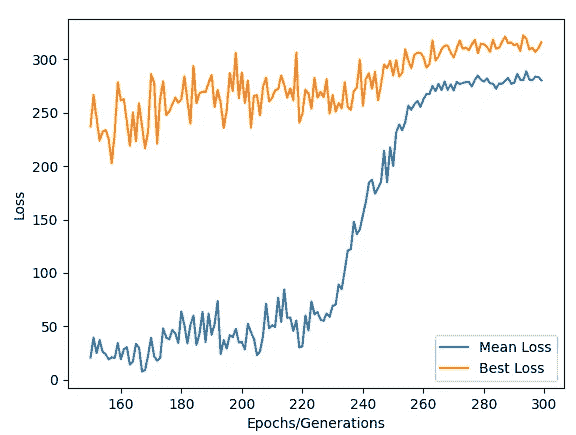

# 单元 8)协同进化——游戏人工智能设计的强化学习

> 原文：<https://towardsdatascience.com/unit-8-co-evolution-reinforcement-learning-for-game-ai-design-97453ed946ec?source=collection_archive---------21----------------------->

## 进化计算课程

## 使用 Python Gym 环境和进化计算库，共同进化用于玩月球着陆器的竞争游戏 AI！

大家好，欢迎回到进化计算的完整课程！在这篇文章中，我们将开始并完成第八单元，共同进化。不幸的是，这将是本课程的最后一个单元，但希望你在这个过程中学到了很多！在前一单元中，我们应用差分进化来进化 Keras 中的卷积神经网络的模型架构，您可以在此处找到该文章:

</unit-7-differential-evolution-automated-machine-learning-eb22014e592e>  

如果您是本系列的新手，请查看下面的两篇文章，我在其中介绍了理解进化计算所必需的背景信息:

</unit-2-introduction-to-evolutionary-computation-85764137c05a>  </unit-3-genetic-algorithms-part-1-986e3b4666d7>  

在这篇文章中，我们将简要概述共同进化、竞争适应度、不同类型的共同进化，然后以进化合作/竞争游戏 AI 来玩**月球着陆器**来结束。

# 目录

*   **协同进化和标准遗传算法的区别**
*   **竞技健身**
*   **竞争与合作的协同进化伪算法**
*   **用于强化学习的 Python 健身房环境**
*   **月球着陆器的竞争/合作协同进化**
*   **代码**
*   **结论**

# 协同进化和标准遗传算法的区别

协同进化和标准遗传算法的主要区别在于，协同进化不是一种进化算法，而是一种同时进化不同物种和种群的方法论。共同进化背后的思想是为了解决同一个问题而进化两个或更多独特的个体物种。例如，假设我们回到单元 3 和单元 4，在那里我们试图预测时间序列问题。单元 3 中采用的方法是进化固定神经网络的权重，而单元 4 中采用的方法是进化决策树。当我们将这两种独特的算法结合起来，创建两个不同的种群、算法种类，并让它们针对同一问题同时进化时，就会出现协同进化。通过这种方式，我们可以创造一个竞争的环境，在这个环境中，每个物种的进化都是基于它们比其他物种好多少，而不一定是基于它们在自己物种中的适应程度。

有两种主要类型的共同进化:

*   捕食者与猎物(竞争)
*   共生(合作)

竞争协同进化通常用于从可能的种群中确定最佳物种，或者为游戏人工智能设计进化不同的策略。另一方面，**合作共同进化**被执行，其中目标是所有物种一起合作来解决特定问题。

# 竞技体能

如前所述，在共同进化中，个体的适应度是通过它比其他物种/种群中的个体好多少来计算的，而不是在它自己的物种中。存在不同的方式来计算先前描述的两种类型的协同进化方法的适合度。

对于**捕食者与猎物(竞争)，**我们想要比较物种之间的适应度得分。我们可以通过竞争适应度抽样进行比较，我们随机抽取另一个群体的适应度值与当前值进行比较。有四种主要的采样技术:

1.  **所有采样** —将每个物种的每个个体与其他物种的所有个体进行比较。
2.  **随机抽样** —将每个物种的每个个体与每个物种整个种群的随机样本进行比较。
3.  **锦标赛抽样** —将每个物种的每个个体与每个物种的小型锦标赛进行比较。
4.  **最佳取样** —将每个物种的每个个体与每个物种的最佳个体进行比较。

对于**共生(合作)**，因为我们希望的一般种群共同进化，所以我们会执行相对适应度，而不是竞争适应度。相对适应度关注的是个体相对于他们周围的人，包括他们自己的物种，表现得有多好。有三种主要的采样技术:

1.  **所有取样** —将每个个体与所有个体进行比较
2.  **随机抽样** —将每个人与随机样本进行比较
3.  **锦标赛抽样** —每个人都与一个小型锦标赛进行比较

正如我们所看到的，竞争和合作共同进化的采样技术极其相似；竞争的主要区别在于每个物种相对于其他物种的表现如何，而共同进化则在于整个物种群体的表现如何。

# 竞争与合作协同进化伪算法

既然我们已经讨论了共同进化的主要区别，让我们来看两个用于设计游戏 AI 代理的伪代码算法。第一次竞争协同进化:

作者图片

上面我们有一个两个种群物种之间的竞争性共同进化的例子，其中它们的适应度是基于来自另一个物种的适应度值的一些样本。

对于合作式共同进化:

作者图片

上面我们有一个所有种群物种之间合作共同进化的例子。我们简单地计算原始适合度，然后通过上面讨论的某种采样技术计算相对适合度。在合作协同进化中，允许相对适应值差的物种灭绝是很常见的。

# **用于强化学习的 Python 健身房环境**

开发游戏 AI 代理是一个包含许多不同学科领域的广阔领域。在这个领域中，有太多不同的方法来创造游戏人工智能代理；然而，培训这些代理的主要领域被称为**强化学习:**代理在不同情况下应该如何行动。

[https://commons . wikimedia . org/wiki/File:Reinforcement _ learning _ diagram . SVG](https://commons.wikimedia.org/wiki/File:Reinforcement_learning_diagram.svg)

在强化学习场景中，我们奖励我们的代理在环境中采取的行动。如果代理采取了不好的行动，我们惩罚它，否则我们奖励它的好行动。通过这种方式，代理人学会在环境中导航，以最大化回报。在这类问题中创建人工智能代理的最常见方式是通过神经网络。我不打算在这里详述神经网络，所以如果你不熟悉，我建议你仔细阅读。神经网络的强化算法有很多，比如**演员评判法**、 **Q 学习**、 **DDPG** 等等。然而，在这篇文章中，我们的目标不是使用上述方法，而是使用**遗传算法**。

一些人在尝试测试他们的强化学习算法时可能遇到的主要问题是如何创建环境本身。嗯，幸运的是，在 Python 中存在一个名为 **Gym** 的库，这是一个用于开发和比较强化学习算法的工具包，包含大量旧的 Atari 游戏、复杂的物理问题和其他简单的小游戏。您可以在下面找到他们的网站:

<https://gym.openai.com/>  

我们将使用体育馆的环境来测试我们的遗传算法。

# **月球着陆器的竞争/合作协同进化**

我们的应用问题是处理**月球 Landar-v2** 环境。这种环境是健身房特有的。这个问题的目标是让月球着陆器在着陆台上着陆。输入是八个不同的数值，代表着陆器的距离和方向，而输出是四个离散的选项，向左、向右、向上移动，或者什么都不做。当获得 200 的适应值时，认为问题已经解决。

为此我们将使用**进化计算**库中的**神经增强器**类，附:我写的。这将是库的一小段，目前还没有完全完成，但是我已经等不及要展示这个例子了。您可以在我的 GitHub 资源库页面上找到更多关于该库及其更新的信息:

<https://github.com/OUStudent/EvolutionaryComputation>  

你也可以在 PyPi 上找到它

<https://pypi.org/project/EvolutionaryComputation/>  

**神经强化器**类是专门解决输入为数字的强化型学习问题的类，而**神经强化器**类解决输入为图像的强化型学习问题。**神经强化器**类通过先进的自适应对数正态遗传算法来进化前馈神经网络的权重和激活函数。神经强化器展示了将竞争和合作机制结合成一种进化机制。它展示了合作的方面，因为目标是让所有物种进化出解决问题的最佳模式；此外，它展示了竞争的品质，因为进化中的每个物种都必须为生存而战，否则就会灭绝……**神经强化剂**中的物种由其激活功能来指定，这些激活功能可以是所有层的静态激活功能，也可以是混合激活功能。

要建立这个问题，我们首先需要创建我们的适应度函数，它将接受群体并返回每个个体的“适应度”。“健康”只是玩一个游戏后的奖励:

现在我们需要创建神经网络架构。对于这个例子，我们将选择一个具有三个隐藏层和 50、100、50 个节点的网络架构。对于激活功能选择，我们将考虑 **relu、leaky relu、卢瑟、elu、高斯、sigmoid、**和 **tanh** 。为了允许进化过程中的一些变化，如果一个个体的当前物种多于一个，它将有 5%的机会转换物种。最后，对于物种形成，我们将把个体各层的激活函数视为静态的。

# 原始群体

这里我们有来自人群的初始因子。注意他们在登陆月球着陆器时做得很差。然而，他们将很快学会如何在环境中的良好行为得到奖励。

# 绘图结果-完成层激活

达到最大代数后，就该可视化结果了:

首先，我们有了最佳和平均奖励分数的总体图:

正如我们在上面看到的，最佳奖励在第 0 代和第 100 代之间波动很大，这表明高奖励仅仅是随机获得的。然而，请注意，在第 225 代，平均奖励急剧增加，然后在第 260 代左右停止。给定一代人的最佳回报可以简单地从随机机会中获得，因此建议查看平均回报，因为它展示了人口的行为。在第 240 代，平均奖励增加到 200 多一点，表明该算法成功地进化出一群模型来解决**月球着陆器-v2** 问题。

下面我们可以看看进化后的物种大小。图例展示了物种，其中激活函数表示特定层的激活。例如，物种“elu，elu，elu”展示了三个隐藏层都具有“elu”作为激活功能。

作者图片

正如我们在上面看到的， **leaky relu** (绿色)开始规模很大，但很快在 60 代左右消亡，而 **elu** (蓝色) **tanh** (粉色)**卢瑟**(紫色)开始掌权。然而，除了卢瑟之外，其他的都很快开始减少。最上面的两个激活功能可能是**卢瑟**和**坦恩**。

现在，因为我们已经确定了顶部的两个激活函数，我们可以重做的演变，除了这一次允许激活函数混合每层之间的顶部两个，卢瑟和坦。这样，我们就能进化出最好的激活功能架构。

# 绘图结果-混合层激活

正如我们从上面看到的，改进我们的层激活搜索实际上改善了群体收敛。当获得 200 的奖励时，问题被认为解决了，这是在种群中通过第 170 代实现的，比保持层激活静态快 55 代。然而，收敛末期的最佳模型与之前的进化有着相似的最终回报。如果问题更复杂，那么第二次改进的架构搜索也可能获得更好的最佳模型。

下面我们可以看看进化后的物种大小。图例展示了物种，其中激活函数表示特定层的激活。例如，物种“卢瑟，卢瑟，坦”展示了前两个隐藏层都有“卢瑟”作为激活函数，而第三层有“坦”。

正如我们所见，物种大小在进化过程中变化很大。**卢瑟，谭，卢瑟**’(绿色)是在整个进化过程中体型最大的物种，在大约 190 代时，50 个种群中有 45 个个体；然而，该物种在 10 年左右因趋同而慢慢消亡。在 50 个种群中，大约有 15 个个体的最大最终物种是“**谭，谭，卢瑟”**。

# 最终生成后的最佳模型

进化之后，最好的模型被保存下来，下面是连续六场比赛的视觉效果:

# **结论**

共同进化可以是竞争的，合作的，或者两者兼有。协同进化的目标是协同进化不同的物种或算法来解决给定的问题。它最常用于钢筋类型的情况。

在这篇文章中，我们讨论了竞争和合作环境中的两个基本伪算法，而我们的例子结合了这两个算法来解决 Gym 的**月球着陆器**环境。我们为此使用的 API 是来自**进化计算**库的**神经强化器**类。

这篇文章将是进化计算课程的最后一部分。我希望你们都学到了很多关于进化算法的知识，并渴望在自己的问题中使用它们！在下一篇文章中，我将介绍**进化计算**库，它是我用本课程涵盖的所有材料创建的！