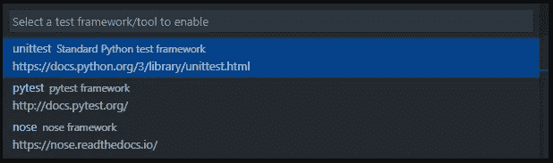

# 深度学习中的单元测试

> 原文：<https://towardsdatascience.com/unit-testing-in-deep-learning-b91d366e4862?source=collection_archive---------15----------------------->


[JESHOOTS.COM](https://unsplash.com/@jeshoots?utm_source=medium&utm_medium=referral)在 [Unsplash](https://unsplash.com?utm_source=medium&utm_medium=referral) 上拍照

深度学习/机器学习工作流通常不同于人们对正常软件开发过程的预期。但是这并不意味着人们不应该从这些年来发展的软件开发中汲取灵感并结合最佳实践。在这篇文章中，我将讨论单元测试，为什么以及如何在你的代码中加入这些。我们将从简单介绍单元测试开始，然后是深度学习中的单元测试示例，以及如何通过命令行和 VS 代码测试浏览器运行这些测试。

# 介绍

单元测试是软件开发人员熟悉的一个概念。这是一种非常有用的技术，可以帮助您防止代码中出现明显的错误和 bug。它包括测试源代码的单个单元，例如函数、方法和类，以确定它们满足需求并具有预期的行为。单元测试通常很小，执行起来不需要太多时间。测试具有广泛的输入，通常包括边界和边缘情况。这些输入的输出通常由开发人员手工计算，以测试被测试单元的输出。例如，对于一个加法器函数，我们会有如下的测试用例。(稍后我们会看到一个深度学习的例子。)


来源:作者

您可以测试具有正输入、零输入、负输入、正输入和负输入的情况。如果被测试的函数/方法的输出等于单元测试中为所有输入情况定义的输出，那么你的单元将通过测试，否则它将失败。您将确切地知道哪个测试用例失败了。可以进一步调查以找出问题。这是您的代码中一个令人敬畏的健全检查。尤其是当多个开发人员在一个大型项目中工作时。想象一下，有人基于某些假设和数据大小编写了一段代码，而新的开发人员更改了代码库中不再满足这些假设的内容。那么代码一定会失败。单元测试可以避免这种情况。

下面是单元测试的一些好处。

*   迫使您编写模块化的、可重用的代码，并清晰地定义输入和输出。因此，您的代码将更容易集成。
*   增加更改/维护代码的信心。它有助于识别由代码更改引入的错误。
*   提高了对单元本身的信心，因为如果它通过了单元测试，我们就可以确定逻辑没有明显的错误，并且单元正在按预期执行。
*   调试变得更容易，因为您知道哪个单元失败了，以及失败的特定测试用例。

# Python 中的单元测试

每种语言都有自己的工具和软件包来进行单元测试。Python 也有一些可用的单元测试框架。 [**unittest**](https://docs.python.org/3/library/unittest.html) 包是标准 Python 库的一部分。我将讨论如何通过命令行/bash 以及作为 VS 代码 UI 接口来使用这个框架。它受 JUnit 的启发，与其他语言中的主要单元测试框架有相似的味道。它支持测试自动化，共享测试的设置和关闭代码，将测试聚合到集合中，以及测试独立于报告框架[4]。

这个框架中单元测试的基本构件是测试用例——必须建立和检查正确性的单一场景。在 unittest 中，测试用例由 unittest 表示。测试用例实例。要制作你的测试用例，你必须编写 TestCase 的子类。

TestCase 实例的测试用例应该是自包含的，这样它既可以独立运行，也可以与任意数量的其他测试用例任意组合运行。TestCase 子类的测试方法应该在名称中有 test 前缀，并执行特定的测试代码。

为了执行测试，TestCase 基类有几个 assert 方法，允许您对照被测试单元的输出来检查测试用例的输出。如果测试失败，将会引发一个异常，并给出一条解释消息，unittest 会将测试用例标识为失败。任何其他异常都将被视为错误。

有两种类型的设置方法可用于为测试设置您的类。

1.  setUp——这将在类中的每个测试方法之前调用。
2.  setUpClass —这对于整个类只运行一次。这是你应该用于深度学习测试的方法。在这个方法中加载模型，以避免在执行每个测试方法之前重新加载模型。这将节省模型重新加载的时间。

请注意，各种测试的运行顺序是通过根据字符串的内置顺序对测试方法名称进行排序来确定的。

现在让我们看看我为测试一个分段项目的 PyTorch 数据加载器而创建的单元测试。代码如下所示。

被测试的分割数据集应该将相应的图像和掩模对成批加载。将正确的图像映射到正确的掩模是至关重要的。为此，通常，图像和遮罩在其名称中具有相同的编号。如果你通过一些放大来调整你的图片大小，那么你得到的尺寸应该和预期的一样。对于 PyTorch，数据加载器返回的张量的形式应该是 BxCxHxW，其中 B 是批量大小，C 是通道数，H 是高度，W 是宽度。

现在，我将解释代码中发生了什么。我创建了一个 Test_TestSegmentationDataset 类，它继承了 unittest。测试用例基类。如前所述，我创建了一个 setUpClass 方法，这是一个确保初始化只进行一次的类方法。

这里需要注意的一点是，为了测试目的，我已经禁用了 dataloader 中的混排。因为我希望名称中带有 001 的图像和掩码出现在数据加载器创建的第一批的索引 0 处。检查不同批次的不同样本索引将是一个更好的测试，因为您将确保不同批次之间的顺序一致。我将第一批作为类属性存储在 cls.samples 中。

既然初始化已经完成，我们来看一下单独的测试。

在第一个测试中，我检查了数据加载器返回的图像张量维数。由于我没有调整图像的大小，我希望图像的大小为 320x480，这些图像被读取为 RGB，所以应该有 3 个通道。在 setUpClass 方法中，我指定批量大小为 4，所以张量的第一维应该是 4。如果尺寸有问题，该测试将失败。

下一个测试是完全相同的，除了它是为面具张量。在这个特定的数据集中，掩膜只有一个通道。所以我预计通道数是 1。批量大小应为 4。遮罩形状应为 320x480。

最后一个测试检查两件事。首先是通过手动应用数据加载器中指定的变换获得的张量是否会产生与数据加载器相同的结果。第二是图像和掩模对是正确的。要直接应用 torchvision 转换，您需要实例化转换并将您的图像作为输入传递给该实例。如果 transform 需要 PIL 图像或 numpy . array(ToTensor 就是这种情况)，任何其他格式都会导致错误。

现在我们已经准备好了单元测试，让我们先看看如何通过命令行运行这个测试。

您可以使用以下命令:

`python -m unittest discover -s Tests -p "test_*"`

一旦您指定了搜索目录和搜索模式，Unittest 就可以发现您的测试。

```
-s or --start-directory directory: It specifies the start discovery directory. In our case, since the tests were in a Tests folder we specified that folder as a value for this flag.-p or --pattern pattern: It specifies the match pattern. I specified a custom pattern just to show you that this functionality is available. Since the default pattern is test*.py, it would work for our test script by default.-v or --verbose: If you specify this you’ll get output for every test method in your test class.
```

非详细和详细输出如下所示。如果您的所有测试方法都通过了，那么最后您会得到一条 OK 消息。


当所有测试都通过时，Unittest 非详细输出(来源:作者)


所有测试都通过时的 Unittest 详细输出(来源:作者)

但是，如果任何一个测试方法失败了，您将会得到一个失败消息，其中指定了失败的测试。你开始知道哪个特定的断言失败了。如前所述，这非常有助于调试和找到破坏代码的原因。在这种情况下，我改变了正在读取的图像，而不是正在比较的张量，这导致了错误。


未通过所有测试时的详细输出(来源:作者)


未通过所有测试时的详细输出(来源:作者)

您可以将这个测试执行行包含在任何用于自动部署的自动化批处理或 bash 文件中。例如，我们在 [GitHub Actions](https://github.com/features/actions) 中使用类似的测试，在更新版本被自动推送到我们的包存储库之前，自动验证代码是否工作。

接下来，我将向您展示如何使用 VS 代码测试浏览器通过 UI 运行这些测试。

# 在 VS 代码中运行 Python 单元测试[3]

默认情况下，在 VS 代码中禁用 Python 测试。要启用测试，请使用命令面板上的 Python: Configure Tests 命令。这个命令提示您选择一个测试框架，包含测试的文件夹，以及用于识别测试文件的模式。最后两个输入与我们通过命令行运行单元测试时使用的输入完全相同。Unittest framework 不需要进一步安装。但是，如果您选择的框架包没有安装在您的环境中，VS 代码会提示您安装它。


在命令 Pallete 中选择 Python: Configure Tests。(图片来源:作者)



选择所需的框架。在这个例子中是 unittest。(图片来源:作者)


选择测试发现目录。这种情况下的测试。(图片来源:作者)


选择测试发现模式。在本例中是 test_*。py(来源:作者)


对我们来说，这个提示不会出现。(图片来源:作者)

一旦正确设置了发现，我们就会在 VS 代码活动栏中看到带有图标的 Test Explorer。测试资源管理器帮助您可视化、导航和运行测试。您还可以看到测试脚本中直接可用的运行测试和调试测试选项。您可以从这个视图中运行所有的或者单独的测试，也可以在不同的类中导航到单独的测试方法。


VS 代码单元测试接口(来源:作者)

如果测试失败，我会出现一个红叉而不是绿勾。如果您想节省时间，您可以选择只运行失败的测试，而不是所有的测试。


VS 代码单元测试失败的例子(来源:作者)

# 结论

关于深度学习单元测试的文章到此结束。我们简要地了解了什么是单元测试以及它们的好处。接下来，我们使用 unittest 包框架完成了一个用 PyTorch 编写的 dataloader 单元的实际例子。我们学习了如何通过命令行以及从 VS 代码的 Python 测试浏览器来运行这些测试。我希望你开始为你的代码编写单元测试，并从中获益！感谢您阅读文章。该代码可在[https://github.com/msminhas93/DeepLabv3FineTuning](https://github.com/msminhas93/DeepLabv3FineTuning)获得

# 参考

[1]https://softwaretestingfundamentals.com/unit-testing/

[2][https://www . tutorialspoint . com/unittest _ framework/unittest _ framework _ overview . htm](https://www.tutorialspoint.com/unittest_framework/unittest_framework_overview.htm)

[3][https://code.visualstudio.com/docs/python/testing](https://code.visualstudio.com/docs/python/testing)

[https://docs.python.org/3/library/unittest.html](https://docs.python.org/3/library/unittest.html)

[5][https://stack overflow . com/questions/23667610/what-is-the-difference-of-setup-and-setup class-in-python-unittest/23670844](https://stackoverflow.com/questions/23667610/what-is-the-difference-between-setup-and-setupclass-in-python-unittest/23670844#:~:text=The%20main%20difference%20(as%20noted,before%20each%20and%20every%20test.&text=A%20class%20method%20called%20before%20tests%20in%20an%20individual%20class%20are%20run.)