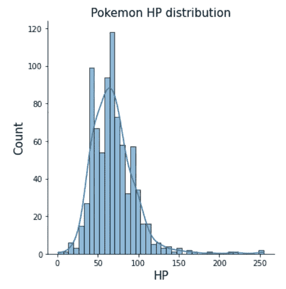
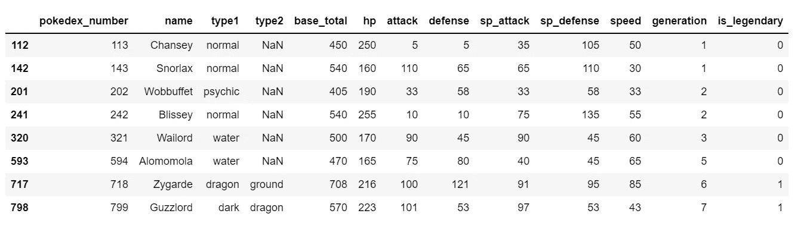
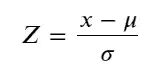
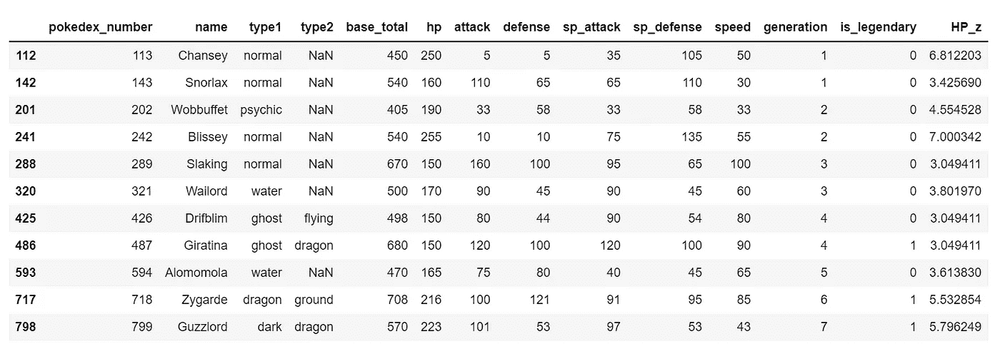
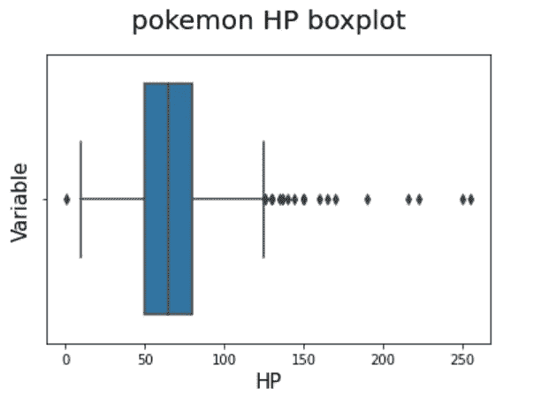
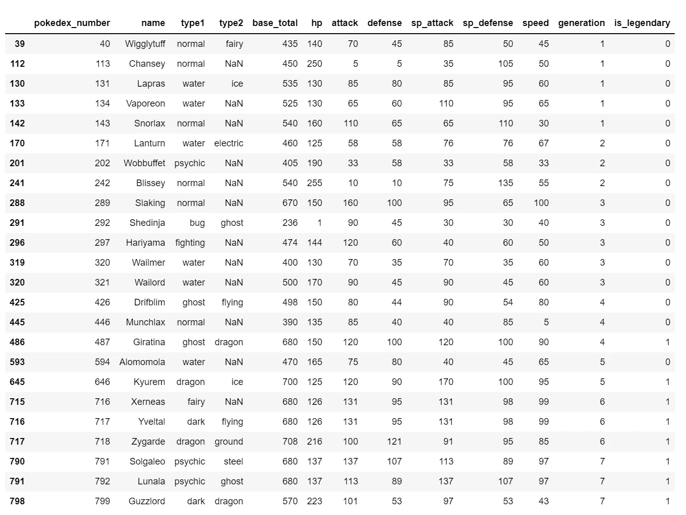
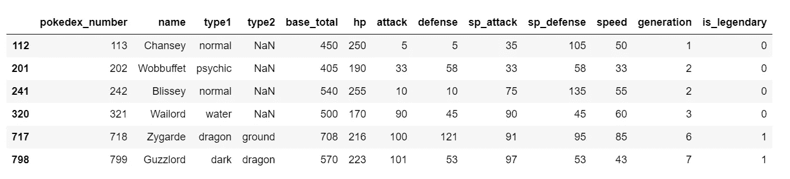
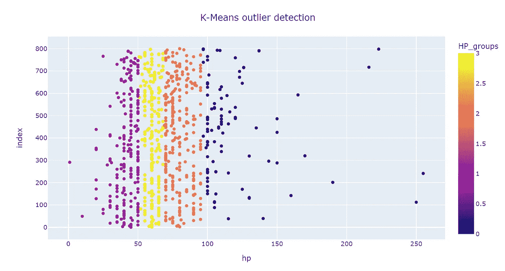

# Python 中的单变量异常检测

> 原文：<https://towardsdatascience.com/univariate-outlier-detection-in-python-40b621295bc5?source=collection_archive---------9----------------------->

## 从数据集中检测异常值的五种方法


威尔·梅尔斯在 [Unsplash](https://unsplash.com?utm_source=medium&utm_medium=referral) 上拍照

异常值检测通常是任何探索性数据分析的重要部分。这是因为在现实世界中，数据通常是杂乱的，许多不同的事情都会影响底层数据。因此，能够从底层数据中识别不同的方法是非常重要的。

那么，首先要问的是“什么是离群值？”离群值可以被归类为不符合模式、数据结构或不在我们对现有数据的预期的正常范围内的一个或几个数据点。这是一个非常主观的定义，因为异常值在很大程度上取决于您检查数据点是否为异常值的环境。

这种异常值可能是许多不同问题的结果:

*   人为误差
*   仪器误差
*   试验误差
*   有意创造
*   数据处理错误
*   抽样误差
*   自然离群值

当然，能够识别该异常值的目的也可以不同。这可能是因为异常值表明产生数据的操作发生了变化，这些数据在以下情况下很有用:

*   欺诈检测
*   入侵检测
*   故障诊断
*   时间序列监控
*   健康监控

异常值表示流程中可能出现了问题，或者生成数据的流程的性质发生了变化。因此，这将需要根据基本的公认正常数据来确定异常值。

在其他情况下，能够从现有数据中移除异常值以确保模型工作是有用的。例如:

*   推荐引擎
*   时间数列预测法
*   科学实验
*   模型结构

其中现有数据中的异常值会影响模型实现，例如线性回归或分类任务。因此，在我们还不确定什么是正常行为的情况下，从现有数据中识别异常值是很重要的。

因此，这两个任务可以分开，第一个任务涉及新生成数据中的新颖性检测，而第二个任务涉及基础数据中的异常检测。我们主要关注第二个领域，尽管下面概述的方法也可以应用于第一种情况。

我为此使用的数据集是前七代神奇宝贝的数据集，总共包含 801 个神奇宝贝。具体来说，我将重点分析这个数据集中 HP 属性的分布，以便能够检测任何潜在的异常。当然，通过这些方法检测到的数据集中的任何异常可能实际上不是异常，但是我们可以根据结果做出选择。

**分布图**

第一种方法是通过分布图检查基础数据集的分布。这可以使用以下代码实现:

```
#create the displot
sns.displot(pokemon["hp"],
           kde = True)#label the axis
plt.xlabel("HP", fontsize = 15)
plt.ylabel("Count", fontsize = 15)
plt.title("Pokemon HP distribution", fontsize = 15)plt.show()
```



作者图片

由此我们可以看到，该分布呈现正偏态，有几个点位于该分布的最右端。根据视觉检查，我们可以说，血量大于 200 的神奇宝贝可能是该数据集中的异常值。这可以通过以下方式从数据集中提取:

```
pokemon_above_150_HP = pokemon[pokemon["HP"] > 150]
pokemon_above_150_HP
```



作者图片

我们可以看到，这导致了 8 个潜在的异常值，但这只是基于纯粹的视觉检查。

**Z 值**

我们可以看到 HP 属性的分布大致是正态的，尽管有一定程度的倾斜。因此，我们可以通过使用 Z 分数来补充视觉检查。这基于以下公式:



其中，𝜇是数据的平均值，𝜎是标准偏差。这样做的目的是查看数据点距离数据集平均值有多少标准差。数据点越远，Z 值越高，我们就越有可能认为该数据点是异常值。这可以在 Python 中实现为:

```
#calculate the Z score
pokemon["HP_z"] = (pokemon["hp"] - pokemon["hp"].mean())/pokemon["hp"].std()
```

在此基础上，我们可以使用 Z 分数来检查大于平均值 2、2.5、3 或 3.5 倍标准差的数据。选择哪个 Z 值作为临界值将取决于基础数据，但这里选择临界值 3 将提取以下神奇宝贝:



作者图片

这里的主要区别是，这包括那些与 150 或以上的 HP，而不仅仅是大于 150。因此，这表明，就该数据集而言，最初的目测检查和截断点的选择是相对准确的。

**箱线图**

另一个好方法是箱线图。这又是另一种可视化方法，可用于识别数据集中的任何异常值。这样做的依据是，任何小于下四分位数减去四分位数间距的 1.5 倍或者大于上四分位数加上四分位数间距的 1.5 倍的值都可以被视为异常值。在图上，这显示为超出箱线图本身的最小值和最大值的单独点。这可以使用 Seaborn 库来实现，如下所示:

```
#create the boxplot
ax = sns.boxplot(x = pokemon["HP"])#add labels to the plot
ax.set_xlabel("HP", fontsize = 15)
ax.set_ylabel("Variable", fontsize = 15)
ax.set_title("pokemon HP boxplot", fontsize =20, pad = 20)plt.show()
```



作者图片

与分布图相比，这个箱形图更清楚地表明了哪些数据点可以归类为异常值，我们可以看到，这表明不仅在分布的高端有异常值，而且在分布的低端也有异常值。

**Tukey fences**

可以使用四分位距的值提取这些点，如下所示:

```
#extract the upper and lower quantiles
pokemon_HP_lq = pokemon["HP"].quantile(0.25)
pokemon_HP_uq = pokemon["HP"].quantile(0.75)
#extract the inter quartile range
pokemon_HP_iqr = pokemon_HP_uq - pokemon_HP_lq#get the upper and lower bounds
lower_bound = pokemon_HP_lq - 1.5*pokemon_HP_iqr
upper_bound = pokemon_HP_uq + 1.5*pokemon_HP_iqr#extract values outside these bounds 
Pokemon_IQR_outliers = pokemon[(pokemon.HP <= lower_bound) | (pokemon.HP >= upper_bound)]
Pokemon_IQR_outliers
```



作者图片

这表明比以前的检查有更多的异常值。事实上，这表明一个神奇宝贝的血量低于下限，而 23 个神奇宝贝的血量高于上限。

考虑到大量的潜在异常值，这种方法的替代方法是使用替代值乘以四分位间距。为了从中获得极端的异常值，而不是只乘以 1.5，我们可以乘以 3。这样做，我们得到:



作者图片

这表明在分布的上端只有六个异常值。您选择哪一个将取决于您想要识别的异常值的类型。

**集群**

最后一种可能使用的方法是聚类。聚类的目的是能够从数据集中识别组，其中潜在的离群值可能适合极端组或它们自己的组，这取决于它们的特征与基础数据集的不同程度。对于单变量分析来说，这可能会限制其明确识别不同组的能力，但是可视化结果可能会比仅仅检查下面的分布更清楚地识别异常值。因此，使用 K 均值聚类，这可以实现为:

```
#convert the HP values to a float to be able to use numpy 
HP_raw = pokemon["hp"].values.astype("float")
#use the kmeans function from scipy
centroids, avg_distance = kmeans(HP_raw, 4)
#extract the groups from the data
groups, cdit = vq(HP_raw, centroids)#plot the results
#assign groups back to the dataframe
pokemon["HP_groups"] = groups#plot the scatter plot
fig = px.scatter(pokemon, x = "hp", y = pokemon.index,
                color = "HP_groups",
                hover_name = "name")
#add a title
fig.update_layout(title = "K-Means outlier detection",
                 title_x = 0.5)
#show the plot
fig.show()
```



作者图片

从中我们更有可能识别出分布的低端和高端的异常值。

这些方法表明不同的潜在异常值都来自同一数据集的事实表明，异常值检测不是一门精确的科学，必须做出判断。其中的一个重要部分是决定需要对这些异常值做什么，以及它们从数据集中移除的意义，输入值以覆盖这些异常值，或承认它们的存在但继续按原样进行分析。

这当然将取决于识别异常值的目的、基础数据集和未来将执行的分析。虽然试图从整个数据集的单个变量中找出异常值的实际应用可能会受到限制，但这些方法可用于补充多元异常值检测算法，如隔离森林、局部异常值因子或椭圆包络线，其中可分析异常值得分以确定污染值。

可用代码:【https://github.com/PhilipDW183/Outlier_detection 

可用数据集:[https://www.kaggle.com/rounakbanik/pokemon?select=pokemon.csv](https://www.kaggle.com/rounakbanik/pokemon?select=pokemon.csv)

<https://philip-wilkinson.medium.com/membership>  </an-introduction-to-object-oriented-programming-for-data-scientists-879106d90d89>  </london-convenience-store-classification-using-k-means-clustering-70c82899c61f>  </introduction-to-decision-tree-classifiers-from-scikit-learn-32cd5d23f4d> [## scikit-learn 决策树分类器简介

towardsdatascience.com](/introduction-to-decision-tree-classifiers-from-scikit-learn-32cd5d23f4d)