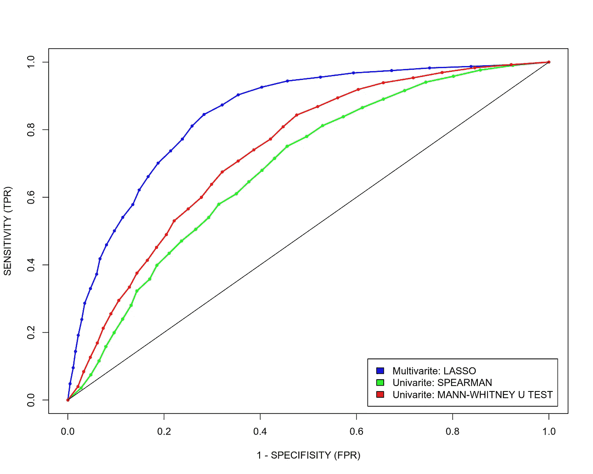
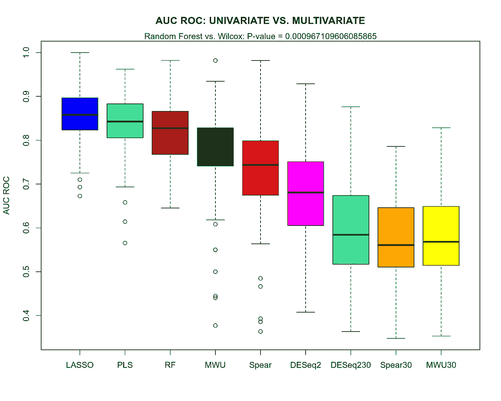

# 单变量与多变量预测

> 原文：<https://towardsdatascience.com/univariate-vs-multivariate-prediction-c1a6fb3e009?source=collection_archive---------25----------------------->

## [生命科学的数理统计和机器学习](https://towardsdatascience.com/tagged/stats-ml-life-sciences)

## DESeq2 与 LASSO 对基因表达的预测能力

作者图片

这是我的专栏 [**生命科学的数理统计和机器学习**](https://towardsdatascience.com/tagged/stats-ml-life-sciences?source=post_page---------------------------) 中的**第二十一篇**文章，我试图以简单的方式解释生物信息学和计算生物学中使用的一些神秘的分析技术。在我之前的文章[为组学集成选择特征](/select-features-for-omics-integration-511390b7e7fd)中，我给出了多变量特征选择的例子，并提到了它相对于单变量特征选择的优势，但没有实际演示。在本帖中，我们将比较多变量模型如 [**【套索】**](https://en.wikipedia.org/wiki/Lasso_(statistics))[**PLS**](https://en.wikipedia.org/wiki/Partial_least_squares_regression)[**随机森林**](https://en.wikipedia.org/wiki/Random_forest) 与单变量模型的预测能力，如著名的差异基因表达工具 [**DESeq2**](https://genomebiology.biomedcentral.com/articles/10.1186/s13059-014-0550-8) 以及传统的 [**曼-惠特尼 U 检验**](https://en.wikipedia.org/wiki/Mann%E2%80%93Whitney_U_test) 和 [**斯皮尔曼使用骨骼肌**](https://en.wikipedia.org/wiki/Spearman%27s_rank_correlation_coefficient) **[**RNAseq**](https://en.wikipedia.org/wiki/RNA-Seq) 基因表达数据集，我们将展示使用多变量模型构建的预测得分，以优于来自单价特征选择模型的预测得分。**

# 骨骼肌 RNAseq 基因表达数据

这里，我们将量化几种特征选择方法的**预测能力**:a)**单变量**(逐个)特征选择，b) **多变量**(全部)特征选择。出于演示目的，我们将使用来自 [**GTEX 人类组织基因表达联盟**](https://gtexportal.org/home/) 的骨骼肌 RNAseq 基因表达数据集(为简单起见，随机取样 1000 个基因)。

[GTEX 门户:人类基因表达公共资源](https://gtexportal.org/home/documentationPage#staticTextAbout)

版本 6 GTEX 骨骼肌数据集包括 157 个样本。在这里，我们加载基因表达矩阵 X，并删除低表达基因。为了与后[选择组学整合特征](/select-features-for-omics-integration-511390b7e7fd)保持一致，我们将使用**性别**作为我们将要预测的响应变量 Y。让我们快速观察一下降维后的样本，如 PCA。

作者图片

正如我们所看到的，PCA 图并没有显示基于骨骼肌基因表达数据的雄性和雌性之间的明显区别。我们可以假设仅来自[性染色体(X 和 Y)](https://en.wikipedia.org/wiki/Sex_chromosome) 的基因可以在雄性和雌性之间提供完美的分离，但是我们在这里没有观察到，因为:1)大多数基因来自[常染色体](https://en.wikipedia.org/wiki/Autosome)，2)随机采样了 1000 个基因，所以我们可能没有从 X 和 Y 染色体上采样很多基因。在下一部分中，我们将把数据集分成训练和测试子集，然后在训练集上实现单变量和多变量特征选择(**训练**)模型，并且**使用平衡假阳性(FPR)和真阳性(TPR)率的 [**ROC 曲线**](https://en.wikipedia.org/wiki/Receiver_operating_characteristic) 技术在测试集上评估**模型。

# 性别预测:套索法与单变量法

为了评估单变量和多变量模型的预测能力，我们需要对**独立的**数据集进行训练和评估。为此，让我们将数据集分成训练(80%的样本)和测试(20%的样本)子集。为了确保我们的评估不是基于特定的“幸运”数据分割，我们将多次随机分割成训练和测试子集，计算每次 ROC 曲线，并对多个 ROC 曲线进行平均。这样，我们将一举两得:为每个模型的 ROC 曲线建立**置信区间**，并使 ROC 曲线**平滑**且美观，否则它们会显得“尖锐”，除非你在测试子集中有大量样本，而我们这里肯定没有。

在[之前的文章](/select-features-for-omics-integration-511390b7e7fd)中，我展示了如何使用 LASSO 进行多变量特征选择，以及使用 Spearman 相关性进行单变量特征选择。为了进行比较，我将再添加一种单变量特征选择方法，即 Mann-Whitney U 检验，它应该在很大程度上与 Spearman 相关性相当，因为两者都是**非参数和基于等级的**单变量方法，不假设数据的特定分布。为了将通过单变量方法单独选择的基因组合成预测分数，我们将通过其表达和性别之间的个体关联的 [p 值](https://en.wikipedia.org/wiki/P-value)来使用它们的排序，用 [Bonferroni 程序](https://en.wikipedia.org/wiki/Bonferroni_correction)(或不太保守的 [Benjamini & Hochberg FDR 程序](https://en.wikipedia.org/wiki/False_discovery_rate))校正多重测试。这通常导致在多次测试调整后，在训练数据集上出现一些差异表达的基因。此外，显著差异表达的(雄性和雌性之间)基因可以通过计算它们对训练数据集的影响/权重(雄性和雌性之间基因表达的 Spearman rho 和[倍变化](https://en.wikipedia.org/wiki/Fold_change)的对数)和它们对来自测试数据集的样品的基因表达值的乘积而被压缩成预测分数。让我们对其进行编码，并比较模型之间的 ROC 曲线。

作者图片

这里我们可以得出结论，LASSO 比两种单变量特征选择方法具有更大的预测能力。为了更好地了解这三种方法的 ROC 曲线下面积(AUC ROC)的差异，并能够进行统计测试来说明 ROC 曲线之间的差异**有多显著**，让我们根据 LASSO、单变量 Spearman 相关和 Mann-Whitney U 检验制作一个 AUC ROC 的箱线图。

作者图片

我们可以看到，Spearman 相关性和 Mann-Whitney U test 单变量特征选择模型具有可比的 AUC ROC 指标(尽管 Mann-Whitney U test 更好)，并且与 multivarite LASSO 相比，两者都具有明显更低的**AUC ROC，即预测能力。**

然而，这种比较可能会有偏差。在谈到单变量模型(Spearman 和 Mann-Whitney U 检验)时，我们提到在[Benjamini&hoch Berg FDR](https://en.wikipedia.org/wiki/False_discovery_rate)校正多重检验后，只有少数基因是显著的。因此，我们在构建单变量模型的预测分数时只使用了几个基因，而 LASSO 选择了更多的基因，大约 30 个，请参见我的 [github](https://github.com/NikolayOskolkov/UnivariteVsMultivariteModels) 上的完整代码。如果 LASSO 更好的预测能力仅仅是因为**更多的特征**被用于其预测得分，会怎么样？为了检验这一假设，在下一节中，我们将暂时忽略 [Benjamini & Hochberg FDR 校正](https://en.wikipedia.org/wiki/False_discovery_rate)，并单独使用 p 值排序，通过 Spearman 相关和 Mann-Whitney U 检验确定约 30 个最具预测性的基因。换句话说，我们将使用与用于构建预测分数的多变量套索相同数量的基因。通过所选基因的数量模拟 LASSO 的相应单变量模型将被称为 Spearman(与约 30 个差异表达基因的 Spearman 相关性)和 MWU30(与约 30 个差异表达基因的 Mann-Whitney U 检验)。

# 性别预测:DESeq2 与多元方法

在本节中，除了将 LASSO 与 Spearman(约 30 个差异表达基因的 Spearman 相关性)和 MWU30(约 30 个差异表达基因的 Mann-Whitney U 检验)模型进行比较，我们还将添加一些其他流行的单变量和多变量模型。

首先，当一个人做差异基因表达分析时， [DESeq2](https://genomebiology.biomedcentral.com/articles/10.1186/s13059-014-0550-8) 软件是使用的金标准。这个工具名声很好，在 RNAseq 社区中非常受欢迎。这是一个单变量工具，也就是说，它假设基因表达计数的**负二项分布**，执行逐个基因的测试。此外，它应用了方差稳定程序，其中高表达基因帮助低表达基因被正确测试。将 DESeq2 的预测能力与 Mann-Whitney U 检验和 Spearman 相关性进行比较是很有趣的，它们基本上利用了相同的单变量概念，但都进行非参数类型的检验，与 DESeq2 相反，deseq 2 假定基因表达的负生物学分布，因此进行参数检验。同时，我们将计算一个 DESEQ2_30 模型，该模型使用与 LASSO 选择的相同数量的基因(按其与性别关联的 p 值排序)来构建预测得分。这类似于 SPEAR30 和 MWU30 型号。

其次，我们将添加两个多变量特征选择模型，以与 LASSO 和单变量模型进行比较。这两个是偏最小二乘判别分析( **PLS-DA** )和**随机森林**，它们都是常见的多元模型。其中一个(PLS-DA)和 LASSO 一样是线性的，另一个(随机森林)是非线性的。这里，我们不仅旨在比较单变量特征选择模型和多变量特征选择模型，还想看看非线性随机森林与线性 LASSO 和 PLS-DA 相比是否能提高预测。

与上一节一样，我们将通过将数据集分成多次训练和测试来围绕 ROC 曲线建立置信区间。它涉及到很多编码，我在这里不展示代码，但是欢迎你在我的 [github](https://github.com/NikolayOskolkov/UnivariteVsMultivariteModels) 上查看。下面我只给出了在多次训练测试分割后每个模型的平均 ROC 曲线以及 AUC 的箱线图。

作者图片

作者图片

我们在这里观察到一些有趣的事情。首先，与所有多变量模型相比，所有单变量模型的预测能力似乎更差。即使是最差的多变量模型，这里似乎是随机森林(RF)，也比最好的单变量模型(这里似乎是曼-惠特尼 U 检验(MWU))具有显著更高的 AUC ROC。

第二，与 LASSO 选择的基因数量相同的所有单变量模型(DESeq230、SPEAR30 和 MWU30)未能与所有其他单变量或多变量模型竞争，这意味着单变量模型具有较差预测能力的原因不是由于选择的特征/基因数量不同，而是由于对构建预测分数的基因的不同排序和权重。

第三，对于这个特定的 RNAseq 基因表达问题，与线性多元 LASSO 和 PLS-DA 模型相比，非线性多元随机森林似乎没有改善预测。然而，根据我的经验，这是许多生命科学问题的常见情况，在开始非线性分类之前，检查简单的线性模型通常是值得的。

第四，也是最有趣的，DESeq2 单变量参数预测得分似乎不仅比多变量模型(LASSO、PLS-DA、Random Forest)表现更差，而且比单变量非参数模型(如 Spearman correlation 和 Mann-Whitney U 检验)表现更差。考虑到提到的非参数测试是如此简单，以及 DESeq2 的杰出声誉，这是非常出乎意料的。然而，事实证明，至少对于这个特定的数据集，简单的 Spearman 和 Mann-Whitney **非参数检验在预测能力方面优于 DESeq2** 。

# 加分:套索 vs 山脊 vs 弹力网

另外，在本节中，我们将比较 LASSO (L1 规范)、Ridge (L2 规范)和 Elastic Net(L1 和 L2 规范的组合)预测得分的预测能力。惩罚线性模型族的这三个成员之间的差别通常并不明显。不涉及细节(有许多文献解释了这种差异)，我们只强调 LASSO 是最保守的方法，因此由于生命科学数据的高噪声水平，在生命科学中通常是首选方法。弹性网在脊的[凸优化](https://en.wikipedia.org/wiki/Convex_optimization)优势和套索的严格性之间提供了很好的平衡，在癌症研究中很受欢迎。下面，我们再次展示了在 RNAseq 基因表达数据集的 100 次训练测试分割后，套索、脊和弹性网的平均 ROC 曲线，以及 AUC ROC 度量的箱线图。

作者图片

作者图片

我们可以看到，LASSO 和 Elastic Net 给出了几乎相同的 ROC 曲线，并且优于已知最宽松的 Ridge 模型，这显然不利于模型泛化，因此也不利于预测目的，因此 Ridge 可能不是处理有噪声的生命科学数据时的首选。

# 摘要

在本文中，我们了解到，与单变量模型相比，多变量统计模型似乎具有更强的预测能力。至少对于本文研究的 GTEX 骨骼肌 RNAseq 基因表达数据，单变量差异基因表达工具 DESeq2 不仅与 LASSO、PLS-DA 和 Random Forest 等多变量模型相比，而且与 Spearman correlation 和 Mann-Whitney U test 等简单的非参数单变量模型相比，都表现出了**较差的预测**。

像往常一样，请在下面的评论中告诉我**生命科学**和计算生物学**中的哪些话题对你来说特别神秘**，我将在本专栏中尝试回答这些问题。在我的 [github](https://github.com/NikolayOskolkov/UnivariteVsMultivariteModels) 上查看完整的笔记本。在 Medium [关注我，在 Twitter @NikolayOskolkov 关注我，在 Linkedin](https://medium.com/u/8570b484f56c?source=post_page-----c1a6fb3e009--------------------------------) 关注我。下次我们将讨论**如何在 UMAP 空间聚集**，敬请关注。