# 普遍的对抗性扰动可能会对自动驾驶汽车构成威胁

> 原文：<https://towardsdatascience.com/universal-adversarial-perturbations-could-be-a-threat-to-autonomous-vehicles-742e3e52f9a?source=collection_archive---------36----------------------->

## [人工智能校准和安全](https://towardsdatascience.com/tagged/ai-alignment-and-safety)

## 论文综述:*自主车辆物体类别检测对普遍敌对干扰的弹性*

在这篇文章中，我将讨论我作为合著者撰写我的第一篇同行评审出版物的旅程:*自主车辆物体类别检测对普遍敌对扰动的弹性* ***，*** 最近被授予*2021**IEEE iem tronics(国际 IOT，电子和机电一体化会议)最佳口头陈述。***

*自动驾驶汽车这些天越来越受关注。为了让自动驾驶车辆识别人、交通灯和其他车辆以做出关键任务决策，**物体检测**是自动驾驶系统中的关键任务之一。然而，众所周知，基于深度学习的算法容易受到被称为**对抗性干扰**的精心制作的噪音的影响。*

*因此，我们必须评估我们在自动驾驶汽车中使用的物体检测算法是否对这些扰动具有鲁棒性，以确保它可以安全地部署在现实世界中。如果不这样做，可能会发生严重的后果，例如，检测到街道上的停车标志，因为不同的物体会使汽车忽略该标志，并撞上另一辆汽车或人。*

*当我意识到这个问题的动机时，我搜索了关于对抗目标检测攻击的著作，一篇关于*“对抗目标检测的普遍对抗扰动”**【1】*的论文引起了我的注意。这是第一个从经验上证明物体探测任务中普遍对抗性干扰存在的工作。我想到，对手也可以利用这种针对自动驾驶汽车的对抗性攻击。*

> *为什么目前对对抗性鲁棒性的研究相当普遍，而不涉及自动驾驶汽车等任务关键型应用？难道我们不应该在应用程序级别研究对抗性攻击和防御吗？*

*这个问题让我和我的顾问专注于一个流行的数据集 COCO2017 中与自动驾驶汽车相关的最重要的类别。在研究领域，理解敌对扰动对与自动驾驶汽车相关的特定类别的影响似乎探索得较少。虽然[1]已经探索了针对对象检测的对抗性攻击，但不是在自动驾驶汽车的背景下。*

*这种差异导致我制定了三个研究问题 ***:****

*   *与[1]中使用的 PASCAL VOC 相比，这种普遍扰动的存在会扩展到更大的真实世界背景数据集 COCO 吗？*
*   *我们是否完全将普遍扰动的影响从其他因素中分离出来，例如包括没有扰动就已经被错误分类的图像？*
*   *通用扰动对 COCO 子集(仅包括与自动驾驶相关的类别)的影响有多大？*

# *介绍*

*本文介绍了与**自主车辆相关的五个类别中普遍扰动对物体检测的影响:人、停车标志、汽车、卡车和交通灯**。我们从经验上证明，对包含这些类别的图像训练集计算普遍扰动并将那些发现的扰动添加到那些图像中会使对象检测器在大多数图像上检测不到那些类别。*

*论文的主要贡献包括:*

*   *在目标探测中建立类别级的脆弱性等级以对抗普遍的敌对扰动*
*   *通过管理数据集以仅包括其中检测器正确预测了至少一个指定类别的那些图像，完全隔离对抗扰动对检测结果的影响*

# *数据集管理*

*[1]使用 PASCAL VOC 作为他们实验的主要数据集，这是一个规模相对较小的对象检测数据集，更重要的是，它没有捕捉到真实视觉世界的复杂性。我们在这个实验中使用了 **COCO2017** 训练集，因为它是用于具有更真实上下文环境的对象检测的事实上的标准大规模数据集。*

*此外，我们声称，我们需要对目前用于对抗性攻击实验的数据集进行更精细的管理。策展分两个方向进行: **(1)班级****(2)影像。***

## *班级*

*从自动驾驶的背景来看，我们不需要数据集中的所有 80 个类。这可能会妨碍评估普遍扰动的影响，特别是在自动驾驶汽车最常遇到的街道环境中。因此，我们只使用我们的数据集的一个子集，只策展我们感兴趣的图像类别。*

> *为了对自动驾驶汽车最相关的类进行实验，我们选择了 **5 个类(人、汽车、卡车、交通灯、停车标志)。**我们可以使用 **COCO API 轻松搜索我们感兴趣的特定类别的图像。***

## *形象*

*为了完全隔离敌对扰动对检测性能的影响，我们过滤了特定于类的数据集，以仅包括其中检测器正确预测了至少一个目标类的图像。我们这次实验的主要对象检测模型是来自 [**Detectron2**](https://github.com/facebookresearch/detectron2) 库的**更快 RCNN /特征金字塔网络(FPN) / Resnet50 基网络**(在 COCO2017 训练集上预训练)。*

*为了滤除图像，我们使用了更快的 RCNN 对阈值为 0.5 IoU 的图像进行检测。只要对象检测器能够检测到我们的对象类别的至少一个实例，我们就会将该图像保留在我们的数据集中。如果检测器错过了图像中的所有对象实例，则该图像将不再被使用，因为该图像不需要被攻击，因为它已经发生故障。*

*由于时间和资源有限，我们精选了特定于类别的数据集，包括 500 幅人物、汽车和卡车图像、344 个交通灯和 313 个停车标志。特定于类的数据集意味着所有图像至少有一个该目标类的实例，因此这些数据集之间可能有重叠，因为许多图像可能有多个我们选择的类。现在，我们准备计算每个特定于类的数据集的通用扰动。*

# *针对目标检测的通用对抗性扰动*

***通用对抗性扰动** [2]的想法很有趣，因为与需要为每个图像创建的图像特定扰动相反，图像不可知扰动在某种意义上更危险，因为一旦你发现了一个可以很好地推广到不同数据集、图像和模型的扰动，它就可以广泛地用于攻击各种对象检测系统。*

*我们建立在由[1]提出的方法上，因为他们第一次证明了在物体探测任务中普遍扰动的存在。[1]引入了 ***通用密集对象抑制(U-DOS)*** 算法来计算通用扰动，该算法将使对象检测器看不见，以在图像集 I 的大多数图像中找到对象，同时保持人眼不可察觉。如果你看完这个帖子还不清楚这个算法，请阅读[1]。*

*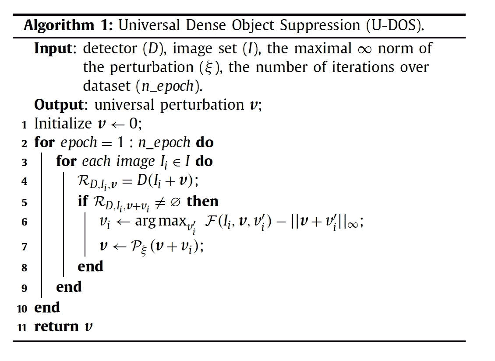*

*图一。U-DOS 算法[1]。*

*给定对象检测器 D、图像集 I、扰动的最大 inf_norm 约束和历元数，UDOS 计算并返回通用扰动 *v* 。*

*对于每个时期，它在图像集 I 中的每个图像上迭代，以首先检查将当前通用扰动添加到该特定图像是否导致遮蔽检测器。如果是，跳到下一张图片。否则，通过优化目标函数(2)来计算 v_i(与我们修改的原始算法 1 略有不同)。v_i 是攻击第 I 个图像并将其添加到我们的通用扰动 v 的扰动。在更新之后，它总是验证更新的扰动的 inf 范数被约束在 Xi 内，该超参数是我们设置的以确保人类的准感知性。*

*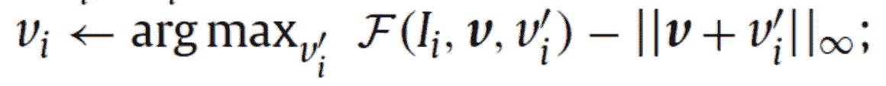*

*图二。U-DOS 算法的原始目标函数[1]。*

*我们对[1]提出的算法 1 中的目标函数(第 6 行)进行了如下修改:*

*1.目标函数中的第一项:取决于对象检测器及其实现，从检测器的输出中访问背景类概率可能是棘手的，因此我们移除了背景类项，并且仅关心对象类的输出的总和。修正后的 F(I_i，v，v_i)如下:*

*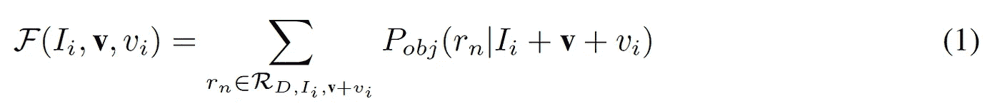*

*图 3。U-DOS 算法目标函数中第一项的修正。[1]*

*2.等式中的第二项:曾经是||的 L-inf 范数。||，所以在运行一些时期后，它停留在最大约束(Xi)，因此比较超过某个时期的扰动幅度是没有意义的。因此，我们使用**平均 L1 范数**——L1 范数除以像素数来比较扰动范数如何平均增加。*

*基于这些变化，我们希望最小化第 I 个扰动图像上的扰动范数和目标检测概率:I_i + v + v_i (I_i:原始图像，v:通用扰动，v_i:第 I 个图像的附加扰动)。需要最小化的函数如下:*

*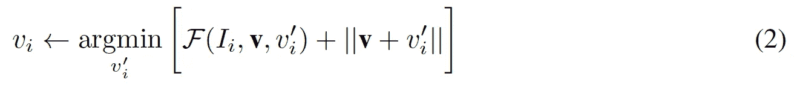*

*图 4。U-DOS 算法的改进目标函数。*

*为了优化(2)，我们使用**梯度下降**来为每个第 I 个图像找到 v_i。α是我们乘以目标函数相对于 v_i 的梯度的步长，v _ I 是我们为了更新普适扰动而添加的扰动。*

*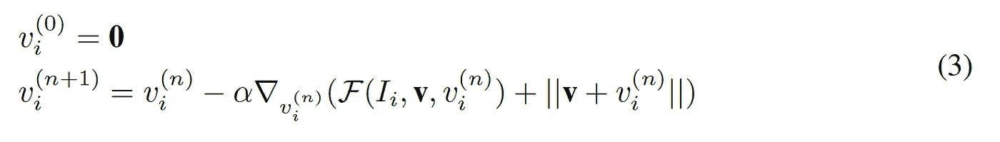*

*图 5。梯度下降以更新增加的扰动。[1]*

*这种攻击非常简单，因为我们使用其输出相对于输入扰动的梯度，这意味着我们可以攻击图像中任意数量的类。*

# *实验和结果*

## *超参数*

*对于这个实验，我们需要调整四个主要的超参数:*

*   *n_epochs:时期的数量*
*   *阿尔法:学习率*
*   *xi:扰动的最大范数约束*
*   *score_threshold:对象检测器将其视为最终预测*

*在一系列试点实验之后，我们确定了以下参数值:n_epoch=250，Xi=10，α= 20，score_threshold=0.7。*

## *韵律学*

*在我们的实验中，我们评估了通用扰动对数据集的影响，因为我们通过迭代使用两个指标找到了更强的扰动:**实例级**和**图像级**盲度。我们为每个类别运行实验，以在类别级别比较易受干扰的程度。*

***图像级盲度:**物体检测器 D 能够以高于阈值的置信度找到至少一个物体的图像与图像总数 N. (4)的比率*

> *这里要提到的重要一点是，在策展过程中，我们需要确保在添加通用扰动之前，数据集的图像级盲度始终为 1.0。这是因为我们应该只包括至少有一个物体的置信度高于阈值的图像。*

*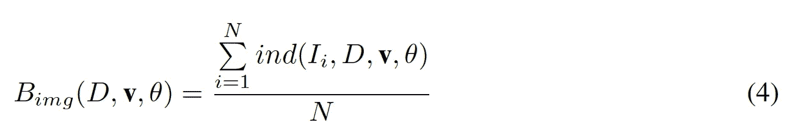*

*图 6。图像级盲度度量[1]。*

***实例级盲度:**检测器 D 在每幅图像中找到的置信度超过给定阈值的平均实例数。此度量显示在实例级别有把握地检测到多少目标类的对象。(5)*

*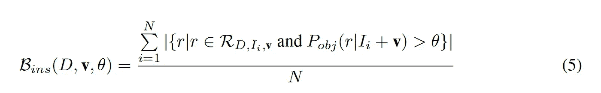*

*图 7。实例级盲度度量[1]。*

## *结果*

*下面的第一张图显示了随着标准的增加，扰动对每个类别的影响。为了绘制这个图，我们跟踪实例级和图像级的盲度，因为我们为五个类别中的每一个改变扰动范数。在进行了一系列的实验后，我们发现所有 5 个类别的图像和实例级盲度随着我们发现具有更强范数的普遍扰动而降低。很明显**人**在图像级和实例级失明程度中是最有弹性的类别，其次是**汽车、交通灯、卡车**和**停车标志**增加了干扰标准。进一步调查和分析为什么某些类别更能抵御这种攻击将是一个有趣的方向。*

*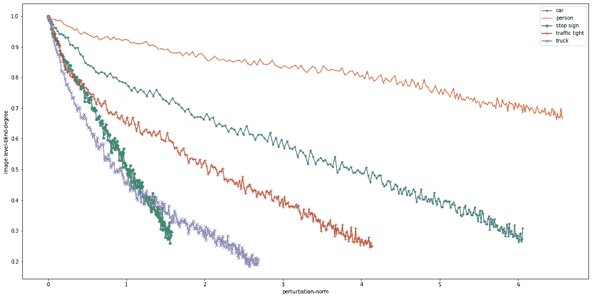*

*图 8。图像级盲度与 5 个类别上的扰动范数[3]。*

*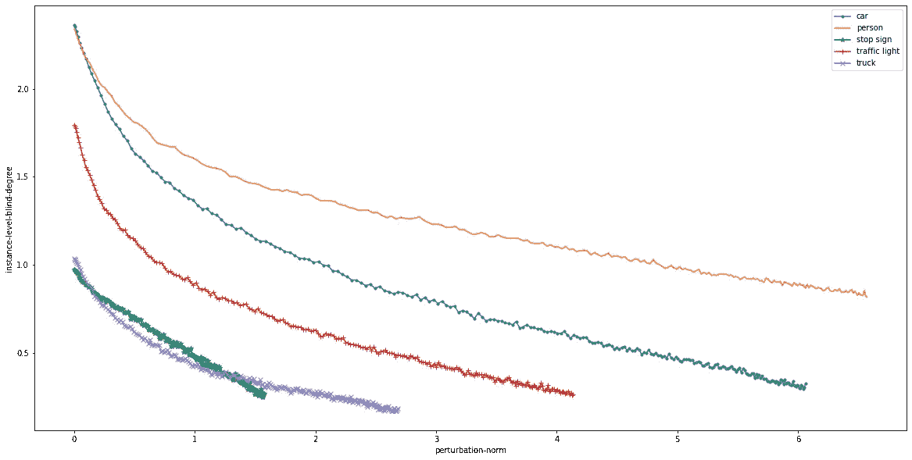*

*图 9。实例级盲度与 5 个类别上的扰动范数[3]。*

*基于我们上面的实验结果，我们已经在图像和实例级盲度中建立了一个**类别排名**，随着时期和规范的增加，对每个类别对普遍扰动的弹性进行排名。随着扰动范数和迭代次数(历元)的增加，我们通过比较图像和实例级盲度的下降率来设置排序。因为这两个指标密切相关，所以这两个指标的排名遵循相似的模式是有意义的。*

*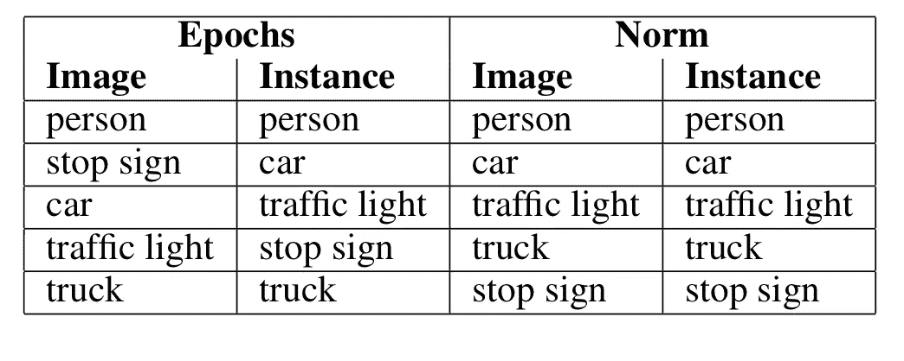*

*表 1。对普遍扰动的复原力的分类等级。从最高到最低[3]。*

*为了形象化，我挑选了一些样本图像，它们清楚地表明，添加在数据集上计算的发现的通用扰动成功地使 Faster-RCNN 在检测我们指定攻击的目标类时失败。前两幅图像显示，在将计算出的攻击停车标志的扰动添加到图像后，原始图像中的 *2 个停车标志检测*消失。接下来的两幅图像显示，在添加计算出的扰动以攻击交通灯后，原始图像中的 *4 个交通灯检测*被移除。除此之外，有趣的是，添加扰动也会影响对非目标类别的检测，例如汽车。*

*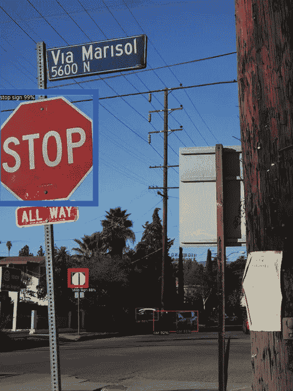*

*图 10。停止对原始图像[3]的标志检测。*

*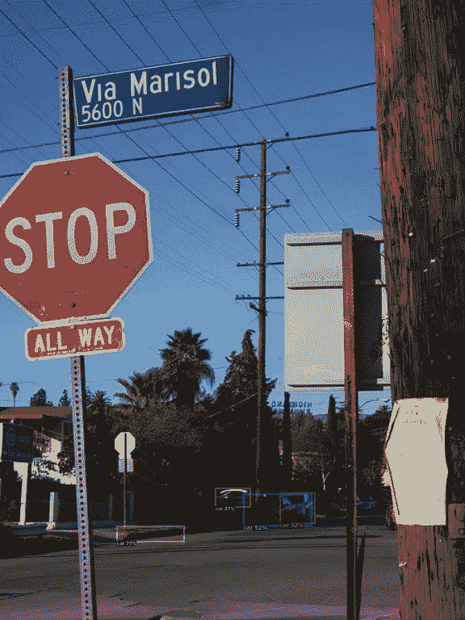*

*图 11。在受干扰的图像[3]上检测停车标志失败。*

*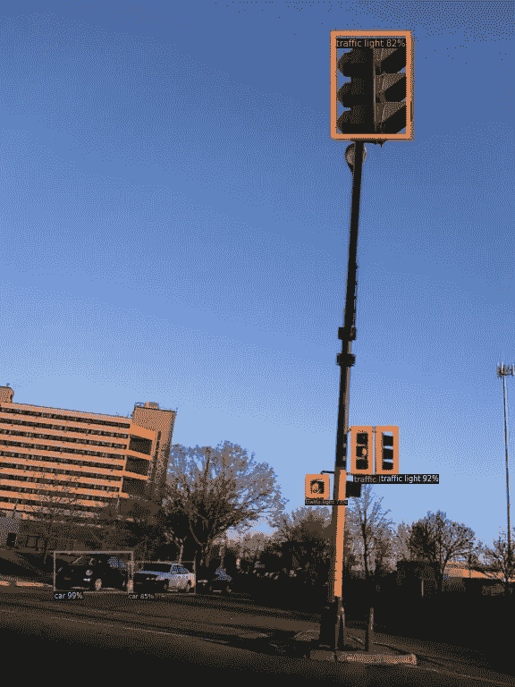*

*图 12。对原始图像进行交通灯检测[3]。*

*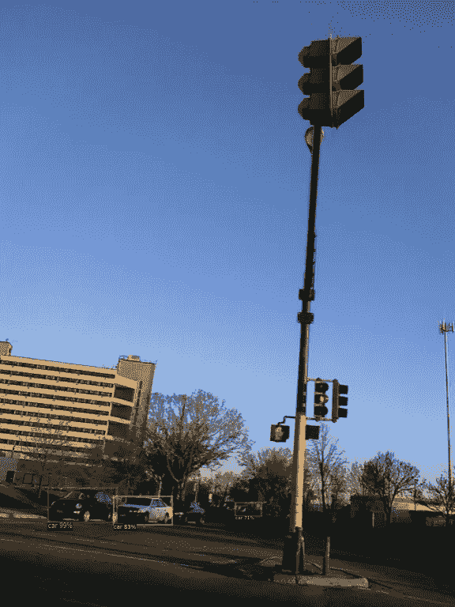*

*图 13。扰动图像上的交通灯检测失败[3]。*

# *结论*

*从使用不同的精选数据集评估原始工作的有效性开始，我了解到准可感知的普遍扰动会对与自动驾驶相关的数据集安全的核心造成真正的伤害。此外，发现哪一类特别容易受到普遍扰动的影响，将对我们应该如何设计自动驾驶系统产生重要影响，以优先考虑我们应该重点防御的类别，而不仅仅是建立一个防御系统来抵御整体的敌对攻击。*

*完成这个实验后，我意识到我可以直接在大规模的驾驶特定数据集上进行实验，例如，Waymo 或 Berkeley DeepDrive，以研究自动驾驶汽车领域的对抗性攻击的影响。*

*我们未来的工作将是对这些数据集进行不同的对抗性攻击实验，以研究更多攻击状态的影响，或开发针对自动驾驶汽车的新型攻击，并提出可以提高自动驾驶系统鲁棒性的防御措施。*

*如果有人想使用这个，请引用我们的论文并指出引用，我已经分享了我的[代码库](https://github.com/seungwonoh5/Universal_Autonomous_Detection)。如有任何问题，请随时联系 nayeem@umd.edu 或 aspiringtechsavvy@gmail.com。任何建设性的批评或反馈都会受到欢迎。感谢阅读。*

# *参考*

*[1]李，张俊杰，黄，王(2020).针对目标探测的通用对抗性扰动。*模式识别*， *110* ，107584。*

*[2] Moosavi-Dezfooli，S. M .，Fawzi，a .，Fawzi，o .，& Frossard，P. (2017 年)。普遍的对抗性干扰。IEEE 计算机视觉和模式识别会议论文集(第 1765-1773 页)。*

*[3] Mohammad Nayeem Teli 和 Seungwon Oh。“自主车辆物体类别检测对普遍扰动的弹性”，被认可出现在 IEEE 国际 IOT、电子学和机械电子学(IEMTRONICS '21)中。*