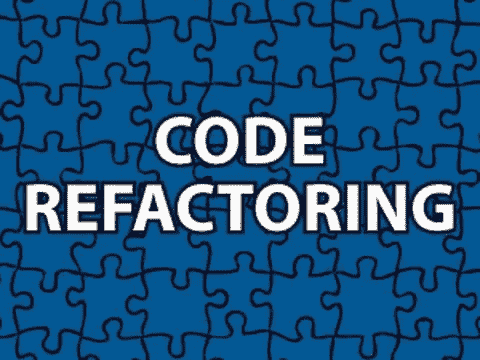

# 普适近似定理:软件 2.0 的代码重构？

> 原文：<https://towardsdatascience.com/universal-approximation-theorem-code-refactoring-for-software-2-0-20d4bdc3cf48?source=collection_archive---------40----------------------->

## 思想实验

约书亚·阿拉贡在 [Unsplash](https://unsplash.com?utm_source=medium&utm_medium=referral) 上拍摄的照片

# 什么是 UAT？

普适逼近定理到底是什么？通俗地说，UAT 的意思就是给一个隐层神经网络足够多的神经元。它可以逼近(或近似模拟)给定输入范围内的任何连续函数。这意味着一个隐层神经网络是一个终极的柔性函数逼近器。可能有点太灵活了。

# 吸取的教训

**由于普适逼近定理的灵活性，过去常常推动 AI 研究人员将注意力大多放在浅层神经网络上，从而在某种程度上阻碍了深度学习的发展进程。**这个有意思。想想看，一个“浅而宽”的神经网络倾向于“记住”所有特征来逼近目标函数。然而，更深层次的网络往往在特征提取方面更加抽象，并找出可以应用于数据集许多部分的模式。他们显然概括得更好。并且用更少的计算能力获得更好的结果。

# 更深入

如果你是一名软件开发人员，你觉得这听起来怎么样？***‘代码重构’！*** 开发人员重构他们的代码，将重复的代码片段放到函数中，尽可能地重用它们。干净的代码通常是更好的代码。深度神经网络在某种程度上做了同样的事情。通过拥有更多的层，它使网络能够更好地“重构”自己，并学习更多的通用模式，从而更有效地实现相同的目标。这导致了更好的(在性能和效率方面)模型。

# 软件 1.0 与软件 2.0

还有哪些软件开发技术我们可以应用到机器学习上？更准确地说，我们从‘软件 1.0’中学到的东西可以应用到‘软件 2.0’上吗？(如果你不熟悉“软件 2.0”的概念，我强烈推荐你观看下面来自 [Andrej Karpathy](https://medium.com/u/ac9d9a35533e) 的视频，它并不完全适用于所有情况，但绝对值得注意，并得到了特斯拉成功的支持！)

根据 Karpathy 的说法，我们目前在软件工程中所做的事情，即有才华的人编写代码来完成任务和解决问题，是“软件 1.0”，人类通过直接告诉计算机如何做每一步来为这个过程做出贡献。在“软件 2.0”的新范式中，机器学习和深度学习被广泛采用，人类通过以数据集的形式提供大量人们做某事的例子来做出贡献，计算机和模型将自动计算出如何做到这一点。事实上，特斯拉的自动驾驶系统有相当一部分是由深度学习模型驱动的。

一些人仍然怀疑“软件 2.0”方法是否会有光明的未来。我们从 1.0 到 2.0 的道路仍有待讨论。对于机器学习研究者和实践者来说，重新应用传统软件工程的智慧可能仍然是一个很好的探索方向。欢乐时光！

如果你想了解更多关于万有逼近定理的知识，可以参考我下面的文章:

[从乐高乐园到神经网络:通俗易懂的通用逼近定理|作者李立伟| 2020 年 12 月|走向数据科学](/from-legoland-to-neural-networks-universal-approximation-theorem-in-laymans-terms-6d1e41f5a8bb?source=your_stories_page-------------------------------------)