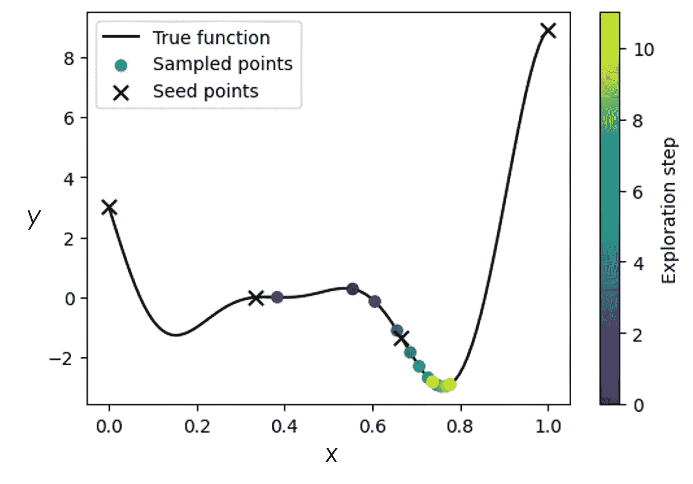
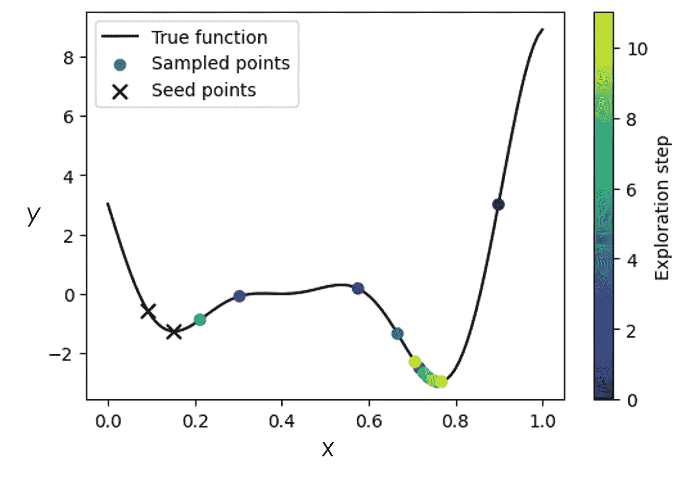
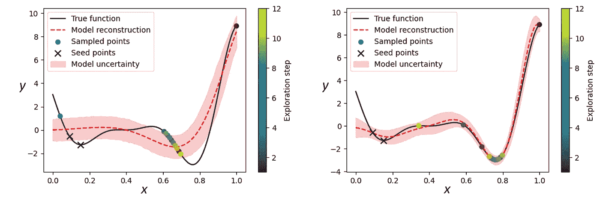

# 未知知识、贝叶斯推理和结构化高斯过程

> 原文：<https://towardsdatascience.com/unknown-knowns-bayesian-inference-and-structured-gaussian-processes-why-domain-scientists-know-4659b7e924a4?source=collection_archive---------7----------------------->

## [思想和理论](https://towardsdatascience.com/tagged/thoughts-and-theory)

## 为什么领域科学家知道的 ML 比他们想象的要多

*马克西姆·兹亚迪诺夫&谢尔盖·加里宁*

*美国田纳西州橡树岭橡树岭国家实验室纳米材料科学和计算科学与工程中心*

大约 20 年前，前国防部长唐纳德·拉姆斯菲尔德[在提到情报情况时说了一句著名的话](https://en.wikipedia.org/wiki/There_are_known_knowns)，“*…有已知的已知；有些事情我们知道我们知道。我们也知道有已知的未知；也就是说，我们知道有些事情我们不知道。但也有未知的未知——那些我们不知道我们不知道的*。”。尽管来自不同的背景，这句话深刻地描述了科学家的工作。我们建立自己的世界观，并基于我们所知道的、可以在教科书中读到的、或在整个职业生涯中从经验、与同事的讨论或在实验室中度过的无数个小时中学到的东西来建立基本的探索。这些是已知的知识。我们也经常知道我们不知道的事情——通常，这些已知的未知是我们研究的直接目标。也就是说，对于每个科学实验来说，未知的未知是至关重要的——我们关注范围之外的因素会极大地影响我们的测量、分析和结论。

显然，拉姆斯菲尔德非常简洁的陈述并不是第一次注意到把世界分成已知和未知的类型。据作者所知，这方面的第一份书面陈述可以追溯到纳赛尔·奥德·丁·图西(1201-1274)，他说

*Har kas ke bedanad va bedanad ke bedanad*

*阿斯布-埃凯拉德阿兹贡巴德-埃加敦贝贾汉纳德*

*Har kas ke nadana d va bedanad ke nadana d*

*甘兰·卡拉克-凯什贝·曼泽尔·贝雷萨纳德*

*达尔贾赫勒-莫拉卡巴德奥德-达尔贝马纳德*

或者，从波斯语翻译过来:

*任何知道的人，以及知道他知道的人*

*让智慧的骏马飞跃苍穹*

*任何不知道，但知道自己不知道的人*

尽管如此，他还是能把他那只跛脚的小毛驴带到目的地

*任何不知道的人，以及不知道自己不知道的人*

*永远陷在双重无知中*

很有可能历史参考可以更早，但我们无法找到它们。也就是说，尽管从阿拔斯和倭马亚时代开始，科学探究工具取得了重大进步，但已知和未知因素在科学发现中的作用依然存在。

例如，在他的科学生涯中，第二作者与电化学应变显微镜(ESM)进行了广泛的合作，该技术允许通过测量由离子运动引起的材料的微小(小于氢原子的半径)膨胀和收缩来探测纳米水平的电化学反应[1，2]。ESM 中测得的信号是局部磁滞回线，代表材料对偏压的电化学响应。对于诸如二氧化铈 CeO₂的经典材料，这些磁滞回线在样品表面的不同位置之间是非常可重复的。这表明它们描述了扫描探针显微镜针尖-表面接合处的反应，并且不受材料成分(我们并没有期望太多)或表面粗糙度(这在 SPM 中总是一个问题)的可能变化的影响。然而，当在受控气体环境和真空中进行测量时，磁滞回线的形状完全改变。这反过来表明，大气环境是测量响应的一个重要因素。如果我们没有在几个大气中进行测量(这需要对显微镜进行非标准的修改)，并试图在不考虑大气水的作用的情况下描述机制，这将是未知的未知的典型例子。可以说，它变成了一个已知的未知——这刺激了另一个十年的理论和实验研究，并导致铁电性和表面电化学之间不寻常的耦合的发现[3],以及其他发展。

也就是说，这三个已知/未知的范畴就是全部了吗？我们提出，当积极地将机器学习方法融入领域科学时，我们经常会发现*未知的知识*——这意味着先验知识的全部范围，从概括(物理定律)和特定领域的数据，一直到难以量化的直觉。因此，现在的问题是，我们如何将先前的知识，未知的知识，整合到科学发现过程中，并以一种有原则的和可量化的方式这样做。

贝叶斯公式奠定了这方面的一般框架。有许多优秀的书籍描述了贝叶斯方法，也有一些中型文章。对于第二作者来说，进入贝叶斯的首选切入点是 Martin [4]和 Lambert [5]的书，Kruschke [6]给出了贝叶斯和频率主义方法之间的系统比较。第一作者认为，关于贝叶斯分析的最好的(对于领域科学家来说)书是 Richard McElreath 的[“统计再思考”](https://xcelab.net/rm/statistical-rethinking/)。

下面，我们从领域科学家的角度给出经典贝叶斯公式。在这里，科学实验的目的是从新获得的实验数据中获得新的知识，也就是理论的概率。

**图一。**领域科学家视角下的贝叶斯公式。作者图。

这里，给定理论的数据的概率，或贝叶斯语言中的可能性，使用正演模拟直接访问。使用计算方法直接评估数据或证据的概率，无论是马尔可夫链蒙特卡罗还是变分推断。但是第三部分——理论的概率，或者先验——通常会引发最多的问题。事实上，经常针对贝叶斯模型的批评是它们需要先验知识，而这些先验知识很难被一致地建立。事实上，他们是——如果一个人完全停留在统计学领域。对于领域专家来说，先验知识是绝对必要的，它实际上定义了领域专长。然而，它是未知的已知，并且通常这种知识不容易量化或以可追踪算法形式的先验分布的形式建立。也许更重要的是，现在还不清楚如何将先前的知识整合到实验发现的主动学习流程中。让我们逐一考虑。

一旦实验数据可用，贝叶斯推理方法允许进行直接分析。例如，最近，我们利用高分辨率电子显微镜探索了铁电畴壁的结构[7]。这里，畴壁结构由自由能的特定函数形式决定，自由能产生描述畴壁轮廓的解析解。简单的函数拟合，如前所述[8，9]，给出了参数的数值估计，但不允许超出这些。相比之下，贝叶斯方法允许以相对常数的先验分布的形式结合材料物理学的先验知识，这反过来可以从大量的公开数据、宏观测量等中获得。例如， [Materials Project](https://materialsproject.org/) 等大型材料信息学项目的价值之一就是将来自多个独立来源的数据整合成易于访问的形式。

同样，贝叶斯框架允许回答一些重要的问题，如材料物理学的先验知识是否影响我们从实验中学到的东西(相当令人惊讶的是，我们知道的越多，我们学到的越多)，材料行为的特定模型是否可以基于观察到的数据进行区分(在这种情况下不是)，以及区分不同模型需要什么样的显微镜分辨率或信息限制。类似地，贝叶斯方法允许以概率方式定义许多“绝对”量——例如，对称性或结构单元等描述符[10]。

然而，下一个问题变成了我们是否可以使用贝叶斯方法进行主动学习和属性优化？原则上，可以使用上面详述的经典贝叶斯方法。这里，我们将先验假设定义为一个结构化的概率模型。给定实验数据，我们改进我们模型的参数，然后在参数空间上探索后验预测概率。与我们之前的[帖子](/gaussian-process-first-step-towards-active-learning-in-physics-239a8b260579)中描述的经典贝叶斯优化/主动学习(BO/AL)非常相似，期望值和/或相关的不确定性可用于指导测量(即选择下一个测量点)。

然而，在实践中，基于预期系统行为的结构化概率模型的 BO/AL 在模型仅部分正确时不能很好地工作。与此同时，这正是我们通常在实验中必须处理的问题，在实验中，即使最复杂的理论也只能在一定程度上描述现实，而且可能存在几种竞争模型，更不用说所有与测量相关的非理想性了。当然，另一种选择是用高度灵活的高斯过程(GP)来代替刚性的结构化概率模型。然而，后者通常不允许结合先前的领域知识，并且可能偏向于平凡的插值解决方案。

因此，我们引入了结构化高斯过程(sGP)，其中经典的高斯过程被预期系统行为的结构化概率模型所增强[11]。这种方法允许我们平衡非参数 GP 方法的灵活性和编码到参数模型中的先验(物理)知识的刚性结构。后者的贝叶斯处理通过选择模型参数的先验，即结合过去的知识，对 BO/AL 提供了额外的控制。

更正式地说，给定输入参数 *x* 和目标属性 *y* ，经典 GP 被定义为 *y* ~ *多变量* ( *m* ( *x* )， *K* ( *x* ， *x* `))，其中 *m* 是通常设置为 0 和*的均值函数后者可以使用哈密尔顿蒙特卡罗(HMC)抽样技术来推断。然后，对新的/未测量的输入集的预测由下式给出*

其中 *θⁱ* 是具有核超参数的单 HMC 后验样本。注意，通常假设的观察噪声被吸收到核函数的计算中。(我们用*下标表示新的输入和相关的预测——不幸的是，在撰写本文时，介质还没有对这个下标和其他下标的内嵌支持)。

在我们的 *s* GP 方法中，我们用一个结构化的概率模型代替上述等式中的常数均值函数 *m* ，该模型的参数通过 HMC 与核参数一起推断。然后，等式(1b)变成:

其中 *ϕⁱ* 是具有学习模型参数的单个 HMC 后验样本。该概率模型反映了我们关于系统的先验知识，但它不必是精确的，也就是说，该模型可以具有不同的函数形式，只要它捕捉数据中的一般或部分趋势。

**使用结构化 GP 的贝叶斯优化**

我们将通过具体的例子来说明 *s* GP 方法的优势。首先，我们将使用一个稍加修改的[福雷斯特函数](https://doi.org/10.1016/j.paerosci.2008.11.001)、*f*(*x*)=(5*x-*2)sin(12*x*-4)，它通常用于评估优化算法。除了全局最小值之外，它还有两个局部最小值。我们的目标是仅使用少量的步骤(测量)来收敛到全局最小值。首先，我们将 BO 与 vanilla GP 一起使用。我们从种子点的“良好”初始化开始(在运行 BO 之前执行的“预热”测量)，并使用[置信上限](/gaussian-process-first-step-towards-active-learning-in-physics-239a8b260579) (UCB)采集函数和 *k* = -0.5，在每一步选择下一个测量点。不出所料，GP-BO 很快收敛到真正的最小值。

**图二。**使用普通 GP-BO 的黑盒函数优化:“良好”初始化的情况。作者图。

现在，让我们从一个“坏的”初始化开始，其中初始化的点落入一个局部最小值周围的区域。由于这种糟糕的初始化，GP-BO 陷入局部最小值，无法收敛到真正的最小值。我们注意到，在真实的实验中，人们通常没有使用不同的初始化来重新开始测量的奢侈，因此必须准备好处理不好的初始化。

**图三。**使用普通 GP-BO 的黑盒函数优化:“坏”初始化的情况。

看待上面的例子的一种方式是，我们陷入局部最小值，因为我们的算法不“知道”不同最小值的潜在存在。但是如果我们确实知道可能有更多的极小值(其中一个可能是真实的/全局的极小值)，那么这个先验知识可以合并到 *s* GP 模型中。

具体来说，让我们将结构化概率模型定义为

其中 *y* ₀ ~ *均匀* (-10，10)*a*ₙ~*对数正态* (0，1)*w*ₙ~*半正态*(0.1)*x*ₙ⁰~*均匀* (0，1)为模型参数的先验。这个模型简单地告诉我们，在我们的数据中有两个极小值，但并不假设对它们的相对深度和宽度有任何了解，也不包含它们相距多远的信息。然后，我们用等式(3)中定义的概率模型替换 GP 中的常数先验均值函数 *m* ，并以与之前相同的方式运行“坏”初始化的 BO。

**图 4。在初始化“不良”的情况下，使用 *s* GP-BO 进行**优化。由于关于系统的部分先验知识(其具有不止一个最小值)，优化算法能够将其自身从局部最小值中拉出，并收敛于真实/全局最小值。作者图。

我们可以看到，配备了预期系统行为的一些知识的优化算法能够将自己从局部最小值拉出来并收敛到全局最小值。我们已经在 GP-BO 和 *s* GP-BO 之间进行了系统的比较，针对种子点的几十种不同的随机初始化，并且在存在噪声的情况下，发现 *s* GP-BO 在几乎所有情况下都有更好的性能【11】。

为了理解 sGP-BO 的优越性能，我们可以比较 GP-BO 和 *s* GP-BO 在不同优化步骤的采集函数。

**图 5。**第 1、3、5、7 和第 9 步中普通 GP-BO(顶行)和 *s* GP-BO(底行)的采集功能。作者图。

显然，普通 GP-BO 很快锁定在局部最小值，其获取函数基本保持不变(图 5 中的顶行),因为算法“假设”它已经找到了真实/全局最小值。另一方面， *s* GP-BO(图 5 中的底行)中的采集函数在早期显示了一个具有多个最小值的结构，这有助于算法在过程的后期爬出局部最小值并收敛到真正的最小值，即使初始化非常糟糕。图 5 的底行中的采集函数的演变在某种意义上确实是显著的，因为该算法正在寻找第二个最小值，好像是由直觉驱动的。从某种意义上来说，我们在等式(3)中以 GP 均值函数的形式纳入的先验知识假设在某处存在第二个最小值，而采集函数突出显示了第二个最小值最有可能出现的位置。

但是如果这个“先验知识”只是部分正确呢？如前所述，与独立的概率模型相比， *s* GP-BO 的优势在于 GP 内核的灵活性允许我们使用不精确的，有时甚至是“不正确的”函数形式的模型。我们使用形式为*m*=*a*e*ᵃˣ*sin(*bx*)的结构化概率模型来说明这一点，BO 作为独立模型和作为 *s* GP 的一部分。我们注意到，虽然这显然不是描述 Forrester 函数的正确模型，但它确实捕捉到了数据中的一些趋势，例如存在一个全局最小值和多个局部最小值。

**图 6。**使用独立概率模型的 BO 结果(左)和使用完全相同的模型增强的 sGP-BO 结果(右)。作者图。

具有独立概率模型的业务对象(图 6，左侧)无法收敛到全局最小值。如果现实不适合所选择的模型框架，那么推论本身就太死板并且会失败。它也不能产生目标函数的令人满意的重建，即使在测量点周围，并且它的不确定性估计似乎不是特别有意义。另一方面， *s* GP-BO 使用相同的概率模型作为 GP 的一部分，轻松识别出真正的最小值(图 6，右)。它还对测量区域周围的基础函数进行了良好的重建，并提供了这些区域之外的有意义的不确定性估计，这可用于选择下一个测量点以完全恢复目标函数(如有必要)。

**主动学习不连续函数的结构化 GP**

作为我们的第二个例子，我们展示了如何使用 *s* GP 从稀疏和有噪声的观测中重建不连续的函数。我们注意到，不连续性的存在在相变物理学中是常见的，在相变物理学中，人们通常希望重建靠近相变点的感兴趣的性质的行为，以及在相变之前和之后的两个阶段中的行为。同时，标准 GP 不具备处理这种不连续性的能力。

**图 7。** (a)不连续函数的噪声观测，(b)基础分段函数的基于普通 GP 的重构，(c) *s* 基于 GP 的重构，具有系统行为的“正确”模型，(d)基于 sGP 的重构，具有部分正确的模型。重构中的不确定性由采样预测中的离散度定义。作者图。

图 7a 示出了由形式的分段函数产生的观察值

我们的目标是从这些有噪声的数据点重建基础函数。首先，我们尝试普通 GP(图 7b)。它表现不佳，这并不奇怪，因为标准 GP 不具备处理不连续性的能力。直观上，它可以通过不连续性给核函数带来的矛盾需求来理解——具有大长度尺度的核不能描述不连续性，而小长度尺度需要多次测量来发现各处的函数行为。请注意，简单 GP 在测量区间之外的外推也很差(尽管在这种情况下，可以使用多种策略来解决这个问题)。

接下来，我们尝试用两种不同的概率模型增强的 *s* GP。第一个 *s* GP 由分段概率函数扩充，该函数具有一般幂律形式:对于*x*axᵇxₜ和 *cxᵈ* 对于 *x* ≥ *xₜ* ，具有关于 *xₜ* 的均匀先验和关于其他参数的对数正态先验。它显示了一个良好的整体重建(图 7c)，除了过渡区，我们没有足够的观察。然而，该区域也具有非常大的不确定性(采样预测的变化)，表明人们可能想要在该区域进行额外的测量。在这种情况下，检查采样预测的行为也是值得注意的-本质上，它们在切换点位置的估计上是不同的。同样，这符合科学家的决策逻辑——如果我们预期相变，并且对相变前后测量响应的功能行为有信心，那么剩下的唯一不确定性就是相变点！

第二个 *s* GP 由一个分段概率函数扩充，对于 *x* < *xₜ* 等于 *ax* 并且对于 *x* ≥ *xₜ* 等于 *bx* ，在 *xₜ* 上具有均匀先验并且在 *a* 和 *b* 上具有对数正态先验。请注意，这个模型只是部分正确:它有一个转变点，但在转变前后呈现线性(而不是幂律)行为。因此，重建质量(图 7d)较低，尽管它仍然比普通 GP 好一些。请注意，在这种情况下，最大的不确定性与转换前的行为相关(我们不期望幂律行为)。

模型预测中的不确定性可用于指导测量，以获得基础函数的更精确的重建。该过程与贝叶斯优化中的过程相同，除了我们使用模型的不确定性而不是采集函数来预测下一个测量点。

**图 8。**主动学习的结果，其中(a)普通 GP，(b) *s* GP 由预期系统行为的“正确”模型增强，(c) *s* GP 由预期系统行为的部分正确模型增强。作者图。

我们可以看到，两个*的* GP 模型在探索参数“空间”的其他部分之前，很快集中在过渡区域(图 8b，c)。因此，我们能够显著提高重建质量。另一方面，使用 vanilla GP 的不确定性导向勘探仍然无法重建过渡区(图 8a)。因此，我们再次看到，即使*的* GP 对预期系统的行为有部分正确的模型，也能胜过标准的 GP 方法。

总之，用预期系统行为的(完全贝叶斯)概率模型增强高斯过程，允许更有效的优化和系统属性的主动学习。请注意，即使对于不正确或部分正确的模型，主动学习算法最终也会得出正确的答案——但代价是大量的实验步骤。查看我们的预印本了解更多细节，包括这个概念在物理模型中的应用[11]。也请查看我们的 [gpax](https://github.com/ziatdinovmax/gpax) 软件包，将此工具和其他 GP 工具应用于科学数据分析。如果你想了解更多关于扫描探针显微镜的知识，欢迎来到 M*N 频道:显微镜，机器学习，材料。

最后，在科学界，我们感谢我们的研究赞助商。这项工作在橡树岭国家实验室纳米材料科学中心(CNMS)进行并得到支持，该中心是美国能源部科学用户设施办公室。您可以使用[此链接](https://my.matterport.com/show/?m=MT819FqAwbT)进行虚拟漫游，如果您想了解更多信息，请告诉我们。

可执行的 Google Colab 笔记本在[这里](https://colab.research.google.com/github/ziatdinovmax/notebooks_for_medium/blob/main/sGP_for_medium.ipynb)有。

**参考文献:**

1.巴尔克，新泽西州；杰西；莫罗佐夫斯卡；叶利舍耶夫，e；钟德伟；金，y；阿达姆奇克湖；加西亚河；新泽西州杜德尼；锂离子电池阴极中离子扩散的纳米级绘图。 *Nat。纳米技术。* **2010，** *5* (10)，749–754。

2.库马尔，a。丘奇，女；莫罗佐夫斯卡；加里宁公司；Jesse，s,《在纳米尺度上测量氧还原/析出反应》。 *Nat。化学。* **2011，** *3* (9)，707–713。

3.杨，S. M 莫罗佐夫斯卡；库马尔河；叶利舍耶夫，英国；曹；马泽特湖；巴尔克，新泽西州；杰西；瓦苏德万；杜布尔迪厄，c；纳米级铁电体中的混合电化学-铁电态。*自然物理* **2017，** *13* (8)，812–818。

4.Martin，o .，*使用 Python 的贝叶斯分析:使用 PyMC3 和 ArviZ 的统计建模和概率编程介绍，第二版*。Packt 出版:2018。

5.Lambert，*贝叶斯统计学生指南*。塞奇出版有限公司；1 版:2018。

6.Kruschke，j .，*做贝叶斯数据分析:与 R，JAGS 和斯坦的教程*。学术出版社；2 版:2014 年。

7.C. T .纳尔逊；瓦苏德万；张；齐亚特迪诺夫，m；叶利舍耶夫，英国；竹内岛；莫罗佐夫斯卡；通过原子解析 STEM 数据的贝叶斯分析探索铁电畴壁的物理学。 *Nat。Commun。* **2020、** *11* (1)、12。

8.鲍里塞维奇；莫罗佐夫斯卡；金耀明；伦纳德博士；奥克斯利议员；医学博士 Biegalski 叶利舍耶夫，英国；通过拓扑缺陷的原子尺度观测探索空位有序系统的介观物理。*物理学家列特。* **2012 年，** *109* (6)。

9.李，q；C. T .纳尔逊；许淑玲；达摩达兰；李；亚达夫，又名；麦卡特尔，m；马丁；拉梅什河；Kalinin，S. V,《使用机器学习和相场建模对 PbTiO3/SrTiO3 超晶格极涡中的挠曲电进行量化》。 *NatCommun。* **2017，** *8* 。

10.加里宁公司；奥克斯利议员；瓦莱蒂，m；张；赫尔曼，注册会计师；郑；张；Eres，g；瓦苏德万；深度贝叶斯局部结晶学。 *npj 计算资料* **2021、** *7* (1)、181。

11.文学硕士齐亚特迪诺夫；戈什，a。物理学有所不同:贝叶斯优化和通过增广高斯过程的主动学习。*arXiv:2108.10280*2021。