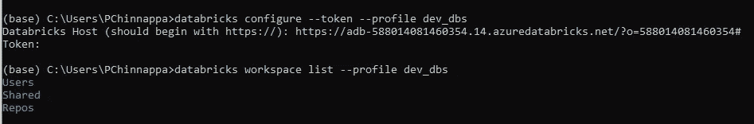
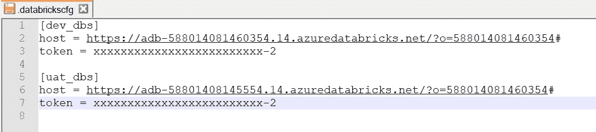
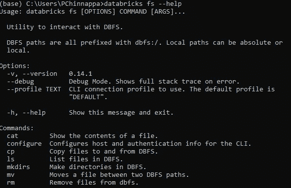
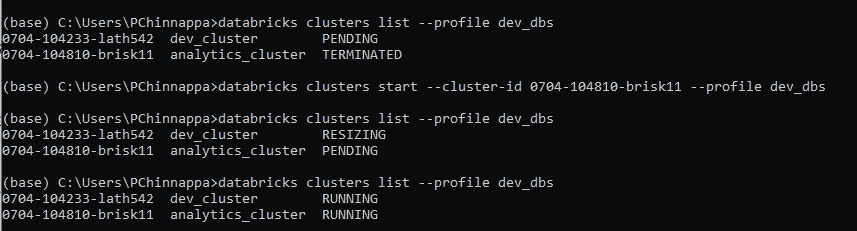

# 释放 Databricks CLI 的威力

> 原文：<https://towardsdatascience.com/unleash-the-power-of-databricks-cli-59480868eb0e?source=collection_archive---------26----------------------->

## 从您的控制台舒适地管理您的 Databricks 工作区！

照片由[在](https://unsplash.com/@laundemrl?utm_source=unsplash&utm_medium=referral&utm_content=creditCopyText) [Unsplash](https://unsplash.com/?utm_source=unsplash&utm_medium=referral&utm_content=creditCopyText) 上的Launde Morel 拍摄

*如果我告诉您，您可以从一个命令行控制台控制所有数据块资产，会怎么样？*

Databricks 已经是数据工程师武库中一个非常强大的工具。它在分析方面的成就令人印象深刻，有些人甚至可以说是革命性的。

一个**数据块工作空间**本质上是一个管理所有数据块资产的环境。工作区允许您组织笔记本、表格、群集，并帮助管理作业。

虽然界面非常光滑和用户友好，但像导出/导入笔记本、启动集群、尝试将每个笔记本链接到您的 git repo 这样的事情感觉更像是痛苦的体力劳动。

这变得令人毛骨悚然，尤其是如果你必须在你的平台上管理多个工作区，并且很难跟踪你的浏览器中打开的所有小标签。

**要是有办法从一个地方管理您所有的工作空间就好了。值得庆幸的是有，并且像所有的好东西一样，这个是以 python 包的形式出现的。**

# 如何配置 Databricks CLI

Databricks-CLI 是一个开源库，可以使用 pip 命令安装。

使用适合您的 python 版本的 pip 版本运行`pip install databricks-cli`。

一旦你安装了库，你可以使用`databricks -- version`列出版本

要开始编写 CLI 命令，您必须首先设置要管理的 Databricks 工作区的身份验证。这必须只做一次。

我将以 **Azure Databricks** 为例展示以下步骤，但这些步骤在任何托管 Databricks 服务上都非常相似。

可以使用 **Databricks 个人访问令牌**设置身份验证。这个令牌可以直接从工作区生成。

1.  点击工作区中的用户资料图标，并选择**用户设置**
2.  您将看到一个选项**生成新令牌**
3.  设置生存期并生成令牌。记得复制令牌。
4.  从浏览器中获取工作区的 URL，格式为`https://<instance-name>.cloud.databricks.com`

现在，您可以通过在 cmd 行上运行`databricks configure --token`在本地机器上配置认证。系统会提示您输入`Databricks Host`粘贴工作区的 URL。接下来，系统会提示您输入`Token`，粘贴您生成的令牌。

要快速检查认证是否有效，运行命令`databricks workspace list`，如果一切正常，您必须能够在控制台上列出您的数据块工作区中的所有目录。

但是，如果您希望管理属于不同环境的多个工作区，或者您为多个客户端工作，并且每个客户端都有自己的专用工作区，那么这将使您只能管理单个工作区。

您可以通过设置**连接配置文件**在控制台上进行配置。要添加连接配置文件，请设置唯一的名称来标识特定的工作区。例如开发或 UAT 工作区。

1.  运行`databricks configure --token --profile <<profile_name>>`这就像为你的每个工作区创建一个别名，这样 CLI 就能记住哪个是哪个。
2.  像之前一样输入主机名和令牌。
3.  要使用此连接配置文件，您只需用`--profile <<profile_name>>`来补充您想要运行的每个 CLI 命令
4.  要确认只需运行`databricks workspace list --profile <<profile_name>>`
5.  要切换到另一个工作空间，只需更改配置文件

这是它在游戏机上的样子。

如何配置 Databricks CLI(图片由作者提供)

只需对所有工作区重复相同的配置步骤，并记住给每个工作区取一个唯一的名称，以便于识别。

**提示:**CLI 将此配置作为`.databrickscfg`存储在您机器中的一个文件中。如果您想通过控制台为每个工作区配置身份验证，只需手动编辑这个文件。文件看起来像这样。

的内容。databrickscfg 文件(图片由作者提供)

# 如何使用 CLI 管理笔记本电脑

CLI 命令组合在一起，代表您可以管理的不同资产。您可以使用`databricks <<group>> --help`列出特定组的子命令。组可以是`fs`、`clusters`、`workspaces` 等等。要列出文件系统的子命令，只需运行`databricks fs --help`

数据块文件系统子命令(图片由作者提供)

您最想做的一件事是列出您工作区中的所有笔记本，并可能将它们导出到您的本地机器中，然后您可以轻松地将其与 git 存储库集成。

1.  **使用`databricks workspace list --profile <<profile_name>>`列出你工作区中的所有文件夹**
2.  **使用`databricks workspace export_dir /<<directory_in_databricks>> <<Target_path>> --profile <<profile_name>>`递归导出工作区目录中的所有笔记本**这会将所选目录中的所有笔记本导出到您机器上的目标路径中。

同样，您可以导出单个笔记本，也可以轻松地将笔记本或目录导入工作区。这里有一个与工作空间相关的命令[的详尽列表，您可以尝试一下。](https://docs.databricks.com/dev-tools/cli/workspace-cli.html)

# 如何使用 CLI 管理集群

数据工程师通常会花大量时间管理集群，通常一天中，我必须在许多不同的工作区启动集群，它们需要时间预热。过了一会儿，事情变得如此混乱，以至于你不记得你最初打算做什么。

Databricks CLI 允许您从控制台管理所有集群，而不必访问每个工作区。这无疑为你节省了大量宝贵的时间，并清理了你的浏览器标签。

1.  您可以做的最简单的事情就是**使用`databricks clusters list --profile <<profile_name>>`列出工作区**中的所有集群。它列出了工作区中的所有集群及其唯一的集群 id 和当前状态。
2.  一旦您有了集群 id 并知道了您的集群的状态，您就可以使用`databricks clusters start --cluster-id <<id>> --profile <<profile_name>>`轻松地**启动这些集群中的任何一个**几分钟后，您的集群将全部预热完毕。

在 CLI 中管理集群(图片由作者提供)

使用集群组命令，您可以做许多更有趣的事情，这里是与[集群相关的](https://docs.databricks.com/dev-tools/cli/clusters-cli.html) CLI 命令的详尽列表。

# 外卖食品

Databricks CLI 是一种将一些乐趣引入管理 Databricks 的好方法，也是一种帮助我节省宝贵时间的工具，我可以将这些时间花在喝咖啡休息上。

我的收获:

1.  您可以在舒适的控制台上控制所有数据块资产。
2.  您可以随时关注您的集群。
3.  您可以使用简单的命令创建、删除、启动集群并调整其大小，而无需导航到工作区。

这篇博客中列出的命令只是日常任务中微不足道的几个。您可以深入研究 Databricks 文档，尝试一些新的东西，或者用它构建一个完整的应用程序。

如果您是一名数据工程师，请将 Databricks CLI 添加到您已经令人印象深刻且详尽的工具列表中，我保证您不会后悔。

请随意问我关于这篇文章的任何问题，我很想知道你对 Databricks CLI 的看法。