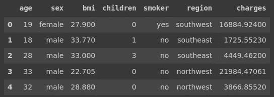
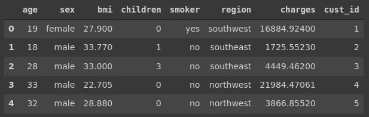
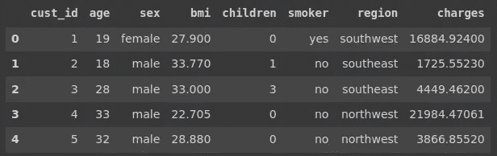
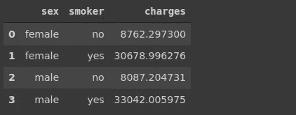

# 熊猫无限的灵活性

> 原文：<https://towardsdatascience.com/unlimited-flexibility-of-pandas-7cf6ab8ba3fc?source=collection_archive---------51----------------------->

## 几乎总是有不止一个解决方案


埃里克·普劳泽特在 [Unsplash](https://unsplash.com/s/photos/multiple?utm_source=unsplash&utm_medium=referral&utm_content=creditCopyText) 上拍摄的照片

Pandas 是一个非常流行的 Python 数据分析和操作库。它是数据科学教育中引入的首批工具之一。Pandas 为更有效的数据分析提供了丰富的功能和方法。

我最喜欢熊猫的一点是，完成一个给定的任务几乎总是有多种方式。一种方法可能在时间和复杂性方面胜过其他方法。然而，拥有多种选择会让你跳出框框思考。这也有助于改善你解决复杂任务的方法。

练习用不同的方法来解决问题的另一个好处是，它会大大提高你对熊猫的了解。

在本文中，我们将查看一些示例，展示完成相同任务的不同方法。Kaggle 上可用的医疗费用[数据集](https://www.kaggle.com/mirichoi0218/insurance)用于示例。

让我们从导入库和将数据集读入数据帧开始。

```
import numpy as np
import pandas as pddf = pd.read_csv("/content/insurance.csv")
df.head()
```



(图片由作者提供)

该数据集包含一些个人信息和保险费用。

第一组示例是基于列中的值过滤行。例如，我们可能想要过滤年龄大于 40 的行。

完成这项任务的更常见的方法如下。

```
df[df.age > 45]
```

另一种方法是使用 query 方法，并将过滤条件指定为字符串。

```
df.query('age > 45')
```

我将展示的第三种方式通常不被使用，但对展示熊猫的灵活性很重要。

```
df.where(df.age > 45).dropna(axis=0, how='all')
```

我们首先应用 where 函数，该函数只接受符合指定条件的行，并将其他行标记为 NaN。然后，我们删除充满 NaN 值的行。

第二个任务是创建一个新列。假设我们需要添加一个包含客户 id 号的新列。

下面是第一种方法。

```
cust_id = np.arange(1,1339)df['cust_id'] = cust_iddf.head()
```



(图片由作者提供)

如果我们将客户 id 列作为第一列，可能会更好。熊猫的插入功能就是在那种情况下使用的。

```
df.drop('cust_id', axis=1, inplace=True)cust_id = np.arange(1,1339)df.insert(0, 'cust_id', cust_id)df.head()
```



(图片由作者提供)

我们首先删除上一步中添加的列，然后插入客户 id 列作为第一行。insert 函数的参数是要插入的位置、列名和值。

下一个例子涉及到熊猫的功能分组。我们可以用它来计算性别和吸烟者列中每个类别的平均费用。

```
df[['sex','smoker','charges']].groupby(['sex','smoker']).mean()
```


(图片由作者提供)

假设我们希望将性别和吸烟者作为数据帧中的列，而不是索引级别。

一种方法是使用 reset_index 函数。

```
df[['sex','smoker','charges']].groupby(['sex','smoker']).mean()\
.reset_index()
```

我们还可以使用 group by 函数的 as_index 参数。

```
df[['sex','smoker','charges']].groupby(['sex','smoker'], as_index=False).mean()
```

两者都会产生以下数据帧:



(图片由作者提供)

下一个例子简单而实用。我们可能希望看到一列中唯一值的数量。一种方法是隐式使用 value_counts 函数。

value_counts 函数返回列中的唯一值以及出现的次数。如果我们应用带有 value_counts 的 len 函数，我们将得到唯一值的数量。

一个更简单的方法是使用一个专用的函数来完成这个任务，这个函数就是 nunique。顾名思义，它返回一列中唯一值的数量。

```
len(df.age.value_counts()) == df.age.nunique()
True
```

正如我们所看到的，两者返回相同的值。

假设我们有以下数据帧:


(图片由作者提供)

索引包含 id 号。我们希望将它们作为名为“id”的列，而不是索引。

一种方法是使用 reset_index 函数，该函数使用索引创建一个新列。但是，该列的名称将是“index ”,因此我们需要使用 rename 函数来更改它。

```
df.reset_index().rename(columns={'index':'id'})
```


(图片由作者提供)

另一种方法是首先重命名索引，然后重置索引。

```
df.rename_axis('id').reset_index()
```


(图片由作者提供)

## 结论

我们已经看到了一些例子，说明用不同的方法用熊猫来完成同样的任务是可能的。

在某些情况下，由于时间和复杂性的考虑，一种方法比其他方法更受欢迎。然而，知道多种方法总是更好的。练习和实施不同的方法也会提高你的熊猫技能。

感谢您的阅读。如果您有任何反馈，请告诉我。