# Kubernetes 中无限的科学图书馆和应用程序，即刻！

> 原文：<https://towardsdatascience.com/unlimited-scientific-libraries-and-applications-in-kubernetes-instantly-b69b192ec5e5?source=collection_archive---------24----------------------->

## 建立一个包和应用程序的共享库，可以动态地加载到您的 Kubernetes 数据科学环境中。

迈克尔·D·贝克与在 [Unsplash](https://unsplash.com/s/photos/scientific-libraries?utm_source=unsplash&utm_medium=referral&utm_content=creditCopyText) 上的合影

**TL；DR:**
在 Kubernetes 上提供 Jupyter-as-a-Service 在规模上是很棘手的，当你需要提供许多不同版本的不同库或应用程序来满足每个用户的需求时。

而不是创建超重的容器图像，或者必须管理(并从中选择！)数百个，或者让人们每次打开笔记本时从头重新安装所有东西，您可以建立一个共享的库和应用程序库，并让用户动态和即时地加载它们。

为[开放数据中心](https://opendatahub.io/)提供的完整代码和部署说明！

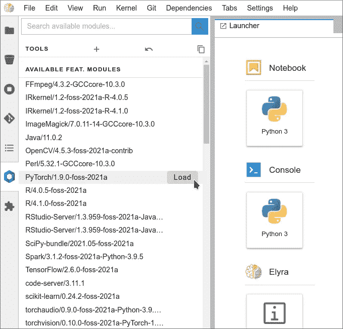

(作者截图)

*免责声明:*我在 Red Hat 工作，帮助组织开发数据科学/数据工程平台和解决方案。因此，这里描述的实现使用不同的 Red Hat 产品，如 [Red Hat OpenShift](https://www.redhat.com/fr/technologies/cloud-computing/openshift) (我们的 Kubernetes 企业发行版)，或[Red Hat open shift Data Foundation](http://Red Hat OpenShift Data Foundation)(我们基于 Ceph 的 open shift-原生存储解决方案)。然而，整体架构和方法可以适用于其他平台。

现在，让我们开始长篇大论吧！

# 第一章:麻烦是如何开始的

Kubernetes 是数据科学和数据工程平台的流行选择。敏捷性、多功能性、资源可扩展性……使其成为这些工作负载类型的首选平台。尤其是在拥有共享环境的大型组织中:将您的应用程序、库和依赖项打包到轻量级容器映像中，使它们可复制、一致且安全，这似乎是解决您所有问题的完美答案！

您最近读到的这些内容让您激动不已，您以这种方式打包了一个 Jupyter 容器图像:

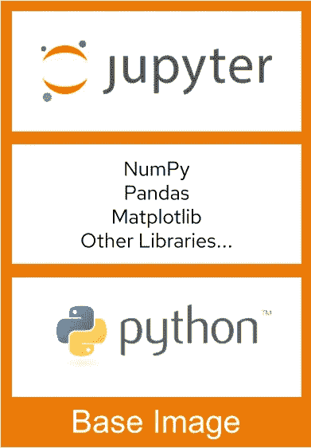

(作者图文)

因为你很聪明，想要预测需求(翻译:你不想一次又一次地回到这个话题)，所以你甚至创造了一些不同的“味道”来涵盖你能想到的不同用例:仅带 Scipy 的基本笔记本，一个带 Tensorflow 的，一个带 Pytorch 的，……完美，那些容器图像都可以使用。

因此，您在 Kubernetes 环境中设置了 JupyterHub 或 Kubeflow，并为所有用户创建了一个 Jupyter 即服务环境！任务完成了，问题解决了，你就可以回去做其他(总是)迫切的事情了。

几个星期过去了…

然后是 Alice、Bob 和数据科学家团队的其他成员。他们甚至带来了一些 BI 人员，以通过该组织正在经历的数字化转型来展示他们的善意，还带来了一些数据工程师(谁也不知道，可能会有数据管道的漏洞需要修复)。但是没有统计学家，你们都知道为什么…

(图片作者来自 imgflip.com)

爱丽丝开始说，“听着，Jupyter 即服务这个东西太棒了！过去几周我们一直在玩它，我们看到它如何取代我们的个人环境:在我们的笔记本电脑上不再需要安装和管理任何东西，因为笔记本电脑缺乏处理能力和内存。任何地方都可以访问任何东西！”。

“是的，这绝对是一个巨大的进步。”，鲍勃继续说道。“我们现在能够轻松地交换我们的笔记本电脑，因为它们都基于相同的容器映像，并使用中央数据湖。这个库或这个应用程序不会再丢失了！”

有些困惑，因为这以前从未发生过，你问，“好吧，那么，完美。但你为什么在这里，不仅仅是为了感谢我吗？”

“哦，几乎没有什么，对你来说，这很容易！”查理大声说道。“你知道，你为我们创造的不同风格的环境非常棒。它只是缺少这个我经常使用的库，你知道我的 avLib 吗？当然是在 3.2.4 或更高版本，因为在 3.2.3 之前有一些坏的东西。但不是来自新的 4.x 分支，我真的不喜欢他们用它做的事情。”

“是的，如果你还能加上巴丽、LibB 和 LibC，那就太好了。哦，顺便说一下，对于 LibC，我需要最近的 3 个版本，以便能够比较一些东西”，Debbie 补充道。

鲍勃以他一贯的方式插话道，“既然我们在讨论这个问题……当然，所有旧版本的图像和库总是可用的，对吗？因为这是我们审计流程的一部分，可以在任何时候重新计算，你知道，为了负债的目的。因此，当然必须总是使用完全相同的工具。另外，我也不想为了适应新版本而修改代码。”

看到你的脸有点腐烂，爱丽丝打断了它，“好吧，我猜你已经明白了，所以我们会离开你，再次感谢！”

由于你是一个经验丰富的专业人士，你设法隐藏恐慌上升，并迅速切换到解决方案模式…

# 第二章:几个选择，没有真正的解决方案…

几天后，你会思考你绞尽脑汁的结果…

**选项 A** :臃肿的形象。

好了，让我们把他们问的所有东西放到同一个容器图像里！这很简单:只需在 requirements.txt 中添加几行，或者在 docker 文件、docker build 中添加一些东西，就完成了！现在让我们把图像上传到回购。什么，预计到达时间 2:34:12？！哦…这个图像是 38.2GB…肯定是不可管理或不可行的:“起始容器。拉图，请明天再来……”。无论如何，我不能适应同一个库的多个版本。

**选项 B** :永无止境的图像流。

嗯，在现有图像的基础上，我总是可以创建定制的图像来满足各种需求。但是让我们看看，……只有 15 个库，每个库有 2 个可能的版本，理论上有 2 个⁵组合，32 768 个！即使他们只要求百分之一，仍然有 300 多个容器图像可供选择。我很确定哪个图像的下拉选择器不会允许这么多。无论如何，即使用户因为没有选择而应付，从长远来看，整个事情将是不可收拾的。

**选项 C** :让他们自己处理。

毕竟，做一个 pip 安装并没有那么难！如果有 requirements.txt，我甚至可以通过一些巧妙的机制让一个进程查看笔记本的文件夹，并安装后台列出的所有内容。当然，每次笔记本启动时都会出现这种情况，这会导致延迟和投诉…而且无论如何，它不会解决使用不同集/版本的基础库来维护许多图像的问题。除非我希望用户每次都从头开始重新安装整个堆栈…

这种方法也不能解决无法使用 pip 或 conda 安装应用程序的问题。而且在一个安全的企业环境中，容器不作为 root 运行(这是一个最佳实践)，所以人们无论如何也不能安装任何东西。

那么该怎么办呢…？

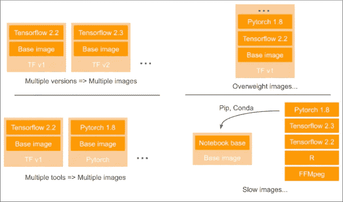

你不太好的选择…(作者提供图片)

# 第三章:绝望的深渊

> 作者注:本章已被自愿过滤为 1)没有必要让每个人都过这种生活，即使是通过代理。2)它与 It 或数据科学没有任何联系。

# 第四章:这就是方法

在过去，我有机会了解加拿大计算机公司(Compute Canada)和 HPC 世界的许多人，至少是学术界的人，特别是神奇的 T2 easy build(T3)社区，正在做什么来解决这个相同的问题:如何在一个共享的环境中以有效和可重复的方式为您的用户带来应用程序和库，使数据科学家轻松地完成他们的工作，而不是笨拙地安装、打包或编译…？

他们的答案是使用环境模块来动态“加载”预打包的库或应用程序。将其简化到极致，假设您可以访问安装在文件系统中某处的一些共享文件夹，模块引擎将简单地修改您的$PATH、$PYTHONPATH 或类似的其他环境变量，以使这些文件夹在您的环境中“可见”。不再有 Python 抱怨当你做“导入 pytorch”时找不到库，因为现在它知道在哪里可以找到它！

当然，所有这些都更加精确，因为它可以跟踪依赖性，加载或不加载什么，卸载什么，以及在交叉依赖性的情况下何时卸载…

但基本上，我们问题的解决方案包括两件事:

1.  提供对“模块”库的访问，这些模块可以是 Python 库、Linux 库或成熟的应用程序。这个库可以在繁殖时挂载到您的环境中。

2.有办法在环境中轻松加载这些模块。

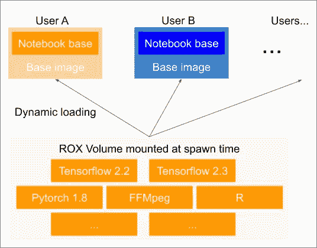

Kubernetes 中的实现概念(图片由作者提供)

所以这是我在开放数据中心([开放数据中心](http://opendatahub.io/)，ODH，是一个基于 Kubeflow 的开源项目，提供开源 AI 工具，用于在 OpenShift 容器平台上运行大型分布式 AI 工作负载)内实现的概念验证解决方案:

*   共享库安装在 OpenShift Data Foundation 提供的 RWX 卷上(后台有 CephFS)。
*   ODH 正在提供 Jypyter-as-a-Service 环境，在这种情况下，它有一个稍微定制的镜像，可以加载模块，还有一个 JupyterLab 扩展，可以轻松地完成加载/卸载部分。
*   当产生 Jupyter 时，共享库以只读方式安装在 pod 中。
*   然后，您只需在需要时加载您需要的内容！

这是它看起来的样子:

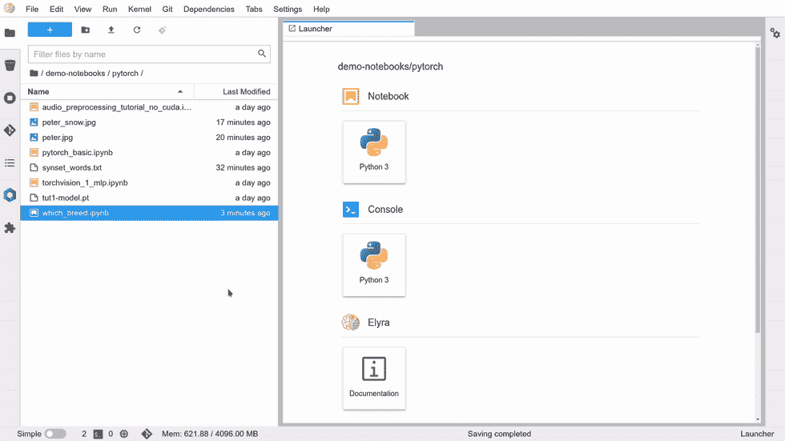

环境快速演示(作者截图)

这是在这个快速概述中发生的事情:

*   我启动了一个基本的笔记本示例，它使用 **Torchvision** 从一张图片中推断出一只狗的品种(不是任何一只狗，我的！).
*   当我尝试运行笔记本时，出现了 ModuleNotFound 错误，因为我的环境中没有可用的 **torchvision** 库。
*   所以在左边的面板上，在我的**软件的**扩展菜单中，我通过输入几个字母来查找这个包，然后我只需点击 Load。
*   由于笔记本已经启动，我必须快速重启我的内核以使更改生效。我可以运行整个笔记本。

在这一点上，你可能会说:“这很有趣，但你可以只做一个 pip 安装”。

当然，特别是这个基本的例子，这也是我们习惯做的，特别是在本地环境中(相对于共享环境)。但是这种替代方法带来了有趣的功能，所有这些功能都不需要创建特定的容器映像:

*   提供人们无法安装的应用程序，因为它们可能没有 Conda 或 Pip 包。在这种共享环境中，人们不应该能够 yum/apt-get 安装任何东西，因为他们不应该有 root 访问权限。我希望您的环境也是如此…
*   测试不同版本的包/应用程序变得非常容易。只需加载/卸载相关的模块，不需要做长时间或复杂的安装/卸载或玩弄依赖关系。
*   您可以提供许多不同版本的包或应用程序，用户可以根据自己的需要选择他们想要的。即使几年后，这些模块仍然可用，不需要删除它们，因为环境已经升级。相反，您可以提供最先进的模块 alpha 版本，而不会将整个环境置于危险之中。
*   用户的环境保持整洁，不会因为安装的库而变得杂乱。此外，他们不必在每次想要运行特定笔记本电脑时都进行所有这些安装。模块加载/卸载速度更快，因为事实上所有内容都已经装载到 pod 中。
*   对于系统管理员来说，生活变得简单多了。只有一个容器映像需要管理。这就是为什么这个项目被称为开放数据中心-汉兰达，“只能有一个！”。

# 但是等等，还有更多！

在第一个基本示例中，我加载了一个 Python 包。但正如我之前所说，它也可以是一个完整的应用程序，甚至是一个拥有自己的 Web UI 的应用程序，如 RStudio-Server。为了实现这一点，我将使用 jupyter-server-proxy 和一些特殊的配置，使它在模块加载时出现在启动器中。

加载模块:

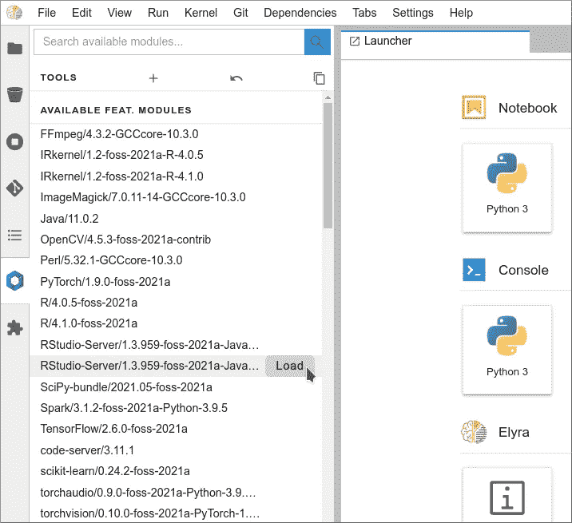

加载模块(作者截图)

RStudio 会出现一个新的单幅图块:

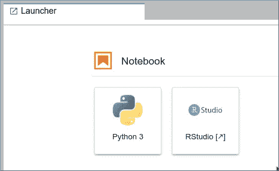

新 RStudio 磁贴(作者截图)

当你点击磁贴时，浏览器会打开一个新标签，RStudio 会在几秒钟内启动。

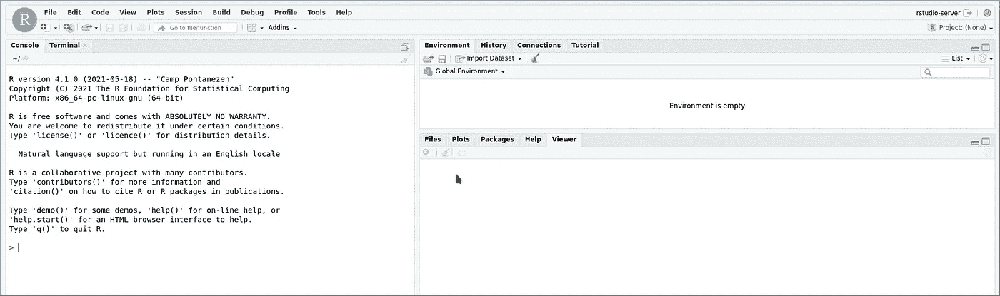

RStudio(作者截图)

这是与以前相同的容器环境，这意味着您可以访问相同的文件、相同的工具……这在您想要混合使用 R 和 Python 脚本时非常有用，反之亦然！

# 更多关于如何使用它的细节

在下面的报告中，您将找到完整的部署说明和代码，包括一个预编译的模块库，该库易于在您的开放式数据中心环境中部署:[https://github.com/guimou/odh-highlander](https://github.com/guimou/odh-highlander)

一旦部署好一切，您就可以这样做了…

在您的 JupyterLab 实例中，您可以访问一个新的扩展“软件”。可用模块列表分为两部分。“特色”模块和完整列表(这只是我在这个演示环境中选择提供的模块):

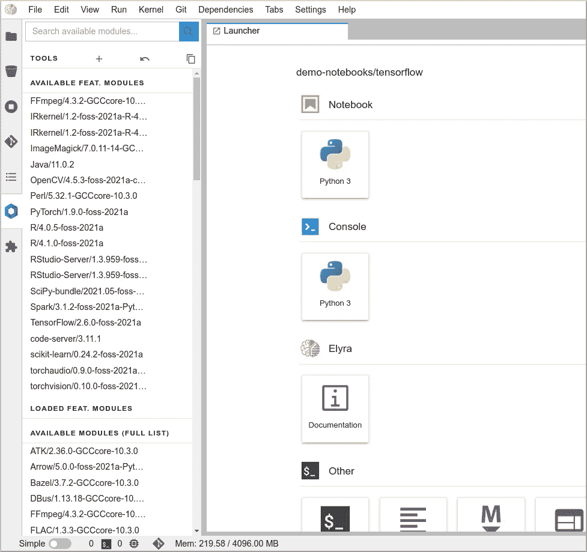

模块列表(作者截图)

您可以使用过滤器框来搜索特定的模块(只需输入几个字母)。过滤同时发生在两个列表上:

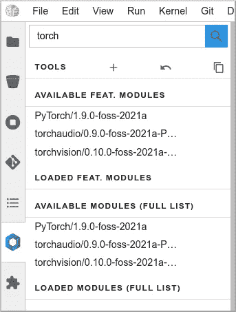

过滤列表(作者截图)

如果你点击一个模块名，一个弹出窗口会给你更多的信息:描述，依赖关系，…

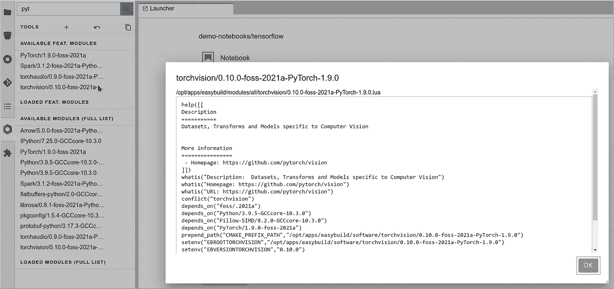

模块信息(作者截图)

要加载模块，请将鼠标悬停在模块上，然后单击“加载”按钮:

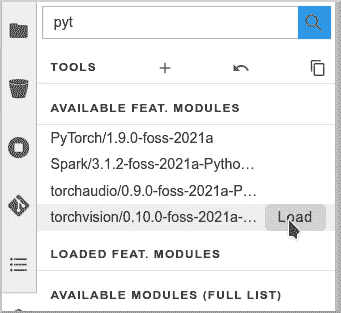

模块加载(作者截图)

模块及其所有依赖项被自动加载(本例中为 torchvision):

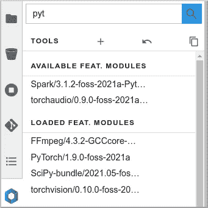

模块已加载(作者截图)

要卸载模块，请将鼠标悬停在“已加载”列表上，然后单击“卸载”:

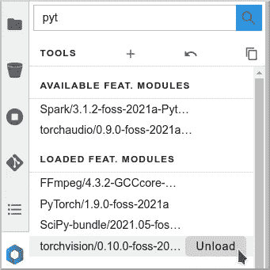

卸载模块(作者截图)

模块及其依赖项将被自动卸载。

*注意* : [Lmod](https://lmod.readthedocs.io/en/latest/) ，模块管理器引擎，跟踪每个模块加载的依赖关系。如果两个不同的模块共享依赖关系，一个模块卸载不会影响另一个模块，它的依赖关系仍然存在。只有当模块不再需要它们时，它们才会被卸载！

# 高级功能

## 收集

如果您想要创建一个特定的环境，其中包含一组您想要使用的不同模块，那么不需要每次都从 scracth 重新创建它！您可以简单地加载这些模块，然后创建一个“集合”。下一次，只需双击即可恢复此收藏。

要创建一个集合，请加载您想要的模块，单击图标并为集合命名。

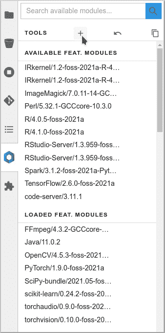

创建收藏(作者截图)

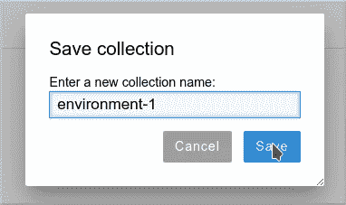

命名并保存收藏(作者截图)

当您想要恢复这个环境时，只需单击恢复图标，然后选择并加载您的集合。

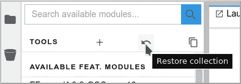

还原收藏(作者截图)

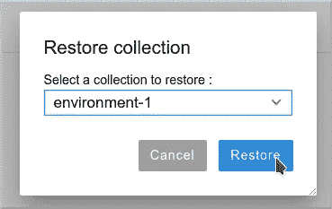

还原收藏(作者截图)

## 进口

您也可以直接从笔记本和脚本加载您需要的模块。要知道要用到哪些模块，可以直接导出相关的 Python 代码！

点击“生成 Python 代码”图标:

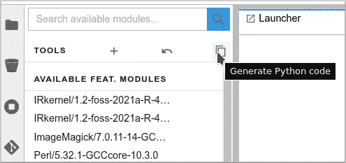

生成代码(作者截图)

然后，您可以将完整的代码复制粘贴到您的第一个笔记本单元格或脚本中:

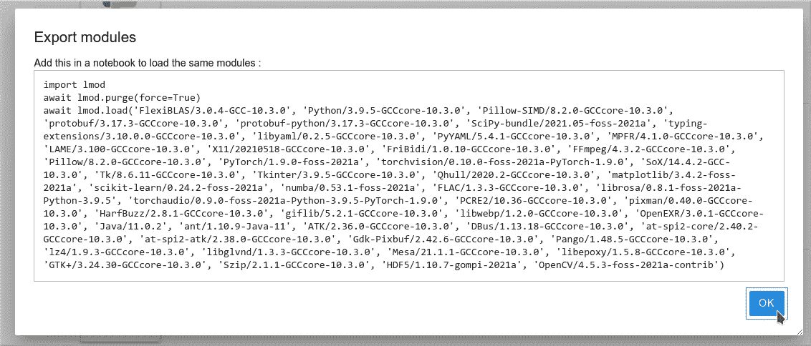

Python 代码(作者截图)

*注意*:当然，为了在您的笔记本或脚本中工作，您正在使用的容器映像或环境必须是“支持 lmod 的”，并且具有相关模块的库必须可访问/安装到该环境中。

# 下一步是什么？

如前所述，您将在此回购中找到部署此解决方案的所有资源和说明。在接下来的文章中，我将详细介绍技术实现，尤其是:

*   如何创建一个环境来创建你自己的模块。
*   关于如何使用 [EasyBuild](https://easybuild.io/) 创建模块的说明和示例。
*   如何创建一个 [Lmod](https://lmod.readthedocs.io/en/latest/) 增强的 JupyerLab 容器映像来使用模块库。
*   如何创建特定于硬件的模块(比如支持 cuda，需要 GPU)，并使它们只在相关的基础设施上可用。

# 多谢

我必须感谢许多人和组织，因为我在这里没有发明任何东西。我只是把一些项目组合起来，把一些解决方案从一个世界移植到另一个世界，瞧！

*   [Open Data Hub](https://opendatahub.io/) 团队，感谢他们创建了这个奇妙的数据科学环境，它非常容易在 OpenShift 上部署。
*   EasyBuild 社区当然感谢他们创造的伟大工具，但也感谢他们的热烈欢迎(感谢 Kenneth！)，以及愿意回答我的 dum 新手问题(谢谢马克西姆！).
*   [Compute Canada](https://www.computecanada.ca/) ，是谁让我发现了这种解决方案。他们的设置是病态的，尤其是他们在整个组织中分配模块的方式，真了不起！
*   [CMD-NTRF](https://github.com/cmd-ntrf) 、费利克斯-安托万·福廷，出色的 Jupyter-Lmod 扩展，通过 Jupyter 中流畅的用户界面将解决方案提升到另一个层次。

# 参考和链接

*   回购与指令:[https://github.com/guimou/odh-highlander](https://github.com/guimou/odh-highlander)
*   启用 Lmod 的 JupyterLab:[https://github.com/guimou/s2i-lmod-notebook](https://github.com/guimou/s2i-lmod-notebook)
*   各种 EasyConfigs(如果你想看看哪些模块已经可用):[https://github.com/easybuilders/easybuild-easyconfigs](https://github.com/easybuilders/easybuild-easyconfigs)
*   各种定制简易配置:[https://github.com/guimou/odh-easyconfigs](https://github.com/guimou/odh-easyconfigs)
*   开放数据中心文档:【http://opendatahub.io/docs.html 
*   EasyBuild 文档:【https://docs.easybuild.io/en/latest/ 
*   加拿大计算机展上的 EasyBuild 展示:[https://www.youtube.com/watch?v=eQ1_iWSnJaI](https://www.youtube.com/watch?v=eQ1_iWSnJaI)